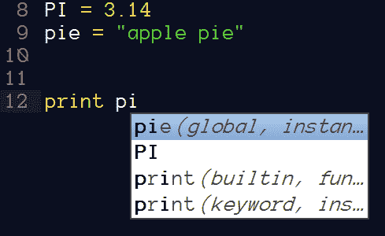
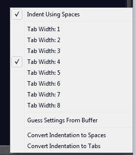

# 使用 Python 的 Sublime Text 2 概述

> 原文：<https://www.pythoncentral.io/overview-of-sublime-text-2-with-python/>

每个开发人员的关键工具之一是一个良好的集成开发环境(IDE)。Python 是一种美丽的语言，得到了新兴开发人员社区的大力支持，他们不断创造出令人惊叹的库和扩展。这就是 Python 有众多 ide 的两个原因。它们包括商业插件，如 Komodo 和 PyCharm，用于其他 ide 的插件，如用于 Eclipse 的 PyDev，以及与 Python 安装捆绑在一起的轻量级插件 IDLE。然而，一些用户更喜欢使用文本编辑器来满足他们的几乎所有需求，包括开发。Sublime Text 2 是这些文本编辑器中的一个，在这里，我将展示在 Python 中使用 Sublime Text 2 的一些特性。

## 为什么选择文本编辑器

在开始，总是有两个论点，一个支持使用文本编辑器编码，一个反对。这不是本文的主题，但值得注意的是，这两个论点都有道理，并且根据用法和用户的熟练程度，其中一个会更合适。对于我的需求，以及通常从事相对较小规模项目(尤其是只包含一个文件的项目)的开发人员的需求，文本编辑器非常方便。它们提供的一些优势是:

*   重量很轻
*   可定制
*   有插件
*   支持跨平台开发
*   支持多种语言

## 介绍崇高文本 2

Sublime Text 2 是较新的文本编辑器之一。目前仍在开发中；因此，新的特性和错误修复经常出现。我个人使用 dev 频道的版本，这里的更新相对频繁:http://www.sublimetext.com/dev.崇高文本 2 是免费下载和评估的，许可证费用为 59 美元，但免费版本功能齐全。除了偶尔会出现一个弹出窗口之外，对产品来说没有太多的麻烦，特别是考虑到它的功能不受任何限制。

崇高具有伟大和创新的特点。它提供了各种各样的主题，大量的定制，插件架构(用 Python 编写)，与完整的 ide 相比，它是轻量级的，可以在所有平台上使用，并且它还在不断地被开发。我使用它的原因和 Python 社区喜欢它的原因如下:

*   多个光标
*   片段
*   语法突出显示
*   GIT 支持
*   全屏&无干扰模式
*   自动构建

Sublime 还提供了一个创新的控制台，可以通过 CTRL+SHIFT+P 访问:

它提供了各种选项，比如设置当前语法、管理插件、使用代码片段等等。包管理器提供了对许多插件的访问，包括 Python 插件，也可以通过这种方式访问。

### 为什么要用崇高文字 2？

下面列出了 Sublime 适合 Python 开发的一些关键特性。

**1。代码片段(可从菜单和键盘快捷键中获得)**

它们在跳转时提供自动选择，这减少了创建一些乏味的代码部分所需的时间和错误。

可以通过按 enter 键输入该代码片段，或者显示在文件中，如果您键入“for”后跟 tab，将自动创建该代码片段。

在上面的屏幕截图中，选择了“x ”,并且在使用 tab 键时将选择范围值，因此在使用代码片段时，tab 键跳转很快，并且集中在正确的位置。

**2。语法突出显示和构建**

它自动提供语法突出显示和构建，因此在创建文件时，通过使用 CTRL + B，您可以在编辑器的控制台中立即看到代码的输出。

**3。在 SublimeROPE 插件**的帮助下 Python 自动完成

SublimeROPE 也支持在其他文件中查找声明，这在处理较大的项目时非常方便。

SublimeROPE 还提供跳转到定义、显示文档和定位全局的功能，因此也支持基本的重构。

**4。编辑器内部的 Python 解释器**

SublimeREPL 提供了一个 Python 解释器(以及其他语言),可以在 Sublime Text 2 中运行。结合分屏视图，这变得非常方便。

**5。棉绒**

Sublime 2 支持错误检测程序/linters(如 pyflakes)，可以与 SublimeLinter 插件完美集成。

**6。缩进到空格的转换**

这是每个 Python 程序员必须做的事情，因为空格是首选，有时在复制代码时，可能会发生混淆，这对 Python 非常不利。Python 的增强提议也表明了这一点，sublime 在一个简洁的界面中提供了这一点，并且有很好的可见结果，如下面的截图所示。

第 2 行中的空格(显示为点)和第 3 行中的空格(表示制表符)有明显的区别。有了“将缩进转换成空格”特性，这个问题就可以解决了，Python 也不会感到困惑。

## 总有改进的空间

但是，与成熟的 ide 相比，还有一些地方需要改进:

**1。调试**

对于大多数文本编辑器来说，这是一件痛苦的事情，尽管有一些东西可以提供帮助，比如 PdbSublimeTextSupport 0.2，它将 Sublime 与调试的 Python、pdb 集成在一起，但是像 Eclipse 这样的 ide 提供了更好的调试特性。

**2。管理大型项目也是一个问题，但是 project browser 和 SublimeRope 提供了跨 project 中各种文件的自动完成功能，因此可以避免这个问题。**

## 结论

总而言之，Sublime Text 2 是一个伟大的编辑器，它提供了非凡的定制选项。你可以根据自己的需要定制它，使用许多可用的插件，Python 和 Sublime 配合得很好。如果你对使用 Sublime Text 2 开发 Python 有一些建议或很好的设置，欢迎通过评论分享。