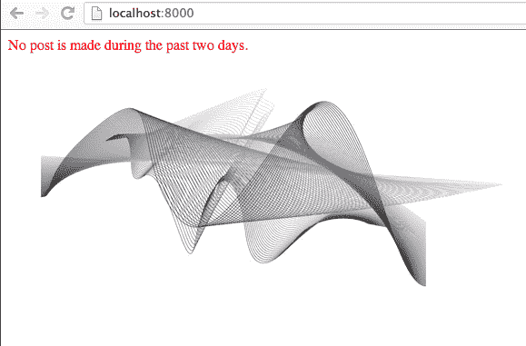

# 将 Python Django 应用程序打包成一个可重用的组件

> 原文：<https://www.pythoncentral.io/package-python-django-application-reusable-component/>

## 通过编写和使用可重用的 Python Django 应用程序来节省时间

设计、开发和维护一个 web 应用程序并不简单。为了一个成功的 web 应用程序，许多特性和方面必须得到正确的处理。举几个例子，几乎每个 web 应用程序都具有的功能是用户管理、第三方 oauth 登录/注册和管理站点。由于在任何 web 应用程序中有如此多的常见问题需要一次又一次地解决，所以让它们成为可重用的组件/包是有意义的，这样新的 web 应用程序就可以简单地利用现有的代码来节省开发时间。

幸运的是， [Python 包索引](https://pypi.python.org/pypi "Python Package Index") ( `pypi`)提供了许多可以在自己的应用程序中使用的包。更具体地说， [Django 包](https://www.djangopackages.com/ "Django Packages")列出了所有你可以集成到自己项目中的可重用 Django 应用。找到并使用一个合适的 Django 包通常比自己编写一个更好、更省时。

在本文中，我们将学习如何使我们当前的`myblog` Django 应用程序成为一个可重用的 Django 包，以便您或其他人可以在他或她自己的项目中使用它。

## 包和应用程序

在我们开始之前，我们应该澄清一个关于软件包和应用程序的关键点。Python *包*是易于重用的 Python 代码的逻辑组。一个*包*通常包含多个被称为*模块*的 Python 文件。

通常情况下，我们使用一个*模块*或者通过像`import myblog.views`或者`from myblog import views`那样导入一个包。为了让一个 Python 目录比如`myblog`变成一个*包*，我们把一个特殊的文件`__init__.py`放入其中，即使这个目录是空的。

Django *应用*只是一个 Python *包*，设计用于 Django 项目内部。通常，Django *应用*遵循常见的 Django 约定，例如包括`models.py`、`urls.py`和`views.py`。

术语*打包*是指将 Django *应用*打包成一个可部署的 Python *包*，以便其他人可以轻松地将其集成到自己的项目中。

## 提取应用程序代码

在我们之前的教程之后，我们应用程序`myblog`的当前结构应该是这样的:

```py

myblog/

  manage.py

  myblog/

    __init__.py

    admin.py

    models.py

    settings.py

    static/

    myblog/

      background.jpg

      style.css

      templates/

        index.html

        post/

          detail.html

          upload.html

          tests.py

          urls.py

          views.py

          wsgi.py

```

首先，让我们在根`myblog`目录之外为`myblog`创建一个父目录。姑且称之为`django-myblog`:

```py

django-myblog/

  myblog/

    manage.py

    ...

```

其次，让我们将`myblog`目录移动到`django-myblog`中:

```py

django-myblog/

  myblog/

  __init__.py

  ...

  myblog/

    manage.py

```

第三，用以下内容创建一个文件`django-myblog/README.rst`:

```py
=====
Myblog
=====

Myblog is a simple demo of Django's basic usage.

Quick start
-----------

1\. Add "myblog" to INSTALLED_APPS:
  INSTALLED_APPS = {
    ...
    'myblog'
  }

2\. Include the myblog URLconf in urls.py:
  url(r'^myblog/', include('myblog.urls'))

3\. Run `python manage.py syncdb` to create myblog's models.

4\. Run the development server and access http://127.0.0.1:8000/admin/ to
    manage blog posts.

5\. Access http://127.0.0.1:8000/myblog/ to view a list of most recent posts.
```

第四，为你的可重用 app 创建一个许可文件`django-myblog/LICENSE`。通常 Django 应用程序是在 BSD 许可下发布的，但是你可以自由选择任何一个。

第五，创建`django-myblog/setup.py`来指定如何安装由[分发](http://pythonhosted.org/distribute/setuptools.html "Python Distribute")使用的应用程序的指令。

```py

import os

from setuptools import setup
README = open(OS . path . join(OS . path . dirname(_ _ file _ _)，' README.rst '))。阅读()
#允许 setup.py 从任何路径运行
OS . chdir(OS . path . norm path(OS . path . join(OS . path . abspath(_ _ file _ _)，os.pardir)))
设置(
 name = 'django-myblog '，
 version = '0.1 '，
 packages = ['myblog']，
 include_package_data = True，
 license = 'BSD License '，
 description = '一个简单的 django 应用程序演示'，
 long_description = README，
URL = ' HTTP://WWW . example . com/'，
 author = 'Your Name '，
author _ email = ' Your Name @ example . com '，
classifiers =[
' Environment::Web Environment '，
 'Framework :: Django '，
'预定受众::开发者'，
' licence::OSI Approved::BSD License '，# example licence
'操作系统::OS 独立'，”
```

第六，创建`django-myblog/MANIFEST.in`来包含我们包中的文本文件和静态文件:

```py

include LICENSE
include README.rst
recursive-include myblog/static *
recursive-include myblog/templates *
recursive-include docs *

```

注意我们还在`MANIFEST.in`中包含了一个目录`docs`。这个目录将包含我们将来可重用的应用程序的文档。现在，让我们创建一个空目录`django-myblog/docs`。

最后，我们构建我们的 Python 包:

```py

$ python setup.py build

running build

running build_py

creating build

creating build/lib

creating build/lib/myblog

copying myblog/__init__.py -> build/lib/myblog

copying myblog/admin.py -> build/lib/myblog

copying myblog/models.py -> build/lib/myblog

copying myblog/settings.py -> build/lib/myblog

copying myblog/tests.py -> build/lib/myblog

copying myblog/urls.py -> build/lib/myblog

copying myblog/views.py -> build/lib/myblog

copying myblog/wsgi.py -> build/lib/myblog

running egg_info

writing django_myblog.egg-info/PKG-INFO

writing top-level names to django_myblog.egg-info/top_level.txt

writing dependency_links to django_myblog.egg-info/dependency_links.txt

reading manifest file 'django_myblog.egg-info/SOURCES.txt'

writing manifest file 'django_myblog.egg-info/SOURCES.txt'

```

## 在新的 Django Web 应用程序中使用 django-myblog

假设您要开始一个新的 Django 项目，它将使用`myblog`中的功能。您可以简单地重用我们刚刚在您的新项目中构建的`django-myblog`。

首先，让我们创建一个新的 Django 项目:

```py

$ django-admin.py startproject mysite

```

其次，我们来修改一下`mysite/settings.py`:

```py

INSTALLED_APPS = (

    'django.contrib.auth',

    'django.contrib.contenttypes',

    'django.contrib.sessions',

    'django.contrib.sites',

    'django.contrib.messages',

    'django.contrib.staticfiles',

    'myblog', # Include 'myblog' into mysite

    'django.contrib.admin', # Enable the admin site

    'django.contrib.admindocs', # Enable the documentation for admin site

)

```

第三，让我们修改`mysite/urls.py`，将`myblog`的 URLconf 放在`/blog`下:

```py

urlpatterns = patterns('',

    ...

    url(r'^blog/', include('myblog.urls')),

)

```

第四，我们运行“python manage.py syncdb”来为`myblog`创建模型，并运行“python manage.py runserver”来启动服务器:

```py

$ python manage.py syncdb

Creating tables ...

Creating table auth_permission

Creating table auth_group_permissions

Creating table auth_group

Creating table auth_user_groups

Creating table auth_user_user_permissions

Creating table auth_user

Creating table django_content_type

Creating table django_session

Creating table django_site

Creating table myblog_post

Creating table myblog_comment
您刚刚安装了 Django 的 auth 系统，这意味着您没有定义任何超级用户。您想现在创建一个吗？(是/否):是
用户名(留空使用‘小糯干滩’):root
邮箱:
密码:
密码(再次):
超级用户创建成功。
安装自定义 SQL...
安装索引...
从 0 个夹具安装了 0 个对象
$ python manage.py runserver 
验证模型...
发现 0 个错误
2013 年 8 月 21 日- 12:03:10 
 Django 版本 1.5.1，使用设置‘my site . settings’
开发服务器运行在 http://127.0.0.1:8000/ 
用 CONTROL-C 退出服务器

```

最后，我们可以访问 http://127.0.0.1:8000/blog/来看看我们博客的主页:



## 总结和提示

在本文中，我们学习了如何*将我们的`myblog`应用*打包成一个可重用的组件，以及如何在一个新的 django 项目中使用它。编写可重用的 Django 应用程序总是一个好主意，因为您可以在新项目中重用相同的代码，从而节省大量时间。由于 [Python 包索引](https://pypi.python.org/pypi "Python Package Index") ( `pypi`)和 [Django 包](https://www.djangopackages.com/ "Django Packages")提供了可重用 Python 和 Django 应用程序的完整列表，所以在开始任何新项目之前，您应该检查一下它们。