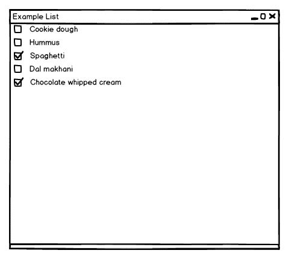

# PySide/PyQT 教程:QListView 和 QStandardItemModel

> 原文：<https://www.pythoncentral.io/pyside-pyqt-tutorial-qlistview-and-qstandarditemmodel/>

在我们的[上一期](https://www.pythoncentral.io/pyside-pyqt-tutorial-the-qlistwidget/ "PySide/PyQt Tutorial: The QListWidget")中，我们讨论了 Qt 的`QListWidget`类，它允许用户制作简单的单列列表框。然而，对于更高级的列表控件，需要更灵活的小部件；因此，Qt 提供了`QListView`小部件，允许创建更多不同的项目。它是一个纯粹的表示小部件，显示由数据模型提供的信息。这将呈现的数据逻辑与执行呈现的小部件分离开来；有多个小部件可以显示来自相同模型结构的数据。

已经为您创建了一些专门的模型类型。例如，`QStandardItemModel`提供了有限的功能，这些功能比我们在上一期关于`QListWidget`的讨论中看到的要大一些；除了文本和图标，它还提供拖放功能、可检查项目和其他功能。自定义行为可以通过从`QAbstractListModel`继承来实现，这是一个通用的列表数据模型。

## PySide/PyQt 的 qstandarditemmodel

我们将从讨论 QStandardItemModel 对`QListView`的使用开始。就像任何其他的`QWidget`一样，`QListView`被实例化了——对于我们遇到的每一个小部件，你是否已经厌倦了这一行？它读起来令人厌烦，但却是一个容易记住的对象模型；PyQt/Pyside 最大的优势之一是它的简单性、可记忆性和一致性。除此之外，`QListView`的构造函数接受一个可选的父类:

```py

list = QListView(parent)

```

很简单。现在我们的列表需要一个模型来管理它的数据。我们将用我们的列表创建一个`QStandardItemModel`作为它的(可选)父节点:

```py

model = QStandardItemModel(list)

```

`QStandardItemModel`还有其他构造函数签名，但它们与我们的单列列表无关；我们改天再讨论它们。

## PySide/PyQt 的 QStandardItem

创建列表和模型是简单的部分；列表的主要工作是创建和填充模型。例如，让我们为列表创建一个项目:

```py

item = QStandardItem()

```

我们可以方便地设置它的文本和图标:

```py

item.setText('Item text')

item.setIcon(some_QIcon)

```

我们还可以创建已经设置了文本(和图标，如果需要)的项目:

```py

textual_item = QStandardItem('Item text')

text_and_icon_item = QStandardItem(some_QIcon, 'Item text')

```

我们还可以使一个项目*成为可检查的*，在项目的最左边添加一个复选框:

```py

item.setCheckable(True)

```

如果你希望你的复选框有三种状态——T0、T1 和 T2——使用 T3。

## 一个简短的 QStandardItem 示例

这是足够的背景知识，我们可以给出一个简单的关于`QListView`外观的例子，尽管它还不能做任何事情。我们将通过使我们的主窗口成为 QListView 来尽可能地简化；我们将进行与任何`QWidget` -as-a-window 示例相同的基本设置:

```py

list = QListView()

list.setWindowTitle('Example List')

list.setMinimumSize(600, 400)

```

接下来，我们将创建我们的模型:

```py

model = QStandardItemModel(list)

```

然后，我们将创建一些`QStandardItem`来填充我们的模型。为了向我的妻子致敬——我们今年夏天将迎来第三个孩子——我将列出她迄今渴望的食物。每个都有一个文本标题和一个复选框:

```py

foods = [

'Cookie dough', # Must be store-bought

'Hummus', # Must be homemade

'Spaghetti', # Must be saucy

'Dal makhani', # Must be spicy

'Chocolate whipped cream' # Must be plentiful

]
对于 foods 中的 food:
#创建一个标题为
 item = QStandardItem(food)的项目
#给它添加一个复选框
 item.setCheckable(True)
#将项目添加到模型
 model.appendRow(item) 

```

最后，我们将我们的模型应用到`QListView`，显示窗口，并运行应用程序:

```py

list.setModel(model)

list.show()

app.exec_()

```

完整的示例，加上经过删减的解释和注释，如下所示:

```py

# Create a Qt application

app = QApplication(sys.argv)
#我们的主窗口将是一个 QListView
List = QListView()
List . setwindowtitle('示例列表')
 list.setMinimumSize(600，400)
#为列表的数据创建一个空模型
model = QStandardItemModel(list)
#添加一些文字项目
食物=[
‘曲奇’，#必须是商店购买的
‘鹰嘴豆泥’，#必须是自制的
‘意大利面’，#必须是香辣的
‘达尔·马克哈尼’，#必须是辛辣的
‘巧克力鲜奶油’，#必须是大量的
 ]
对于 foods 中的 food:
#创建一个标题为
 item = QStandardItem(food)的项目
#给它添加一个复选框
 item.setCheckable(True)
#将项目添加到模型
 model.appendRow(item)
#将模型应用到列表视图
 list.setModel(model)
#显示窗口并运行 app
list . Show()
app . exec _()

```

运行时，它看起来会像这样:



## 添加简单的功能

这一切都很好，但它还没有*做*任何事情。让我们看看如何让一个带有`QStandardItemModel`的`QListView`响应用户交互。

你可能会想象每个`QStandardItem`会像一个`QPushButton`一样，当它被选择、检查、编辑等等时会发出信号——至少，如果你像我一样，那就是你所期望的。如果是这样，你就会像我一样，错了。实际上有一个信号可以表明`QStandardItemModel`中的项目发生了什么，那就是`itemChanged(item)`。正如您所看到的，它将已更改的项目带到它的插槽中，为了告诉它发生了什么，您需要检查该项目。我觉得这不太理想，但这就是我们所得到的。

您可以使用模型的`item`方法来检查未更改的项目；返回指定的从零开始的行中的项。(它也可以接受多列模型的一列，我们可能会在另一个时间看到。)

还有大量的信号表明模型结构的变化；这些都是继承自`QAbstractItemModel`的，可以在这里考察。我们将在稍后的`QAbstractItemModel`讨论中详细讨论它们，这完全是另一个话题；对于我们当前的例子，我们不需要它们中的任何一个。

让我们把我们的清单做成一个甜蜜的清单；您在购买和/或准备物品时核对物品，完成后，窗口关闭。(我知道，这是一个高度人为和构造的例子。)

首先，我们更改标题:

```py

list.setWindowTitle('Honey-Do List')

```

然后，我们需要一个插槽来连接模型的`itemChanged`信号。我们将让它首先检查是否使用它的`checkState`方法检查了被更改的项目，以避免每次都检查所有的项目。如果它被选中，我们将查看其他的是否被选中；如果他们都是，我们就让`QApplication`退出:

```py

def on_item_changed(item):

# If the changed item is not checked, don't bother checking others

if not item.checkState():

return
i = 0
#循环遍历这些项目，直到你没有得到任何项目，这意味着你已经通过了列表的结尾
而 model.item(i): 
如果不是 model.item(i)。checkState(): 
返回
 i += 1
app.quit() 

```

然后，我们将把`itemChanged`信号接到我们的插槽上:

```py

model.itemChanged.connect(on_item_changed)

```

这就是我们需要做的。以下是我们修改后的示例的完整代码:

```py

# Create a Qt application

app = QApplication(sys.argv)
#我们的主窗口将是一个 QListView
List = QListView()
List . setwindowtitle(' Honey-Do List ')
List . setminimumsize(600，400)
#为列表的数据创建一个空模型
model = QStandardItemModel(list)
#添加一些文字项目
食物=[
‘曲奇’，#必须是商店购买的
‘鹰嘴豆泥’，#必须是自制的
‘意大利面’，#必须是香辣的
‘达尔·马克哈尼’，#必须是辛辣的
‘巧克力鲜奶油’，#必须是大量的
 ]
对于 foods 中的 food:
#创建一个标题为
 item = QStandardItem(food)的项目
#给它添加一个复选框
 item.setCheckable(True)
#将项目添加到模型
 model.appendRow(item)
def on_item_changed(item): 
 #如果更改的项目没有检查，就不要费心检查其他的
如果没有 item.checkState(): 
 return
#循环遍历这些项目，直到您没有得到任何项目，这意味着您已经通过了列表的结尾
 i = 0 
而 model.item(i): 
如果不是 model.item(i)。checkState(): 
返回
 i += 1
app.quit()
model . item changed . connect(on _ item _ changed)
#将模型应用到列表视图
 list.setModel(model)
#显示窗口并运行 app
list . Show()
app . exec _()

```

这是一个`QListView`的简单应用。它可以做更多的事情，但是相同的模型可以用于其他小部件，我们将在另一个时间研究它的更多功能。下一次，我们将看一些完全不同的东西，Qt 中最让我兴奋的控件之一:`QWebView`，一个基于 WebKit 的控件，用于呈现 HTML/CSS/XML/XSLT 页面。