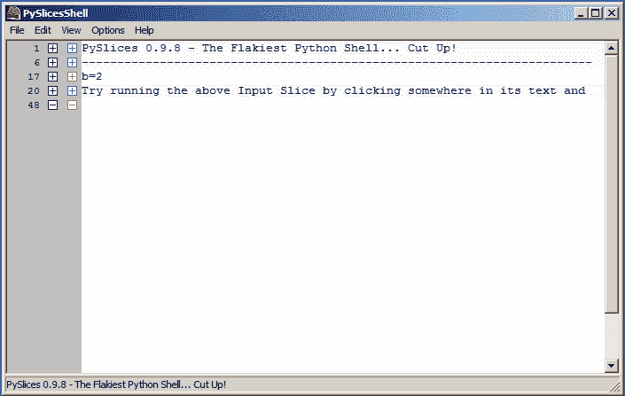
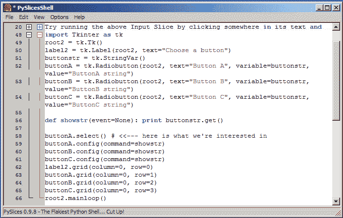
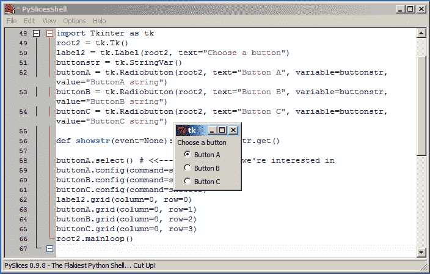
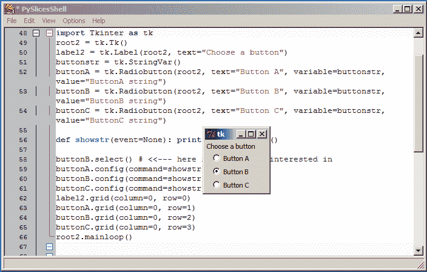
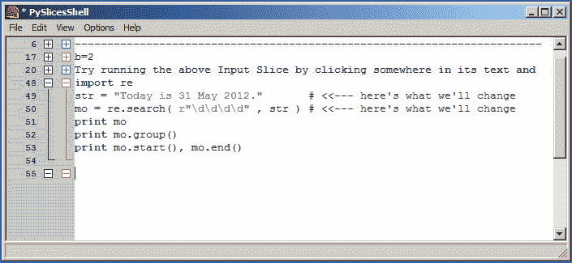
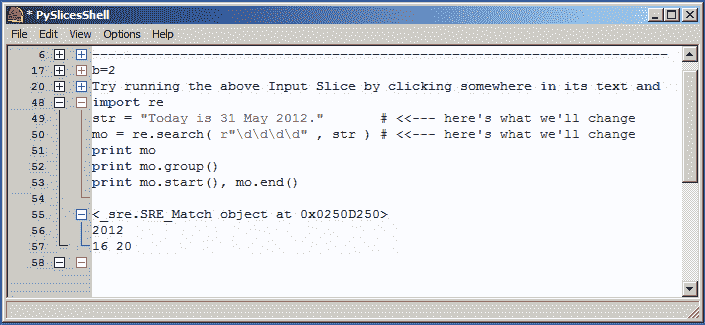
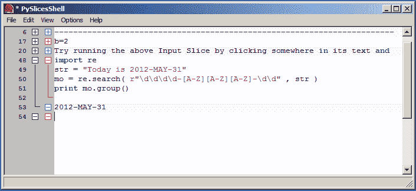

# 带 Tkinter 的 PySlices

> 原文：<https://www.pythoncentral.io/pyslices-with-tkinter/>

在 Python 开发人员用 Python 创建的众多库和软件套件中，有一个是 *Py 套件*，这是一组用 wxPython 编写的工具，用于帮助 Python 爱好者进行编程。

这个套件中包括一个值得一提的 Python shell，名为 *PySlices* 。

也许这个 shell 最显著的特性是能够执行用笔记本风格的代码块编写的 Python 脚本，而不会干扰在同一个 shell 窗口中编写的其他代码块(此外还有一个“普通”shell 模式，可以在 Options > Settings 菜单中激活)。

这非常有用的一种方式是在使用利用了 *Tkinter* 库的脚本时。

## **使用 *PySlices* 与 Tkinter**

为了说明 *PySlices* 的有用性，让我们检查一下我们在 Tkinter 文章的[介绍中尝试一些代码的情况。在标准的 Python IDLE 中，如果我们希望在合并 select()方法来指定默认单选按钮时看到输出的不同，那么每当我们想要改变甚至像选择按钮“B”而不是按钮“A”这样小的事情时，我们都必须键入所有的代码来初始化我们的小部件——这个过程会非常乏味和烦人。](https://www.pythoncentral.io/introduction-to-pythons-tkinter/)

然而，如果我们使用 *PySlices* 来完成这个任务，让我们来看看这个过程会有什么不同:

**步骤 1:** 打开一个 *PySlices* 窗口(把所有的启动消息都折叠起来——节省了不少空间，看行号！)

**步骤 2:** 将示例中的代码输入下一个空白区域

**步骤 3:** 按快捷键组合之一(如 Shift-Return)运行

现在，我们可以很容易地看到代码的输出，如果我们想像前面提到的那样将默认的 RadioButton 从“A”更改为“B ”,只需编辑感兴趣的行并执行脚本。

不需要重启 shell 和/或重新初始化变量/对象来查看调整一个小部分的区别(在标准 Python IDLE 中可能需要这样做)。

## **使用 *PySlices* 与正则表达式**

这个 shell 可以派上用场的另一种情况是调试正则表达式。比方说，我们想完成[Python 正则表达式介绍](https://www.pythoncentral.io/introduction-to-python-regular-expressions/)文章中的前几个例子，而不必每次都重新键入正则表达式字符串和搜索行——与 Tkinter 例子一样，我们首先键入所有内容…

…点击快捷方式运行脚本(例如 Ctrl-Return)并查看输出…

…然后只更改重要的部分，并重新运行脚本以查看不同之处！

使用 Python IDLE，您还可以重复运行脚本，而不必重新键入所有代码，但是脚本必须在单独的窗口中编辑和执行，并且每个脚本都必须在运行前保存到磁盘，不管它有多小。使用 *PySlices* 你可以在一个窗口中编辑和运行多个脚本，并且在执行之前不必将每个脚本保存到它自己的文件中。这样做的缺点是，与 IDLE 不同， *PySlices* 不会在执行之前检查你的脚本是否有语法错误，所以如果/当这些或任何类型的错误发生时，它可能会对你大喊，但即使是这种云也有一线希望——就像你可以折叠你键入的代码块一样， *PySlices* 让你删除来自你的代码块的任何错误报告输出！

如果你想保存你在 *PySlices* 窗口中写的切片也很容易(它们保存到。 *PySlices* 格式——如果你只是想在普通的文本编辑器中通读的话，这都是文本)，它们都保存在同一个文件中，而不是实际上必须将它们切片。无论是对于 Tkinter 库、正则表达式，还是日常脚本和 shell 使用， *PySlices* 都可以让您的 Python 脚本体验更加甜蜜。