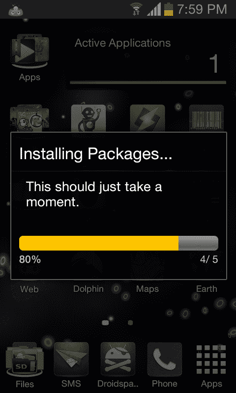
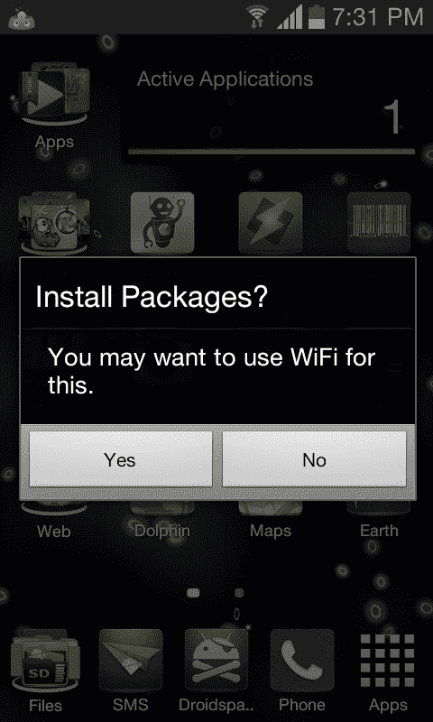

# Python for Android: Android 的原生对话框(SL4A)

> 原文：<https://www.pythoncentral.io/python-android-androids-native-dialogs-sl4a/>

Android has a series of built-in dialogs that allow applications to interact with users. They can be used to display things like spinners and progress bars, and they can also be used to prompt users to make some input, such as dates or strings.

All methods for creating dialog boxes exist in *UIFacade* of SL4A, and most methods needed to manage them. UI Facade also contains methods for creating webviews and using experimental FullScreenUI materials.

## SL4A and native dialog box

The normal process when using a dialog box is to first create an appropriate dialog box object, then set any additional features you want it to have, and then present it to the user. It takes a few phone calls, but it's easy to do. Once it is displayed, there is a way to get the result from the dialog box and eliminate it. You can also update the progress dialog box during rendering.

### Create Android dialog box

You use a `dialogCreate*` call to create a new dialog box. The standard dialog boxes are `Alert`, `Input`, `Password`, `DatePicker`, `SeekBar`, `SpinnerProgress` and `HorizontalProgress`.

For example, to create and present a date picker dialog box, you need to do the following. ...

【python】
从机器人导入 Android
droid = Android()
droid。dialogcreatedatepicker()
droid。dialogshow()

Note that all interactions with the dialog box are completed by calling the method of `droid`. This is only the result of the interface between SL4A and Android API. This `droid` object is a' God object', so everything is a method of `droid`. For simplicity, there is only one instance of a dialog box, so any `dialogCreate*` call will cause any existing dialog box to be destroyed.

### Custom dialog box

You can use the `dialogSet*` call to set any additional functions of the dialog box. What you can customize depends on what kind of dialog box you create.

For example, you can use `dialogSetPositiveButtonText` to set the positive button text in a warning dialog box, and there are matching methods to set the neutral and negative button text. You can use any combination of these three methods in the alert dialog box.

### Show dialog box

You use `dialogShow` to display a dialog box, and then you can use `dialogDismiss` to close the dialog box.

### Get input

You can usually use `dialogGetResponse` to get any result, and it will block until the user responds to the dialog box. However, for some types of dialogs, you may need to use the `eventPoll` method of Events Facade to wait for dialog events. *Some dialogs, such as menus, are persistent features of an application, and may generate multiple events over time, so they must be managed through Events Facade.*

If you create a single-choice dialog box (radio button) or a multi-choice dialog box (checklist), you must pass a list of options for the user to choose from. You can use the `dialogGetSelectedItems` method to find out which options are selected. This method returns an integer list that maps to the index of the selected item in the selection list you passed in. Obviously, there is only one radio dialog box.

## Say it again in Python ...

Suppose we need to ask users if they want to install a bunch of software packages, and then, suppose they want to install them, we want to create a progress bar to show how the installation process is going. Suppose we have five software packages to install.

[Python]
Import the system

#从机器人创建机器人对象
导入 Android
droid = Android()

# Create a reminder, set the title and message
droid. DialogCreateAlert (
' Install package?'
' You may want to use the wireless network to do this.'
)

#设置几个按钮机器人。dialogsetpostivebuttontext(' Yes ')
droid。dialogsetnegativebuttontext(“否”)

# Now present the dialog box to the user
droid.dialogshow ()

#获取结果并关闭对话框
响应= droid。dialoggetresponse().结果
机器人。对话发现()

# Check whether the user pressed a button, because the user can close
# dialog boxes and check whether it is positive, otherwise we have finished
if it is not' which' in the response or ['which']! = 'positive': sys.exit()

# Now that the check has been completed, create and present a new progress bar dialog box,
# Set the title, message and maximum progress 5
Droid. DialogcreateHorizontalprogress (
' Install the software package ...',
' This should take a little time.' ，
5

#呈现对话框 droid.dialogShow()

# Start the installation now and update the progress bar along the way. ...

#导入一对简约词
导入一些包安装功能作为安装
导入一些包列表作为包

#安装每个包,对于包中的包,每次增加进度条
进度= 0
:
安装(打包)
进度+= 1
机器人。dialogsetcurrentprogress(进度)

#整理并退出机器人。对话框溶解()

The screenshot on the right shows the confirmation dialog and the progress dialog. Of course, the actual look and feel of different devices will be slightly different.





Please note that if you only want to ask the user to enter some text, such as Python's "input" function or password, you can use the "dialogGetInput" and "dialogGetPassword" methods, which are just convenient wrappers and allow you to get these inputs in one call.

## Event-based dialog box

The above example covers almost all the basics of SL4A using dialog boxes, and the API reference covers all the more detailed details. The only exception to the normal dialog operation (create-customize-render-read-close) is when using menu items. As mentioned above, menu items are added to the native menu of the application; Generally speaking, they are always available to users and can be clicked any number of times at any time, so their management is a little different.

For example, you can use `addOptionsMenuItem` to add an item to the options menu of an application. This method requires two parameters, one is a string that sets the text to be displayed on the item, and the other is a string that sets the name of the event generated whenever the item is clicked. You can choose to set the data passed with the event and set the icon to be displayed on the menu item. Again, see the API documentation for all the details.

This will be very meaningful if you have used the Events Facade before. Either way, it is not difficult to get started. The following example will block, so it needs another thread or something to play a greater role; This example only involves SL4A API.

```py

# addoptions menuitem 采用两到四个参数:
 # item_label，event_name，[event_data]，[icon_name]
#以下调用向选项菜单添加了三个项目...droid.addOptionsMenuItem('Do A '，' a_event '，'一些事件数据机器人。addoptions menuitem(' Do B '，' b_event '，'其他一些数据. .)
 droid。addoptions menuitem(' Quit '，' kill '，None，' ic_menu_revert))
If it is true: 
 # block until the event occurs, and then get the result 
 res = droid. eventwait (). result
# If it is a kill event, if RES ['name'] = =' kill': 【 is interrupted, exit the event cycle 
.
# Otherwise, print event data 
 print(RES[' data ']) 
.
```