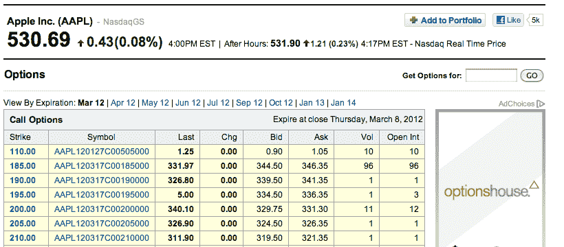

# Python 美汤示例:雅虎金融刮刀

> 原文：<https://www.pythoncentral.io/python-beautiful-soup-example-yahoo-finance-scraper/>

Python 为抓取网站提供了很多强大且易于使用的工具。Python 对抓取网站有用的模块之一被称为[美汤](http://www.crummy.com/software/BeautifulSoup/ "Python's Beautiful Soup Library")。

在这个例子中，我们将为您提供一个漂亮的 Soup 示例，称为“web scraper”。这将从雅虎财经页面获取关于股票期权的数据。如果你对股票期权一无所知也没关系，最重要的是网站上有一个信息表，你可以在下面看到，我们希望在我们的节目中使用。下面是苹果电脑股票期权的[清单。](https://finance.yahoo.com/quote/AAPL/options "Listing for Apple Computer stock options")



首先，我们需要获得页面的 HTML 源代码。Beautiful Soup 不会为我们下载内容，我们可以用 Python 的`urllib`模块来完成，这是 Python 的标准库之一。

## 获取雅虎财务页面

*   [Python 3.x](#custom-tab-0-python-3-x)
*   [Python 2.x](#custom-tab-0-python-2-x)

*   [Python 3.x](#)

[python]
from urllib.request import urlopen

options URL = ' https://finance . Yahoo . com/quote/AAPL/options '
options page = URL open(options URL)
[/python]

*   [Python 2.x](#)

[python]
from urllib import urlopen

options URL = ' https://finance . Yahoo . com/quote/AAPL/options '
options page = URL open(options URL)
[/python]

这段代码检索 Yahoo Finance HTML 并返回一个类似文件的对象。

如果你进入我们用 Python 打开的页面，使用浏览器的“获取源文件”命令，你会发现这是一个庞大而复杂的 HTML 文件。使用`BeautifulSoup`模块简化和提取有用的数据将是 Python 的工作。`BeautifulSoup`是一个外部模块，因此您必须安装它。如果你还没有安装`BeautifulSoup`，你可以在这里获得[。](http://www.crummy.com/software/BeautifulSoup/ "Download Beautiful Soup")

## 美丽的汤示例:加载页面

以下代码将页面加载到`BeautifulSoup`:

```py

from bs4 import BeautifulSoup

soup = BeautifulSoup(optionsPage)

```

## 美丽的汤例子:搜索

现在我们可以开始尝试从页面源(HTML)中提取信息。我们可以看到，选项在“符号”栏中有非常独特的名字，类似于`AAPL130328C00350000`。当你读到这篇文章时，这些符号可能略有不同，但是我们可以通过使用`BeautifulSoup`在文档中搜索这个唯一的字符串来解决这个问题。

让我们搜索这个特定选项的`soup`变量(您可能需要替换一个不同的符号，只需从网页上获取一个):

```py

>>> soup.findAll(text='AAPL130328C00350000')

[u'AAPL130328C00350000']

```

这个结果还不是很有用。它只是我们搜索的 unicode 字符串(这就是“u”的意思)。然而`BeautifulSoup`以*树*格式返回内容，所以我们可以通过询问它的*父节点*来找到文本出现的上下文，如下所示:

```py

>>> soup.findAll( text='AAPL130328C00350000')[0].parent

<a href="/q?s=AAPL130328C00350000">AAPL130328C00350000</a>

```

我们看不到表格中的所有信息。让我们试试更高一层。

```py

>>> soup.findAll(text='AAPL130328C00350000')[0].parent.parent

<td><a href="/q?s=AAPL130328C00350000">AAPL130328C00350000</a></td>

```

再一次。

```py

>>> soup.findAll(text='AAPL130328C00350000')[0].parent.parent.parent

<tr><td nowrap="nowrap"><a href="/q/op?s=AAPL&amp;amp;k=110.000000"><strong>110.00</strong></a></td><td><a href="/q?s=AAPL130328C00350000">AAPL130328C00350000</a></td><td align="right"><b>1.25</b></td><td align="right"><span id="yfs_c63_AAPL130328C00350000"> <b style="color:#000000;">0.00</b></span></td><td align="right">0.90</td><td align="right">1.05</td><td align="right">10</td><td align="right">10</td></tr>

```

答对了。它仍然有点乱，但是你可以看到我们需要的所有数据都在那里。如果您忽略括号中的所有内容，您可以看到这只是一行中的数据。

```py

optionsTable = [

    [x.text for x in y.parent.contents]

    for y in soup.findAll('td', attrs={'class': 'yfnc_h', 'nowrap': ''})

]

```

这段代码有点密，我们来一点一点拆开看。代码是列表理解中的列表理解。我们先来看看内在的:

```py

for y in soup.findAll('td', attrs={'class': 'yfnc_h', 'nowrap': ''})

```

这使用了`BeautifulSoup`的`findAll`函数来获取所有带有`td`标签、一个`yfnc_h`类和一个`nowrap`的 nowrap 的 HTML 元素。我们选择这个是因为它是每个表条目中的唯一元素。

如果我们刚刚用类`yfnc_h`得到了`td`的值，我们将会得到每个表条目的七个元素。另一件要注意的事情是，我们必须将属性包装在字典中，因为`class`是 Python 的保留字之一。根据上表，它将返回以下内容:

```py

<td nowrap="nowrap"><a href="/q/op?s=AAPL&amp;amp;k=110.000000"><strong>110.00</strong></a></td>

```

我们需要更高一级，然后从该节点的父节点的所有子节点中获取文本。这就是这段代码的作用:

```py

[x.text for x in y.parent.contents]

```

这是可行的，但是如果这是您计划频繁重用的代码，您应该小心。如果雅虎改变他们的 HTML 格式，这可能会停止工作。如果您计划以自动化的方式使用这样的代码，最好将它包装在一个 [try/catch 块](https://docs.python.org/2/tutorial/errors.html)中，并验证输出。

这只是一个简单漂亮的 Soup 示例，让您了解如何用 Python 解析 HTML 和 XML。你可以在这里找到美汤文档[。您会发现更多的搜索和验证 HTML 文档的工具。](https://www.crummy.com/software/BeautifulSoup/bs3/documentation.html "Beautiful Soup Documentation")