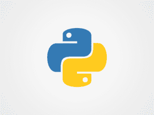

# Python 初学者到 Python Pro:需要掌握的 7 个基本技巧

> 原文：<https://www.pythoncentral.io/python-beginner-to-python-pro-7-basic-tricks-to-master/>

你到处听到教育不那么重要。一般来说，这种观点的起源在于这样一个事实，即学校、学院和大学很少向学生提供日后会派上用场的专业技能。虽然这并不完全正确，但教育系统已经或将让他们失望的想法是一半未来毕业生的普遍看法。

学生们常常抱怨学校里的科目毫无意义。或许，计划成为一名博客写手或 YouTuber 用户并不需要学校里的任何课程。至少乍一看是这样。想成为软件开发人员的学生该做些什么呢？某些学校确实教授编程。但那只是其中一个科目，其他的占用了你大部分的上学时间。

这就是传统作业被搁置的原因。学生们更热衷于在网上找一个 [的大学家庭作业助手](https://studyfy.com/homework-help) ，这样他们就可以有额外的时间学习编程语言。而且有很多可以选择。有些人已经三十多岁了，而有些人是最近才出现的。重点关注哪一个？JavaScript，Elixir，C#？

这就是你的语言学研究可以派上用场的地方。由于其多功能性和简单性，英语已经成为一种国际语言。软件[开发](https://www.pythoncentral.io/the-best-python-ides-you-can-use-for-development/)相当于通用语的是 Python。它可以用于各个方面，从基本的 web 开发到计算机科学和机器学习。如果你用的是 Spotify，这个应用是用 Python 开发的。

作为编程语言中的英语等价物意味着自学 Python 相当容易。只需阅读并开始编码。但是，在深入学习 Python 的 DIY 方法之前，您可以查看几个有用的学习语言的平台:

*   击球；
*   代码大战；
*   SoloLearn
*   Python 教程
*   code academy；

现在，让我们看看从新手到高手学习 Python 的最佳方法。虽然这些技巧并不是火箭科学，但是要想知道从哪里开始却是相当棘手的。

*   ## Daily Code

当你学习新东西时，最重要的是持之以恒。因此，你需要每天练习。如果你想成为一名优秀的 Python 开发者，你至少需要花几个小时来编码。但不是一开始。你可以每天至少花半个小时开始编码。

这就像在一门新语言中学习新单词和语法结构一样。学习编程语言也是如此。学习如何编码，每天都编码。但是不要忘记不时地休息一下。重复很重要，但是当你把自己累坏了就没用了。

*   ## Take notes

虽然看起来很明显，但很多人在学习新东西时会忘记记笔记。记下应该做什么。记下哪些方面你失败了。而且，用纸笔做比较好。它将允许你预先计划代码，并且在使用计算机之前有一个你将要做的计划总是更好的。

*   ## Read other people's codes

成为 Python 开发人员的另一个重要方面，以及以后掌握技能的另一个重要方面是阅读其他开发人员写的代码。掌握你独特的编码风格的最好方法是向他人学习。它能给你带来新鲜的想法。你可以找出你做错了什么。此外，你可以了解到你在某些方面比其他人更好。

问题依然存在——去哪里找开发人员？你可以像大多数开发者一样，在 GitHub 上创建一个账户。你可以在那里找到数百名优秀的 Python 开发者，他们都分享自己的代码。因此，您可以查看 Python 编码的最佳示例，并改进您的风格。

*   ## Share your code

显然，如果你想确保你写的代码可读，你需要共享它们。你的 GitHub 账户再一次派上了用场。开始分享你的代码，其他开发者会给你提供建议。但是你应该准备好接受批评。有可能是你做错了，可能是你在用自己独特的风格写作，别人无法把握。

*   ## Read books about Python

即使是最有经验的 Python 开发人员也会阅读关于编码的书籍。在你的 DIY 之路上，你总能找到一些你没有发现的东西。令人高兴的是，有几十本关于 Python 的好书。从“Python 食谱”到“流畅的 Python”如果你想提高你的编程语言知识，有很多书值得一读。

*   ## Enrich your skill set

要成为一名优秀的开发人员并在市场上保持竞争力，您需要不断提高自己的技能。最好的选择是学习如何使用各种 Python 库。Python 是库方面的首选语言。你当然应该学习如何使用像 NumPy 和 SciPy 这样的库。但是还有更多。

Keras，TensorFlow，Matplotlib，知道的越多越好。您可以使用的库的数量使您成为一名多才多艺的开发人员。你可以通过与他们一起创建宠物项目并在 GitHub 上分享来展示你的库知识。

*   ## Learning AI and Machine Learning

用 Python 写的最有价值的应用可以在机器学习和 AI 领域找到。这就是为什么在这些领域中练习 Python 知识也是至关重要的。您可以从学习那些领域的项目所使用的算法开始，并在您自己的项目中实现它们。

# 最终想法

这些是如何开始学习 Python 并成为编程语言大师的主要方面。获得 Python 经验的最好方法是从事各种与该语言相关的自由职业。在您的 GitHub 帐户上分享这一体验。这会让你对未来的雇主更有吸引力。