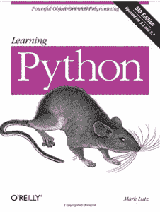
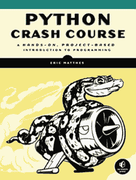
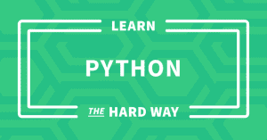
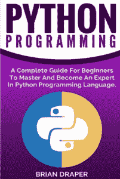
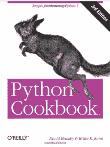

# Python 资源:书籍

> 原文：<https://www.pythoncentral.io/python-resources-books/>

每个人都以不同的方式学习，虽然一些开发人员喜欢以交互方式学习新的编码语言，但其他人可能希望在尝试编写任何代码之前有一个坚实的语言基础。如果你想学习 Python，并且喜欢通过阅读书籍来学习新的语言，请查看下面的列表以获得一些建议。

## **1。[学习 Python](https://www.amazon.com/Learning-Python-5th-Mark-Lutz/dp/1449355730/ref=sr_1_1?ie=UTF8&qid=1479053246&sr=8-1&keywords=learning+python)**

这本书有 1600 多页，所以不太适合胆小的人，但是如果你致力于学习 Python，这被认为是终极参考手册和教程之一。它已经出版了近 20 年，所以它肯定做对了什么。

## **2。 [Python 速成班](https://www.amazon.com/Python-Crash-Course-Hands-Project-Based/dp/1593276036/ref=sr_1_2?ie=UTF8&qid=1479053246&sr=8-2&keywords=learning+python)**

这本书不像是一本参考手册，更像是一种基于项目的动手学习 Python 的方法，同时也为您提供了这门语言的全面基础。

## **3。[敬酒不吃吃罚酒](https://learnpythonthehardway.org/book/)**

该学习了...Hard Way 书籍是一个备受尊重和众所周知的系列的一部分，该系列教人们如何学习编码许多不同的语言。这本书可以在他们的网站上通过你的浏览器免费获得，但如果你喜欢，你也可以购买硬拷贝或数字下载。

## **4。 [Python 编程](https://www.amazon.com/Python-Programming-Complete-Beginners-Language/dp/1539434370/ref=sr_1_4?ie=UTF8&qid=1479053246&sr=8-4&keywords=learning+python)**

这本书是一本 Python 指南，给完全的初学者一个坚实的 Python 基础知识。这本书甚至吹嘘它有能力将完全的初学者变成 Python 大师。

## **5。[巨蟒食谱](https://www.amazon.com/Python-Cookbook-Recipes-Mastering-ebook/dp/B00DQV4GGY/ref=sr_1_1?s=books&ie=UTF8&qid=1481205788&sr=1-1&keywords=python+cookbook+3rd+edition)**

这本书是为更高级的 Python 用户而写的，他们希望用新的编码技术和技能来试验和拓宽他们的 Python 视野。