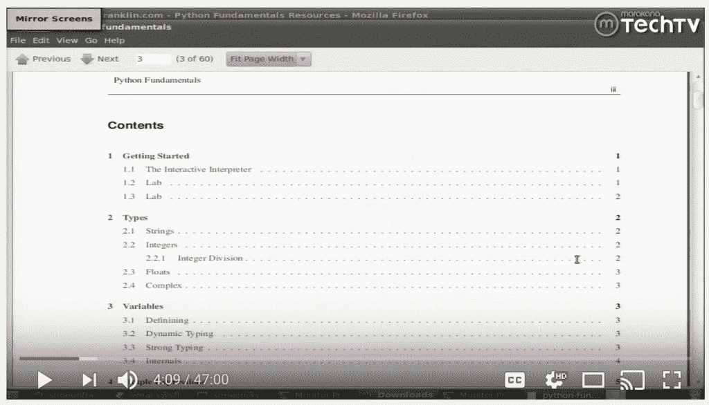
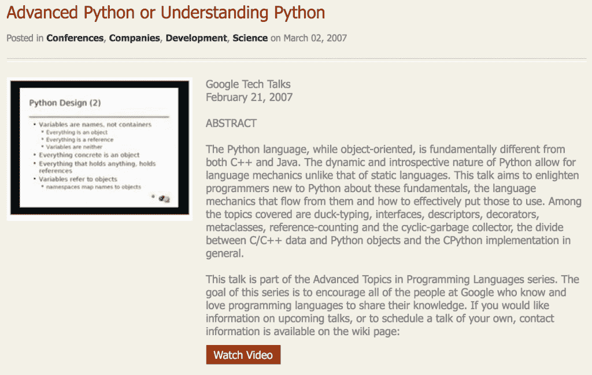

# Python 资源:培训视频

> 原文：<https://www.pythoncentral.io/python-resources-training-videos/>

有时候，熟悉一门新语言或一项新技术的最好方法是先看别人做，然后自己跳进去试一试。如果你喜欢以这种方式学习，并且想要提高你的 Python 技能，请查看下面的任何培训视频或视频库，开始学习吧！

## **1。 [Python 培训——Python 入门](https://www.youtube.com/watch?v=B9MvjMFokLc)**

这个受欢迎的视频由 YouTube 托管，带您了解 Python 的基本原理。在视频中，您将了解数据类型、变量以及其他对 OOP 语言很重要的术语和概念。

## **2。[高级 Python 或者理解 Python](http://www.bestechvideos.com/2007/03/02/advanced-python-or-understanding-python)**

Besttechvideos.com 主持了一系列 Python 视频，包括这个带你了解一些高级 Python 主题和概念的流行视频。许多视频都是从 Python 演讲、活动或会议上传的。如果你访问 besttechvideos.com 并搜索“Python”这个词，你会找到几十个视频供任何水平的程序员欣赏。

## **3。[PyVideo.org](http://pyvideo.org/)**

PyVideo.org 是一个专门致力于探索和教授 Python 的大型视频库。与 BestTechVideos 一样，这些视频中有许多来自流行的 Python 会议或讲座。看看他们库中的视频，了解如何扩展您的 Python 概念和技术知识，甚至从任何层面提高您的 Python 编码技能。