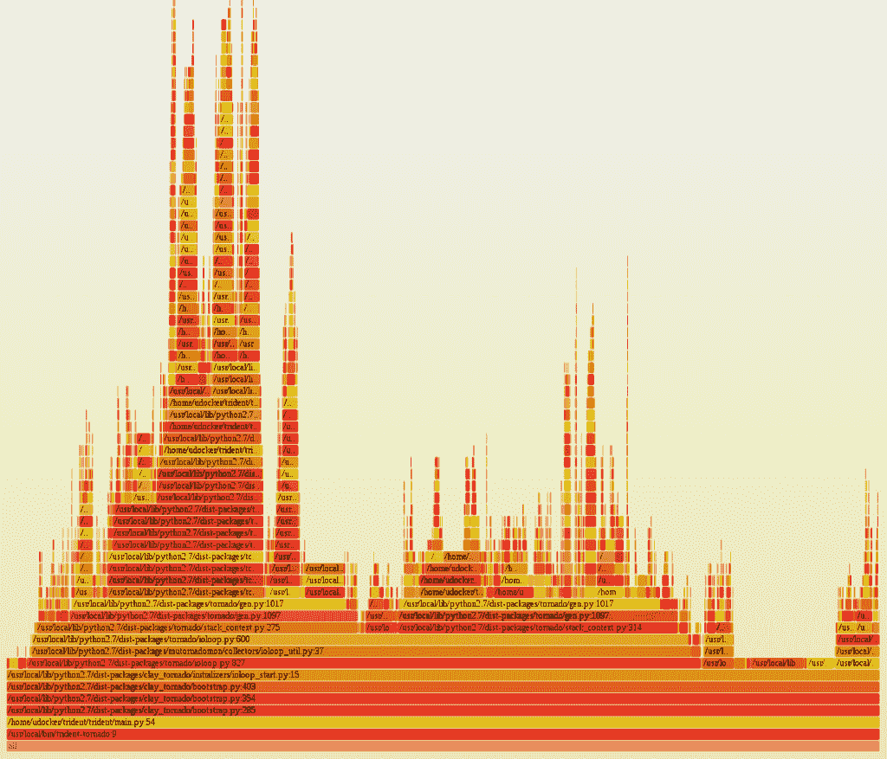

# Python 工具:Pyflame

> 原文：<https://www.pythoncentral.io/python-tools-pyflame/>

Pyflame 是优步工程团队带给我们的新工具(你可以在这里阅读这个想法的概念),许多 Python 程序员会发现它非常有用。该工具用于为 Python 流程生成火焰图。

Pyflame 通过使用 ptrace(2)系统调用来分析 Python 进程当前正在执行的堆栈跟踪。该工具仍然是最新发布的，已经被 web 开发社区所接受。安装简单，重量轻。创建 Pyflame 的目标是开发一个分析器，它将收集完整的 Python 堆栈，以一种可用于生成 flame 图的方式发出数据，具有较低的开销，并处理不明确用于分析的进程。如果做所有这些事情的能力听起来对你很有帮助，请确保在你的下一个项目中使用 Pyflame。