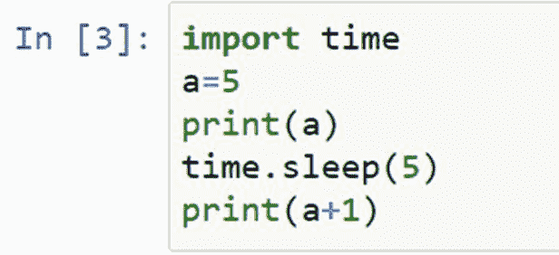

# Python 的 time . Sleep()–暂停、停止、等待或休眠您的 Python 代码

> 原文：<https://www.pythoncentral.io/pythons-time-sleep-pause-wait-sleep-stop-your-code/>

假设你正在开发一个用户界面，你用你的代码来支持它。您的用户正在上传文档，您的代码需要等待文件上传的时间。同样，当你参观一个有自动门的建筑群时，你一定注意到当你进入建筑群时，门是静止的。只有当你进入建筑群时，门才会自动关闭。是什么导致了这两种情况下的延迟？

代码支持上述两种系统。正是编程语言的 **延时函数** 导致了所需的延时。我们还可以在 Python 代码中添加时间延迟。Python 的 **time** 模块允许我们在两个语句之间建立延迟命令。添加时间延迟的方法有很多种，在本文中，我们将逐步讨论每种方法。

## **Python 的 time . Sleep()–暂停、停止、等待或休眠您的 Python 代码**

Python 的 **时间** 模块有一个很好用的函数叫做**sleep()**。本质上，顾名思义，它暂停您的 Python 程序。**time . sleep()**命令相当于 Bash shell 的**sleep**命令。几乎所有的编程语言都有这个特性。

### ****功能****

 **使用该函数时，我们可以指定延时，编译器将执行固定的延时。 该函数的语法如下:

#### **time.sleep()参数**

*   **secs**-Python 程序应该暂停执行的秒数。这个参数应该是一个 int 或者 float 。

### **使用 Python 的 time.sleep()**

这里有一个快速简单的语法示例:

在这里，我们通过第一个命令指示系统等待五秒钟，然后等待 三百毫秒，等于 0.3 秒。 你可以在这里注意到，我们已经根据语法在括号内写了时间延迟的值。

现在让我们考虑另一个执行时间延迟的例子。

这里我们取了一个变量“a ”,它的值存储为 5。现在我们打印值“a ”,然后再次打印增加的值“a”。但是，两个语句的执行之间存在时间延迟。并且，我们已经指定使用**time . sleep()**函数。你一定观察到了，我们在代码的开头也导入了 **time** 模块。

现在我们来看看输出是什么:

在这里，我们可以看到只有第一个命令被执行。现在五秒钟后的输出:

现在，经过五秒钟的延迟后，第二条语句也被执行。

### **睡眠的高级语法() **功能****

 **这里有一个更高级的例子。它接受用户输入，并询问您想要 【睡眠() 多长时间。它还通过打印出time . sleep()调用前后的时间戳来证明它是如何工作的。注意，Python 2.x 使用raw _ input()函数获取用户输入，而 Python 3.x 使用input()函数。现在让我们看看输入语法:

上面给出的代码询问用户要等待多长时间。我们已经在**sleeper()**函数中提到了这个输出的命令。然后，代码在代码执行开始时和代码实现后打印计算机时间。通过这种方式，我们可以看到延迟功能的实际功能。现在让我们看看输出:

系统要求我们输入，即我们希望系统等待多长时间。让我们输入 5 秒，观察最终的输出。

我们可以看到起始计算机时间(“之前”)和结束计算机时间(“之后”)有五秒钟的时间差。

### **time . sleep()的准确性**

**time . sleep()**函数使用底层操作系统的**sleep()**函数。最终，这一功能有其局限性。例如，在标准的 Windows 安装中，您可以延迟的最小时间间隔是 10 - 13 毫秒。Linux 内核倾向于具有更高的滴答率，其时间间隔通常接近 1 毫秒。注意，在 Linux 中，可以安装**RT _ PREEMPT**补丁集，这样就可以拥有一个半实时内核。使用实时内核将进一步增加**time . sleep()**函数的准确性。但是，除非你想短暂的 ***睡眠*** ，一般可以忽略这个信息。

## **使用装饰者添加****time . sleep()****命令**

[装饰器](https://www.geeksforgeeks.org/decorators-in-python/) 用于创建调用高阶函数的简单语法。什么时候可以用装修工？假设我们不得不再次测试一个功能，或者用户不得不再次下载一个文件，或者你不得不在特定的时间间隔后检查一个接口的状态。您需要在第一次尝试和第二次尝试之间有一段时间延迟。因此，您可以在需要重复检查和需要时间延迟的情况下使用 decorators。

让我们考虑一个使用装饰者的例子。在这个程序中，我们将计算执行函数所花费的时间。

这里的**time _ calc()**是装饰函数，扩展并包含了其他函数，从而提供了简单的语法。让我们看看输出是什么。

## **使用线程添加****time . sleep()****命令**

[Python 中的多线程](https://www.tutorialspoint.com/python/python_multithreading.htm) 相当于同时运行几个程序。当多线程与模块相结合时，我们可以快速解决复杂的问题。多线程功能可从 **线程** 模块获得。

让我们使用多线程和时间延迟来打印字母表歌曲。

这里一个线程被用来打印单个的字母。也有 0.5 秒的时间延迟。当你运行这个程序时，你会看到字母表歌曲的每一行都在 0.5 秒的延迟后被打印出来。我们来看看输出是什么:

## **延时练习题**

1.  ### **打印两个延时报表:**

    在这个问题中，我们将打印两条语句，第一条是“大家好！”

    第二个问题是“这是一个关于时间延迟的练习题。”我们将在这两个语句之间引入 5 秒的时间延迟。我们来看看这个问题的代码语法:

    

    如你所见，基本步骤很简单。我们首先导入时间模块。接下来，我们给出第一条语句的打印命令。然后我们通过**time . sleep()**函数引入延时，然后我们给出打印以下语句的命令。我们来看看输出是什么:

    

    此图显示了第一个输出。

    

    现在，这个输出比前一个输出晚五秒钟获得。

2.  ### **显示日期和时间的程序:**

    让我们创建一个程序，在这个程序中，我们制作一个也能显示日期的数字钟。

    该任务的代码如下:

    ### ****

    这里我们给出了显示日期和时间的命令。然后，我们添加了一秒钟的时间延迟，以便更新时间。该程序的输出如下:

    

## **结论**

时间延迟在用户界面中有着巨大的应用。对于程序员来说，知道如何在程序中增加时间延迟是很重要的。我们希望这篇文章能帮助你了解 Python 的时间模块。现在，您可以有效地在代码中添加时间延迟，并提高代码的生产率！****