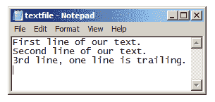
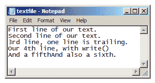

# 用 Python 读写文件

> 原文：<https://www.pythoncentral.io/reading-and-writing-to-files-in-python/>

操纵文件是 Python 脚本的一个重要方面，幸运的是，这个过程并不复杂。内置的`open`函数是读取任何类型文件的首选方法，也可能是您需要使用的所有方法。让我们首先演示如何在一个简单的文本文件上使用这个方法。

为了清楚起见，让我们首先在标准文本编辑器(本例中为 MS Notepad)中编写文本文件字符串。当在编辑器中打开时，它看起来像这样(注意空的尾随行):



为了用 Python 打开我们的文件，我们首先必须知道文件的路径。在本例中，文件路径是相对于当前工作目录的。所以我们不需要在解释器中输入完整的路径。

```py

>>> tf = 'textfile.txt'

```

## **用 Python 打开一个文件**

使用这个变量作为`open`方法的第一个参数，我们将文件保存为一个对象。

```py

>>> f = open(tf)

```

## **用 Python 读取文件**

当我们引用我们的 file-object `f`时，Python 告诉我们状态(打开或关闭)、名称和模式，以及一些我们不需要的信息(关于它在我们机器上使用的内存)。

我们已经知道这个名字，我们没有关闭它，所以我们知道它是开放的，但模式值得特别注意。我们的文件`f`处于模式 *r* 中，用于*读取*。具体来说，这意味着我们只能*从文件中*读取数据，而不能编辑或向文件中写入新数据(对于`text`，它也处于`t`模式，尽管它没有明确说明这一点——这是默认模式，就像 *r* 一样)。让我们用`read`方法从文件中读取我们的文本:

```py

>>> f.read()

'First line of our text.\nSecond line of our text.\n3rd line, one line is trailing.\n'

```

这看起来不完全像我们在记事本中输入的内容，但这是 Python 读取原始文本数据的方式。获取我们输入的文本(没有`\n`换行符，我们可以打印它):

```py

>>> print(_)

First line of our text.

Second line of our text.

3rd line, one line is trailing.

```

**注意**我们如何在 Python IDLE 中使用`_`字符来引用最近的输出，而不是再次使用`read`方法。如果我们试着用`read`来代替，会发生什么:

```py

>>> f.read()

''

```

发生这种情况是因为 read 返回了文件的全部内容，而不可见的位置标记(Python 如何跟踪你在文件中的位置)在文件的末尾；没什么可看的了。

## **部分读取 Python 中的文件**

**注意**:如果你不想要文件的全部内容，你可以在`read`中使用一个整数参数；Python 将读取您为`read`指定的任意数量的字节作为整数参数。

要回到文件的开头(或文件中的任何地方)，在`f`上使用`seek(int)`方法。通过回到开头，您可以使用`read`从头开始再次阅读内容:

```py

>>> f.seek(0)

# We only read a small chunk of the file, 10 bytes

print(f.read(10))

First line

```

此外，要知道文件的当前位置，在`f`上使用`tell`方法，如下所示:

```py

>>> f.tell()

10L

```

如果你不知道你的文件的大小或者你想要多少，你可能会发现这没什么用。

## **用 Python 逐行读取文件**

然而，有用的是逐行读取文件的内容。我们可以用`readline`或`readlines`方法做到这一点——第一个方法一次读取一行，第二个方法返回文件中每一行的列表；两者都有一个可选的整数参数来指示要读取多少文件(多少字节):

```py

# Make sure we're at the start of the file

>>> f.seek(0)

>>> f.readlines()

['First line of our text.\n', 'Second line of our text.\n', '3rd line, one line is trailing.\n']

>>> f.readline()

'First line of our text.\n'

>>> f.readline(20)

'Second line of our t'

# Note if int is too large it just reads to the end of the line

>>> f.readline(20)

'ext.\n'

```

逐行读取文件的另一种方法是将它视为一个序列并遍历它，如下所示:

```py

>>> f.seek(0)

>>> for line in f:

>>> print(line)

First line of our text.

Second line of our text.

3rd line, one line is trailing.

```

## **用 Python 读取文件的特定行**

我们可以使用`readlines`方法来访问文件中的特定行。

假设我们有一个名为`test.txt`的文件，包含以下文本:

```py

one

two

three

four

```

我们可以这样理解第二行:

```py

>>> test_file = open('test.txt', 'r')

>>> test_lines = test_file.readlines()

>>> test_file.close()

>>> # Print second line

>>> print(test_lines[1])

two
注意，它打印了两行，因为该行有一个行尾，而`print`添加了另一个行尾。可以用*剥离*的方法，比如`print(test_lines[1].strip())`。
 **Python 文件写入模式**
这涵盖了文件的基本读取方法。在查看写入方法之前，我们将简要检查用`open`返回的 file-object 的其他*模式*。
我们已经知道了模式 *r* ，但是还有 *w* 和 *a* 模式(分别代表*写*和*追加*)。除此之外还有选项 *+* 和 *b* 。添加到模式中的 *+* 选项使文件为更新而打开，换句话说，就是从中读取或向其中写入。
使用这个选项，看起来似乎在 *r+* 模式和 *w+* 模式之间没有什么区别，但是这两者之间有一个*非常*重要的区别:在 *w* 模式中，文件被自动截断，这意味着它的**全部内容**被擦除——所以即使在 *w+* 模式中，文件一打开就会被完全覆盖，所以要小心。或者，您可以使用`truncate`方法自己截断打开的文件。
如果你想写到文件的末尾，只需使用*追加*模式(如果你也想从中读取，使用 *+* )。
 *b* 选项表示以*二进制*文件打开文件(而不是默认的*文本*模式)。每当文件中有非常规文本的数据时(例如，打开图像文件时)，请使用此选项。
现在让我们看看如何写入我们的文件。我们将使用 *a+* 模式，这样我们就不会删除已有的内容。首先让我们关闭文件`f`并打开一个新文件`f2`:

```

# It's important to close the file to free memory

>>> f.close()

>>> f2 = open(tf, 'a+')

```py

我们可以看到我们的`f`文件现在被关闭了，这意味着它没有占用太多的内存，并且我们不能对它执行任何方法。
**注意:**如果你不想在文件上显式调用`close`，你可以使用一个`with`语句来打开文件。`with`语句将自动关闭文件:

```

# f remains open only within the 'with'

>>> with open(tf) as f:

>>> print(f.read())

First line of our text.

Second line of our text.

3rd line, one line is trailing.

# This constant tells us if the file is closed

>>> f.closed

True

```py

用 *f2* ，让我们写到文件的末尾。我们已经处于追加模式，所以我们可以调用`write`:

```

f2.write('Our 4th line, with write()\n')

```py

**用 Python 写多行到一个文件**
这样我们就写入了我们的文件，我们也可以用`writelines`写多行，这将把一个字符串序列(例如一个*列表*)作为行写入文件:

```

f2.writelines(['And a fifth', 'And also a sixth.'])

f2.close()

```py

**注意:**的名字`writelines`是一个误称，因为**而不是**会自动在序列中的每个字符串末尾写换行符，我们将会看到。
好了，现在我们已经写好了文本并关闭了`f2`,所以当我们在文本编辑器中打开文件时，我们所做的更改应该会出现在文件中:

我们可以看到`writelines`方法并没有把我们的第五行和第六行分开，所以请记住这一点。
现在，您有了一个好的起点，开始编写脚本并探索在 Python 中读写文件时可以做些什么——不要忘记利用 Python 为字符串提供的所有广泛的格式化方法！

```