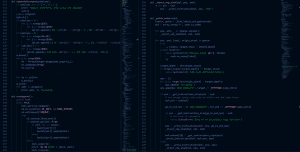

# 为什么 Python 是最好的编程语言

> 原文：<https://www.pythoncentral.io/reasons-why-python-is-the-best-programming-language/>

如果你想知道谁会做我的 Python 作业，不要担心，因为你总能在网上找到专业的作业帮助服务。在专业网站上，专家可以为学生提供任何复杂程度的在线 Python 作业帮助。

网站助手以低廉的价格为学生提供服务，无论你在哪里学习，在学校，学院或大学。专业人士将根据既定的截止日期交付没有抄袭的优质解决方案。可以选择最适合自己的期限。您的家庭作业解决方案可以在 5 小时或 5 天内交付。

不用担心工作质量，因为每个帮工都有学位，都是高等教育机构毕业的。你甚至可以检查帮助者如何为其他学生做某类作业的例子。所有的专家都有在网上帮助学生完成家庭作业的长期经验。

最重要的是，你可以随时寻求援助。如果你突然忘记了，你甚至可以在晚上点一份作业解决方案。

## 应该从学习哪种编程语言开始？

如果你喜欢一个 STEM 主题，并且你已经[决定](https://www.pythoncentral.io/python-generators-and-yield-keyword/)你想把你的职业与它联系起来，你需要知道哪种编程语言会在你的工作中帮助你。最有可能的是，你将开始学习 Python 的编程语言。

Python 是最简单的编程语言之一，在 IT 界越来越受欢迎。Python 在编程语言中排名第四，仅次于经典的 Java、C 和 C ++。今天，每个程序员都必须拥有这个工具才能在自己的领域取得成功。

Python 是一种多用途编程语言，允许程序员编写可读性很好的代码。Python 的相对简洁性允许您创建一个比用另一种语言编写的程序要短得多的程序。

作为一种多平台编程语言，意味着 Python 程序可以在不同的操作系统上运行，而无需任何修改。

Python 的另一个优势是它的标准库，它与 Python 一起安装，包含用于操作系统、网页、数据库、各种数据格式的现成工具，用于构建程序的图形界面等等。

你可以用 Python 创建完全不同的程序；它们可以是小的脚本，也可以是复杂的系统。

最重要的是你可以免费使用 Python。因此，如果你不喜欢这个项目，你不会失去任何东西，也不会多付额外的钱。

对于不同的项目，这种编程语言还有许多其他好处。

## Python 对于 web 开发来说很方便

据 web 开发人员称，Python 是备选语言中最方便的编程语言。

由于标准 web 开发任务的现成解决方案的应用程序的可用性，单个项目的速度提高了许多倍。稳定性应该理解为应用程序在任何条件下的可靠性。

## Python 很可靠

美国银行选择 Python 来管理关键系统，美国证券交易委员会将 Python 作为一种语言来支持华尔街——听起来很有说服力。这种信任不是没有根据的:执行一项任务的几行代码使它不容易出现问题，并且易于调试。

Python 也用于在一些复杂的任务中扩展解决方案，结果可以在在线服务 YouTube、Dropbox、Reddit、Quora 和 Disqus 中看到。最初，这些资源有一个小而原始的功能。随着时间的推移，它们越来越受欢迎，它们引入了新的选项，Python 帮助快速、轻松地完成了这些工作。

## Python 用于数据科学

无论您在 IT 领域选择哪条道路，数据都将是其中的一部分。分析技能的必要性不亚于编程技能，Python 在这两个领域都有应用。在 R 语言的层面上，Python 最常用于数据科学，Python 开发人员的空缺数量超过了 R 语言的类似职位。与 Python 不同，R 语言是用于研究和统计分析的特定工具。

数据并没有变小；对专家的需求越来越大，所以为了将来不迷失方向，现在就开始学习 Python 吧。由于编程语言总是有需求的，你可以很容易地找到一份掌握它的高薪工作。

## 哪些职业需要我的 Python 技能？

学习流行的编程语言为初学者打开了许多专业的大门。您可以在以下位置轻松开始您的职业生涯:

*   网络安全——防范黑客攻击、创建渗透系统的测试、安全系统分析以及软件开发。
*   物联网——又称物联网、智能家居。你可以买几个设备，在家试着配置或者专业做。
*   营销——从你的数据中提取和分析用户信息，或者使用脸书、谷歌和 Twitter 的 API。
*   科学-数学和统计层面的数据处理，从各个领域的实验室实验结果中提取信息部分。
*   QA——通过从事自动化测试，你可以成为一名软件测试人员。
*   机器学习——Python 据说是机器学习的未来，我们也建议你以后多学一点。

Python 的一个可能的缺点是代码执行速度。Python 不是编译语言。Python 代码首先被编译成内部字节码，然后由 Python 解释器执行。在大多数情况下，与 c 等语言相比，使用 Python 会产生较慢的程序。

然而，现代计算机的计算能力如此之强，以至于对于大多数应用来说，开发速度比执行速度更重要，Python 程序通常会写得快得多。

此外，用 C 或 C ++编写的模块很容易扩展 Python。这种模块可用于执行程序中对处理器产生高负荷的部分。