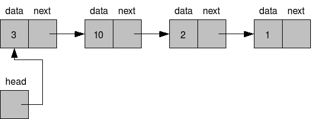

# 单链表:如何插入和打印节点

> 原文：<https://www.pythoncentral.io/singly-linked-list-insert-node/>

## 先决条件

要了解单链表，你应该知道:

1.  Python 3
2.  OOP 概念

## 什么是单链表？

在本教程中，我们将学习什么是单链表，以及可以对它们执行的一些非常基本的操作。

在我们进入什么是单链表的细节之前，我们必须了解什么是节点。这是因为节点是链表的构造块。一个节点由两部分组成:

1.  数据部分-包含数据
2.  地址部分-这是指向下一个节点位置的指针

在单链表中，每个节点的地址部分包含了下一个节点的位置信息。这就形成了一系列的链条或链环。链表的第一个节点由指针跟踪。最后一个节点指向 *无* 。

让我们看看下面的图表，以便更好地理解这一点:

[](https://www.pythoncentral.io/wp-content/uploads/2017/08/wordpress-hints-linked-list-google.png)

**注:**上图中最后一个元素 1 指向*无*。 尽管这些节点彼此相邻，但实际上，它们可能在也可能不在相邻的内存位置。

请看这个动画，它展示了链表的工作方式。

**提示:** 总是试图画出这些数据结构来获得清晰的理解。

## 如何创建单链表？

### 创建类

首先，你必须创建一个节点来创建一个单链表。为此，我们创建一个类*【数据】* 和*next Node*属性。如前所述， *数据* 属性将包含数据，而*next node*将简单地指向链表中的下一个节点。我们将*next node*的默认值设为 *None。* 你可以用*getter*和*setter*方法来做到这一点。

既然已经创建了 *节点* 类，那么是时候创建*linked list*类了。这个只有一个属性，。默认情况下，这里会指向 *无* 。如果表头指向 *None，则表示*链表为空 。为了跟踪链表中节点的数量，我们可以在*linked list*类中添加一个*size*属性，并将其默认为 0。

### 插入节点

这是一个*linked list*类的方法。记住，为了使编码简单有效，我们总是将新节点添加到链表的开头。换句话说， *头* 将始终指向最近添加的节点。如果我们将新节点添加到列表的末尾，我们需要做额外的工作来找到列表的末尾，然后添加它。这是一个浪费的操作。然而，如果你维护另一个指针，让我们称它为 *尾*指针使它指向最后一个节点，这是可以做到的。您可以在链表中的任意位置插入新节点。我们已经讨论了前一种方法，即在链表的开头插入。

假设我们需要将 7 添加到一个链表中，我们需要执行以下步骤:

1.  创建一个以 7 为数据的节点对象，下一个节点指向 *头* 节点
2.  将 *头的* 指针指向这个新节点

最后将 *大小* 属性加 1。如果插入成功，最好返回 *True* 。这样用户就知道发生了什么。

### 打印节点

这是一个*linked list*类的方法。要打印链表所有节点中的数据，我们需要一次遍历一个节点，并打印每个节点的数据部分。

### 编码单链表

```py
class Node:

   def __init__(self,data,nextNode=None):
       self.data = data
       self.nextNode = nextNode

   def getData(self):
       return self.data

   def setData(self,val):
       self.data = val

   def getNextNode(self):
       return self.nextNode

   def setNextNode(self,val):
       self.nextNode = val

class LinkedList:

   def __init__(self,head = None):
       self.head = head
       self.size = 0

   def getSize(self):
       return self.size

   def addNode(self,data):
       newNode = Node(data,self.head)
       self.head = newNode
       self.size+=1
       return True

   def printNode(self):
       curr = self.head
       while curr:
           print(curr.data)
           curr = curr.getNextNode()

myList = LinkedList()
print("Inserting")
print(myList.addNode(5))
print(myList.addNode(15))
print(myList.addNode(25))
print("Printing")
myList.printNode()
print("Size")
print(myList.getSize())
```

## 单链表的优缺点是什么？

优势

1.  这是一个动态数据结构，插入和删除都很简单，因为我们不需要移动元素。只要更新下一个指针就可以了。
2.  使用链表可以很容易地实现堆栈和队列数据结构。

缺点

1.  下一个指针用完了额外的内存。
2.  随机访问是不可能的。您必须从头开始遍历链表才能到达特定的节点。

## 结论

本教程到此结束。在以后的教程中，我们将会看到如何从链表中移除一个元素，如何发现一个元素是否存在于链表中等等。快乐的蟒蛇！