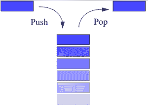

# 堆栈教程:实现初学者指南

> 原文：<https://www.pythoncentral.io/stack-tutorial-python-implementation/>

## 先决条件

为了理解这个堆栈教程，你需要学习堆栈数据结构，这需要:

1.  Python 3
2.  基本数据结构概念如列表(点击 [此处](https://www.pythoncentral.io/python-lists-and-tuples/) 刷新列表概念)
3.  OOP 概念

## 什么是栈？

你好！如果你正在阅读这篇文章，你将会学到一个非常基本和最有用的数据结构概念。如果你懂其他语言，比如 C 或 C++，stack 的实现可能会很棘手(因为你必须跟踪指针！)但不是用 Python。Python 是如此神奇，以至于你可以使用列表来轻松地实现它们，但是你也将学习如何使用指针来采用一种语言不可知的方式来实现它们。但首先，让我们了解它们是什么。如果您已经熟悉了这一点，可以跳到实现部分。

当你听到书库这个词时，你首先想到的可能是一摞书，我们可以用这个类比来轻松解释书库！一些共性包括:

1.  在书库的顶部有一本书(如果书库中只有一本书，那么这本书将被认为是最上面的书)。
2.  只有拿走最上面的书，你才能拿到最下面的书。这里没有叠衣服游戏！(同时假设你一次只能举起一本书)。
3.  一旦你一本书一本书地从上面拿走，就没有书剩下了，因此你不能再拿走更多的书。

看看这款名为 [河内之塔](https://www.mathplayground.com/logic_tower_of_hanoi.html) 的有趣游戏，它完美地展示了堆栈是如何工作的。仔细阅读说明，关掉音乐(声音太大了！).



用编程的方式描述以上几点:

1.  跟踪最顶端的元素，因为这将为您提供关于堆栈中元素数量以及堆栈是否为空/满的信息(如果堆栈为空，则 top 将被设置为 0 或负数)
2.  最后进入堆栈的元素总是第一个离开(后进先出)
3.  如果所有的元素都被移除，那么堆栈是空的，如果你试图从一个空的堆栈中移除元素，会抛出一个警告或错误信息。
4.  如果堆栈已经达到最大限制，而你试图添加更多的元素，就会抛出一个警告或错误信息。

要记住的事情:

1.  元素的进入和退出只发生在堆栈的一端(顶部)
2.  将一个元素推入堆栈
3.  从堆栈中取出一个元素
4.  不允许随机访问——不能从中间添加或删除元素。

注意:始终跟踪顶部。这告诉我们堆栈的状态。

## 如何实现堆栈？

现在你知道什么是栈了，让我们开始实现吧！

### 栈实现使用列表

这里我们将定义一个类堆栈并添加方法来执行下面的操作:

1.  将元素推入堆栈
2.  从堆栈中弹出元素，如果为空则发出警告
3.  获取堆栈的大小
4.  打印堆栈的所有元素

```py
class Stack:

    #Constructor creates a list
    def __init__(self):
        self.stack = list()

    #Adding elements to stack
    def push(self,data):
        #Checking to avoid duplicate entries
        if data not in self.stack:
            self.stack.append(data)
            return True
        return False

    #Removing last element from the stack
    def pop(self):
        if len(self.stack)<=0:
            return ("Stack Empty!")
        return self.stack.pop()

    #Getting the size of the stack
    def size(self):
        return len(self.stack)

myStack = Stack()
print(myStack.push(5)) #prints True
print(myStack.push(6)) #prints True
print(myStack.push(9)) #prints True
print(myStack.push(5)) #prints False since 5 is there
print(myStack.push(3)) #prints True
print(myStack.size())  #prints 4 
print(myStack.pop())   #prints 3
print(myStack.pop())   #prints 9
print(myStack.pop())   #prints 6
print(myStack.pop())   #prints 5
print(myStack.size())  #prints 0
print(myStack.pop())   #prints Stack Empty!
```

**注意:**我们不担心堆栈的大小，因为它是由一个可以动态改变大小的列表来表示的。

### 使用数组的堆栈实现

Python 列表使得实现堆栈变得如此容易。然而，如果你想不可思议地实现堆栈语言，你必须假设列表就像数组(大小固定),并使用一个顶部指针来记录堆栈的状态。查看 [这个](https://www.cs.usfca.edu/~galles/visualization/StackArray.html) 动画来了解它的工作原理。

#### 算法

1.  声明一个链表和一个整数 MaxSize，表示栈的最大大小
2.  Top 初始设置为 0
3.  推送操作:
    1.  检查 Top 是否小于堆栈的 MaxSize
        1.  如果是，将数据追加到堆栈，并将 top 加 1
        2.  如果否，打印堆栈满信息
4.  弹出操作:
    1.  检查 Top 是否大于 0:
        1.  如果是，从列表中弹出最后一个元素，并将 top 减 1
        2.  如果否，打印堆栈空消息
5.  尺寸操作:
    1.  顶部指针的值是堆栈的大小

#### 程序

```py
class Stack:

    #Constructor 
    def __init__(self):
        self.stack = list()
        self.maxSize = 8
        self.top = 0

    #Adds element to the Stack
    def push(self,data):
        if self.top>=self.maxSize:
            return ("Stack Full!")
        self.stack.append(data)
        self.top += 1
        return True

    #Removes element from the stack
    def pop(self):
        if self.top<=0:
            return ("Stack Empty!")
        item = self.stack.pop()
        self.top -= 1
        return item

    #Size of the stack
    def size(self):
        return self.top

s = Stack()
print(s.push(1))#prints True
print(s.push(2))#prints True
print(s.push(3))#prints True
print(s.push(4))#prints True
print(s.push(5))#prints True
print(s.push(6))#prints True
print(s.push(7))#prints True
print(s.push(8))#prints True
print(s.push(9))#prints Stack Full!
print(s.size())#prints 8        
print(s.pop())#prints 8
print(s.pop())#prints 7
print(s.pop())#prints 6
print(s.pop())#prints 5
print(s.pop())#prints 4
print(s.pop())#prints 3
print(s.pop())#prints 2
print(s.pop())#prints 1
print(s.pop())#prints Stack Empty!
```

**注:**未添加元素 9，因此大小仍为 8。

除了上面描述的方法之外，您还可以添加方法来返回顶部元素，检查堆栈是否为空等等。

## 结论

堆栈的一个主要应用是在递归中。请务必查看[这篇](https://www.pythoncentral.io/recursive-python-function-example-make-list-movies/)教程，了解什么是递归。一旦你熟悉了这个概念，试着用递归- [句子颠倒](https://www.geeksforgeeks.org/reverse-words-in-a-given-string/)和[平衡括号](https://www.geeksforgeeks.org/check-for-balanced-parentheses-in-an-expression/)来解决这些难题。快乐的蟒蛇！