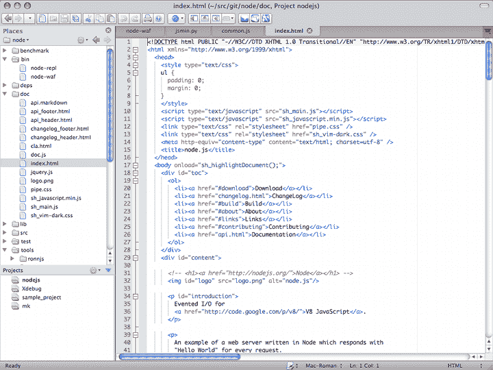

# 可以用于开发的最好的 Python IDEs

> 原文：<https://www.pythoncentral.io/the-best-python-ides-you-can-use-for-development/>

This article was written by Sergio Tapia Gutierrez. If you're after another opinion by Jason Fruit, checkout our other IDE article [Comparison of Python IDEs for Development](https://www.pythoncentral.io/comparison-of-python-ides-development/ "Comparison of Python IDEs for Development"). We also have a [Review of Python's Best Text Editors](https://www.pythoncentral.io/best-text-editors-for-python-development/ "Review of Python's Best Text Editors").

IDE ( *集成开发环境*)是程序员可以使用的最好的工具之一。它允许开发人员高效地工作，忘记样板文件。

虽然一些程序员对使用文本编辑器以外的任何东西的想法嗤之以鼻，但是当您正在处理一个包含许多文件的非常大的项目时，IDE 将具有使您作为开发人员的生活更加容易的特性。

一个好的 IDE 应该具备的一些特性是:

*   代码完成
*   语法突出显示
*   通用代码模板
*   源代码控制支持(例如 *Subversion、Mercurial 或 Git*

让我们看看哪些 Python IDE 是最好的，以及它们是如何相互比较的。

PyDev 的 Eclipse

## PyDev 的 Eclipse

PyDev 的 Eclipse

**PyDev 官方网站:[http://pydev.org/](http://pydev.org/ "PyDev Website")**

Eclipse 是一个非常通用的 IDE，已经存在很长时间了。这是经过时间考验的产品，非常可靠。Eclipse 就像一个沙盒 IDE 它可以支持任何语言，只要有人通过一个包来支持它。PyDev 就是这种情况，这个包允许您将 Eclipse 变成一个非常有用的 Python IDE。

这是一个完全免费 IDE，提供了大量的功能，例如:

*   Django 一体化
*   代码完成
*   自动导入的代码完成
*   语法突出显示
*   代码分析
*   转到定义
*   重构
*   标记事件
*   调试器
*   远程调试器
*   令牌浏览器
*   交互式浏览器
*   单元测试集成
*   代码覆盖率
*   还有很多很多

我在我的 Windows 机器上用 Python 编码时使用了这个，它只需很少的配置就能工作。

## Komodo Edit

Komodo Edit -可在 Windows、Linux 和 Mac 上使用。

**科莫多编辑官网:[http://www.activestate.com/komodo-edit](http://www.activestate.com/komodo-edit "Komodo Edit")**

Komodo Edit 是一个非常干净、专业的 Python IDE。它没有绒毛，而是专注于把你需要的东西放在你面前。没有挖掘随机子菜单寻找一个选项。它的代码完成非常好，速度很快；它会在你输入的时候弹出，只需要很少的加载时间。

ActiveState 提供了他们 IDE 的商业版本，名为 [Komodo IDE](https://www.activestate.com/products/komodo-ide/ "Komodo IDE") 。

两个版本之间的差异如下:

Komodo Edit vs. Komodo IDE

## 皮查姆

JetBrains 的 PyCharm

**PyCharm 官方网站:[http://www.jetbrains.com/pycharm/](http://www.jetbrains.com/pycharm/ "PyCharm IDE")**

PyCharm 是由 [JetBrains](http://www.jetbrains.com "Jetbrains") 创建的 IDE。你可能记得这些人是 T2 ReSharper T3 的作者，这是. NET 开发者可以做的最好的投资之一。PyCharm 也不例外，JetBrains 延续了其优秀的血统，向开发者生态系统发布了另一个优秀的工具。

据说拥有绝对最好的代码完成技术，这至少值得您尝试一下。

*   跨平台
*   商业
*   自动代码完成
*   集成 Python 调试
*   错误标记
*   源代码管理集成
*   智能缩进
*   括号匹配
*   加行号
*   代码折叠
*   单元测试