# 2022 年 10 大 Python 在线课程

> 原文：<https://www.pythoncentral.io/top-10-python-courses-online-in-2022/>

## [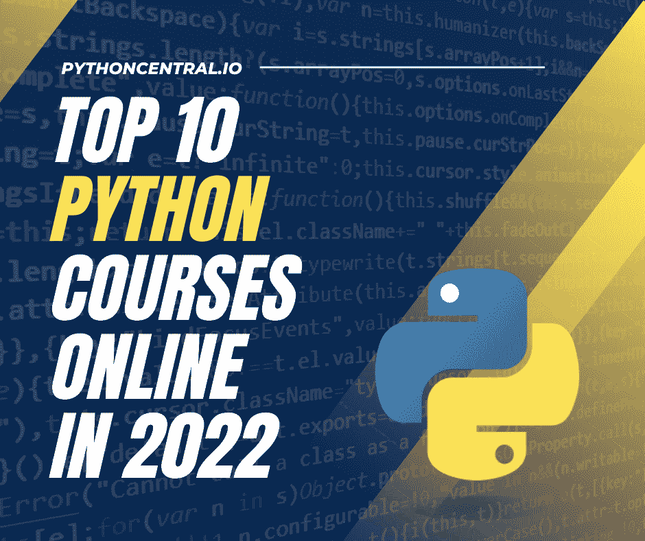](https://www.pythoncentral.io/wp-content/uploads/2022/09/Top-10-Python-Courses-Online-in-2022.png)

## **简介**

Python 已经成为全球使用最广泛、最容易访问的编码语言之一。对于 STEM 甚至其他学科的不同领域的许多人来说，它已经成为一种赋权工具。

获得这样一项基本技能是一个梦寐以求的机会，因为它提高了你的就业机会，更重要的是，为不同的问题提供了技术解决方案。无论是数据分析还是开发简单的程序来自动化琐碎的事情，Python 和它的包已经涵盖了一切。

现在，有人可能会问在哪里可以获得这些知识，为了回答这个问题，python central 的工作人员已经编译了一些在线课程的资源，这些课程是可访问的和全面的，足以让你精通 python。请注意，这个列表没有特定的顺序，它们都最适合不同的用途。请继续阅读，寻找答案！

## 好的 Python 课程由什么组成？

我们在选择课程时的标准是基于一些因素，如新手是否容易接触到，以及为寻求更多经验的熟练用户提供的有趣技巧。客观分析这一点的一些方法是保持对这几点的敏锐:

*   类比的用法:如果老师能够向没有数学背景的人解释“字符串”和“变量”这样的概念，这是一个好现象
*   更少的家庭作业，更积极的课堂作业:这有助于人们更经常地改正错误，而且因为他们可以倒带大多数录好的课，这也有助于他们复习。
*   行业经验:如果教师一直活跃在计算机编程行业，他们比普通的半职业教师更有可能有更多的锦囊妙计。

## **2022 年 10 大 Python 在线课程**

### **# 1 Python 编程入门(Udemy)**

[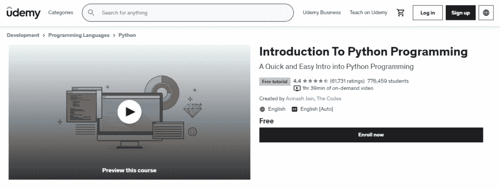](https://www.pythoncentral.io/wp-content/uploads/2022/09/course1.png)

这个两小时的简短入门课程是最适合初学者的 。 由加州大学伯克利分校的学生 Avinash Jain 创办的教育机构 Codex 制作，这个免费课程尽最大努力让一个没有编码经验的人熟悉 python 环境下代码的关键特性。您可以尽快完成这 15 个视频教程，因为每个教程只有 10 分钟。因此，这门课程可以非常快地完成。由于它是免费的，所以从初学者到基础知识一般的部分编码人员都可以使用。

**导师** :阿维纳什·贾恩(Avinash Jain)，Codex 的创始人，该机构旨在使代码知识民主化。

**特色** :非常全面的课程持续时间非常短，因为它涵盖了许多需要进一步研究的主题，但它做得足够好，足以简化它，让任何外行人都知道事情的要点。也是免费的，是加分加一分。

| 课程名称 | Python 编程简介 |
| 讲师 | 阿维纳什·贾恩 |
| PythonCentral 专家评分 | 4.4 颗星 |
| 级别 | 初学者 |
| 成本 | 免费 |
| 总结 | 完全初学者的好课程 |
| Pro | 在不到两个小时的时间里教你基础知识 |

[转到课程](https://www.udemy.com/course/pythonforbeginnersintro/)

### **#2 完全初学者学习 Python 3.6(Udemy)**

[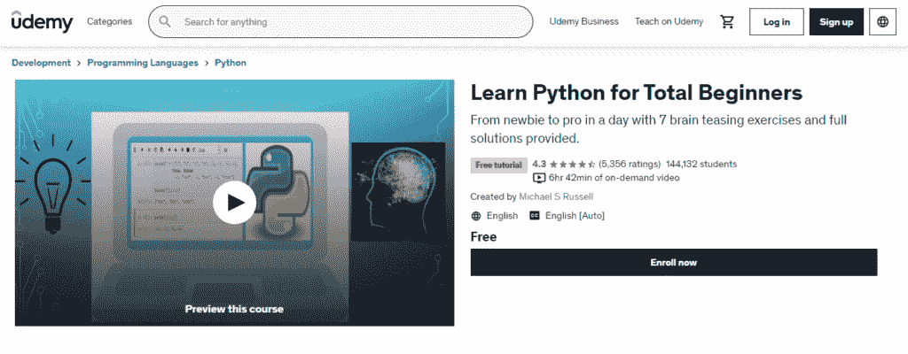](https://www.pythoncentral.io/wp-content/uploads/2022/09/course2.png)

本课程的名称有点用词不当，因为本课程期望你对 Python 或编码有一些基本的了解。许多极其生动的细节被掩盖了，这门课在短时间内有效传授知识方面表现突出。本课程是 最适合中级或初级初学者 。这是一门 6 小时的课程，包括作业、现场问题和 39 个录音讲座，要求你也遵守你的控制台上的代码。这些讲座由经验丰富的 Michael S Russell 主持，他是一名业务分析师，拥有 20 年使用 Python 和其他编码语言处理大量数据的经验。

**导师**:Michael S . Russell，金融与银行学硕士，他是一位伟大的老师，能预见你的错误，也有精彩的技巧为半熟练或新手减轻工作量。

**特色** :讲座都有字幕，通常有代码和 PowerPoint 的视频，这意味着它们是高质量和专业编辑的。它们在视觉上很容易理解，但我们也要说，老师以一种悠闲的节奏教学，在某种程度上，这实际上是好的，给了学生思考的空间。您还将学习如何操作 Jupyter 笔记本电脑。

| 课程名称 | 完全初学者学习 Python 3.6 |
| 讲师 | 迈克尔·拉塞尔 |
| PythonCentral 专家评分 | 4.4 颗星 |
| 级别 | 初级到中级 |
| 成本 | 免费 |
| 总结 | 涵盖 Python 基础知识的初学者坚实课程 |
| Pro | 带字幕的讲座，易于跟随 |

[转到课程](https://www.udemy.com/course/python-3-for-total-beginners/)

### **#3 Python 基础训练(LinkedIn 学习)**

[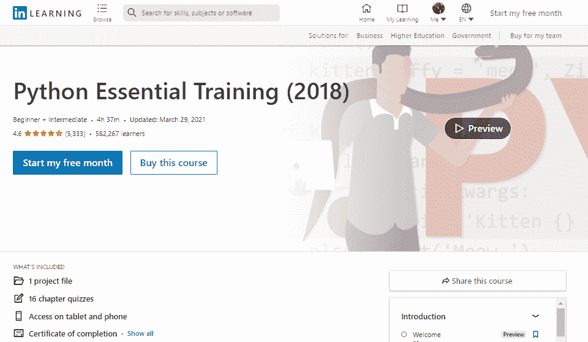](https://www.pythoncentral.io/wp-content/uploads/2022/09/course3.png)

这是一个稍短的 5 小时课程，课程结构非常均衡，初学者开始时速度稍慢，最终加快速度。本课程适合 的初级初学者和半熟练的中级者。

**讲师** : Bill Weinman，技术教育家和 Python 专家，在编写关于 C++、Java，当然还有 Python 等编码语言的内容方面有超过 25 年的经验。这种体验在讲座内容的质量上体现得淋漓尽致。

**特色** :本课程经过认证，最后提供证书，作为你简历的附件有效。这门课程很有声望，比尔·魏因曼已经教了很多人编程。因此，即使是这个 5 小时的课程，对于那些希望雇佣自由职业者来完成某些编码任务的公司来说也是有价值的。你在 5 个小时内学会了循环、模块和世界上所有的东西，在每章结束时完成了章节划分和测验。

| 课程名称 | Python 基础训练 |
| 讲师 | 比尔·魏因曼 |
| PythonCentral 专家评分 | 4.7 颗星 |
| 级别 | 初学者 |
| 成本 | LinkedIn 学习订阅 |
| 总结 | 适合 Python 新手的 5 小时课程 |
| Pro | 包括一个练习和 11 个小测验 |

[转到课程](https://www.linkedin.com/learning/python-essential-training-2018)

### **# 4 Python 3:Python 编程初学者指南(SkillShare)**

[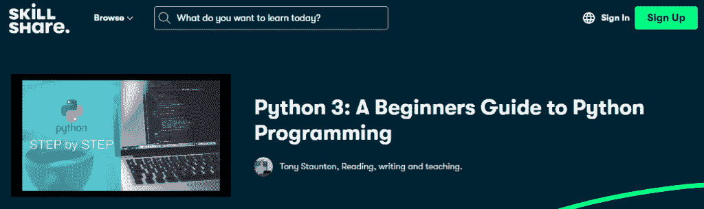](https://www.pythoncentral.io/wp-content/uploads/2022/09/course4.png)

这是一门更全面的课程，内容超过 8 小时，外加 9 个不同的项目，帮助您磨练技能并获得实践经验。本课程最适合 初学者和中级程序员。 它专注于开发应用程序的框架，所以这是一个中心焦点，这并不坏，因为开发一个应用程序包含了 Python 的大多数主要工具和应用程序，并使您熟悉所有这些。

**导师** :托尼·斯汤顿，精通多种编码语言，就职于 IT 部门。

**特色** :在课程结束时提供证书，但最好的部分是课程给你的奖金 9 个不同的项目，以应用在 8 小时的讲座和测验中获得的技能，因为没有指导方针，你可以自由地以你喜欢的方式处理问题。

| 课程名称 | Python 3:Python 编程初学者指南 |
| 讲师 | 托尼·斯汤顿 |
| PythonCentral 专家评分 | 4.7 颗星 |
| 级别 | 初学者 |
| 成本 | SkillShare Premium 订阅 |
| 总结 | 由知识渊博、引人入胜的讲师讲授的简短而甜蜜的初级 Python 课程 |
| Pro | 周末学习 Python 的绝佳课程 |

[转到课程](https://www.skillshare.com/classes/Python-3-A-Beginners-Guide-to-Python-Programming/821742951)

### **#5 100 天代码:2022 年完整 Python Pro boot camp(Udemy)**

[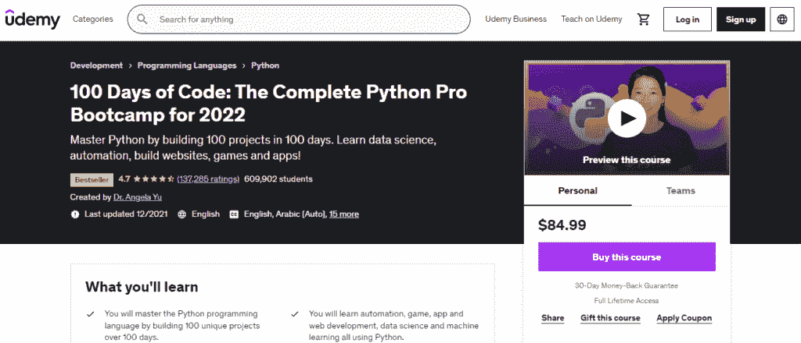](https://www.pythoncentral.io/wp-content/uploads/2022/09/course5.png)

《100 天的代码》是网上最实用、最紧张、最全面的 Python 课程之一，由于信息量太大，要跟上它有点困难，这是出了名的。因此，新人通常需要 100 多天才能完成这门课程。这门课程最适合于 中级程序员和想拓展 Python 其他用途的程序员。

数据科学家和 Python 的狂热用户 Angela Yu 博士精通 Python 的几乎每一种用法，因此她的课程似乎为所有技能水平的人提供了一些东西。

**特色** :超过 60 小时的内容、项目等，使其成为最全面的在线课程之一。它是有报酬的，但提供结业证书。如果你对你的教学质量不满意，它还提供 30 天的退款保证。

| 课程名称 | 100 天代码:2022 年完整的 Python Pro 训练营 |
| 讲师 | 于安琪博士 |
| PythonCentral 专家评分 | 4.7 颗星 |
| 级别 | 初学者 |
| 成本 | $84.99 |
| 总结 | 全面的 Python 课程，让初学者在 100 天内成为专业人员 |
| Pro | 由伦敦顶级编程训练营伦敦 App Brewery 的首席讲师授课 |

[转到课程](https://www.udemy.com/course/100-days-of-code/?ranMID=39197&ranEAID=JVFxdTr9V80&ranSiteID=JVFxdTr9V80-9lLIHikPxV14QEf1vu8rcw&LSNPUBID=JVFxdTr9V80&utm_source=aff-campaign&utm_medium=udemyads)

### **#6 使用 Python 的数据摄取(LinkedIn Learning)**

[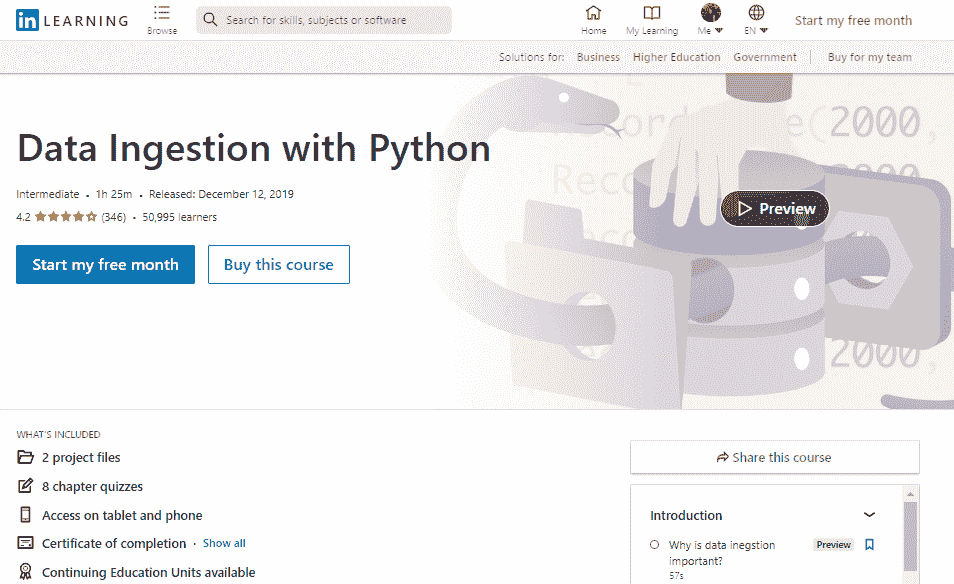](https://www.pythoncentral.io/wp-content/uploads/2022/09/course6.png)

这是清单上第一批更适合 高级或高级中级程序员的课程之一。 这部分是因为本课程侧重于数据管理和应用 Python 统计分析技术。这门课程非常适合那些必须处理大量数据并且可能还不精通这门语言的生物科学家。

**导师:** Miki Tebeka，数据专家，资深编码老师。

**特色** :面向需要学习 STEM 语言的科学家和人员，因为它是专门为处理数据密集型文件而构建的，并学习如何用 Python 分离和管理它们。还提供了许多模板和其他资源。它还提供了一个证书。

| 课程名称 | 使用 Python 摄取数据 |
| 讲师 | 云母条 |
| PythonCentral 专家评分 | 4.2 颗星 |
| 级别 | 中级 |
| 成本 | LinkedIn 学习订阅 |
| 总结 | 面向中级 Python 程序员的优秀数据科学课程 |
| Pro | 简短的课程；讲授 ML 从业者可能在中发现的真实场景 |

[转到课程](https://www.linkedin.com/learning/data-ingestion-with-python)

### **#7 巨蟒圣经(Udemy)**

[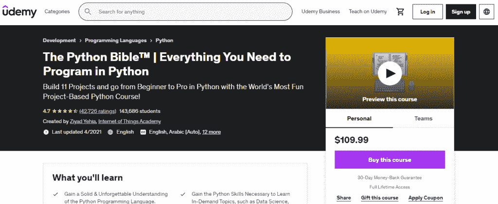](https://www.pythoncentral.io/wp-content/uploads/2022/09/course7.png)

这是一门有趣且以应用为基础的 9 小时课程，使用 11 个有趣的项目进行结构化，教你基础和高级技术，因此最适合 中级或初级编码人员。

指导老师 : Ziyad Yehia，来自物联网学院，一个在世界各地教授人们如何编码的机构。

**特色:** 11 个有趣的项目将在你学会解决它们所需的概念后由你来处理。在 10 多个小时的课程中，你已经自己用 Python 编写了 11 个应用程序，这是值得称赞的。

| 课程名称 | Python 圣经 |
| 讲师 | Ziyad Yehia |
| PythonCentral 专家评分 | 4.7 颗星 |
| 级别 | 初级到中级 |
| 成本 | $129.99 |
| 总结 | 10 小时的课程将帮助你建立 11 个项目的投资组合 |
| Pro | 讲师以有趣的方式教授 Python 的原理和方法 |

[转到课程](https://www.udemy.com/course/the-python-bible/?ranMID=39197&ranEAID=JVFxdTr9V80&ranSiteID=JVFxdTr9V80-F7A3I14dhEx7XqCxhjmVQQ&LSNPUBID=JVFxdTr9V80&utm_source=aff-campaign&utm_medium=udemyads)

### **#8 用 Python 构建工具(LinkedIn Learning)**

[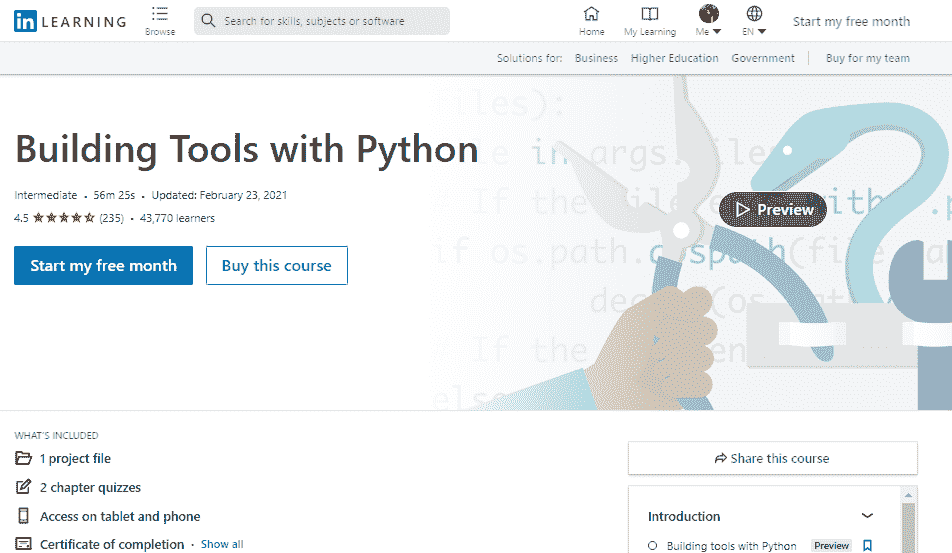](https://www.pythoncentral.io/wp-content/uploads/2022/09/course8.png)

这门特定的课程集中于构建工具，这些工具可以自动化重复的任务，最适合于 中级和后期初学者。 这门课程很棒，因为它可以帮助传统上不从事 STEM 的人，也可以帮助其他领域的人，因为对许多人来说，琐碎的计算任务仍然很耗时。

**导师** : Scott Simpson，编程老手，IT 行业专家，作家，教师。

**特色** :专注于构建自动化工具，帮助排序、管理电子表格和其他较小任务的工具，可以帮助零售业、商业甚至科学家和社会学家。

| 课程名称 | 用 Python 构建工具 |
| 讲师 | 斯科特·辛普森 |
| PythonCentral 专家评分 | 4.5 颗星 |
| 级别 | 中级 |
| 成本 | LinkedIn 学习订阅 |
| 总结 | 一个小时的课程，教你如何用 Python 自动完成任务 |
| Pro | 从长远来看能帮你节省大量时间的实用课程 |

[转到课程](https://www.linkedin.com/learning/building-tools-with-python)

### **#9 完整的 Python 课程:初学者到进阶(SkillShare)**

[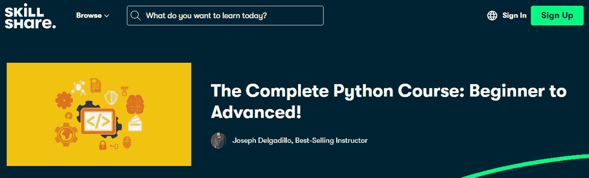](https://www.pythoncentral.io/wp-content/uploads/2022/09/course9.png)

这个 16 小时的课程经过精心编排和研究，对 的初学者、中间用户或老手都有帮助。 从很多方面来说，这是一门重要的课程，因此它忽略了一些细节，但可以通过有趣的项目和讲座帮助你学习 Python。

**讲师:** Joseph Delgadillo，科技作者和自学成才的 Python 专家、教育家和讲师，编码教育公司 JTDigital 的创始人。

**特色** :两个可以自由运用你的概念的项目，脚本编写、Django 框架和 GUI 设计都是本课程很酷的部分。

| 课程名称 | 完整的 Python 课程:初学者进阶 |
| 讲师 | 约瑟夫·德尔加迪略 |
| PythonCentral 专家评分 | 4 颗星 |
| 级别 | 初学者 |
| 成本 | SkillShare Premium 订阅 |
| 总结 | 关于初级 Python 开发人员入门所需了解的一切的深入课程 |
| Pro | 经济实惠的 Python 速成班 |

[转到课程](https://www.skillshare.com/classes/The-Complete-Python-Course-Beginner-to-Advanced/81017023)

### **# 10 Python A-Z:Python 用于数据科学的真实练习**

[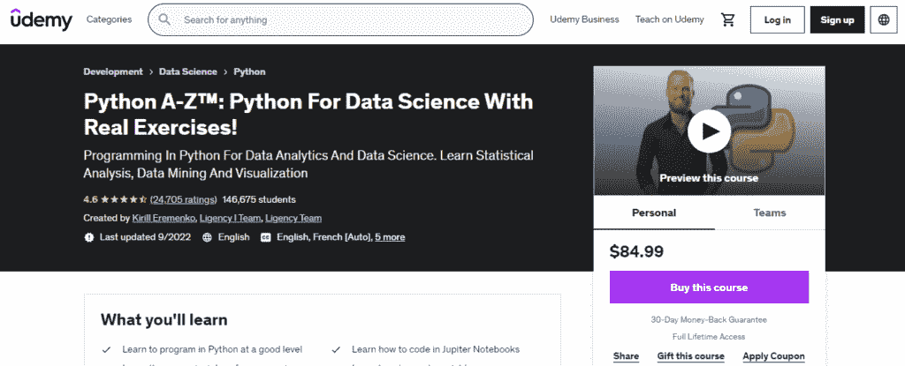](https://www.pythoncentral.io/wp-content/uploads/2022/09/course10.png)

这是一个 11 小时的超具体但简短的课程，内容是关于应用 Python 技术，你们大多数人在数据科学和机器学习的基础 Python 课程后可能会拥有，并使用基于人工智能的技术为自己构建有用的自动化工具。本课程适用于 高级或后期中级程序员。

**导师** :基里尔·叶列缅科，世界上最大的在线 Python 辅导和编程语言学院之一 Agency 的创始成员。

**特色** :关注数据科学，大数定律，Jupyter 笔记本，循环，数据分析技术。这个课程提供了一个证书，并且被大公司作为你简历的一个真实特征。你还会学到矩阵和数据框架，这很有用。

| 课程名称 | Python A-Z:带实际练习的数据科学 Python |
| 讲师 | 基里尔·叶列缅科 |
| PythonCentral 专家评分 | 4.6 颗星 |
| 级别 | 初学者 |
| 成本 | $84.99 |
| 总结 | 面向数据分析和数据科学的 Python 编程综合课程 |
| Pro | 清晰的解释和富有挑战性的作业让你为工作中可能出现的任何情况做好准备 |

[转到课程](https://www.udemy.com/course/python-coding/?ranMID=39197&ranEAID=JVFxdTr9V80&ranSiteID=JVFxdTr9V80-IN6IiaX.JsvCiRdaXonJhw&LSNPUBID=JVFxdTr9V80&utm_source=aff-campaign&utm_medium=udemyads)

## **结论**

虽然所有这些课程都填补了一些空白或提供了适合您需求的特定类型的教育，但我们认为#5 100 days of code 仍然是整体上最好的，也是网上最全面的 Python 课程之一。#2 学习 Python 3.6 对初学者来说是最好的，但是有一个更尖锐的学习曲线。

有些课程是付费的，详情可在会员链接上找到。您的决定完全取决于您的需求以及您希望使用 Python 实现什么。