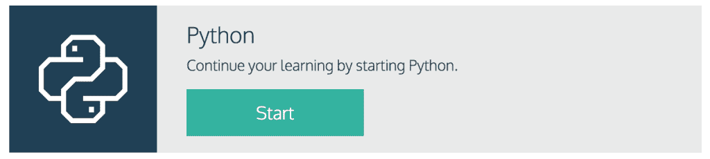
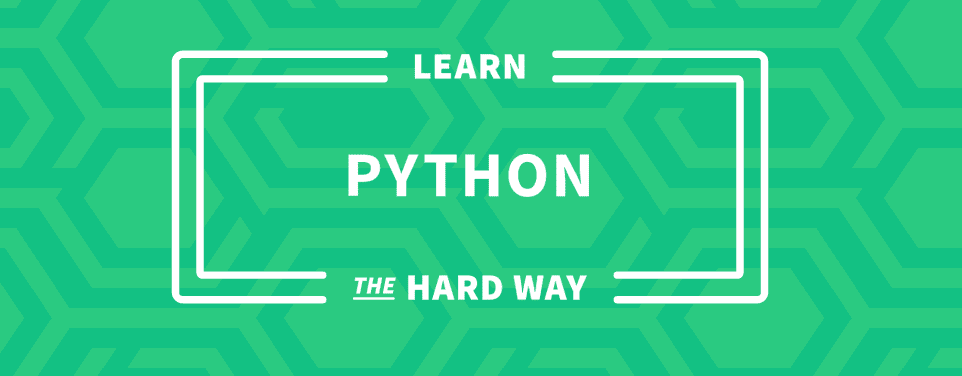
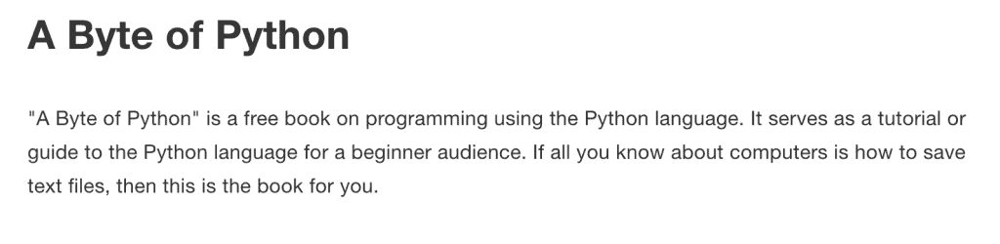
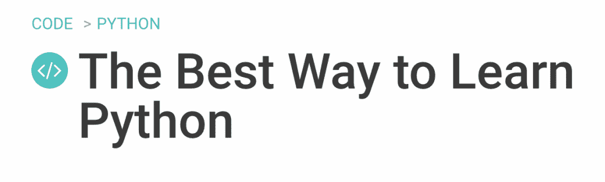

# 面向初学者的 5 大免费 Python 资源

> 原文：<https://www.pythoncentral.io/top-5-free-python-resources/>

作为初学者学习 Python 可能有点让人不知所措。你从哪里开始？你怎么知道你得到了最好的信息？一旦你掌握了基本知识，你会做什么？如果你最近发现自己在问这些问题中的任何一个，那么你来对地方了。在这篇文章中，我们为刚开始学习 Python 的人整理了一些最好的免费 Python 学习资源(并非所有这些资源都适合绝对的编码初学者，但有些是，所以如果你是这样的人，请继续阅读！).

## **1。[Codecademy](https://www.codecademy.com/learn/python)**

Codecademy 非常适合绝对的初学者。他们的免费代码教程非常受欢迎，这是有原因的。在本教程中，通过一些免费的实践课程，您将会对编写 Python 代码有一个很好的了解。

## **2。[敬酒不吃吃罚酒](https://learnpythonthehardway.org/book/)**

《艰难地学习 Python》是一本免费的在线电子书，它为你提供了大量 Python 代码的基础知识。这本书涵盖了从最基本的(当你第一次开始时如何设置)到超级复杂的(如何构建一个游戏)的一切。

## **3。[谷歌的 Python 类](https://developers.google.com/edu/python/)**

谷歌的 Python 课程对于那些希望从专业角度学习这门语言的人来说是一个很好的资源。这门课不是为完全的编码初学者开设的，但是那些有一点编码知识的人将能够使用 Google 在这门课中提供的视频、讲座、书面材料和代码练习来学习 Python。

## **4。[一个字节的 Python](https://python.swaroopch.com/)**

《Python 的一个字节》是一本免费的电子书，适合完全的初学者。这本书将为您提供一个全面的课程，介绍您需要了解的关于 Python 的所有知识，为您新获得的技能更上一层楼打下坚实的基础。

## **5。[tuts plus](https://code.tutsplus.com/articles/the-best-way-to-learn-python--net-26288)**

这个 TutsPlus 教程为您提供了几十种不同的资源，可以用来学习 Python，它甚至为您提供了一个教学大纲，以便您可以确保知道使用什么资源，以及您应该在编码之旅的哪个阶段使用它。对于编码新手和编码老手都是完美的。