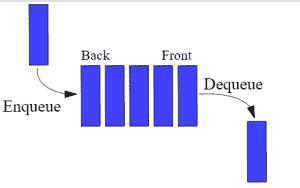

# 如何使用队列:初学者指南

> 原文：<https://www.pythoncentral.io/use-queue-beginners-guide/>

## 先决条件

要了解队列数据结构，您首先应该很好地理解以下内容:

1.  Python 3
2.  基本数据结构概念如列表(点击 [此处](https://www.pythoncentral.io/python-lists-and-tuples/) 刷新列表概念)
3.  OOP 概念

## 简介

本教程将帮助你理解队列数据结构以及如何实现它。这些概念经常在面试中被检验，并且有广泛的应用。与其他语言相比，队列的 Python 实现相对简单。在这里，您将学习如何以 Pythonic 的方式和语言不可知论者的方式来做这件事。

队列是一个简单的数据结构概念，可以很容易地应用到我们的日常生活中，比如你在星巴克排队买咖啡。基于这个例子我们来做几个观察:

1.  人们从一端进入队伍，从另一端离开
2.  先到的人先离开，最后到的人最后离开
3.  一旦所有人都得到服务，就没有人在排队等候离开了



现在，让我们以编程的方式来看以上几点:

1.  队列从两端开放，意味着从后面添加元素，从前面移除元素
2.  先添加的元素先被删除(先进先出)
3.  如果所有的元素都被删除，那么队列是空的，如果你试图从一个空的队列中删除元素，会抛出一个警告或错误消息。
4.  如果队列已满，并且您向队列中添加了更多元素，则必须抛出警告或错误消息。

需要记住的事情:

1.  队列中的入口点和出口点是不同的。
2.  入队——将元素添加到队列中
3.  出列——从队列中删除一个元素
4.  不允许随机访问——不能从中间添加或删除元素。

## 实施

我们将看到三种不同的实现方式。一种是使用列表，另一种是使用库 *【德奎】* ，最后一种是使用数组 。让我们一个一个来看看...

1.  ### Queue Implementation Usage List

这里我们将定义一个类队列并添加方法来执行下面的操作:

1.  将元素放入队列的开头，如果队列已满，则发出警告
2.  从队列末尾将元素出队，如果为空则发出警告
3.  评估队列的大小
4.  打印队列的所有元素

```py
class Queue:

  #Constructor creates a list
  def __init__(self):
      self.queue = list()

  #Adding elements to queue
  def enqueue(self,data):
      #Checking to avoid duplicate entry (not mandatory)
      if data not in self.queue:
          self.queue.insert(0,data)
          return True
      return False

  #Removing the last element from the queue
  def dequeue(self):
      if len(self.queue)>0:
          return self.queue.pop()
      return ("Queue Empty!")

  #Getting the size of the queue
  def size(self):
      return len(self.queue)

  #printing the elements of the queue
  def printQueue(self):
      return self.queue

myQueue = Queue()
print(myQueue.enqueue(5)) #prints True
print(myQueue.enqueue(6)) #prints True
print(myQueue.enqueue(9)) #prints True
print(myQueue.enqueue(5)) #prints False
print(myQueue.enqueue(3)) #prints True
print(myQueue.size())     #prints 4
print(myQueue.dequeue())  #prints 5
print(myQueue.dequeue())  #prints 6
print(myQueue.dequeue())  #prints 9
print(myQueue.dequeue())  #prints 3
print(myQueue.size())     #prints 0
print(myQueue.dequeue())  #prints Queue Empty!
```

在任何需要的地方调用 printQueue()方法，以确保它在工作。

**注意:**你会注意到我们并没有从开头移除元素，而是在结尾添加元素。其原因将在下面的“使用阵列实现”一节中介绍。

2.  ### Use deque's queue to realize

Deque 是一个库，它在导入时提供现成的命令，例如用于入队的 *append()* 命令和用于出队的 *popleft()* 命令。

```py
#Importing the library
from collections import deque

#Creating a Queue
queue = deque([1,5,8,9])

#Enqueuing elements to the Queue
queue.append(7) #[1,5,8,9,7]
queue.append(0) #[1,5,8,9,7,0]

#Dequeuing elements from the Queue
queue.popleft() #[5,8,9,7,0]
queue.popleft() #[8,7,9,0]

#Printing the elements of the Queue
print(queue)
```

在队列清空后，尝试使用 *popleft()* 命令，看看会得到什么。张贴你可以处理这个问题的方法。

**注意:** 实现 2 效率更高，因为链表中的插入操作开销很大！这是因为每当在位置 0 插入一个元素时，所有其他元素都必须移动一个位置(这类似于坐在长凳上的人向下推以容纳另一个人)。我们将在后面的教程中详细讨论操作的效率。

3.  ### Use the array queue to realize

Python 列表使得实现队列变得如此容易。然而，如果你想不可思议地实现队列语言，你必须记住以下几点:

1.  元素从队列的末尾添加，从队列的开头移除。
2.  像对待数组一样对待列表(大小固定)——我们可以通过虚拟地限制列表的大小来实现。这是通过确保列表不会超出固定的限制或大小来实现的。
3.  使用尾指针来记录添加到队列中的元素——尾指针总是指向下一个可用空间。例如，当队列中有三个元素时，Tail 将指向第四个位置。当队列已满时，尾指针将大于声明的大小。
4.  使用 Head 指针来标记从队列中移除的元素——Head 指针将指向下一个要出列的元素。例如，如果队列中有三个元素，头指针将指向第一个元素。在一个出列操作之后，头指针将指向队列中的第二个元素。实际上，没有元素会从队列中删除。这是因为一旦删除了一个元素，列表会自动将所有其他元素向左移动一个位置。这意味着位置 0 将总是包含一个元素，这不是实际队列的工作方式。
5.  使用一个重置方法——这个方法被调用来重置队列、尾部和头部。例如，如果队列中有三个元素，那么 Head = 0，Tail = 4。现在，如果我们让所有三个元素出队，队列将是空的，这意味着 Head = Tail = 4。所以如果你将一个元素加入队列，它会发生在位置 4，这是不正确的。因此，有必要将这些指针重置为 0。请注意，由于我们实际上并没有删除元素，所以列表仍然包含“已删除”的元素，因此也需要创建一个新的列表。

### 算法

1.  声明一个列表和一个整数 MaxSize，表示队列的虚拟最大大小
2.  头部和尾部初始设置为 0
3.  尺寸方法
    1.  计算队列中元素的数量-> Size = Tail - Head
4.  重置方法:
    1.  将尾部和头部重置为 0
    2.  创建新队列(将队列初始化为新列表)
5.  入队操作:
    1.  检查大小是否小于 MaxSize:
        1.  如果是，将数据添加到队列中，然后将 Tail 增加 1
        2.  如果否，打印队列满消息
6.  出列操作:
    1.  检查大小是否大于 0:
        1.  如果是，从列表中弹出第一个元素，并将 Head 增加 1
        2.  如果没有:
            1.  呼叫重置方法
            2.  打印队列空消息

### 程序

```py
class Queue:

    #Constructor
    def __init__(self):
        self.queue = list()
        self.maxSize = 8
        self.head = 0
        self.tail = 0

    #Adding elements
    def enqueue(self,data):
        #Checking if the queue is full
        if self.size() >= self.maxSize:
            return ("Queue Full")
        self.queue.append(data)
        self.tail += 1
        return True     

    #Deleting elements 
    def dequeue(self):
        #Checking if the queue is empty
        if self.size() <= 0:
            self.resetQueue()
            return ("Queue Empty") 
        data = self.queue[self.head]
        self.head+=1
        return data

    #Calculate size
    def size(self):
        return self.tail - self.head

    #Reset queue
    def resetQueue(self):
        self.tail = 0
        self.head = 0
        self.queue = list()

q = Queue()
print(q.enqueue(1))#prints True
print(q.enqueue(2))#prints True
print(q.enqueue(3))#prints True
print(q.enqueue(4))#prints True
print(q.enqueue(5))#prints True
print(q.enqueue(6))#prints True
print(q.enqueue(7))#prints True
print(q.enqueue(8))#prints True
print(q.enqueue(9))#prints Queue Full!
print(q.size())#prints 8        
print(q.dequeue())#prints 8
print(q.dequeue())#prints 7 
print(q.dequeue())#prints 6
print(q.dequeue())#prints 5
print(q.dequeue())#prints 4
print(q.dequeue())#prints 3
print(q.dequeue())#prints 2
print(q.dequeue())#prints 1
print(q.dequeue())#prints Queue Empty
#Queue is reset here 
print(q.enqueue(1))#prints True
print(q.enqueue(2))#prints True
print(q.enqueue(3))#prints True
print(q.enqueue(4))#prints True
```

**注意:** 元素 9 没有被添加到队列中，因此队列的大小保持为 8

除了上面描述的方法，你还可以添加一些方法来返回队列开始的元素，检查队列是否为空等等。

## 结论

本教程到此结束。一定要学会队列的应用。另外，请继续关注 PythonCentral，了解更多关于其他类型队列的信息，比如循环队列和优先级队列。快乐的蟒蛇！