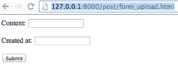
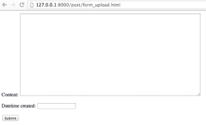

# 在您的第一个 Django 应用程序中使用 Python Django 的模型表单

> 原文：<https://www.pythoncentral.io/using-python-django-modelform-first-django-application/>

## 姜戈的模型

在我们之前的文章[如何使用 Python Django 表单](https://www.pythoncentral.io/how-to-use-python-django-forms/ "How to Use Python Django Forms")中，我们学习了如何创建 Django 表单对象，并在模板中使用它们来完成常见的任务，比如数据验证和 HTML 生成。在本文中，我们将学习如何使用 Django 的`ModelForm`直接从模型创建表单。与普通的 Django 表单对象相比，`ModelForm`对象将自己绑定到 Django `Model`上，从而免除了手工创建表单对象的责任。

## 为模型文章创建模型表单

在接下来的代码片段中，我们定义、创建并打印一个 PostForm 对象。

```py

>>> from myblog import models as m
>>> from django.forms import ModelForm
>>> class PostForm(ModelForm):
... class Meta:
... model = m.Post
...
>>> post = m.Post.objects.all()[0]
>>> post

>>> form = PostForm(instance=post)
>>> form.as_p()
u'

Content: 
New Post

\n

Datetime created: 
2013-08-14 21:12:30

'
```

如您所见，`ModelForm`对象的`as_p`方法返回的输出与我们之前的表单对象的`as_p`方法完全相同。因此，我们可以简单地用一个`ModelForm`对象替换 post upload 视图中的表单对象。

```py

# myblog/forms.py
...
from myblog import models as m

...

class PostModelForm(forms.ModelForm):
class Meta:
model = m.Post

# myblog/views.py
from myblog.forms import PostForm, PostModelForm

from myblog.forms import PostForm, PostModelForm

def post_form_upload(request):
if request.method == 'GET':
form = PostModelForm()
else:
# A POST request: Handle Form Upload
# Bind data from request.POST into a PostForm
form = PostModelForm(request.POST)
# If data is valid, proceeds to create a new post and redirect the user
if form.is_valid():
content = form.cleaned_data['content']
created_at = form.cleaned_data['created_at']
post = m.Post.objects.create(content=content, created_at=created_at)
return HttpResponseRedirect(reverse('post_detail', kwargs={'post_id': post.id}))

return render(request, 'post/post_form_upload.html', {
'form': form,
})
```

现在，您可以刷新页面 http://127 . 0 . 0 . 1:8000/post/form _ upload . html，查看新的`ModelForm`对象是否与之前的表单对象呈现相同。



我们的空表单页面。

## 自定义模型表单对象

我们可以定制字段列表，排除某些我们想对用户隐藏的数据库字段，而不是向用户公开模型的所有字段。例如，`Comment.created_at`可能是一个字段，其值应该默认为`django.utils.timezone.now()`，而不是由用户提供。

```py

# myblog/forms.py
class CommentModelForm(forms.ModelForm):
class Meta:
model = m.Comment
exclude = ('created_at',)

# Python shell
>>> from myblog.forms import CommentModelForm
>>> form = CommentModelForm()
>>> form.as_p()
u'

Post: 
---------

\n

Message: 
\r\n

'
```

注意`Comment.created_at`没有列在`form.as_p`的输出中。

我们可以执行的另一种定制是改变默认的字段类型或者与某些模型字段相关联的小部件。例如，`PostModelForm.content`使用 HTML `input`元素呈现，这是任何`CharField`的默认 Django HTML 小部件。我们可以改为使用一个`textarea`元素。

```py

# myblog/forms.py
class PostModelForm(forms.ModelForm):
class Meta:
model = m.Post
widgets = {
'content': forms.Textarea(attrs={'cols': 80, 'rows': 20})
}
```

现在您可以刷新页面`http://127.0.0.1:8000/post/form_upload.html`并注意到表单字段`Content`现在呈现为一个`textarea`元素，而不是一个`input`元素。



使用我们的文本区

## 总结和提示

在本文中，我们学习了如何使用和定制 Django 的`ModelForm`对象来公开 Django `Model`的有限接口，如`Post`或`Comment`。使用`ModelForm`比使用`Form`更有利，因为前者将`Model`对象紧密地集成到其核心功能中，减轻了程序员手工创建表单的一些责任。