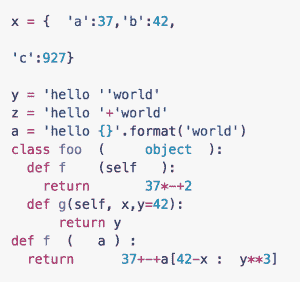
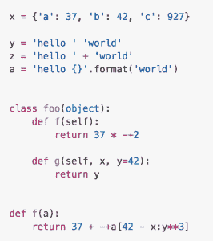

# 使用 YAPF(另一种 Python 格式化程序)

> 原文：<https://www.pythoncentral.io/using-yapf-yet-another-python-formatter/>

另一个 Python 格式化程序 (YAPF)是编写 Python 的一个有价值的工具。YAPF 是一个开源的 Python 格式化程序，它使编写干净的 Python 代码变得容易得多，所以你可以花更多的时间编写代码，而不用担心代码看起来怎么样。使用这个格式化程序的一个很大的优点(除了漂亮的代码之外)是，它使得由任意数量的开发人员编写的 Python 代码集成到一个文件甚至一个大的目录或项目中变得非常容易。

正如你将在他们的 github 页面上看到的，YAPF 会拿走你丑陋的代码:

并将其重新格式化成组织良好的代码:

YAPF 不是一般的重新格式化程序，因为它会重新格式化你的整个文件，而不仅仅是把你的代码一行一行地格式化成一个好看的模板。它实际上重新组织和重构了您的 Python，不仅仅是为了让它看起来更好，而是为了帮助优化性能。如果你写了很多 Python，它确实是你可以使用的不可或缺的工具。