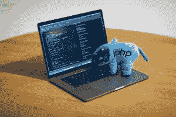

# 想学 Python？以下是开始的方法

> 原文：<https://www.pythoncentral.io/want-to-learn-python-heres-how-to-start/>

Python 是一种功能强大的编程语言，如今被广泛应用于许多行业。如果你想学习 Python，你来对地方了！在这篇博文中，我们将讨论如何开始学习 Python，并为您提供一些有助于您学习这门语言的资源。我们开始吧！

## Python 是什么？

Python 是由吉多·范·罗苏姆在 20 世纪 80 年代创造的一种编程语言。如今，它是一种被广泛使用的语言，它的许多特性使它成为对初学者有吸引力的选择。Python 易于读写，它有一个大型的标准库，可用于数据分析和机器学习等任务。Python 也是一种流行的 web 开发语言，可以用来创建服务器端应用程序。

如果你对学习 Python 感兴趣，网上有很多资源。你可以找到教程、书籍和视频来帮助你开始学习这门语言。你也可以加入一个 [兼职编程训练营](https://www.fullstackacademy.com/programs/part-time-coding-bootcamp) 来学习更多的编程语言和其他编程技能。对于那些想学习编码的人来说，Python 是一个很好的选择，它可以用于各种任务。所以花时间去学习更多的相关知识绝对是值得的。

## 为什么要学 Python？

Python 是一种通用语言，你可以在 web 应用程序的后端、前端或整个堆栈上使用。Python 对于 [数据科学](https://online.hbs.edu/blog/post/what-is-data-science) 和人工智能应用也很棒。此外，Python 相对于其他编程语言来说，相对容易学习。这就是为什么许多初学者在学习编码时会从 Python 开始。

## 如何入门 Python

首先，你需要下载并安装 Python。可以从 Python 官方网站(python.org)获取 Python 的最新版本。我们推荐使用 Python 的 Anaconda 发行版，它附带了许多对数据科学和机器学习有用的包。一旦安装了 Anaconda，就可以通过打开 Anaconda Navigator 并选择“Environments”选项卡来创建 Python 环境。从这里，您可以创建一个新的 Python 环境，并使用 conda 包管理器安装包。

## 帮助你学习 Python 的资源

我们建议查看官方的 Python 文档，其中包含了一个优秀的初学者教程。您还可以在网上找到许多学习 Python 的资源，包括书籍、视频和课程。我们最喜欢的资源之一是 Jake VanderPlas 的 Python 数据科学手册。这本书涵盖了数据科学和机器学习的广泛主题，如果你对这些领域感兴趣，这是学习 Python 的好方法。如果你想更深入地研究 Python，我们推荐你看看你最喜欢的 Python [包](https://www.pythoncentral.io/package-python-django-application-reusable-component/)的源代码。这是了解有经验的 Python 程序员如何编写代码的一个很好的方式，它可以为您的项目提供一些思路。

原来如此！关于如何开始学习 Python 的一些提示。希望这有所帮助，给你一点方向。记住一次专注于一项任务，把事情分成可管理的小块。很快，你就会像专业人士一样编写 Python 代码了！