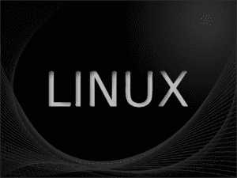

# 快速有效地学习 Python 的方法

> 原文：<https://www.pythoncentral.io/ways-to-learn-python-fast-efficiently/>

Python 是二十一世纪流行的编程语言。了解 Python 可以帮助你在计算机工程专业上取得进步。

然而，作为开始，我们经常在选择最佳教育旅程时遇到问题，我们通常会浪费大量时间试图找出哪种资源是最好的。当大多数开发人员开始发现新事物时，他们经常会在他们的计算机或 USB 驱动器上积累各种课程，这不是一个好习惯。

我们将讨论快速学习 Python 的各种方法。

*   ## First, understand the jargon.

在我们学习它之前，我们必须先掌握如何或在哪里使用这个句法。Python 在多种领域实现，包括网站开发、数据研究、机器学习、系统工程。因为很难一次了解所有的主题，所以我们必须专注于我们需要掌握的关键原则，并适当地继续下去。

*   ## covers the following basic knowledge of python.

最起码，你和你的导游必须掌握基本知识。如果你不理解它们，你将很难处理复杂的挑战、计划或使用实例。

*   ## Set a learning goal for yourself.

在开始学习 Python 之前，为自己制定一个学习目标。当你牢记自己的目标时，你开始学习时遇到的问题就会更容易克服。此外，你会意识到为了达到你的目标，应该集中精力或浏览哪些学习材料。例如，如果您希望学习 Python 进行数据处理，您需要执行任务、构建函数并理解有助于数据分析的 Python 模块。

*   [ Anaconda accelerates the configuration of Python.

您可以从 Python Software Foundation 网页安装 Python 安装文件，然后获取和检索增加的库，或者您可以下载 Anaconda 软件包，其中也包括您需要的几个软件包，特别是如果您打算使用 Python 进行数据处理或预测分析。

*   ## Virtual learning Python with the help of Python teacher.

[在线 Python 导师](https://www.tutorocean.com/topics/python) 可以辅助你学习基本的 Python 编程原理，以及更复杂的 Python 编程主题。导师可以提供广泛的学科和水平，让你选择一个完全适合你的需求。

大多数导师会与您建立免费视频通话，讨论您的要求，并了解您的独特要求。Python 实际上正在成为一门流行的在线辅导课程，非常适合在在线课堂上讲授。

学生现在可以在一个共享的代码编辑器中实时展示他们的进度，让教育工作者有机会同时提供帮助。此外，学习者可以更轻松地在屏幕上完成他们的编码挑战，因为他们可以考虑一切，而不必担心有人在背后监视。这使个人感觉更舒服，从而提高理解和记忆。

*   ## With your discovery, put it into practice.

Python 也不例外，学习某样东西最简单的方法就是将其付诸实践。如果你通过在线课程或教科书理解它，你应该接触它。

打开你的笔记本电脑，配置你的编码设置，然后开始编码。例如，如果你已经学习了条件循环，用它们来创建一个数字乐透。

为了获得更好的结果，你也可以用 if-else 表达式来调整它。如果你正在采用一个新的 Python 库，你可以把它变成一个小小的冒险，这将极大地增强你对这个想法的理解。

*   ## Consider picking up a Python library.

掌握一个或多个补充 Python 的 Python 库很有帮助。库是充当“催化剂”的专用功能集如果没有自定义代码，您就必须构建自定义代码来完成特定的工作。举例来说，Pandas 是一个著名的用于修改表中数据的库。Numpy 是一个 Python 库，帮助在数组上执行算术和科学运算。

*   ## Make a timetable for learning Python and stick to it.

大多数人跳过这一步，导致困难或停工。现在需要做的就是制定一个时间表。建立至少两周的时间来展开你的学习，并保证你有足够的机会来反思 Python 的基础， [在 IDE](https://www.geeksforgeeks.org/top-10-python-ide-and-code-editors-in-2020/) 中练习编码，并调试代码。

排除错误是学习 Python 或任何计算机程序的困难和乐趣的一部分。在最初的两周之后，你会惊讶于自己的进步。你将有足够的经验去学习你选择的供应商提供的更复杂的东西。

*   ## Associate with people who are eager to learn.

虽然编程看起来是一项孤独的工作，但在团队中完成时会更有效。在 Python 中创建项目时，将自己与同样在实践的其他人联系起来是至关重要的。你将能够提供你在旅途中学到的技巧和技术。

# 结论

虽然 Python 是一门简单易懂的语言，但即使对于业余爱好者 T2 来说，掌握这门语言的所有基本思想也需要一些时间。

利用上述方法，你可以快速理解 Python 的基本原理和特定领域的信息。

标准的 Python 手册也是一个极好的信息来源。关键的重点应该是把你学到的东西付诸实践；没有快速改善的方法。