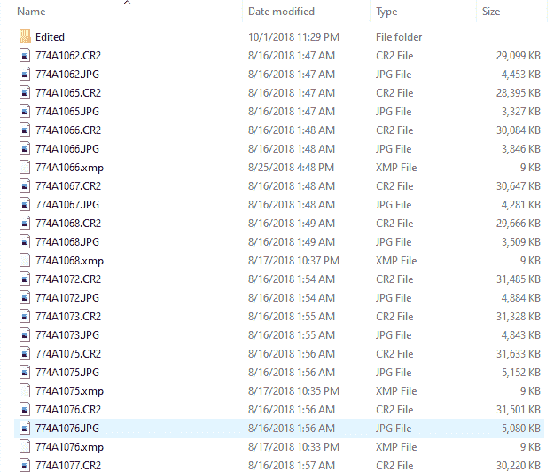

# 你能用 python 做什么:使用指南

> 原文：<https://www.pythoncentral.io/what-can-you-do-with-python-usage-guide/>

## 先决条件

你应该知道 python 的基本语法。你应该在你的机器上安装 Python。在本文中，我们将了解更多关于

*   你能用 python 做什么？
*   如何学习 Python？
*   什么时候学 Python
*   python 程序员挣多少钱

## 你能用 Python 做什么？

Python 是一种通用语言。您可以在任何类型的应用程序中使用它。您可以将它作为一种脚本语言来解决一些日常问题。

### 使用 Python 编写脚本

我们举个例子。如果你喜欢摄影，你可能有一个图像命名的问题。在漫长的一天拍摄后，你回到了你的工作室。您过滤了图像并将选定的图像放入一个目录中。该目录包含不同名称的不同图像。您需要通过用特定的格式命名所有图像来简化您的工作。假设图像名称将由地名和序列号组成。这使您可以轻松搜索图像。通过使用 Python，您可以创建一个简单的脚本，该脚本将遍历该文件夹中所有 JPEG 类型的文件，并对其进行重命名。

[](https://www.pythoncentral.io/wp-content/uploads/2020/08/Annotation-2020-08-29-173736.png)

未排序的图像

让我们看一个例子:

```py
import os 

def main():
    path = input("Enter folder path: ")
    folder = os.chdir(path)

	for count, filename in enumerate(os.listdir()): 
		dst ="NewYork" + str(count) + ".jpeg"
		os.rename(src, dst) 

if __name__ == '__main__':
	main()
```

正如你所看到的，Python 是一个高效的自动化工具。这有助于将你的注意力集中到重要的事情上。

用 Python 还能做什么？你可以用 python 做一个 FTP 服务器。使用命令

```py
python3 -m http.server 8000
```

您可以运行 python 服务器。您可以通过本地网络访问该服务器。您可以从不同的设备打开浏览器。键入您的`network ip : 8000`。您可以访问该文件夹中的所有文件。您可以使用它从同一网络中的不同设备传输文件。

Python 在日常生活中如此简单的用法会让它变得更简单。谈论引导我们走向

### Python 在基于 web 的应用程序中的使用

Python 在 web 开发中非常流行，有 Flask 和 Django 这样的框架。如果你想建立自己的电子商务商店。你可以使用 Django 框架。安装后，您将有一个现成的项目结构来构建您的网站。让我们看看安装 Django 有多容易。

```py
# checking django version 
$ python -m django --version

# if you don't have django installed you can install it using pip
$ python -m pip install Django

```

注意:如果没有安装 pip，您应该按照我们的[文章安装它](https://www.pythoncentral.io/what-is-python-installation-guide/)。

安装 Django 后，现在你可以创建你的项目了。

```py
$ django-admin startproject my-eCommerce-Website
```

您将拥有如下所示的项目结构

```py
my-eCommerce-Website/
    manage.py
    my-eCommerce-Website/
        __init__.py
        settings.py
        urls.py
        asgi.py
        wsgi.py

```

继续姜戈项目。您应该安装您的项目应用程序

```py
$ python manage.py startapp store
```

在您的 Django 项目中，您将拥有所有的应用程序。每个应用程序都有不同的文件夹。

```py
my-eCommerce-Website/
    manage.py
    my-eCommerce-Website/
        __init__.py
        settings.py
        urls.py
        asgi.py
        wsgi.py

```

你可以在 Django 的官方文档中了解更多关于他们的信息。您会发现，开始使用 Python 进行 web 开发非常容易。

Python 在数据科学、游戏和移动开发等不同领域有不同的用途。我们在[上一篇](https://www.pythoncentral.io/what-is-python-used-for/)里详细讲过。

## 如何学习 Python？

学习 Python 是一个持续的过程。有些人喜欢课程，有些人喜欢实践经验。你从哪里学习真的不重要。您将需要应用您所学的知识来构建有用的 Python 应用程序。我们在上一篇文章中谈到了学习它的各种资源。在这里检查一下[。如果你已经知道它的基本语法。你现在的重点应该是学习如何构建 python 的应用程序。](https://www.pythoncentral.io/what-is-python-used-for/)

这取决于您想要构建的应用程序的类型。如果您正在寻找构建一个基于 web 的应用程序。推荐弗拉斯克和姜戈。

### 你在哪里可以学习烧瓶？

*   烧瓶文件有一个[获取说明部分](https://flask.palletsprojects.com/en/1.1.x/quickstart/)。学习 Flask 的基础知识很有帮助。
*   Coursera 刚刚发布了学习 Flask 的新[课程。它会引导你了解所有烧瓶的细节。](https://www.coursera.org/projects/python-flask)
*   教程点有条不紊[烧瓶教程](https://www.tutorialspoint.com/flask/index.htm)。

在上述所有资源中，您将构建一个 Flask 应用程序。这将给你带来使用 Flask 的实践经验。

### 你什么时候能学会姜戈？

*   Django 文档是学习 Django 的详细资源。用它的[启动导轨](https://www.djangoproject.com/start/)。
*   Django 是最流行的 Python 框架。Coursera 创建了一个[全专精](https://www.coursera.org/specializations/django)来学习它。
*   教程点创建了一个有组织的学习 Django 的资源。叫做[姜戈教程](https://www.tutorialspoint.com/django/index.htm)。

同样，来源是什么并不重要。你需要自己试着写代码，构建一个项目。这会帮助你建立你的投资组合。

如果你正在寻找建立机器学习项目。Udacity 和 Coursera 是学习它的绝佳资源。

### 在哪里可以学习机器学习？

*   Udacity 有一门关于机器学习的入门课程。它会引导你通过机器学习和人工智能。
*   斯坦福大学在 Coursera 上也有一个很棒的课程来学习机器学习。由[吴恩达](https://en.wikipedia.org/wiki/Andrew_Ng)主持。他是机器学习和人工智能领域的顶尖人物之一。
*   如果你喜欢阅读。教程点有一个关于[机器学习](https://www.tutorialspoint.com/machine_learning_with_python/index.htm)的教程。它会给你所需的知识来了解更多关于机器学习的知识。

## 什么时候学习 Python

学习 Python 作为基础不会花很多时间。可能需要两到四周的时间才能适应。学习 Python 之上的其他框架可能需要时间。这取决于领域和框架的难度。学习如何用 Flask 或 Django 构建应用程序可能需要 4 到 6 周的时间。对于机器学习来说，可能需要更长的时间。机器学习是一个更复杂的领域。需要更多的时间去学习。请注意，根据您的学习过程，时间可能会有所不同。请记住，像机器学习或数据科学这样的领域需要数学背景。这可能需要更长的学习时间。

## Python 程序员挣多少钱？

Python 应用于不同的行业。这样用它找工作就容易了。就你的工资而言，很多因素会控制这一点。

*   你的经历
*   你的国家
*   公司业务规模
*   您正在构建的应用程序类型

这就是为什么你对它了解得越多越好。以获得与你的经验相符的期望薪资的准确数字。你应该检查一下玻璃门。这将帮助你了解你所在地区基于技能的平均人数。

## 结论

Python 有很多有用的用法。它基于您想要构建的应用程序的类型。学习 Python 是一个持续的过程。您对 python 了解得越多，您可以构建的应用程序就越多。会帮你更快找到工作，增加工资。