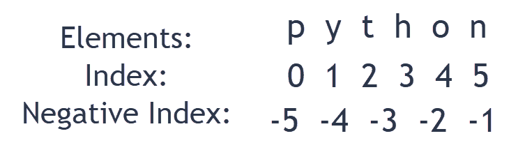

# Python 中的元组是什么

> 原文：<https://www.pythoncentral.io/what-is-a-tuple-in-python/>

学习 Python 中的内置函数和数据类型是在你被认为精通这门语言之前你需要取得的更重要的知识飞跃之一。

元组是 Python 中四种内置数据类型之一，理解它的工作原理应该不会太难。

下面是元组的分类，它们是如何工作的，以及它们与列表和字典有何不同。

## **Python 中的 Tuple 是什么？**

如上所述，元组是 Python 内置的四种数据类型之一。另外三种数据类型分别是列表、 [集合、](https://www.w3schools.com/python/python_sets.asp) 和字典。每种数据类型都有其特点，在使用时也有其独特的缺点。

Python 元组的特征有:

1.  元组是有序的、索引的数据集合。与字符串索引类似，元组中的第一个值的索引为[0]，第二个值的索引为[1]，依此类推。
2.  元组可以存储重复值。
3.  一旦数据被分配给一个元组，其值就不能改变。
4.  元组允许你在一个变量中存储多个数据项。您可以选择在一个元组中只存储一种数据，也可以根据需要混合存储。

## **如何创建和使用元组？**

在 Python 中，元组是通过将数据的值或“元素”放在圆括号“()”内来分配的必须用逗号分隔这些项目。

[Python 官方文档](https://docs.python.org/3/) 声明，在圆括号内放置项目是可选的，程序员可以声明元组而不使用它们。然而，在声明元组时使用圆括号被认为是最佳实践，因为它使代码更容易理解。

一个元组可以有任意数量的值，并且这些值可以是任意类型。

下面是一些声明元组的例子:

```py
tuple1 = (1, 3, 5, 7, 9);
tuple2 = "W", "X", "c", "d";
tuple3 = ('bread', 'cheese', 1999, 2019);
```

你也可以通过在括号之间不放值来创建一个空的元组，就像这样:

```py
tuple1 = ();
```

创建一个只有一个值的元组在语法上有点棘手。当声明一个只有一个值的元组时，在结束括号之前必须包含一个输入值的逗号。

```py
tuple1 = (1,);
```

这是为了让 Python 明白，你是在试图创建一个元组，而不是一个整数或字符串值。

### **访问元组项**

在 Python 中，你可以通过各种方式访问元组。你要记住的重要一点是 Python 元组索引就像 Python 字符串索引——它们都是从 0 开始索引的。

因此，就像字符串索引一样，元组可以被连接、切片等等。Python 中访问元组的三种主要方式是索引、负索引和切片。

#### **方法#1:步进**

访问元组时，索引操作符就派上了用场。要访问元组中的特定元组，可以使用“[]”运算符。请记住，索引是从 0 而不是 1 开始的。

换句话说，一个有五个值的元组将有从 0 到 4 的索引。如果试图访问元组现有范围之外的索引，将会引发“IndexError”

此外，在索引操作符中使用浮点类型或其他类型来访问元组中的数据会引发“类型错误”

这里有一个使用索引访问元组的例子:

```py
tuple1 = (1, 3, 5, 7, 9);
print(tuple1[0])
*# Output: 1* 
```

你也可以把元组放在元组里面。这被称为嵌套元组。要访问一个元组中另一个元组的值，必须链接索引操作符，就像这样:

```py
tuple1 = ((1, 3), (5, 7));
print(tuple1[0][1])
print(tuple1[1][0])
*# Output: 
# 3
# 5* 
```

#### **方法#2:负步进**

有些语言不允许负索引，但 Python 不是其中之一。

换句话说，元组中的索引“-1”指的是列表中的最后一项，索引“-2”指的是倒数第二项，依此类推。

下面是如何在 Python 中使用负索引来访问元组元素:

```py
tuple1 = (1, 3, 5, 7);
print(tuple1[-1])
print(tuple1[-2])
*# Output: 
# 7
# 5* 
```

#### **方法#3:切片**

通过切片访问元组值意味着使用切片操作符访问元素，切片操作符是冒号(":")。

切片是这样工作的:

```py
tuple1 = ('p','y','t','h','o','n');

*# To print second to fourth elements*
print(tuple1[1:4])
*# Output: ('y','t','h')*

*# To print elements from the beginning to the second value*
print(tuple1[:-4])
*# Output: ('p','y')*

*# To print elements from the fourth element to the end*
print(tuple1[3:])
*# Output: ('h','o','n')*

*# To print all elements from the beginning of the tuple to the end* print(tuple1[:])
*# Output: ('p','y','t','h','o','n')* 
```

切片是访问元组中值的有效方法。如下所示，可视化元组中的元素可以使您更容易理解范围并在代码中编写适当的逻辑。

[](https://www.pythoncentral.io/wp-content/uploads/2021/07/Python-Slicing-Reference.png)

### **改变元组**

虽然 Python 列表是可变的，但元组不是。这是元组的主要特征之一——一旦元组元素被声明，它们就不能被更改。

这里有一个例子:

```py
tuple1 = (1,2,3,4,5)

tuple1[0] = 7

*# Output: TypeError: 'tuple' object does not support item assignment* 
```

然而，元组可以在其中存储可变元素，比如列表。如果存储的元素是可变的，您可以更改嵌套在元素中的值。下面举个例子来演示:

```py
tuple1 = (1,2,3,[4,5])

tuple1[3][0] = 7

print(tuple1) 

*# Output: (1,2,3,[7,5])* 
```

虽然元素的值一旦分配就不能更改，但是元组可以完全重新分配。

```py
tuple1 = (1,2,3,[4,5])

tuple1 = ('p','y','t','h','o','n');

print(tuple1) 

*# Output: ('p','y','t','h','o','n')* 
```

改变元组的唯一方式是通过连接。串联是组合两个或多个元组的过程。可以使用+和*运算符连接元组。

```py
*# Concatenation using + operator* 
tuple1 = (('p','y','t')+('h','o','n'));

print(tuple1) 

*# Output: ('p','y','t','h','o','n')* 
*# Concatenation using * operator* 
tuple2 = (("Repeat",)* 3)

print(tuple2)

*# Output: ('Repeat', 'Repeat', 'Repeat')* 
```

### **删除元组**

Python 不允许程序员改变元组中的元素。这意味着您不能删除元组中的单个项。

然而，使用关键字“del”可以完全删除一个元组

```py
tuple1 = ('p','y','t','h','o','n')

del tuple1[2]

*# Output: TypeError: 'tuple' object doesn't support item deletion* 
del tuple1

print(tuple1)

*# Output: NameError: name 'my_tuple' is not defined* 
```

### **可用于元组的方法**

使用元组时，有两种方法可以提供额外的功能。这两种方法是计数法和指数法。

这里有一个例子，演示了如何使用这两种方法:

```py
tuple1 = ('p','y','t','h','o','n')

print(tuple1.count('y'))

*# Output: 1
# Since there is only one 'y' in the tuple*

print(tuple1.index('y'))

*# Output: 1
# Since the index of 'y' is 1* 
```

### **元组操作**

元组的工作方式很像字符串，并响应您可以对它们执行的所有常规操作。但是，当对它们执行操作时，结果是元组而不是字符串。

除了连接和重复，程序员还可以对元组执行其他一些操作。

例如，你可以检查一个元组的长度:

```py
tuple1 = ('p','y','t','h','o','n')

print(len(tuple1))
```

还可以比较元组的元素，提取元组中的最大值和最小值:

```py
tuple1 = (1,2,3,4,5)

tuple2 = (5,6,7,8,9)

tuple1[4] == tuple2[0]

*# Output: True* 
print(max(tuple1))

*# Output: 5* 
print(min(tuple1))

*# Output: 1* 
```

您也可以使用“成员测试”来检查一个条目是否存在于一个元组中下面是一个成员资格测试的例子:

```py
tuple1 = (1,2,3,4,5)

1 in tuple1

*# Output: True* 
'1' in tuple1

*# Output: False* 
7 in tuple1

*# Output: False* 
```

您可以使用 for 循环来遍历元组中的项。例如:

```py
for name in ('Kathy', 'Jimmy'):
   print('Hello', name)
```

## **Python 中列表和元组的相似性**

元组和列表在一些不同的方面是相似的，我们已经在这一节讨论了如何相似。

### **存储**

元组和列表相似的一个主要原因是你可以在两者的一个变量中存储多个条目。此外，元组和列表都可以为空。

这两者之间的主要区别是语法上的:你必须用圆括号来声明一个元组，用方括号来声明一个列表。

通过键入变量名并在末尾添加括号，可以创建一个空元组。或者，您可以使用 tuple()构造函数来创建元组。

重要的是要记住，如果你使用构造函数创建一个元组，你将需要使用双括号来正确地向 Python 表明你的意图。

此外，如果你用一个条目创建一个元组，你需要在条目后添加一个逗号。如果您忘记添加逗号，Python 不会将代码识别为元组。

列表也以类似的方式工作。您可以通过键入所需的列表名称并在其末尾添加方括号来创建列表。或者，您可以使用 list()构造函数来创建列表。

虽然你可能认为你需要在列表中添加一个项目后添加一个逗号，但事实并非如此。Python 会识别出它是一个列表，而不需要你添加一个尾随逗号。

通常，存储在列表和元组中的项目本质上是相似的，并且倾向于以某种方式彼此相关。

如果你正在创建一个包含字符串、整数或布尔值序列的列表或元组，你需要做的就是用逗号将它们分开。但这并不是说不能创建包含不同数据类型的列表和元组。

只需确保在添加字符串时使用撇号，在添加布尔值时将 T 和 F 的 True 和 False 大写。另外，请注意，您可以在列表和元组中添加重复项。

### **开箱**

元组和列表的另一个相似之处是它们都支持解包。当您创建一个列表或元组时，Python 会将许多值“打包”到一个变量中。

解包的思想是 Python 使你能够给单个变量分配单个值。

然而，不管你是使用列表还是元组，你必须确保你创建的变量数量与列表或元组中的值数量相同。如果不这样做，Python 会抛出一个错误。

### **索引**

列表和元组之间的最后一个相似之处是，它们都是项目的有序集合。换句话说，数据的存储顺序一旦设定就不可改变。

元组和列表中的值都可以通过引用数据的索引值来访问。在 Python 和大多数其他编程语言中，索引从零开始。因此，列表或元组中的第一个值的索引为 0，第二个值的索引为 1，依此类推。

## **列表和元组之间的差异**

元组和列表具有相同的功能——它们使你能够在其中存储不同种类的数据。然而，两者之间有一些主要的区别。

从语法上来说，元组在圆括号内有值。但是，如果您想用 Python 表示一个列表，您必须将值放在方括号(“[]”)中。

另一个关键的区别是，虽然你可以在赋值后改变列表中的元素，但是元组中的值不能改变。

元组被分配给一个内存块，而列表使用两个内存块。因此，在元组上迭代比在列表上迭代更快。

### **如何在元组和列表之间选择**

由于在元组上迭代更快，如果你正在构建一个需要更快迭代的解决方案，选择使用元组而不是列表是一个好主意。

此外，如果你正在解决的问题不需要改变元素，使用元组是理想的。但是，如果项目需要更改，您将需要使用列表。

你可以在我们关于 Python 列表 的 [指南中学习使用 Python 中的列表。](https://www.pythoncentral.io/lists-in-python-how-to-create-a-list-in-python/)

### **辞书:第三种收藏类型**

字典是另一种数据类型，也作为一个集合。然而，与列表和元组不同，字典是键值对的哈希表。

其他数据类型和字典的另一个关键区别是字典是无序的。此外，字典是可变的，这意味着您可以添加、更改或删除其中的元素。要声明 dictionary 对象，必须使用花括号(“{}”)。

要学习创建和使用字典对象，请查看我们的 [如何用 Python](https://www.pythoncentral.io/how-to-create-dictionary-in-python/) 创建字典的帖子。

# **结论**

元组是方便的数据类型，可以作为解决复杂问题的强大工具。现在，您已经阅读了本指南，了解了它们是什么以及它们是如何工作的。

为了巩固您对这个强大的内置 Python 函数的了解，您只需编写一些包含元组的代码。