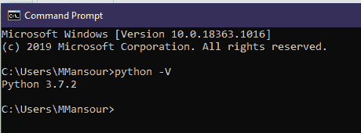
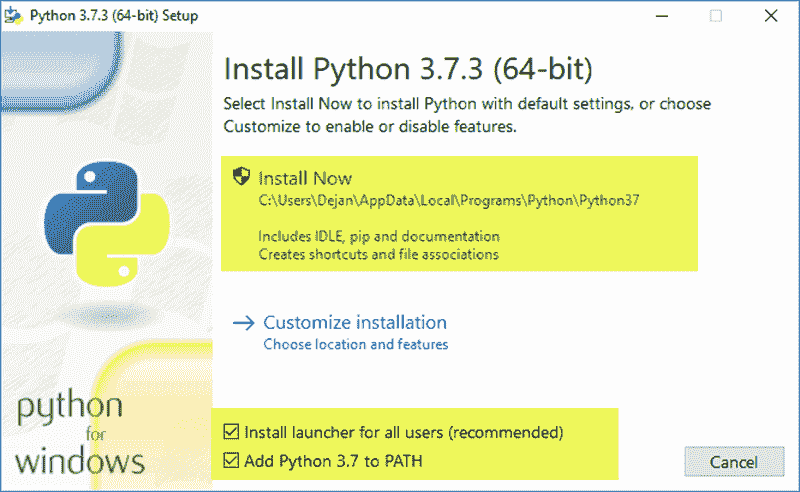
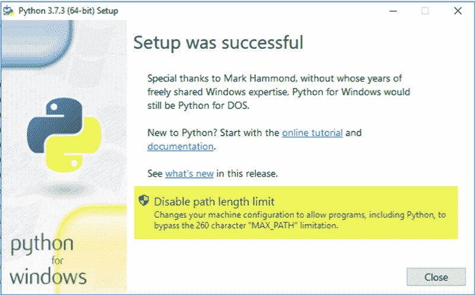
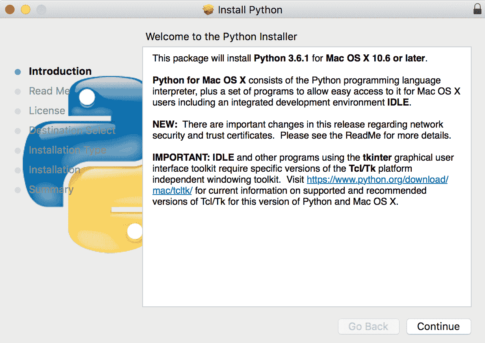

# 什么是 Python:安装指南

> 原文：<https://www.pythoncentral.io/what-is-python-installation-guide/>

## 先决条件

如果你是 Python 新手，请务必阅读我们的前一篇文章。它兼容所有不同的操作系统。这很容易设置，事实上，如果你使用的是 Linux 系统，你会预装 python。在这篇文章中，你会知道:

*   如何检查 python 版本？
*   如何下载 Python？
*   Python 版本 2.x 和 3.x 的区别
*   如何建立一个现成的 python 环境。

## 如何检查 Python 版本？

一些操作系统预装了 Python，比如 macOS 或 T2 Ubuntu。其他操作系统如 [Windows](https://www.microsoft.com/en-us/windows) 没有开箱即用的安装。

为了检查 Python 是否安装在中，请在 macOS 或 Linux 中打开终端。编写以下命令:

```py
python --version
```

输出:

```py
Python 3.7.2
```

如果你用的是 windows。打开 CMD 并写下:

```py
python -v
```

检查 Python 版本的另一种方法是编写`python`。它应该打开 [Python 外壳](https://www.pythoncentral.io/review-of-ipython-alternative-python-shell/)或者引发一个错误。

[](https://www.pythoncentral.io/wp-content/uploads/2020/08/Python-versiob.png)

如果你的操作系统没有安装 Python。

## 如何下载 Python？

Python 最好的特性之一是它的兼容性。它可以很容易地安装在任何操作系统。您可以通过命令行或 GUI 安装它。

在基于 Linux 的操作系统中安装 Python 非常容易。在这种情况下，我们将检查 Ubuntu 的安装。在其他 Linux 发行版中也差不多。

1.  安装依赖项。

    ```py
    $ sudo apt-get install software-properties-common
    $ sudo add-apt-repository ppa:deadsnakes/ppa
    ```

2.  更新操作系统软件包管理器

    ```py
    sudo apt-get update
    ```

3.  安装最新版本

    ```py
    $ sudo apt-get install python3.8
    ```

请注意，python 的版本将取决于您的发行版。比如在 Fedora 25 上安装一个`Python36`的包来获得 Python 3.6。

如何在 windows 中安装它:

1.  访问[官网。](https://www.python.org/)
2.  导航到下载>窗口。
3.  选择您的版本。
4.  打开。exe 文件。
5.  单击立即安装。
6.  继续下一步。
7.  完成安装，然后单击关闭。

[](https://www.pythoncentral.io/wp-content/uploads/2020/08/python-setup.png)

为 windows 设置 python

[](https://www.pythoncentral.io/wp-content/uploads/2020/08/python-setup-completed.png)

windows 安装的最后一步。

如何在 macOS 中安装 Python:

1.  执行上述步骤
2.  从下载部分选择 MacOS X
3.  点击 macOS 安装程序。
4.  打开下载的文件。
5.  单击以继续使用推荐的设置。
6.  完成后，你就可以安装了。

[](https://www.pythoncentral.io/wp-content/uploads/2020/08/6fa2f292-a7ed-4c0a-9020-3c1dd47a047c.png)

macOS 中的安装过程

## Python2.x 和 3.x 有什么区别？

如果你试图开始学习 Python，你会发现有两个版本。2.x 和 3.x 有什么区别？

Python 就像任何其他有版本的语言一样。版本控制的目标是跟踪更新。每个版本都有自己的特色。为什么我们要对任何语言的更新进行版本控制？

目标是能够跟踪更新。在软件行业，更新语言会有副作用。该更新可能包含不推荐使用的功能或语法更改。自动更新会导致项目失败。版本控制帮助我们指定我们的项目将运行的版本。这导致了更少的错误，并增加了项目的生命周期。版本号由两部分组成。像这样(2.7 或者 3.8)。第一个数字指的是一个重大变化。可能导致不赞成某些功能或语法更改的更改。第二个数字是指一个小的更新或修复。每次更新都有一个变更日志。有了这个 changelog，开发人员可以跟踪变更以更新他们的项目。总是建议使用该语言的最新版本。

在 Python 中，有 2.x 和 3.x 两个版本，区别是主要的。将 2.x 项目更新为 3.x 将导致语法错误。2.x 和 3.x 有什么区别？你应该学哪一个？

### 整数除法:

用 2.x 除两个整数不会有浮点值。

```py
# Python 2.x
print 5 / 2

output:
# 2

# Python 3.x
print(5 / 2)

output:
# 2.5
```

### 打印功能:

3.x 括号中的打印功能是强制性的。Python2.x 括号中的打印函数是可选的。

```py
# Python 2.x
print "Hi weclome to python 2.x"

output:
# Hi weclome to python 2.x

# Python 3.x
print("Hi weclome to python 3.x")

output:
# Hi weclome to python 3.x
```

### Unicode:

在 2.x 中，隐式字符串类型是 ASCII。但是在 3.x 中是 UNICODE。

```py
print('sample word')
print(b'sample word')

# Python 2.x 
output:
# <type 'str'>
# <type 'str'>

# Python 3.x
output:
# <class 'str'>
# <class 'bytes'>
```

在 2.x 中两者是同一类型。但是在 3.x 中它们是不同的类型。这并不意味着 Python2.x 不支持 Unicode。它支持不同语法的 Unicode】。

### 范围和 xrange:

Python3.x 中不赞成使用语句`xrange`，你可以查看我们关于[范围函数](https://www.pythoncentral.io/pythons-range-function-explained/)的完整文章。

```py
# Python 2.x
for x in xrange(1, 5):
    print(x)

output:
# 1 2 3 4

# Python 3.x
for x in xrange(1, 5):
    print(x)

output:
Traceback (most recent call last):     
  File "<stdin>", line 1, in <module>  
NameError: name 'xrange' is not defined

It should be
for x in range(1, 5):
    print(x)

output:
# 1 2 3 4

```

### 错误处理:

Python3.x 中的错误异常处理要用`as`来定义。

```py
# Python 2.x
try
    variable_name
except NameError, err:
    print err, 'ops defined before assign.'

# output:
(NameError("name 'variable_name' is not defined",), 'ops defined before assign.')

# Python 3.x
try:
    variable_name
except NameError, err:
    print err, 'ops defined before assign.'

output:
 File "<ipython-input-1-942e89fbf9ab>", line 3
    except NameError, err:
    ^
SyntaxError: invalid syntax

It should be:
try:
    variable_name
except NameError as err:
    print(err, 'ops defined before assign.')

```

注意:Python2.7 支持结束。如果你是 python 新手，建议从 Python3.x 开始。

## 如何设置一个现成的 python 环境？

python 的不同版本使得为所有项目设置一个单一的设置是不现实的。如果你有一个 python2.x 项目，它不能在你的 python3.x 环境中工作。您需要将每个项目与其包隔离开来。这个概念被称为虚拟环境。这是一个独立的环境，有一个特定的版本来运行您的项目。使用虚拟环境将有助于您轻松处理不同的项目。你需要它来激活环境。

### 如何搭建虚拟环境？

安装虚拟环境 ubuntu

1.  确保您已经安装了它。
2.  更新您的软件包管理器

    ```py
    sudo apt update
    ```

3.  安装 pip 软件包管理器。

    ```py
    $ sudo apt install -y python3-pip
    ```

4.  安装基本工具。

    ```py
    $ sudo apt install -y build-essential libssl-dev libffi-dev python3-dev
    ```

5.  安装虚拟环境。

    ```py
    $ sudo apt install -y python3-venv
    ```

6.  创建一个虚拟环境。

    ```py
    $ python3 -m venv <env_name>
    ```

7.  激活虚拟环境。

    ```py
    $ source <env_name>/bin/activate
    ```

现在你有一个孤立的操场。任何已安装的包都将在这个虚拟环境中。如果你完成了，你可以简单地写`deactivate`去激活环境。

## 结论

您可以在任何操作系统上轻松安装 python。通过其版本控制系统，您可以为您的项目选择正确的版本。总是建议使用最新版本。你应该知道版本之间的区别。更新项目取决于您使用的版本。建议每个项目都使用虚拟环境。它帮助你在同一台机器上运行多个项目。