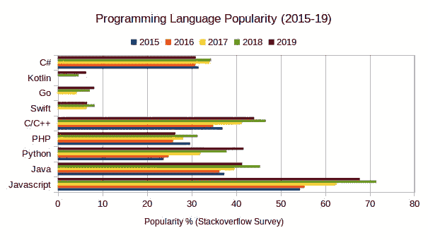

# python 有什么用途:python 初学者指南

> 原文：<https://www.pythoncentral.io/what-is-python-used-for/>

## 先决条件

如果你期待学习 python，你可能会发现这篇文章非常有用。在这里，您将了解 Python。它是用来做什么的？在哪学的？

要更多地了解任何一种语言，你需要了解一点它的历史。通过了解它的历史，你会对语言的主要焦点和发展方向有更多的了解。

根据 StackOverflow 2019 年的调查，Python 是最受欢迎的编程语言之一。在本文中，我们将了解更多关于

*   python 的历史
*   学习需要多长时间
*   python 的主要用法
*   去哪里免费学 python

[](https://www.pythoncentral.io/wp-content/uploads/2020/08/popularity-2015-19.jpg)

编程语言流行度图表根据stack overflow2019[调查](https://insights.stackoverflow.com/survey/2019)

## **python 的历史**

**Python** 是一种 解释为高级通用 编程语言 。由 [吉多·范·罗苏姆](https://en.wikipedia.org/wiki/Guido_van_Rossum)创作并于 1991 年首次公映。Guido 的 python 目标是成为开源的交互式编程语言。他想鼓励其他开发者使用它。Python 基于 C 语言，在性能上对 python 有帮助。CPython 的目标是将 Python 脚本翻译成 C 语言，并对解释器进行直接的 C 级 API 调用。Python 的代码可读性使其对长期项目非常有用。对于不同的公司都是不错的选择。除了在大型商业项目中使用 python 之外，开发人员开始将 python 用于辅助项目。现在你知道 python 的主要目标了。Python 注重可读性和性能。Python 支持不同的操作系统。让我们开始看看它的主要用法。

## **python 的主要用法**

面向对象和函数式编程等多种编程范式的支持，以及背后庞大的社区，正在帮助语言适应不同的开发领域。再来说说 Python 的流行用法。

### **网页开发**

> 在 Web 开发中，有许多编程语言可供选择。Python 在 web 开发中被广泛采用，有 Django、Flask 和 Pyramid 等框架。或者使用 scrappy、BeautifulSoup4 等从不同网站获取数据的废弃工具。

**Django** 是最大的 python web 框架。这是一个鼓励快速开发的 MVC(模型-视图-控制器)框架。它提供了具有标准架构的结构良好的文件。Django 给你开箱项目:

*   具有大量定制的可扩展架构。
*   包含项目配置的设置模块。
*   ORM(对象关系映射器)将你的 python 代码转换成 SQL。
*   带有用户管理系统的管理门户。
*   HTML 渲染的模板引擎。
*   内置表单验证。
*   漏洞防范，如 SQL 注入、跨站点脚本、点击劫持和密码管理

你可以在我们对 Django 的[介绍中了解更多关于 Django 的信息。](https://www.pythoncentral.io/writing-your-first-python-django-application/)

[**Flask**](https://flask.palletsprojects.com/en/1.1.x/) 是一个微框架，之所以这么叫是因为它不需要安装特定的工具或库。它没有默认的数据库或表单验证，您可以完全控制项目架构。您可以根据需要添加工具。Flask 是大型项目或基于微服务的项目的快速解决方案。这并不意味着 Flask 不是可伸缩项目的好选择。烧瓶是一个简单的选择

*   需要详细定制的项目
*   微服务系统。
*   用最少的配置快速创建 web 应用程序。

**注:**我们在[之前的文章](https://www.pythoncentral.io/introduction-to-pythons-django/)中对 Django 和其他框架做了充分的比较。Python 的用途不仅仅是构建 web 应用程序，还包括机器学习和数据科学等其他领域。

### **机器学习和数据科学**

Python 非常擅长资源管理(RAM、CPU 和 GPU)。数据科学家和机器学习工程师正在将它与如下库一起使用:

*   **张量流**，机器学习的端到端 python 平台。它处理复杂的计算。它用于自然语言处理、语音识别，具有开箱即用的用户友好响应。
*   **Pytorch，**一个生产就绪的机器学习库。它利用机器 CPU 和 GPU 来支持应用程序加速计算
*   **NumPy，** Python 最流行的复杂数学运算库。它有很多线性代数方程，比如傅立叶变换。

数据科学和机器学习最近在学术研究和公司中被大量使用。你需要一个好的数学背景，并且你已经准备好开始学习它了。

### **自动化脚本**

开发人员和安全工程师正在使用它来编写自动化脚本，以帮助他们的日常工作。查看我们关于使用 python 和 [boto 访问 AWS 服务](https://www.pythoncentral.io/introduction-to-python-on-aws-with-boto/)的文章

除了不擅长的**移动**和**游戏**之外，你可以在几乎所有的应用程序中使用它。

## **学习需要多长时间？**

显然，学习一门新语言的时间并不是对每个人都是固定的。它被设计成像英语一样可读。我们可以说，学习它的基础知识并开始使用它可能需要大约 2 周的时间。

下面是 python 语法的一个例子

```py
# define variables
language = "english"

# check type the type
type(language)  # str

# python boolean
is_readable = True

# List Data structure
numbers = [1, 2, 3, 4, 5]

# conditional statment
If language == "english":
   print("Welcome to english language")
else:
   print("Invalid language")

# iteration and for loop
for num in numbers:
    print("current number is : ", num)

# we can use ptyhon funtions to isolate logic
def get_number_type(number):
    if number % 2 == 0:
       return "Even number"
    else:
       return "Odd number"

# calling function

number_type = get_number_type(2)
print(number_type)
# Output : Even number

number_type = get_number_type(3)
print(number_type)
# Output : Odd number

```

上面的代码是一个易于阅读的 Python 代码的例子。这就是 Python 易学的原因。查看干净 python 代码的[技巧。](https://www.pythoncentral.io/python-starter-tips/)

## **去哪里免费学 python？**

有大量的资源可以免费学习，我们将列出最好的学习资源。

*   文档 [文档教程](https://docs.python.org/3/tutorial/index.html)
*   Udacity 课程[python 编程入门](https://www.udacity.com/course/introduction-to-python--ud1110)
*   Coursera 专精 [Python 为大家带来](https://www.coursera.org/specializations/python)
*   Tutorialspoint [教程](https://www.tutorialspoint.com/python/index.htm)
*   W3Schools [教程](https://www.w3schools.com/python/)
*   Sololearn [课程](https://www.sololearn.com/learning/1073)

## 结论

从上面的解释来看，很明显你可以在不同的应用中使用 python。python 在不同的行业和领域有着广泛的用途。它兼容所有的操作系统。如果你想以编程开始你的职业生涯，这是一个好的开始。对于在日常工作中需要几个脚本的数学家来说，Python 是一个非常有用的工具。如果您正在寻找可伸缩的 web 应用程序，python 也是一个不错的选择。