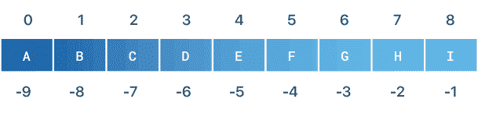

# Python 中的字符串是什么

> 原文：<https://www.pythoncentral.io/what-is-the-string-in-python/>

字符串是 Python 数据类型。在本文中，我们将了解什么是 python 中的字符串，如何在 Python 中反转、连接和比较字符串。为了从本文中获得最大收益，您需要具备 Python 的基础知识。如果你不点击查看我们的[python 介绍。先说 python 中的字符串是什么。](https://www.pythoncentral.io/what-is-python-used-for/)

## **Python 中的字符串是什么？**

Python 字符串是一种数据类型。Python 没有字符数据类型。这就是为什么它有一个字符串，一个 Unicode 表示的字符列表。Python 将字符串作为字符数组来处理。

这意味着您也可以将所有列表函数应用于 string。声明一个 python 字符串非常简单，只需在单引号或双引号之间添加单词。这将告诉 Python 在内存中创建一个字符串长度的列表。让我们看一个定义 Python 字符串的例子。

```py
text = 'Hello'
message = "Python string"

print(text)
print(message)

# output
'Hello'
"Python string"

```

上面的例子展示了如何在 python 中用单引号或双引号定义一个字符串。Python 字符串有一些利用字符串的函数。假设用户用他们的电子邮件注册了您的应用程序。您需要验证电子邮件字符串是小写的。以避免用户数据的重复。Python 提供了一个内置函数`lower()`，可以将字符串转换成小写。

```py
email = "Email@Mail.com"

print(email)
# output
'Email@Mail.com'

print(email.lower())

# output
'email@mail.com'
```

我们提到字符串是一个列表，我们可以对它执行一些列表函数。这包括列表所具有的反向功能。

### **如何在 Python 中反转一个字符串**

要在 python 中反转一个字符串，你需要理解 python 将字符串作为一个字符列表读取。相反的功能非常简单。首先，遍历字符串。从原始字符串的末尾开始创建一个新字符串。举个例子你就明白了。

```py
text = 'Hello world'
new_text = ''

index = len(text)
while index > 0:
  new_text += text[index -1]
  index -= 1

print(text)
print(new_text)

# output
Hellow world
dlrow olleH
```

在上面的代码中，我们用字符串的长度创建了一个索引。使用循环从后向前遍历文本中的每一项。最后一部分是将字符添加到新字符串中，并减少计数器。这就解决了我们反串的问题。Python 支持更有效的方法来反转字符串。

[](https://www.pythoncentral.io/wp-content/uploads/2020/12/String-Indexing.png)

```py
text = 'Hello world'
new_text = text[::-1]

print(new_text)

# output
dlrow olleH
```

文本[::-1]代码做了什么？它对字符串进行切片，使其以字符串的长度开始，以零索引结束。这会反转字符串，并将其存储在 new_text 字符串中。您可能已经注意到，在前面的例子中，我们创建了一个空字符串，并开始向其中添加内容。这就引出了一个问题，如何连接 Python 的字符串？

### **在 Python 中连接字符串**

串联 Python 的字符串是将字符串合并在一起。更简单的解释，如果你有 text_1 =“你好”，text_2 =“世界”。将它们串联起来就是我将它们合并，形成“Hello world”。在 Python 中有很多种连接字符串的方法。最简单的方法是使用加号。

```py
text_1 = "Hello"
text_2 = "World"

print(text_1 + " " + text_2)

# output
Hello World
```

你的代码库越大，你就越需要定制连接。Python 提供了几个函数来帮助您以一种更优雅、更易读的方式连接字符串。第一种方法是 format()函数。

```py
username = "John"

welcome_message = "Welcome {username} this is a test text".format(username=username)

print(welcome_message)

# output
Welcome John this is a test text
```

如果您需要添加空格，并且您有多个变量要添加到文本中，format 函数在大型测试中非常方便。你需要做的就是把变量名放在花括号里。Python 将从传递给 format 函数的参数中获取该变量的值。

第二种方法是使用 join 函数。如果您有一个列表，并且想要将列表数据连接成一个字符串，那么 join 函数非常有用。我们举个例子来了解一下。

```py
full_name_parts = ['John', 'Jack', 'Watson']
full_name = "-"

full_name.join(full_name_parts)

print(full_name)

# output
John-Jack-Watson
```

您可以看到 join 函数遍历了列表，并将项目添加到 full_name 字符串中。它添加了中间带有`-`的项目。

第三种方法仅在 Python 3.6 及更高版本中可用。这是 f 弦法。这是 format 函数的一个更好的版本。

```py
name = "Jack"
age = 72

f"Hi, {name}. You is {age}."

# output
'Hello, Eric. You are 74.'
```

f-string 方法允许您直接获取字符串中的变量值。如果你在字符串的开头添加了一个字符。

### **比较两个 Python 字符串**

让我们假设您有一个存储用户名的应用程序。您希望每个用户的用户名都是唯一的。这意味着您需要验证这个名称不匹配任何其他注册的用户名。Python 提供了比较字符串的能力。一个基本的例子是:

```py
name = input('Enter Your Name:')

saved_name = 'Jack'

if name == saved_name:
  print('Sorry the name you entered is taken')
else:
  print('Welcome {name}'.format(name=name))

# output
Sorry the name you entered is taken

# output
Welcome John
```

Python 将这两个字符串作为文本进行比较。这意味着如果用户输入小写的插孔名称，该条件将无效。这一点非常重要。你要知道 Python 是不做自动验证的。您需要手动实现所需的验证。这是一个非常简单的例子，在一个更现实的例子中，您将有一个数据库来确保名称是唯一的。

### **结论**

Python 的字符串使用起来非常方便和有用。它有明确的形成和污染方法。您可以将它作为一个列表来使用。它支持不同的大多数 [Python 列表内置的](https://www.pythoncentral.io/pythons-string-replace-method-replacing-python-strings/)函数。要反转一个 Python 的字符串，你可以把它切片，以索引 0 结束。Python 中的连接字符串提供了不同的连接方法，可以根据您的需要进行选择。在 python 中比较字符串类似于比较两个整数。你可以在[官方文档](https://docs.python.org/3/tutorial/introduction.html#strings)中了解更多关于 Python 字符串的知识。你可以在这里得到更多关于字符串函数[的细节。](https://www.w3schools.com/python/python_ref_string.asp)