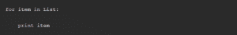

# 为什么选择 Python 作为您在 Linux 上的第一种编程语言

> 原文：<https://www.pythoncentral.io/why-choose-python-as-your-first-programming-language-on-linux/>

由于 Windows 的使用在减少，Linux 正在迅速发展并变得越来越流行。许多程序员正致力于 Linux 的推广，他们为台式机开发新的程序，这些程序将等同于甚至优于 Windows 和 Mac OS X 应用程序。

用于 Linux 的编程语言有很多，而且每年都有新的出现。但并不是所有的都是程序员用的。几乎每一个现代 Linux 发行版中都有 Python，所以那些准备在 Linux 中编写第一个 Python 程序的人不需要安装任何额外的程序。要在 Linux 中编写您的第一个 Python 程序，请启动您最喜欢的 Linux 程序，并遵循本文的步骤。

具有简单语法和语义的可靠编程语言将确保快速学习，并有助于开发算法思维。第一语言应该是高水平和灵活的，这样学生就可以尝试解决问题的替代方案。同样重要的是，它应该支持现代设计方法，包括抽象、封装和面向对象的方法。我们来试着了解一下 Python 是否真的适合新手程序员。重要的是要记住编程语言可能因公司而异。但是如果你想做一名自由职业者，为 [论文写作服务](https://writemypaperbro.com/) 或任何其他公司创建网站，从学习 Python 开始吧。

值得理解的是，第一门编程语言的选择并不总是决定一个学生未来的职业生涯，但它可以影响职业发展的方向，有利于未来的自主学习。

编程通常被视为开发思维的工具，并且能够影响人们解决问题的方式。这里可以与口语的 Sepir-Worf 假说相提并论，该假说认为语言决定思维。

选择第一编程语言的标准还可以包括:

*   范围和流行程度；
*   范式——面向对象或函数式编程；
*   句法简洁；
*   思想的优雅；
*   程序员群体的规模；
*   培训材料的可用性。

尽管对理想的第一语言缺乏共识，Python 符合大部分标准，可以被推荐为这样的选择。在这种情况下，值得考虑未来程序员所面临的任务，以及他或她所选择的整体学习策略。

# **Python 的范围**

最近，脚本语言越来越受欢迎。用它们编写的软件比用传统的系统语言要多。Python 可用于所有主流平台:Windows、OS X、Linux、Unix、BeOS、Java。它广泛应用于科学计算、机器学习、web 开发、游戏和视觉效果创建、服务器管理以及其他一些领域。

Python 可以做许多开箱即用的有用的事情，并提供专业人员期望从核心编程语言中获得的所有基本工具和特性。有关如何使用 Python 来启发您学习它的更多示例，请查看本文。

# **社区和文档**

Python 有一个来自世界各地的大型程序员社区，致力于学习、使用和开发它。有许多专门讨论 Python 的会议、聚会和黑客马拉松，这种语言有一个庞大且研究充分的 [文档库](https://www.python.org/about/gettingstarted/) 来帮助新手熟悉它并找到大多数问题的答案。Python 有大量适用于各种场合的标准库，甚至还有更多开源库供您在工作中使用。

# **Python 的简单性——语法和语义**

得益于简单的正则语法，Python 程序通常可读性极强，易于理解。操作符在行尾结束，块结构缩进，程序看起来像可执行的伪代码。

Python 最不寻常的特性之一是使用缩进来表示代码块。解释器有助于确保正确的格式，这使得编写不可读的代码更加困难。在其他语言中，缩进是一门艺术。在 Python 中，它是语法的重要部分。作为一个例子，这里有一个 Python 的线性搜索版本:

例如，如果将代表 的 行向左移动几个空格，就会导致语法错误。还要注意， : 用于表示代码块的开始。

除了基本的数字类型，Python 还提供了三种内置的数据结构:字符串、列表和字典。字符串和列表支持灵活的切片表示法，可以提取任何子串或子列表。

简单的程序真的很简单。比如 Python 中的 Hello World 是这样的:

语义上，Python 很简单。它是动态类型的，所以不需要变量声明。这减少了代码量，也消除了由于误解声明、定义和用法中的细微差别而导致的常见错误。Python 代码易于阅读，因为它在许多方面类似于日常英语。

Python 有一套最小但完整的简单控制结构:一个 if-elif-else 选择结构，一个确定的 for 循环，一个不确定的 while 循环。

Python 中的 为 循环就是例证。它允许控制变量取连续的值。它可用于枚举任何序列，如列表或字符串。列表项可以打印如下:

for 简单又安全，让你很早就可以进入，不用担心无尽的循环。

# **Python 的优缺点**

我们已经在上面提到了 Python 的一些优点，我们建议将它们与缺点进行比较，以客观地评估作为第一个学习者的语言。

## **优势**

*   简单易学。
*   简洁。
*   易于使用的语法和简单的语义。
*   可解释性。
*   广泛的可用性。
*   动态打字。
*   广泛的库支持。
*   大量文档和培训材料。
*   它是多平台的。

## **缺点**

程序运行速度低:使用动态类型的语言逐行执行代码使得开发高性能的应用程序变得困难，但这通常可以通过提高开发人员的工作效率来弥补。

Python 程序使用大量内存:在创建优化的应用程序时，这可能是一个缺点。有关此问题的更多信息，请参见“Python 中的内存工作原理”。

编译时缺乏检查有时会导致运行时错误。这对于在运行或发布之前测试应用程序提出了更高的要求。

对比优缺点，Python 在弱硬件上对代码的速度有一定的限制。由于新手程序员通常不会编写高性能的应用程序，所以他们的产品没有如此严重的运行时限制。同时，Python 比编译的编程语言快好几倍，而可读性和语法、语义的简单性否定了可能的错误。

# **总结**

Python 是一种简单、通用、有前途的编程语言。虽然它有一些缺点，但好处在很大程度上大于它们，尤其是对于新手程序员来说。脚本语言作为基本软件开发工具的流行是计算机编程中潜在的革命性变化。Python 是学习基础知识和开始职业生涯的理想工具。