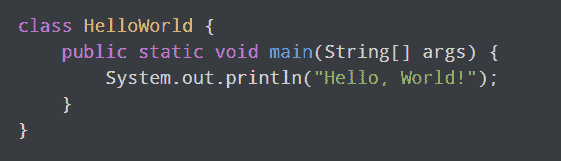

# 为什么选择 Python

> 原文：<https://www.pythoncentral.io/why-python/>

Python 已经在 [IEEE Spectrum 的年度编程语言排名榜](https://www.zdnet.com/article/programming-language-popularity-python-tightens-its-grip-at-the-top/) 之上好几年了。

它也是美国大学教授的最流行的入门编程语言。

如果你还没有开始学习 Python，那么理解它为什么会在全球开发者中流行是一个挑战。

因此，在这篇文章中，我列出了你应该考虑学习和使用 Python 的五大理由。

## **为什么是 Python？**

Python 受欢迎背后最大的原因是它的。阅读和理解 Python 程序比用其他编程语言编写的程序要容易得多。

由于没有令人困惑的语法规则，程序员不必花太多精力编写代码。这使得像程序员一样思考变得容易多了。

对于程序员来说，用任何语言编写一个“Hello World”程序作为他们的第一个程序都是惯例。在 Java 中，基本程序的代码是这样的:

另一方面，Python 中的“Hello World”程序看起来是这样的:

这两种语言复杂程度的对比是惊人的。

此外，有了 Python，你不必担心让你的代码工作。

设置 Python 很容易——你所要做的就是访问 Python 官方网站，并在你的电脑上安装软件包。虽然如果你喜欢有一个好的界面来写代码，你可以得到一个 IDE，但是你不一定要这样做。您可以在 Windows 上使用命令提示符，或者在 macOS 和 Linux 上使用终端来运行您的程序。

## **Python 到底有多大用处？**

Python 看起来很简单，但它远不是一种不灵活的语言。它用途广泛，在几个行业都有应用。大型科技公司，包括谷歌、Dropbox 和 Spotify，都使用 Python 开发各种应用程序。下面是不同公司的使用方法:

### **Dropbox**

让用户管理云数据的 Dropbox 桌面客户端完全是用 Python 编写的，你会感到惊讶。服务器端代码也是用 Python 编写的，这使得它成为该公司使用的最重要的语言。这证明了 Python 的强大和出色的跨平台能力。

### 谷歌

谷歌已经成长为向大众提供的不仅仅是一个强大的搜索引擎，因此，该公司使用多种语言。除了 C++和 Go 之外，Python 是该公司使用最多的语言之一。

尽可能使用 Python 是谷歌的早期决定，并不难理解其中的原因。它支持快速实现功能，并且易于维护。

然而，由于 Python 没有那么快，谷歌软件栈中需要低延迟操作的部分是用 C++编写的。

### **Spotify**

虽然该公司严重依赖 Java，但 Python 用于构建 web API 和交互式 API 控制台。交互式控制台使开发人员能够探索端点，而无需经历导航复杂界面的麻烦。

该语言在公司内部的其他应用包括:

*   数据分析
*   支付系统
*   内容管理系统
*   DNS 服务器恢复系统

如你所见，这种语言在不同的公司有着广泛的应用。虽然 Python 可能没有 C++这样的低级语言快，但它是快速构建原型和实现特性的完美工具。

它还具有明显的多功能性。学习 Python 将使你能够创建几乎任何你想要的东西。

## **为什么要学习 Python？**

易用性和多功能性是选择 Python 的两大原因。然而，学习 Python 是个好主意还有许多其他原因。

### **#1 一个积极支持的社区**

Python 自 1991 年就出现了。它是有据可查的，并且被世界上一些最大的公司所使用。如果你碰巧遇到了这种语言的问题，很可能这个问题以前就已经解决了——仅仅是因为使用这种语言的开发人员数量太多。

简单的谷歌搜索通常足以回答你的任何问题。如果您在那里没有找到您的答案，您可以求助于详细的文档来获得解决方案。您也可以向 Stack Overflow 上的大型 Python 开发人员社区寻求帮助。

### **#2 多种编程范例**

Python 提供的最大优势之一是它支持多种编程范式。它对面向对象、结构化、函数式和面向方面编程的支持使它非常灵活。

此外，这种编程语言以动态类型系统为特色，并拥有自动内存管理功能。这些特性使您能够使用 Python 构建大型、复杂的应用程序，而不必太担心约束。

### **#3 大数据应用**

过去十年，数据科学和云计算的应用呈指数级增长。Python 对这些应用程序的支持帮助它一飞冲天。

Python 现在是处理大数据最常用的语言，仅次于 R，R 也用于创建人工智能系统。

Python 使得分析和组织数据变得非常容易。它的易维护性和可伸缩性帮助它把 R 推到了开发者偏好的第二位。

#### **大数据库**

该语言有几个软件包，如 NumPy 和 Pandas，使用户能够以不同的方式分析和使用数据，而无需从头开始编写程序。

由谷歌开发的 Tensorflow 是迄今为止最受欢迎的 Python 包，它能够构建机器学习算法。用户可以使用 pyspark 调用 spark 框架并处理大型数据集。

像这样的库使日常开发人员能够分析数据趋势，而不需要学习像 r 这样复杂的语言。

### **#4 庞大的套库**

Tensorflow 和 Pandas 并不是 Python 自带的唯一的库。这种语言拥有大量的库，可以在开发的各个领域提供帮助。一些最著名的库包括:

*   **NumPy 和 SciPy:** 为 web 开发的科学计算提供帮助。
*   **Scikit-Learn:** 用于机器学习应用和自然语言处理。
*   Keras: 它使得与神经网络一起工作变得更容易。

也有类似库的工具使 Python 能够与其他语言一起工作，并扩展其跨平台支持。

Python 的另一个优势是，你可以通过阅读 Python 标准库文档来了解几个库。

### **#5 几种开源框架和工具**

Python 是开源的，这大大降低了开发成本。活跃的开发人员社区和缺乏严格的许可要求导致了一些强大的开源 Python 框架的开发。

任何开发人员都可以使用几十种强大的 Python 工具中的一种来满足他们确切的开发需求，而不会增加开发成本。

这些工具的可用性也有助于减少开发时间，因为团队不必编写代码来解决框架和工具为他们解决的问题。

Django、Flash 和 Bottle 是 web 应用程序开发人员可以用来简化和加速开发的许多工具中的一部分。另一方面，像 PyQT、PyGUI 和 Kivy 这样的框架有助于加速 GUI 应用程序的开发。

这些框架并不缺乏，而且很有可能你会找到一个框架来帮助你解决一个复杂的问题，而不需要写很多代码。

### **结论:2021 年 Python 值得学吗？**

Python 是大学里最受欢迎的入门编程语言——现在你明白为什么了。

它很容易学习、阅读和使用，而且由于它是免费下载的，所以也很容易访问。对于一个发展中的开发者来说，这是一个完美的起点。

这种编程语言有着广泛的应用，可以用来做任何事情，从制作视频游戏到评估营销决策。活跃的社区和几个可用的库有助于加速软件开发。

但也许最重要的是，Python 在大型科技领域被广泛使用，这意味着学好它将带来几个经济上有回报的就业机会。

另外，学习编写 Python 程序将教会你一些细节，足以让你更轻松地掌握其他编程语言。

如果你正在寻找一门可以学习的编程语言，Python 是最好的选择。

*好奇用 Python 可以做什么？下面就为* [*详细用法指南*](https://www.pythoncentral.io/what-can-you-do-with-python-usage-guide/) *提供帮助。*