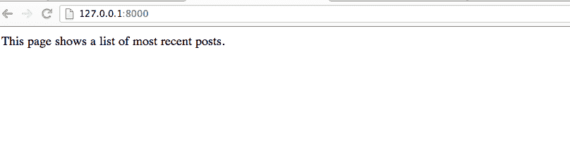
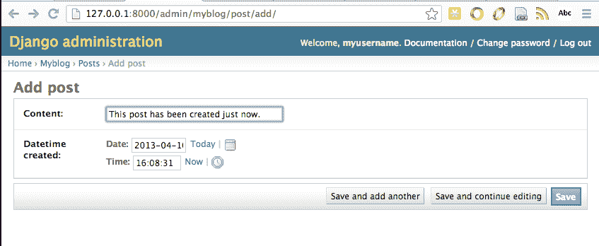
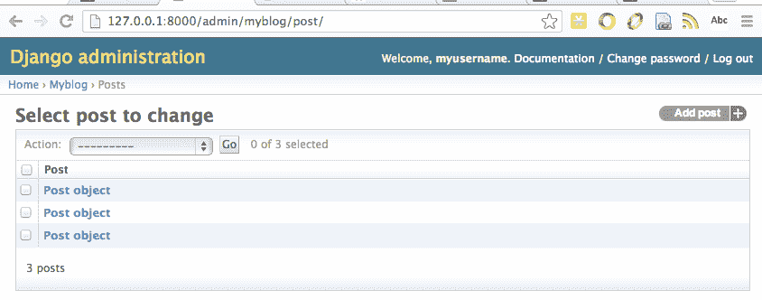
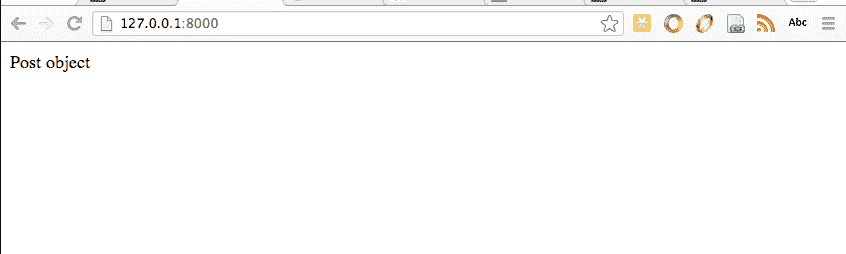
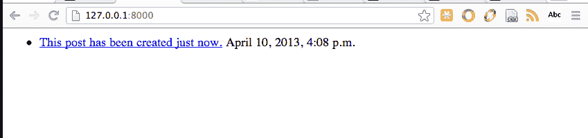
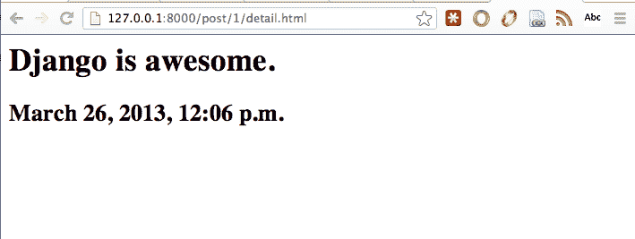
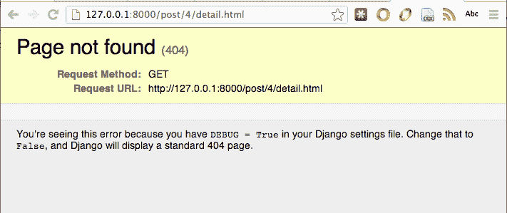

# 为您的第一个 Python Django 应用程序编写简单的视图

> 原文：<https://www.pythoncentral.io/writing-simple-views-for-your-first-python-django-application/>

在上一篇文章[为您的 Python Django 网站激活管理应用](https://www.pythoncentral.io/activate-admin-application-for-your-python-django-website/ "Activate Admin Application for Your Python Django Website")中，我们学习了如何在您的网站中激活来自 Django 的内置管理应用。在本文中，我们将为您的网站编写简单的视图。

## 什么是视图？

在 Django 中，*视图*是一个端点，任何客户端都可以通过网络访问它来检索数据。例如，一些*视图*将使用模板呈现的数据提供给 web 服务器，web 服务器再将 HTML 页面提供给客户端。而其他*视图*向 web 服务器提供 JSON 数据，这些*视图*成为一个 *RESTful* API 的一部分。

在 Django 中，*视图*是简单的 Python 函数或方法，将数据返回到前端 web 服务器。当一个*请求*进来时，Django 通过检查域名后面的*请求*的 URL 来选择一个*视图*。当发出一个*请求*时，为了调用正确的*视图*，您需要将一个 URL 模式列表插入到`myblog/urls.py`中。URL 模式是基于字符串的正则表达式，它指定了*视图*的 URL 的一般形式。例如，`r'^posts/(?P\d{4})/$'`匹配域名后的部分遵循字符串“posts”后跟一个四位数的模式的所有 URL。

## Django 网站的浏览量

在我们的博客网站上，我们将写出以下观点:

*   `Post`“索引”视图显示博客中最近的帖子或热门帖子的列表，就像  的主页一样
*   `Post`“detail”视图显示了一个`Post`的细节，类似于  上的每一篇文章页面

在“索引”视图中，用户应该能够看到其他人制作的最新`Posts`列表。在“细节”视图中，用户应该能够看到一个`Post`的内容以及其他人制作的一个`Comment`列表。

### 索引视图

让我们编写您的第一个*视图*“索引”,它显示了最近`Post`的列表。使用以下内容创建一个文件`myblog/views.py`:

```py

from django.http import HttpResponse
def index(request):
return HttpResponse('该页面显示最近发布的帖子列表。')

```

并修改文件`myblog/urls.py`:

```py

from django.conf.urls import patterns, include, url
#取消对下面两行的注释，以启用 django.contrib 中的 admin:
import admin
admin . auto discover()
urlpatterns = patterns('，
 #添加下面一行将根 URL 链接到函数 myblog.views.index()
url(r'^$'，' my blog . views . index '，name='index '，
 # url(r'^myblog/'，include('myblog.foo.urls ')，
#取消对下面的管理/文档行的注释以启用管理文档:
 url(r'^admin/doc/'，包括(' django.contrib.admindocs.urls ')，
#取消注释下一行以启用 admin: 
 url(r'^admin/'，include(admin.site.urls))，
 ) 

```

现在您可以在浏览器中访问 [127.0.0.1:8000](http://127.0.0.1:8000/ "127.0.0.1:8000") ，查看`myblog.views.index()` :
返回的内容

因为`myblog.views.index`的返回值是一个字符串，所以这个页面显示了最近的文章列表，它显示在这个页面上。接下来，我们将修改函数`myblog.views.index`来返回一个不早于两天前发布的`Post`列表:

```py

from datetime import datetime, timedelta

from django.http import HttpResponse
从我的博客导入模型作为 m
def index(request):
two _ days _ ago = datetime . utc now()-time delta(days = 2)
recent _ posts = m . post . objects . filter(created _ at _ _ gt = two _ days _ ago)。all() 
返回 HttpResponse(recent_posts) 

```

现在可以刷新 [127.0.0.1:8000](http://127.0.0.1:8000/ "127.0.0.1:8000") 看不到两天前没有帖子:


让我们使用[管理站点](http://127.0.0.1:8000/admin "Admin Site")的管理界面添加一个`Post`:



点击“保存”,文章管理页面将显示一篇新文章被添加，现在数据库中总共有三篇文章:



现在你可以刷新[主页](http://127.0.0.1:8000/ "Home Page")来查看返回的`Post`:



## Django 视图模板

显然，只显示“文章对象”对用户没有太大的帮助，我们需要一个更有信息的页面来显示一系列的`Post`。这时*模板*将有助于把一个像当前这样无用的页面变成一个像样的页面。

用以下内容创建一个新文件`myblog/templates/index.html`:

```py



    <ul>

    

        <li>

            <a href="/post/{{ post.id }}/">{{ post.content }}</a>

            <span>{{ post.created_at }}</span>

        </li>

    

    </ul>



    <p>No post is made during the past two days.</p>



```

并修改文件`myblog/views.py`以使用 Django 模板系统渲染 [127.0.0.1:8000](http://127.0.0.1:8000/ "127.0.0.1:8000") 的响应:

```py

from datetime import datetime, timedelta

from django.http import HttpResponse

from django.template import Context, loader 
从我的博客导入模型作为 m
def index(request):
two _ days _ ago = datetime . utcnow()-time delta(days = 2)
#检索不到两天前创建的帖子列表
recent _ posts = m . post . objects . filter(created _ at _ _ gt = two _ days _ ago)。全部()
#加载模板 my blog/templates/index . html
template = loader . get _ template(' index . html ')
# Context 是一个普通的 Python 字典，它的键可以在模板 index.html
Context = Context({
' post _ list ':recent _ posts
})中访问
return HttpResponse(template . render(context))

```

现在，您可以再次刷新[主页](http://127.0.0.1:8000/ "Home Page")，查看使用`myblog/templates/index.html`中的模板渲染的`Post`:



虽然*视图*索引()的当前代码可以工作，但是它比必要的要长一点。您可以使用 Django 快捷方式`render`来缩短代码:

```py

from datetime import datetime, timedelta

from django.http import HttpResponse

from django.shortcuts import render

from django.template import Context

from myblog import models as m
def index(request):
two _ days _ ago = datetime . utc now()-time delta(days = 2)
recent _ posts = m . post . objects . filter(created _ at _ _ gt = two _ days _ ago)。all()
Context = Context({
' post _ list ':recent _ posts
})
# Render 接受三个参数:请求对象、模板文件的
 #路径和 context 
返回 render(request，' index.html '，context) 

```

## 姜戈的详图

类似于`index`视图，`detail`视图显示了一个页面，该页面在类似于`/post/1/detail.html`的 URL 上呈现了关于`Post`的详细信息，其中`1`是一个`Post`的 id。

类似于`index`视图，您需要在编写`detail`视图之前编写 URL 模式。按照以下方式修改文件`myblog/urls.py`:

```py

from django.conf.urls import patterns, include, url                          
#取消对下面两行的注释，以启用 django.contrib 中的 admin:
import admin
admin . auto discover()
urlpatterns = patterns('，
 url(r'^$'，' myblog.views.index '，name='index ')，
 #将视图函数 myblog.views.post_detail()映射到一个 url 模式
 url(r'^post/(？p<post _ id>\ d+)/detail . html $ '，
 'myblog.views.post_detail '，name='post_detail '，
 # url(r'^myblog/'，include('myblog.foo.urls ')，
#取消对下面的管理/文档行的注释以启用管理文档:
 url(r'^admin/doc/'，包括(' django.contrib.admindocs.urls ')，
#取消注释下一行以启用 admin: 
 url(r'^admin/'，include(admin.site.urls))，
 ) 

```

然后可以在`myblog/views.py`中实现*视图*功能:

```py

from datetime import datetime, timedelta

from django.http import Http404, HttpResponse

from django.shortcuts import render

from django.template import Context

from myblog import models as m
def index(request):
two _ days _ ago = datetime . utc now()-time delta(days = 2)
recent _ posts = m . post . objects . filter(created _ at _ _ gt = two _ days _ ago)。all()
context = Context({
' post _ list ':recent _ post
})
return render(request，' index.html '，Context)
# post_detail 接受两个参数:普通请求对象和一个整数
 #其值由 r'^post/(定义的 post_id 映射？p<Post _ id>\ d+)/detail . html $ '
def Post _ detail(request，Post _ id):
try:
Post = m . Post . objects . get(PK = Post _ id)
除 m.Post.DoesNotExist: 
 #如果没有帖子有 id post_id，我们抛出 HTTP 404 错误。
引发 http 404
return render(request，' post/detail.html '，{'post': post}) 

```

然后我们需要在`myblog/templates/post/detail.html`添加一个新的模板文件:

```py

<div>

    <h1>{{ post.content }}</h1>

    <h2>{{ post.created_at }}</h2>

</div>

```

现在您可以访问 URL [帖子详细信息](http://127.0.0.1:8000/post/1/detail.html "Post Detail Page"):



如果您访问的`Post`的`id`不在数据库中，我们的`detail` *视图*将显示 HTTP 404 错误页面:



## 摘要

在本文中，我们编写了前两个*视图*。`index`视图显示了用户在不到两天前创建的`posts`的列表，`detail`视图显示了`Post`的详细内容。一般来说，写一部`view`的过程包括:

*   在`myblog/urls.py`中为视图编写 URL 模式
*   在`myblog/views.py`中编写实际视图的代码
*   在目录`myblog/templates/`中写一个模板文件