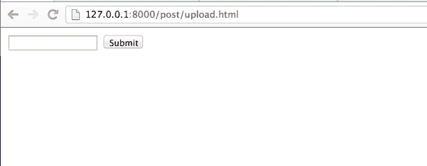
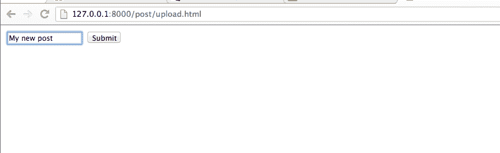
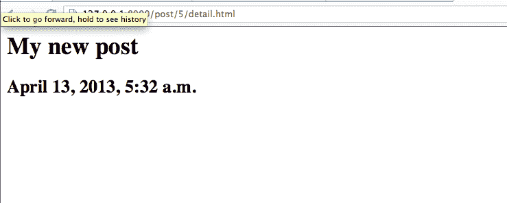

# 为您的第一个 Python Django 应用程序编写上传帖子的视图

> 原文：<https://www.pythoncentral.io/writing-views-to-upload-posts-for-your-first-python-django-application/>

在上一篇文章中，我们编写了一个`index`视图来显示不到两天前创建的一系列`posts`和一个`detail`视图来显示一个`post`的详细内容。在本文中，我们将编写一个视图，允许用户上传一个`post`，并用 Django 内置的通用视图改进我们现有的`index`和`detail`。

## 上传视图

类似于我们在上一篇文章中所做的，为了编写上传视图，我们需要首先在`myblog/urls.py`中编写一个 URL 模式:

```py

from django.conf.urls import patterns, include, url
#取消对下面两行的注释，以启用 django.contrib 中的 admin:
import admin
admin . auto discover()
urlpatterns = patterns('，
 url(r'^$'，' myblog.views.index '，name='index ')，
 url(r'^post/(？p<post _ id>\ d+)/detail . html $ '，
 'myblog.views.post_detail '，name='post_detail '，
 #将视图 myblog.views.post_upload 链接到 URL post/upload . html
url(r'^post/upload.html$'，' myblog.views.post_upload '，name='post_upload '，
#取消对下面的管理/文档行的注释以启用管理文档:
 url(r'^admin/doc/'，包括(' django.contrib.admindocs.urls ')，
#取消注释下一行以启用 admin: 
 url(r'^admin/'，include(admin.site.urls))，
 ) 

```

前面的 URL 模式指定`myblog.views.post_upload`应该处理任何指向 URL `post/upload.html`的请求。现在让我们编写实际的视图:

```py

# Add the following import statements to the top of myblog/views.py

from datetime import datetime

from django.core.urlresolvers import reverse

from django.http import HttpResponseRedirect
#在 myblog/views.py 的末尾添加以下函数
def POST _ upload(request):
if request . method = = ' GET ':
return render(request，' post/upload.html '，{ })
elif request . method = = ' POST ':
POST = m . POST . objects . create(content = request。POST['content']，
created _ at = datetime . utc now())
#此时不需要调用 POST . save()——已经保存了。
return HttpResponseRedirect(reverse(' post _ detail '，kwargs = { ' post _ id ':post . id })

```

`post_upload`处理两种可能的情况。如果`request`是一个 **GET** 请求，`post_upload`只是返回一个 HTML 页面。如果是一个 **POST** 请求，`post_upload()`在数据库中创建一个新的`Post`对象，并返回一个在上下文中包含新的`Post`对象的 HTML 页面。

接下来，我们将为我们的视图编写模板`myblog/templates/post/upload.html`。这个模板将向用户呈现一个 HTML 表单。

```py

<form action="" method="post">

  

  <label for="content"></label>

  <input type="text" name="content" id="content" />

  <input type="submit" />

</form>

```

前面的模板文件使用 Django 的模板语言来指定页面的内容。每当 Django 将模板与上下文一起呈现时，模板呈现器就会处理之间的代码，并且标记之外的任何内容都会作为普通字符串返回。为了查看渲染模板的实际输出，您可以在浏览器中检查其源代码:

```py

<form action="/post/upload.html" method="post" _lpchecked="1">
  <input type="hidden" name="csrfmiddlewaretoken" value="AGGNpA4NcmbuPachX2zrksQXg4PQ7NW0">
  <label for="content"></label>
  <input type="text" name="content" id="content">
  <input type="submit">
</form>

```

现在您可以用`python manage.py runserver` shell 命令启动服务器，并访问 URL `http://127.0.0.1:8000/post/upload.html`:



现在您可以键入新的`Post`对象的内容:



然后点击“提交”,这将把您重定向到您的新帖子:



## 通用视图

到目前为止，我们在 Django 应用程序中编写了三个简单的视图:一个显示一列`Posts`的`index`视图；一个`post_detail`视图显示了一个`Post`对象的详细信息页面；和一个允许用户上传一个`Post`到数据库的`post_upload`视图。这些视图代表了 web 开发的一个常见案例:从数据库获取数据，使用模板呈现数据，并将呈现的模板作为 HTTP 响应返回给用户。由于这些类型的视图非常常见，Django 提供了一套`generic`视图，有助于在编写类似的视图时减少样板代码。

首先，我们将修改`myblog/urls.py`中的 URL 配置:

```py

 from django.conf.urls import patterns, include, url
#取消对下面两行的注释，以启用 django.contrib 中的 admin:
import admin
admin . auto discover()
从我的博客导入视图
urlpatterns = patterns('，
 #取消对下面的管理/文档行的注释以启用管理文档:
 url(r'^admin/doc/'，包括(' django.contrib.admindocs.urls ')，
#取消注释下一行以启用 admin: 
 url(r'^admin/'，include(admin.site.urls))，
#使用通用视图替换以前的 post_index 和 post_detail viwes 
 url(r'^$'视图。PostIndexView.as_view()，name='post_index ')，
 url(r'^post/(？P < pk > \d+)/detail.html$ '，
观点。PostDetailView.as_view()，
 name='post_detail ')，
 url(r'^post/upload.html'，views.post_upload，name='post_upload ')，
 ) 

```

注意，`post_detail`接受一个参数`pk`，这是`generic.DetailView`获取主键是传入参数的`Post`对象所需要的。

然后，我们修改`myblog/views.py`:

```py

from datetime import datetime, timedelta

from django.core.urlresolvers import reverse

from django.http import HttpResponseRedirect

from django.views import generic
从我的博客导入模型作为 m
def POST _ upload(request):
if request . method = = ' GET ':
return render(request，' post/upload.html '，{ })
elif request . method = = ' POST ':
POST = m . POST . objects . create(content = request。POST['content']，
created _ at = datetime . utc now())
#此时不需要调用 POST . save()——已经保存好了。
return HttpResponseRedirect(reverse(' post _ detail '，kwargs={'post_id': post.id}))
类 PostIndexView(泛型。ListView):
template _ name = ' index . html '
context _ object _ name = ' Post _ list '
model = m . Post
def get_queryset(self): 
' ' '返回不到两天前创建的帖子'
two _ days _ ago = datetime . utc now()-time delta(days = 2)
返回 m . post . objects . filter(created _ at _ _ gt = two _ days _ ago)。全部()
类 PostDetailView(泛型。detail view):
template _ name = ' Post/detail . html '
model = m . Post

```

请注意，与以前的版本相比，这段代码要干净得多。`generic.ListView`提供了显示对象列表的概念，而`generic.DetailView`关心的是“显示一个特定的对象”。每个通用视图都需要知道它依赖于哪个模型，所以每个通用视图子类中都需要`model`属性。

因为`generic.ListView`和`generic.DetailView`接受合理的缺省值，比如在模板中使用的`context_object_name`和在数据库中查询的`model`，我们的代码变得更短、更简单，而不是太在意样板代码，比如加载和呈现模板。通用视图是一堆 Python `classes`,意在子类化以适应开发者的不同需求。

现在，您可以再次运行服务器，查看与我们之前的实现完全相同的输出。

## 总结和建议

在本文中，我们学习了如何编写一个视图来处理 **POST** 请求，以及如何使用`generic`视图来清理和提高视图的代码质量。Django 是**不要重复自己(DRY)** 原则的强烈支持者，该原则要求每条信息在系统中都应该有一个单一的、明确的和权威的表示。在 Django 的例子中，这意味着应该只有一个函数、一个类或一个模块负责一个特定的特性。例如，每个通用视图只处理一种类型的视图，并封装了特定类型视图的基本功能，因此子类可以在任何地方重用核心功能。Django 自己的实现和 API 严格遵循 **DRY** 原则，以最小化重复和不必要的样板代码。我们也应该遵循同样的原则，尽可能重用 Django 的`generic`视图。当您面临对通用视图进行子类化还不够的问题时，我建议您阅读 Django 关于如何实现通用视图的源代码，并尝试编写可重用的视图，而不是盲目地编写样板代码。