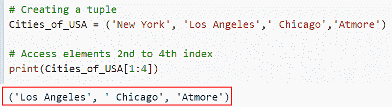

# 如何在 Python 中访问元组的项目

> 原文：<https://pythonguides.com/access-items-of-a-tuple-in-python/>

[](https://sharepointsky.teachable.com/p/python-and-machine-learning-training-course)

在本 [Python 教程](https://pythonguides.com/python-programming-for-the-absolute-beginner/)中，我们将学习 ***如何在 Python*** 中访问一个元组的条目。为了理解各种方法，我们将使用一些内置函数来访问 Python 中的元组项。

作为一名开发人员，在制作 Python 项目时，我需要访问 Python 中的元组项。所以，我遇到了多种方法，我们可以用它们来访问 python 中的元组。在本教程中，我们将尝试涵盖所有这些。

在这里我们将看到:

*   如何使用索引访问 Python 中的元组项
*   如何使用 for 循环访问 Python 中的元组项
*   如何使用负索引访问 Python 中的元组项
*   如何使用切片在 Python 中访问元组的项目
*   如何使用 tuple 在 Python 中访问元组的项目

目录

[](#)

*   [如何使用索引访问 Python 中元组的项目](#How_to_access_items_of_a_tuple_in_Python_using_an_index "How to access items of a tuple in Python using an index")
*   [如何使用 for 循环访问 Python 中元组的项目](#How_to_access_items_of_a_tuple_in_Python_using_for_loop "How to access items of a tuple in Python using for loop")
*   [如何使用负索引访问 Python 中元组的项目](#How_to_access_items_of_a_tuple_in_Python_using_a_negative_index "How to access items of a tuple in Python using a negative index")
*   [如何使用切片在 Python 中访问元组的项目](#How_to_access_items_of_a_tuple_in_Python_using_slicing "How to access items of a tuple in Python using slicing")
*   [如何使用 tuple](#How_to_access_items_of_a_tuple_in_Python_using_tuple "How to access items of a tuple in Python using tuple") 在 Python 中访问 tuple 的项目

### 如何使用索引访问 Python 中元组的项目

*   在这一节中，我们将讨论如何在 Python 中访问元组的条目。
*   Python 元组既是可迭代的，也是有序的对象组。因此，我们可以使用 for 或 while 循环遍历对象，或者使用对象的索引读取对象的值。
*   元素用括号()括起来，用逗号分隔，形成一个元组。元组类型变量的声明如下。

**举例:**

让我们举一个例子，看看我们如何使用索引来访问 Python 中的元组项。

**源代码:**

```py
Country_name = ('U.S.A', 'Germany', 'Australia', 'China', 'NewZealand')
# Using by index
new_output = Country_name[1]
# Display the Content
print("Access values in tuple: ",new_output)
```

在下面给出的代码中，我们首先创建了一个名为“Country_name”的元组，通过使用索引，我们可以轻松地访问这些元素。

下面是以下给定代码的执行。


Accessing items of a tuple in Python using an index

这就是如何使用索引在 Python 中访问元组的项目。

阅读: [Python 串联元组](https://pythonguides.com/python-concatenate-tuples/)

### 如何使用 for 循环访问 Python 中元组的项目

*   现在让我们讨论如何使用 for 循环访问 Python 中的元组项。
*   元组是可迭代的对象，因此我们可以通过使用 for 循环迭代它们的项来获得它们的值。

**举例:**

```py
new_numbers = (34, 12, 98)

for result in new_numbers:
    print("Access value in tuple :",result)
```

下面是下面给出的代码的截图。


Accessing items of a tuple in Python using for loop

正如你在截图中看到的，我们讨论了如何使用 for 循环访问 Python 中的元组项。

阅读: [Python 元组排序列表](https://pythonguides.com/python-sort-list-of-tuples/)

### 如何使用负索引访问 Python 中元组的项目

*   在这一节中，我们将讨论如何使用负索引在 Python 中获取元组的项。
*   这里我们将使用负索引，负索引从元组的末尾开始，从右到左递减。

**举例:**

让我们举一个例子，看看如何在 Python 中使用负索引来访问一个元组的条目。

**源代码:**

```py
Country_name = ('U.S.A', 'China', 'Australia', 'Germany', 'United Kingdom')
new_result = Country_name[-1]
print("First item of tuple :", new_result) #U.S.A
new_output = Country_name[-2]
print("Second item of tuple :",new_output) #Germany
result = Country_name[-3]
print("Third item of tuple :", result) #Australia
```

在下面给出的代码中，我们首先声明了一个名为 Country_name 的元组。接下来，我们将通过使用负索引来迭代元组中的项。首先在这个例子中，我们通过[-1]迭代我们的第一个项目。

下面是下面给出的代码的截图。


Accessing items of a tuple in Python using a negative index

在这个例子中，我们理解了如何使用负索引在 Python 中获取元组的项目。

阅读:[如何在 Python 中创建元组列表](https://pythonguides.com/list-of-tuples-in-python/)

### 如何使用切片在 Python 中访问元组的项目

*   现在让我们理解如何使用切片在 Python 中获取元组的项目。
*   Python **切片**是通过切片从给定的字符串中获得一个子字符串。为了获取字符串的一部分，我们将指定开始索引和结束索引，用冒号分隔。
*   切片操作符冒号允许我们访问各种元组项:在本例中，我们将访问第二个和第四个索引值。

**举例:**

这里我们将举一个例子，并检查如何使用切片来访问 Python 中的元组项。

**源代码:**

```py
# Creating a tuple
Cities_of_USA = ('New York', 'Los Angeles',' Chicago','Atmore')

# Access elements 2nd to 4th index
print(Cities_of_USA[1:4]) 
```

你可以参考下面的截图。



Accessing items of a tuple in Python using slicing

这就是如何在 Python 中使用切片来访问元组的项目。

阅读: [Python 程序创建空集](https://pythonguides.com/python-create-empty-set/)

### 如何使用 tuple 在 Python 中访问 tuple 的项目

*   在这一节中，我们将讨论如何使用元组在 Python 中访问元组的项目。
*   用于迭代我们在 python 中使用的 For 循环的每个元素，以及访问元组的项目。

**举例:**

让我们举一个例子，看看如何在 Python 中使用 tuple 访问 tuple 的条目。

**源代码:**

```py
new_tuple=('John', 'Micheal','George')
for i in new_tuple:
    print ("Access elements of tuple :", i)
```

在下面给定的代码中，我们创建了一个名为“new_tuple”的元组，然后使用 for 循环迭代一个值。

下面是以下给定代码的执行。


Accessing items of a tuple in Python using tuple

正如你在截图中看到的，我们讨论了如何使用元组访问 Python 中的元组项。

您可能也喜欢阅读以下 Python 教程。

*   [集合的并集 Python +实例](https://pythonguides.com/union-of-sets-python/)
*   [如何在 Python 中添加集合中的元素](https://pythonguides.com/add-elements-in-a-set-in-python/)
*   [用于集合交集的 Python 程序](https://pythonguides.com/python-intersection-of-sets/)

在本文中，我们讨论了如何在 Python 中访问元组的项目。为了理解各种方法，我们使用了一些内置函数来访问 Python 中的元组项。

*   如何使用索引访问 Python 中的元组项
*   如何使用 for 循环访问 Python 中的元组项
*   如何使用负索引访问 Python 中的元组项
*   如何使用切片在 Python 中访问元组的项目
*   如何使用 tuple 在 Python 中访问元组的项目

[Arvind](https://pythonguides.com/author/arvind/)

Arvind 目前是 TSInfo Technologies 的高级 Python 开发人员。他精通 Python 库，如 NumPy 和 Tensorflow。