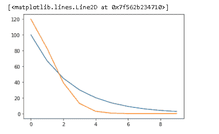

# 带有示例的 Adam 优化器 PyTorch

> 原文：<https://pythonguides.com/adam-optimizer-pytorch/>

[](https://sharepointsky.teachable.com/p/python-and-machine-learning-training-course)

在这个 [Python 教程](https://pythonguides.com/learn-python/)中，我们将学习Python 中的**亚当优化器 PyTorch** ，我们还将涵盖与亚当优化器相关的不同示例。此外，我们将涵盖这些主题。

*   亚当优化器 PyTorch
*   Adam 优化器 PyTorch 示例
*   Adam 优化器 PyTorch 代码
*   整流器 adam 优化器 pytorch
*   Adam 优化器 PyTorch 学习率
*   Adam 优化器 PyTorch 调度程序
*   Adam 优化程序 pytorch 重量衰减
*   Adam 优化器 PyTorch 更改学习率

目录

[](#)

*   [亚当优化器 PyTorch](#Adam_optimizer_PyTorch "Adam optimizer PyTorch")
*   [Adam 优化器 PyTorch 示例](#Adam_optimizer_PyTorch_example "Adam optimizer PyTorch example")
*   [亚当优化器 PyTorch 代码](#Adam_optimizer_PyTorch_code "Adam optimizer PyTorch code")
*   [修正的 Adam 优化器 PyTorch](#Rectified_Adam_optimizer_PyTorch "Rectified Adam optimizer PyTorch ")
*   [亚当优化器 PyTorch 学习率](#Adam_optimizer_PyTorch_learning_rate "Adam optimizer PyTorch learning rate")
*   [Adam 优化器 PyTorch 调度器](#Adam_optimizer_PyTorch_scheduler "Adam optimizer PyTorch scheduler")
*   [亚当优化器 PyTorch 重量衰减](#Adam_optimizer_PyTorch_weight_decay "Adam optimizer PyTorch weight decay ")
*   [Adam 优化器 PyTorch 改变学习率](#Adam_optimizer_PyTorch_change_learning_rate "Adam optimizer PyTorch change learning rate")

## 亚当优化器 PyTorch

在这一节中，我们将了解【adam optimizer PyTorch 如何在 Python 中工作。

*   在继续之前，我们将了解一下 **PyTorch 优化器**。优化器用于降低训练神经网络期间的错误率。
*   `Adam optimizer`被定义为用作梯度下降的替代优化器的过程。它对于包含大量数据的大型问题非常有效。
*   `Adam optimizer` 是用于训练神经网络的最广泛使用的优化器之一，也用于实际目的。

**语法:**

以下语法是 adam optimizer 的语法，用于降低错误率。

```py
toch.optim.Adam(params,lr=0.005,betas=(0.9,0.999),eps=1e-08,weight_decay=0,amsgrad=False)
```

此语法中使用的参数:

*   `Adam` 用作梯度下降优化器的替代。
*   **params:** 它被用作有助于优化的参数。
*   **lr :** 定义为学习率帮助优化器。
*   **beta:**用作计算梯度平均值的参数。
*   **eps:** 用于提高数值稳定性。
*   **weight_delay:** 用于将 l2 惩罚加到损失上，weight delay 默认值为 0。

## Adam 优化器 PyTorch 示例

在本节中，我们将学习 Python 中的 **Adam 优化器 PyTorch 示例**。

正如我们所知，Adam optimizer 被用作梯度下降的替代优化器，它对于包含大量数据的大型问题非常有效。

Adam optimizer 不需要很大的空间，它需要较少的内存空间，这是非常有效的。

**代码:**

在下面的代码中，我们将导入一些库，从中我们可以优化 adam 优化器的值。

*   `n = 100` 用作数据点数。
*   **x = torch.randn(n，1)** 用于生成随机数。
*   **t = a * x + b + (torch.randn(n，1) *误差)**用于学习目标值。
*   **优化器= optim。Adam(model.parameters()，lr=0.05)** 用于制作优化器。
*   **loss_fn = nn。ms loss()**用于定义损失。
*   **预测值=模型(x)** 用于预测模型的值
*   **loss = loss_fn(predictions，t)** 用于计算损失。

```py
import torch
from torch import nn
import torch.optim as optim
a = 2.4785694
b = 7.3256989
error = 0.1
n = 100 

**# Data**
x = torch.randn(n, 1)

t = a * x + b + (torch.randn(n, 1) * error)

model = nn.Linear(1, 1)
optimizer = optim.Adam(model.parameters(), lr=0.05)
loss_fn = nn.MSELoss()
 **# Run training**
niter = 10
for _ in range(0, niter):
	optimizer.zero_grad()
	predictions = model(x)
	loss = loss_fn(predictions, t)
	loss.backward()
	optimizer.step()

	print("-" * 10)
	print("learned a = {}".format(list(model.parameters())[0].data[0, 0]))
	print("learned b = {}".format(list(model.parameters())[1].data[0]))
```

**输出:**

运行上面的代码后，我们得到了下面的输出，其中我们可以看到参数的值被打印在屏幕上。


Adam optimizer PyTorch example

阅读:[Python 中的 Scikit 学的是什么](https://pythonguides.com/what-is-scikit-learn-in-python/)

## 亚当优化器 PyTorch 代码

在这一节中，我们将学习如何用 Python 实现 adam 优化器 PyTorch 代码。

Adam 优化器 PyTorch 用作梯度下降的优化技术。它需要最小的内存空间或有效地处理包含大量数据的大问题。

**代码:**

在下面的代码中，我们将导入一些库，梯度下降的优化技术就是从这些库中完成的。

*   **m _ dw _ corr = self . m _ dw/(1-selfβ1 * * t)**用作偏差校正。
*   **weight = weight–selfη*(m _ dw _ corr/(NP . sqrt(v _ dw _ corr)+selfε))**用于更新权重偏差。
*   **w_0，b0 = adam.updates(t，weight=w_0，b=b0，dw=dw，db=db)** 用于更新 weight 和 bias 值。
*   **print(' converged after '+str(t)+' iterations '))**用于在屏幕上打印迭代。

```py
import torch
import numpy as num
class AdamOptim():
    def __init__(self, eta=0.01, beta1=0.9, beta2=0.999, epsilon=1e-8):
        self.m_dw, self.v_dw = 0, 0
        self.m_db, self.v_db = 0, 0
        self.beta1 = beta1
        self.beta2 = beta2
        self.epsilon = epsilon
        self.eta = eta
    def updates(self, t, weight, b, dw, db):
        **## dw, db are from current minibatch
        #weights** 
        self.m_dw = self.beta1*self.m_dw + (1-self.beta1)*dw
        self.m_db = self.beta1*self.m_db + (1-self.beta1)*db

        **## rms beta 2**
        self.v_dw = self.beta2*self.v_dw + (1-self.beta2)*(dw**2)

        self.v_db = self.beta2*self.v_db + (1-self.beta2)*(db)

        m_dw_corr = self.m_dw/(1-self.beta1**t)
        m_db_corr = self.m_db/(1-self.beta1**t)
        v_dw_corr = self.v_dw/(1-self.beta2**t)
        v_db_corr = self.v_db/(1-self.beta2**t)

        weight = weight - self.eta*(m_dw_corr/(np.sqrt(v_dw_corr)+self.epsilon))
        b = b - self.eta*(m_db_corr/(np.sqrt(v_db_corr)+self.epsilon))
        return weight, b
def lossfunction(m):
       return m**2-2*m+1
**## take derivative** 
def gradfunction(m):
    return 2*m-2
def checkconvergence(w0, w1):
    return (w0 == w1)
w_0 = 0
b0 = 0
adam = AdamOptim()
t = 1 
converged = False

while not converged:
    dw = gradfunction(w_0)
    db = gradfunction(b0)
    w_0_old = w_0
    w_0, b0 = adam.updates(t,weight=w_0, b=b0, dw=dw, db=db)
    if checkconvergence(w_0, w_0_old):
        print('converged after '+str(t)+' iterations')
        break
    else:
        print('iteration '+str(t)+': weight='+str(w_0))
        t+=1
```

**输出:**

在运行上面的代码之后，我们得到了下面的输出，其中我们可以看到屏幕上打印了带有权重的迭代次数。


Adam optimizer PyTorch code

阅读:[Python 中的 tensor flow](https://pythonguides.com/tensorflow/)

## 修正的 Adam 优化器 PyTorch

在本节中，我们将学习 python 中的**修正 adam 优化器 PyTorch** 。

*   修正的 Adam 优化器 Pytorch 是 Adam 优化器的替代方案，旨在解决 Adam 收敛性差的问题。
*   它还用于校正自适应学习率的变化。

**语法:**

以下语法是 RAdam optimizer 的语法，用于解决 Adam 的收敛性差的问题。

```py
torch.optim.RAdam(params,lr=0.001,betas=(0.9,0.999),eps=1e-08,weight_decay=0)
```

**上述语法中使用的参数:**

*   RAdam: RAdam 或者我们可以说，修正的 Adam 是 Adam 的替代方案，它可以解决 Adam 的收敛性差的问题。
*   params:它被用作一个有助于优化的参数。
*   lr:定义为学习率。
*   betas:它用作计算梯度平均值的参数。
*   eps:用于提高数值稳定性。
*   weight_decay:用于将 l2 惩罚加到损失上，权重延迟的默认值为 0。

阅读: [PyTorch 预训练模型](https://pythonguides.com/pytorch-pretrained-model/)

## 亚当优化器 PyTorch 学习率

在本节中，我们将了解【Adam 优化器 PyTorch 学习率如何在 python 中工作。

Adam optimizer Pytorch 学习率算法被定义为正确绘制用于训练深度神经网络的过程。

**代码:**

在下面的代码中，我们将导入一些库，从中获得 Adam 优化器的精确学习率。

*   **optimizer = torch . optim . Adam(model . parameters()、lr=100)** 用于优化模型的学习速率。
*   **scheduler = torch . optim . lr _ scheduler。λlr(optimizer，lr _ lambda =λ1)**用于调度优化器。
*   **LRS . append(optimizer s . param _ groups[0][" lr "])**用于将优化器追加到参数组中。
*   **plot.plot(range(10)，lrs)** 用于绘制图形。

```py
import numpy as num 
import pandas as pds 
import torch
import matplotlib.pyplot as plot
model = torch.nn.Linear(4, 3)
optimizers = torch.optim.Adam(model.parameters(), lr=100)
lambda1 = lambda epoch: 0.67 ** epoch
scheduler = torch.optim.lr_scheduler.LambdaLR(optimizers, lr_lambda=lambda1)

lrs = []

for i in range(10):
    optimizers.step()
    lrs.append(optimizers.param_groups[0]["lr"])

    scheduler.step()

plot.plot(range(10),lrs)
```

**输出:**

运行上面的代码后，我们得到下面的输出，其中我们可以看到 Adam optimizer 的学习率绘制在屏幕上。


Adam optimizer Pytorch learning rate

阅读:[Scikit-learn Vs tensor flow–详细对比](https://pythonguides.com/scikit-learn-vs-tensorflow/)

## Adam 优化器 PyTorch 调度器

在这一节中，我们将学习如何用 python 实现`Adam optimizer py torch scheduler`。

Adam optimizer PyTorch 调度程序被定义为一个用于在单独的参数组中调度数据的进程。

**代码:**

在下面的代码中，我们将导入一些库，从中我们可以调度 adam optimizer 调度程序。

*   **models = torch.nn.Linear(6，5)** 用于创建单层前馈网络。
*   **optimizer = torch . optim . Adam(models . parameters()、lr=100)** 用于优化模型。
*   **scheduler = torch . optim . lr _ scheduler。**用于创建调度程序。
*   **plot.plot(range(10)，lrs)** 用于绘制图形。

```py
import numpy as num
import pandas as pds 
import torch
import matplotlib.pyplot as plot
models = torch.nn.Linear(6, 5)
optimizers = torch.optim.Adam(models.parameters(), lr=100)
lmbda = lambda epoch: 0.69 ** epoch
scheduler = torch.optim.lr_scheduler.MultiplicativeLR(optimizers, lr_lambda=lmbda)
lrs = []

for i in range(10):
    optimizers.step()
    lrs.append(optimizers.param_groups[0]["lr"])

    scheduler.step()

plot.plot(range(10),lrs)
```

**输出:**

运行上面的代码后，我们得到了下面的输出，其中我们可以看到 Ada，优化器 Pytorch 计划绘制在屏幕上。


Adam optimizer PyTorch scheduler

阅读: [PyTorch nn 线性+例题](https://pythonguides.com/pytorch-nn-linear/)

## 亚当优化器 PyTorch 重量衰减

在本节中，我们将学习 python 中的 Adam 优化器 PyTorch 权重衰减。

*   Adam optimizer PyTorch 权重衰减用于定义一个过程，通过简单地添加一些惩罚(通常是权重的 l2 范数)来计算损失。
*   权重衰减也被定义为向损失添加 l2 正则化项。
*   PyTorch 将重量衰减应用于重量和基础。
*   损耗=损耗+权重系数*l2 范数的权重

语法:

以下语法是 Adam 优化器的语法，它用于降低误差率，我们也可以使用权重衰减，它用于将 l2 正则化项添加到损失中。

权重衰减的默认值为 0。

```py
toch.optim.Adam(params,lr=0.005,betas=(0.9,0.999),eps=1e-08,weight_decay=0,amsgrad=False)
```

**参数:**

*   **params:**params 函数用作帮助优化的参数。
*   **beta:**用于计算梯度的平均值。
*   **权重衰减:**权重衰减用于将 l2 正则化添加到损失中。

## Adam 优化器 PyTorch 改变学习率

在本节中，我们将学习 python 中的 Adam 优化器 PyTorch 变化学习率。

Adam optimizer py torch change learning 被定义为主要用于训练深度神经网络的可调学习速率。

**代码:**

在下面的代码中，我们将导入一些库，从中我们可以改变 adam 优化器的学习率。

*   **optimizer = torch . optim . Adam(model . parameters()，lr=100)** 用于优化 Adam 优化器模型，同时给出学习率。
*   **scheduler = torch . optim . lr _ scheduler。λlr(optimizer，lr _ lambda =λ1)**用于调度优化器。
*   **plot.plot(range(10)，lrs)** 用于在屏幕上绘制图形。

```py
import numpy as num 
import pandas as pds 
import torch
import matplotlib.pyplot as plot
model = torch.nn.Linear(4, 3)
optimizers = torch.optim.Adam(model.parameters(), lr=100)
lambda1 = lambda epoch: 0.67 ** epoch
scheduler = torch.optim.lr_scheduler.LambdaLR(optimizers, lr_lambda=lambda1)

lrs = []

for i in range(10):
    optimizers.step()
    lrs.append(optimizers.param_groups[0]["lr"])

    scheduler.step()

plot.plot(range(10),lrs)
optimizers = torch.optim.Adam(models.parameters(), lr=120)
lmbda = lambda epoch: 0.69 ** epoch
scheduler = torch.optim.lr_scheduler.MultiplicativeLR(optimizers, lr_lambda=lmbda)
lrs = []

for i in range(10):
    optimizers.step()
    lrs.append(optimizers.param_groups[0]["lr"])

    scheduler.step()

plot.plot(range(10),lrs)
```

**输出:**

运行上述代码后，我们得到以下输出，其中我们可以看到屏幕上绘制了 Adam optimizer 更改学习率图。



Adam Optimizer PyTorch Change Learning Rate

因此，在本教程中，我们讨论了 **Adam 优化 PyTorch** ，并且我们还讨论了与其实现相关的不同示例。这是我们已经讨论过的例子列表。

*   亚当优化器 PyTorch
*   Adam 优化器 PyTorch 示例
*   Adam 优化器 PyTorch 代码
*   整流器 adam 优化器 pytorch
*   Adam 优化器 PyTorch 学习率
*   Adam 优化器 PyTorch 调度程序
*   Adam 优化程序 pytorch 重量衰减
*   Adam 优化器 PyTorch 更改学习率

[Bijay Kumar](https://pythonguides.com/author/fewlines4biju/)

Python 是美国最流行的语言之一。我从事 Python 工作已经有很长时间了，我在与 Tkinter、Pandas、NumPy、Turtle、Django、Matplotlib、Tensorflow、Scipy、Scikit-Learn 等各种库合作方面拥有专业知识。我有与美国、加拿大、英国、澳大利亚、新西兰等国家的各种客户合作的经验。查看我的个人资料。

[enjoysharepoint.com/](https://enjoysharepoint.com/)[](https://www.facebook.com/fewlines4biju "Facebook")[](https://www.linkedin.com/in/fewlines4biju/ "Linkedin")[](https://twitter.com/fewlines4biju "Twitter")