# 如何在 Python Pandas 中向数据帧添加列

> 原文：<https://pythonguides.com/add-a-column-to-a-dataframe-in-python-pandas/>

[](https://sharepointsky.teachable.com/p/python-and-machine-learning-training-course)

在这个 [Python Pandas 教程](https://pythonguides.com/pandas-in-python/)中，我们将学习**如何在 Python Pandas** 中给数据帧添加一列。这里我们将看到一些关于在 pandas 中添加列数据帧的例子。

*   在 Python Pandas 中向数据帧添加列
*   用默认值向数据框熊猫添加一列
*   向列表中的数据框熊猫添加一列
*   向带有索引的数据框熊猫添加列
*   在数据框中添加一列，忽略索引
*   根据条件向数据框熊猫添加一列
*   向 numpy 数组中的 dataframe pandas 添加一列
*   从另一个数据框架添加列熊猫
*   在数据帧熊猫的开头添加一列
*   在 Python Pandas 中向数据帧添加列
*   使用相同的值向 Python 中的数据帧添加一列
*   向数据帧添加列名熊猫
*   基于 if-else 条件向 Pandas 数据框架添加一列
*   从一个数据框架向另一个数据框架添加一列

所有使用的数据集要么是自己创建的，要么是从 Kaggle 下载的。此外，我们已经讨论了这些主题。

目录

[](#)

*   [在 Python Pandas 中给数据帧添加一列](#Add_a_Column_to_a_DataFrame_in_Python_Pandas "Add a Column to a DataFrame in Python Pandas")
    *   [使用赋值操作符](#Add_a_column_to_a_dataframe_in_python_pandas_using_an_Assignment_operator "Add a column to a dataframe in python pandas using an Assignment operator")向 python pandas 中的数据帧添加一列
    *   [使用 assign()方法向 python pandas 中的数据帧添加一列](#Add_a_column_to_a_dataframe_in_python_pandas_using_the_assign_method "Add a column to a dataframe in python pandas using the assign() method")
    *   [使用 insert()方法向 python pandas 中的数据帧添加一列](#Add_a_column_to_a_dataframe_in_python_pandas_using_the_insert_method "Add a column to a dataframe in python pandas using the insert() method")
*   [用默认值](#Add_a_column_to_dataframe_pandas_with_a_default_value "Add a column to dataframe pandas with a default value")向数据帧熊猫添加一列
*   [从列表中添加一列到数据框熊猫](#Add_a_column_to_dataframe_pandas_from_the_list "Add a column to dataframe pandas from the list")
*   [用索引](#Add_a_column_to_dataframe_pandas_with_an_index "Add a column to dataframe pandas with an index")给数据框熊猫添加一列
    *   [使用 insert()方法向数据帧 pandas 添加一列索引](#Add_a_column_to_dataframe_pandas_with_an_index_using_the_insert_method "Add a column to dataframe pandas with an index using the insert() method")
    *   [使用 reindex()方法向数据帧 pandas 添加一列索引](#Add_a_column_to_dataframe_pandas_with_an_index_using_reindex_method "Add a column to dataframe pandas with an index using reindex() method")
*   [在数据帧中添加一列熊猫忽略索引](#Add_a_column_to_the_dataframe_pandas_ignore_the_index "Add a column to the dataframe pandas ignore the index")
*   [根据条件](#Add_a_column_to_dataframe_pandas_based_on_the_condition "Add a column to dataframe pandas based on the condition")向数据框熊猫添加一列
    *   [根据条件添加一列](#Add_a_column_based_on_a_condition "Add a column based on a condition")
    *   [添加一列，并根据条件](#Add_a_column_and_fill_the_rows_based_on_the_condition "Add a column and fill the rows based on the condition")填充行
*   [向 numpy 数组中的 dataframe pandas 添加一列](#Add_a_column_to_dataframe_pandas_from_the_numpy_array "Add a column to dataframe pandas from the numpy array")
*   [从另一个数据框中添加一列熊猫](#Add_a_column_from_another_dataframe_pandas "Add a column from another dataframe pandas")
*   [在数据帧的开头添加一列熊猫](#Add_a_column_at_the_beginning_of_the_dataframe_pandas "Add a column at the beginning of the dataframe pandas")
*   [在 Python Pandas 中给数据帧添加一列](#Add_a_Column_to_a_DataFrame_in_Python_Pandas-2 "Add a Column to a DataFrame in Python Pandas")
*   [用相同的值](#Add_a_Column_to_a_DataFrame_in_Python_With_the_Same_Value "Add a Column to a DataFrame in Python With the Same Value")在 Python 中向数据帧添加一列
*   [给数据帧添加列名熊猫](#Add_a_Column_Name_to_a_DataFrame_Pandas "Add a Column Name to a DataFrame Pandas")
*   [在 Pandas](#Add_An_Empty_Column_to_a_DataFrame_in_Pandas "Add An Empty Column to a DataFrame in Pandas") 中给数据帧添加一个空列
*   [根据 if-else 条件向 Pandas 数据框架添加一列](#Add_a_Column_to_a_Pandas_DataFrame_Based_on_an_if-else_Condition "Add a Column to a Pandas DataFrame Based on an if-else Condition")
*   从另一个数据框架中添加一列到另一个数据框架中

## 在 Python Pandas 中给数据帧添加一列

Python 是一种流行的编程语言，由荷兰程序员吉多·范·罗苏姆开发。Pandas 是一个机器学习库，用于读取、清理、分析和导出数据集。

在美国，像亚马逊、特斯拉、谷歌、微软等受欢迎的公司使用机器学习和 python 来理解数据，并创造出一种产品，使这个世界变得更美好。

想学习如何在 python pandas 中向数据帧添加列吗？在 python pandas 中，有三种向数据帧添加列的流行方法

1.  **赋值运算符**
2.  **赋值()**
3.  **插入()**

现在我们知道了在 python pandas 中向数据帧添加列的方法。让我们来详细探讨其中的每一个。

### 使用赋值操作符向 python pandas 中的数据帧添加一列

在 python pandas 中向数据帧添加列的最简单方法是使用赋值操作符。提到 dataframe 的名称，然后是括号内的新列名，等于操作符，然后是列的值。

如果您要在已经有一些数据的数据帧中添加一列，那么这些信息将使您避免出现错误:–

1.  为新列设置默认值，以便被占用的行具有相同的值。
2.  在为新列传递一个值列表时，确保它与其他数据具有相同的行数，否则 pandas 将抛出一个值错误。

```py
ValueError: Length of values does not match length of index 
```

该图显示了添加新列的正确方法。性别是这里的新栏目。

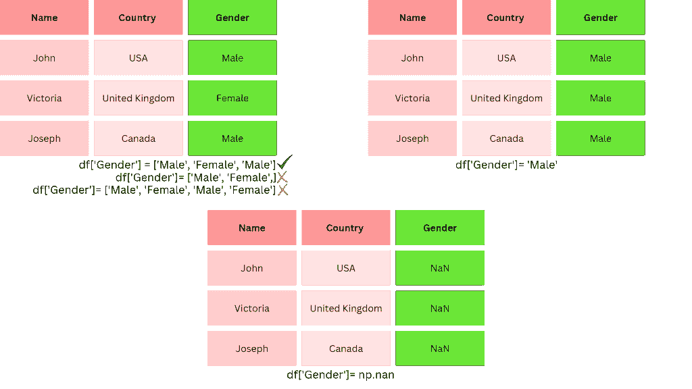

**语法:–**下面的语法展示了如何在 python pandas 中向 dataframe 添加单个和多个列。

```py
**# add single data**
dataframe[new_column] = 'Value'

**# add multiple data**
dataframe[new_column0, new_column1, new_column2] = [val1, val2, val3]
```

**参数描述:–**

*   熊猫数据框，可以是任何名字。
*   **新列**–新列，可以是任何名称
*   **值**–任意数据类型(整数、字符串等)的值。)

现在我们已经了解了如何使用赋值操作符(=)在 python pandas 中添加 dataframe。下面我以一个例子的形式实现了这些知识。

**示例:**–在下面的示例中，我使用的是美国著名洗车公司的数据集。该公司希望在数据框架中添加新列。这些新列是:-

*   性别
*   街道
*   状态
*   国家
*   邮政区码

下图显示了 python 熊猫数据帧的当前快照。

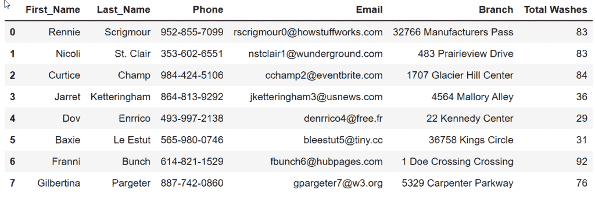

Carwash dataset of USA company

我已经在数据框中添加了一个单独的性别列，并且我已经将默认值设置为“男性”。可选默认值可以是–缺少值(nan)、无、空字符串(“”)或索引长度的值列表。

```py
**# add a Gender column to the dataframe**
carwash_df['Gender'] = 'Male'
```

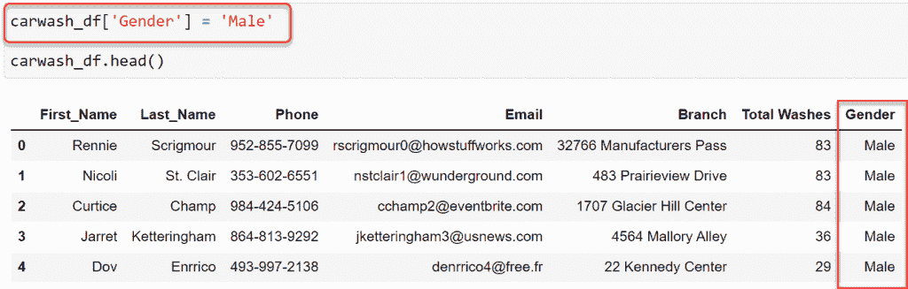

Add a column to a dataframe in python

这一次，我向 dataframe 添加了多个列，并分配了默认值，如下所示:

*   街道-7500 锯木厂 Pkwy
*   州-俄亥俄州
*   国家——美国
*   邮政编码–43065

这些列的每个索引将具有相同的值，或者，我可以为相同长度的索引提供空值或值列表。

```py
**# add Multiple columns to the dataframe**
carwash_df[['Street', 'State', 'Country', 'Zip code']] = ['7500 Sawmill Pkwy', 'Ohio', 'United States', 43065]
```

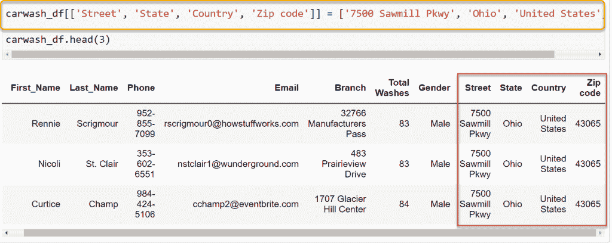

### 使用 assign()方法向 python pandas 中的数据帧添加一列

python pandas 中的 **assign()方法用于创建一个新列，其中包含从现有列中派生的修改后的值。当需要从一个 dataframe 向另一个 panda 添加一列时，这很有用。**

**语法:–**下面是在 python pandas 中使用 assign()方法向数据帧添加列的语法。

```py
dataframe.assign(**kwargs)
```

这里，**kwargs 是新的数据帧名称或新的列名称，它可以有 n 个值。

### 使用 insert()方法向 python pandas 中的数据帧添加一列

python pandas 中的 **insert()方法允许在特定索引或位置向数据帧添加列。**

**语法:–**该语法用于 python pandas 中的 insert()方法，用于在 python pandas 中将列添加到数据帧中。

```py
carwash_df.insert(
    `loc`: int val,
    `column`: column_name,
    `value`: single or list of values,
    `allow_duplicates`: = True/False,
)
```

**参数描述:**--

*   `loc`–接受整数值，并定义数据帧中列的位置。
*   **列**–要添加的列名
*   **值**–可以传递单个值或值列表
*   `allow _ duplicates`–如果设置为 False，pandas 将不允许创建已经存在于 dataframe 中的列。

## 用默认值向数据帧熊猫添加一列

熊猫数据框中的默认值会自动在记录中输入一个值。在下列情况下，这很有帮助:

*   您想要添加新列，但新列的值长度不足以匹配现有数据帧的索引长度
*   对于列中的布尔条目，将 True 设置为默认值将完成一半的工作，反之亦然。
*   它总是有一个值，而不是缺少值。默认值可以简化数据清理过程。

我在上一节解释了如何在 python pandas 中添加列。我们将使用这些知识在 dataframe pandas 中添加一个带有默认值的列。

想学习如何给数据框熊猫添加一列默认值吗？阅读完整博客。

**示例:–**在这个示例中，我在 carwash 数据框架中创建了一个新的列 Country，并将默认值指定为“美国”。

```py
carwash_df['Country'] = 'United States'
```

洗车数据框中的所有行将自动填入相同的美国。下图显示了如何向 dataframe 添加列的输出。

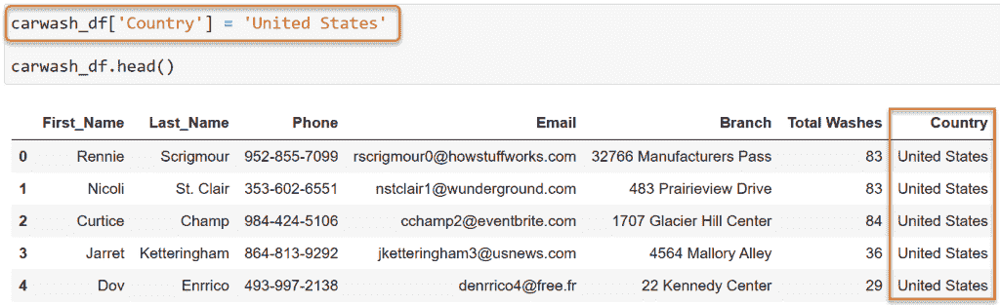

Add a column to dataframe pandas with a default value

默认值不仅限于字符串，您也可以设置整数默认值。在下面的例子中，我在熊猫数据帧中添加了纬度和经度的默认值。

请注意，我已经演示了在 dataframe 中添加多个列，默认值为 integer 数据类型。

```py
carwash_df[['Latitude', 'Longitude']] = ['40.194082', '-83.097631']
```

这个例子是不现实的，因为洗车公司的所有分支机构都在美国和国外的不同地点。但是适合解释如何在 pandas 数据帧中添加具有默认值的列。

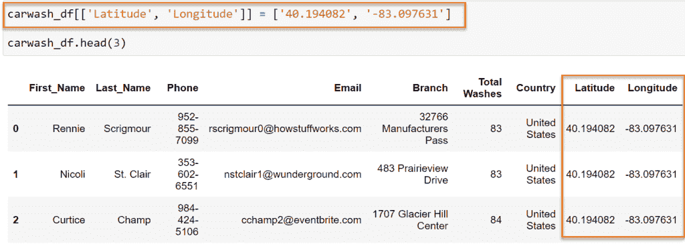

Add a column to dataframe pandas with a default

至此，我已经解释了如何向 dataframe pandas 添加一个带有默认值的列。

## 从列表中添加一列到数据框熊猫

Pandas 是一个数据分析库，它提供了各种各样的操作。在这一节中，我们将向您展示如何从列表中添加一个列到 dataframe pandas。

python 中的列表是项目的集合，它可以是相同或不同数据类型的同质或异质数据。

互联网上的大多数回答都与从列表中添加列到数据框有关，他们创建了一个值列表，然后用新的列名传递该列表，如下所示。

```py
**# list of values**
USA_states_list = ['Alabama', 'Alaska', 'Arizona', 'Arkansas','Connecticut', 'Colorado']

**# create new column with the name states**
df['States'] = USA_states_list 
```

这样,“州”这一新列中添加了值——阿拉巴马州、阿拉斯加州、亚利桑那州、阿肯色州、康涅狄格州和科罗拉多州。这可能看起来是正确的，但并不能证明这个要求是正确的。

我对语句–*Add a column to data frame pandas from list*的理解是，我必须从给定的列名列表中创建多个列。

**示例:–**假设我有一个列名列表，如下所示，我必须使用它在 python pandas 中创建一个数据帧。

```py
**# List of column names**
col_list = ['Company', 'State', 'Country', 'Zip code' ]
```

我将把列名列表放入循环中，然后在 python pandas 中的 dataframe 中添加一列。

```py
**# create empty dataframe**
company_loc = pd.DataFrame({})

**# list of columns**
col_list = ['Company', 'State', 'Country', 'Zip code' ]

**# add columns from list**
for i in col_list:
    company_loc[i]=None

**# Result**
company_loc
```

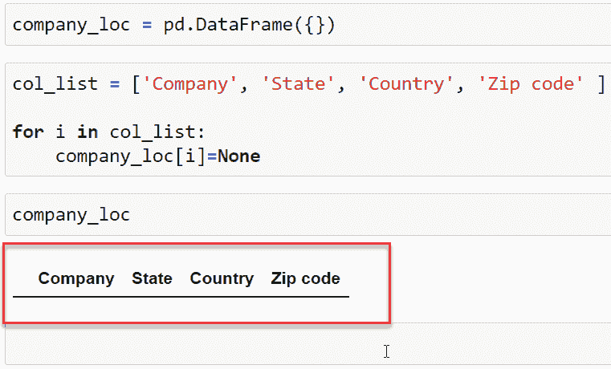

Add a column to dataframe pandas from the list

有各种有效的方法可以给数据框添加多列，比如使用 assign()、insert()等。，但是因为我使用了一个列表，所以这是实现它的方法。

## 用索引给数据框熊猫添加一列

熊猫中的索引描述了行或列的位置。默认情况下，它从 0 开始，一直到最后一列或最后一行。在 pandas 中，axis =1 表示列，axis=0 表示行。

在这一节中，我已经解释了如何向带有索引的 dataframe pandas 添加一列。因此，有两个内置的函数，我们可以使用它。

*   Insert()方法
*   Reindex()方法

### 使用 insert()方法向数据帧 pandas 添加一列索引

Python pandas 提供了一个 `insert()` 方法，用于将一列添加到 dataframe 上的特定位置。此方法主要用于在 dataframe 中创建新列。

**语法:–**下面是在 python pandas 中使用 insert()方法的语法。

```py
dataframe.insert(
    `loc`: integer value,
    `column`: col name,
    `value`: value,
    `allow_duplicates`: False/True,
)
```

**参数描述:**

*   `loc` :你要添加新列的具体位置，它接受整数值。
*   **列**:在此命名新列
*   **value:** 提供列中的值，该值可以是一个标量或数组。
*   `allow_duplicate` :如果该参数设置为 True，则可以创建同名的列。

**举例:–**

我已经添加了一个新的列*分支代码*，并将其放置在数据帧中的索引 2 处。对于值，我已经创建了一个循环，它将继续在每一列中插入递增的值。

如果我不确定 dataframe 中的行数，那么我使用 python pandas 中的 `shape` 属性来检查它。

```py
**# insert new column at index 2**
carwash_df.insert(
    loc=2,
    column='Branch Code',
    value=[i for i in range(1000, 2000)]
)

**# display result**
carwash_df.head(3)
```

在下图中，一个新列–*分支代码*被添加到索引 2 处的数据帧中。默认情况下，新列会添加到现有列的末尾。

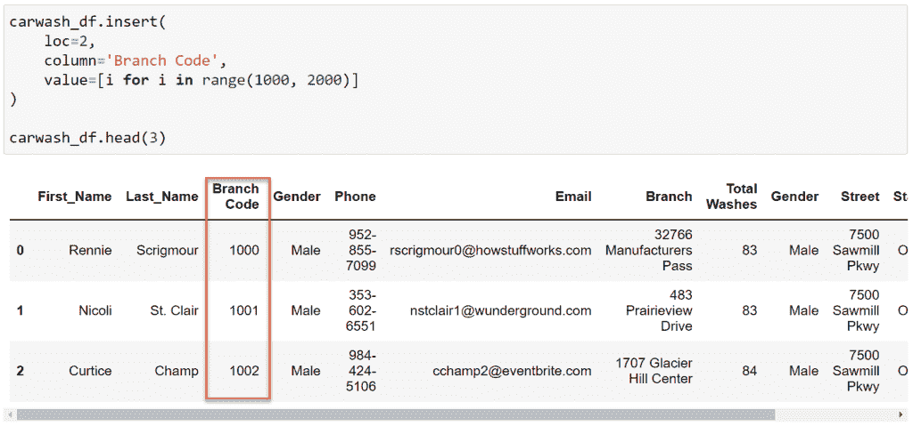

### 使用 reindex()方法向数据帧 pandas 添加一列索引

Python pandas 提供了 *reindex()* 方法，以便现有索引可以在 pandas 数据帧中重新定位。在上一节中，我创建了一个新的列——分行代码。这里，我将把它的位置移到分支地址旁边，即 index=7。

**语法:–**下面是在 python pandas 中实现 *reindex()* 方法的语法。语法有更多的参数，但是我只展示了这个任务所必需的参数。

```py
dataframe.reindex(`columns`=None)
```

**参数描述:**--

*   **列** =传递位置发生变化的列的列表。

**举例:–**

在这个例子中，我将把*分支代码*列的值从索引 2 重新定位到索引 7，以便它出现在 pandas 数据帧中的分支地址旁边。

## 在数据帧中添加一列熊猫忽略索引

在为一个任务准备一个数据帧时，我必须将多个数据帧中的数据连接起来。因此，索引值看起来不均匀，如下图所示。

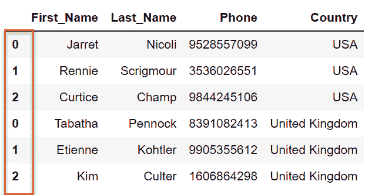

Uneven index in the pandas dataframe

为了解决这个问题，我在 pandas 数据帧中将 ignore_index 参数设置为 True。该参数可用于各种方法，如 concat、append、assign 等。

除此之外，在 python pandas 中使用 `assign()` 方法时，索引会被忽略，因此这是另一个向数据帧添加列的好方法。

**示例 1:** 在下面的示例中，我有两个数据帧，当它们组合在一起时，索引是不均匀的，因此为了解决这个问题，我在 python pandas 中将 `ignore_index` 参数的值设置为 True。

```py
**# sample dataframes**
df1 = pd.DataFrame({
    'First_Name': ['Jarret', 'Rennie', 'Curtice'],
    'Last_Name': ['Nicoli', 'Scrigmour', 'Champ'], 
    'Phone': [9528557099, 3536026551, 9844245106],
    'Country': 'USA'
})

df2 = pd.DataFrame({
    'First_Name': ['Tabatha', 'Etienne', 'Kim'],
    'Last_Name': ['Pennock', 'Kohtler', 'Culter'], 
    'Phone': [8391082413, 9905355612, 1606864298],
    'Country': 'United Kingdom'
})
```

我已经展示了如何使用 concat。同样，它也可以用其他函数来完成。

```py
pd.concat([df1, df2], `ignore_index`=True)
```

在下面的输出中，使用 python pandas 中的 ignore index 参数后，索引按正确的顺序组织。

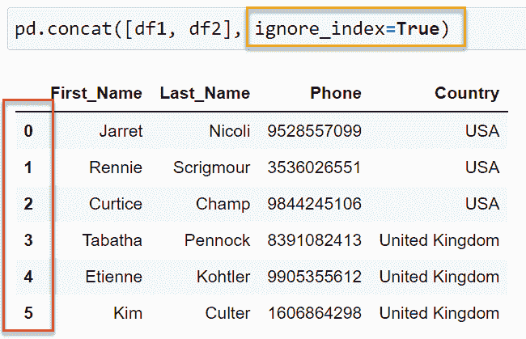

Add a column to the dataframe python pandas ignore the index

**示例 1:** 这是另一个使用 `assign()` 方法向数据帧添加一列的示例。

```py
**#data**
first_name = pd.Series(['Tabatha', 'Etienne', 'Kim', 'Bidget', 'Hannie', 'Esme'])
last_name = pd.Series(['Pennock', 'Kohtler', 'Culter', 'Stivens', 'Treslove', 'Eastbrook'])
country = pd.Series(['USA', 'USA', 'USA', 'USA', 'USA','USA'])

**# add a column with assign()**
df.assign(
    First_Name=first_name.values,
    Last_Name=last_name.values,
    Country=country.values
) 
```

assign()方法覆盖了以前的信息，并添加了一个包含下面提到的详细信息的新列。

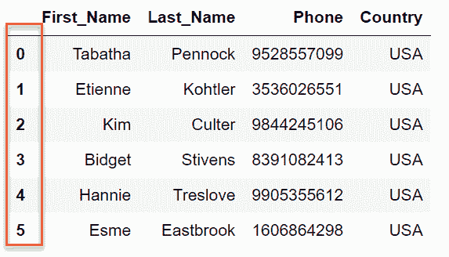

Add a column to the dataframe and ignore the index

这样，我已经解释了如何在 python pandas 中向 dataframe 添加一列并忽略索引。

## 根据条件向数据框熊猫添加一列

如果你想知道如何根据条件在 dataframe pandas 中添加一列，那么请阅读整个博客，因为我在这里已经涵盖了所有相关的要点。

*根据条件*向数据帧熊猫添加一列在这里有两种含义:-

*   基于条件添加列。
*   添加一列并根据条件填充行。

### 根据条件添加一列

在这里，我将展示如何在数据帧中创建一个符合某些条件的列。根据用户的要求，可能有 n 种条件，其中很少是:-

*   如果数据帧有名字和姓氏列，则添加一列–*全名*
*   如果超过 3 列的数据类型为 int，则添加一列以计算平均值。

可能有更多的场景，但我将在我的例子中使用第一个场景。

**示例 1:** 该函数将检查数据帧中是否存在名字和姓氏列。如果是，那么将在数据框架中创建一个新列*全名*。

|  | **名字** | **姓氏** | **邮政编码** | **国家** |
| Zero | 柯蒂斯 | 咀嚼 | Ninety-nine thousand nine hundred and fifty | 美利坚合众国 |
| one | 塔巴塔 | Pennock | 00501 | 美利坚合众国 |
| Two | 艾蒂安 | 科勒 | Thirty-three thousand six hundred and one | 美利坚合众国 |
| three | 金姆（人名） | 库特 | Ten thousand and four | 美利坚合众国 |

Python Pandas Dataframe

```py
**# pointer is increamented by 1 if condition is True**
pointer = 0

if 'First_Name' in df.columns:
    pointer +=1

if 'Last_Name' in df.columns:
    pointer +=1

**# if the value of pointer is 2 then full name column will be added**
if pointer == 2:
    df['FullName'] = df.First_Name +' '+ df.Last_Name 
```

在下面的输出中，全名列被添加到 pandas 数据帧中。这个新列在 python pandas 中将用户的名和姓连接在一起。

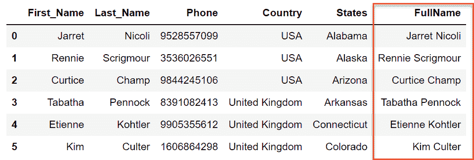

Add a column based on a condition in pandas

### 添加一列，并根据条件填充行

在这一节中，我解释了如何添加一列并根据条件填充行。我将设置一个条件，如果它符合条件，那么将添加一个新列，其中包含基于该条件的值。

这听起来可能与上一个相似，但是这里只关注创建一个列，这里关注的是列的值。

**示例:–**在这个示例中，我将创建一个作物及其所需温度的数据框架。根据条件，温度进一步分为热、中等或低。

|  | **温度** | **裁剪** |
| Zero | 28.300415 | 绿豆 |
| one | 26.736908 | 西瓜 |
| Two | 24.443455 | 米饭 |
| three | 24.247796 | 石榴 |
| four | 26.335449 | 香蕉 |
| five | 36.750875 | 鸽子豌豆 |
| six | 41.656030 | 葡萄 |
| seven | 18.283622 | 玉米 |
| eight | 18.782263 | 云豆 |

The temperature required to grow crops

## 向 numpy 数组中的 dataframe pandas 添加一列

Numpy 是一个用于处理数组的 python 库。使用 NumPy 创建的数组比用 python 创建的更快更有效。在这一节中，我们将学习如何从 NumPy 数组向 dataframe pandas 添加一列。

在下面的数据集中，我们将使用 python 中的 [NumPy 数组添加一个新列–*邮政编码* e。](https://pythonguides.com/python-numpy-array/)

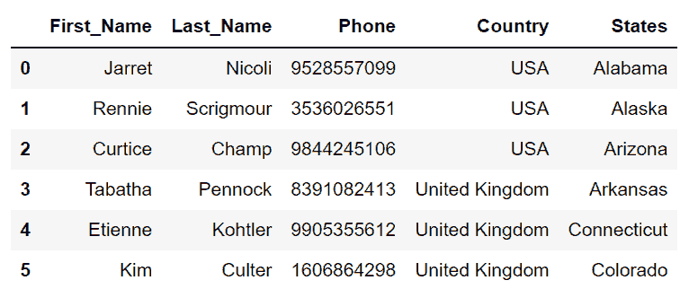

Add a column to dataframe pandas from the numpy array

从 numpy 数组向 dataframe pandas 添加列有多种方法，下面用 python 演示了其中一种方法。

```py
**# array of data**
postal_code = np.array([99950, 33601, 10004, 97290, 96898, 20108])

**# add a new column**
df['Postal_Code'] = postal_code 

**# print dataframe**
df
```

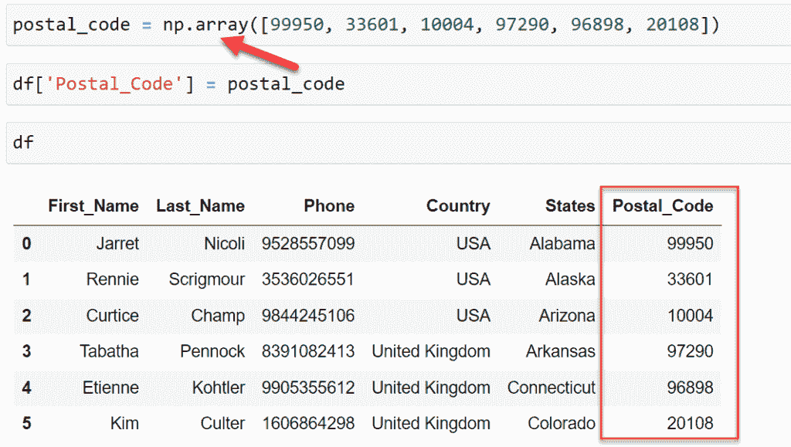

Add a column to dataframe pandas from the np array

在这一节中，我们学习了如何从 numpy 数组向 dataframe pandas 添加一列。

## 从另一个数据框中添加一列熊猫

在处理熊猫数据帧时，我在数据集中创建了多个数据帧。其中一些是有目的的，另一些是为实验复制一个数据集。在 pandas 中，从一个数据帧向另一个数据帧添加列是一项常见的活动。

你想学习如何在 pandas 中从一个数据框架添加一列到另一个数据框架吗？阅读完整博客。

在我的例子中，我有 df1 和 df2，其中 df1 是主数据集，我将在 python pandas 中从 df2 向 df1 添加*is scaled*列。

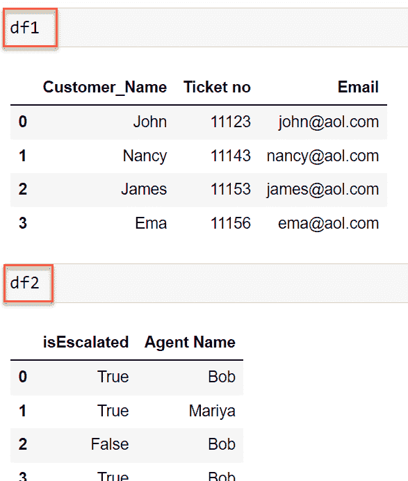

Add a column from another dataframe panda

```py
**# using insert**
df1.insert(loc=1, column='IsEscalated', value=df2['isEscalated'])
```

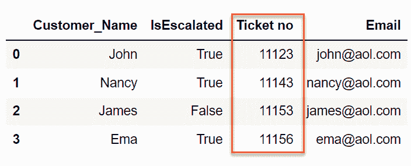

Add column from one dataframe to other pandas

```py
**# using join**
df1.join(df2['isEscalated']) 
```

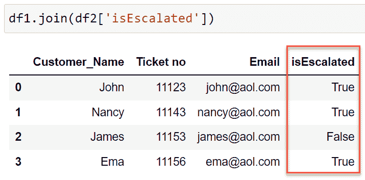

Add a column from another dataframe panda

## 在数据帧的开头添加一列熊猫

Python pandas 提供了一个 *insert()* 方法，使用该方法可以在 pandas 数据帧中的特定位置添加列。我已经在这个博客的不同地方解释了 insert。

在下面的例子中，我在 python pandas 中添加了一个名为 *serial* 的新列。提供 loc=0 将在 python pandas 中的 dataframe 的开头添加新列。

```py
df1.insert(loc=0, column='Serial', value=df1.index)
```

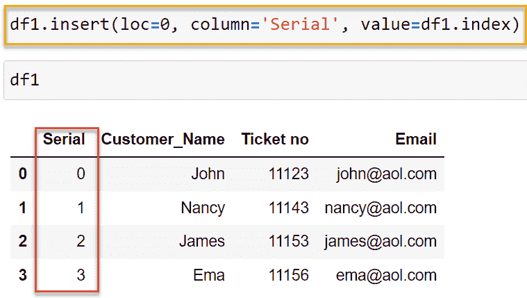

Add a column at the beginning of the dataframe pandas

## 在 Python Pandas 中给数据帧添加一列

在这一节中，我们将学习如何在 Python Pandas 中向数据帧添加列。

*   在 Python Pandas 中处理数据集时，创建和删除列是一个活动的过程。添加包含新数据的新列，删除不需要的列。
*   可以通过三种方式在现有数据框架中添加列。
    *   dataframe.assign()
    *   dataframe.insert()
    *   dataframe['新列'] =值
*   在 dataframe.assign()方法中，我们必须传递新列的名称及其值。如果只提供了一个值，那么它将被分配给整个数据集。如果提供了一个值列表，那么它将被相应地分配。
*   在 `dataframe.insert()` 方法中，用户必须提供插入列的位置、列名、列值以及是否允许重复的布尔值。
*   第三个选项是不言自明的，你也可以阅读 Jupyter 笔记本上的注释来理解每一步。
*   请注意，如果您提供的是值列表，则总值必须等于行数。