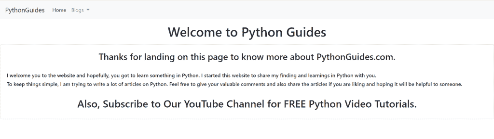

# 如何在 Django 中添加下拉导航条

> 原文：<https://pythonguides.com/add-dropdown-navbar-in-django/>

[](https://sharepointsky.teachable.com/p/python-and-machine-learning-training-course)

在这个 [Python Django 教程](https://pythonguides.com/what-is-python-django/)中，我将解释**如何用简单的步骤在 Django** 中添加下拉导航条。

最近，我一直在使用 Django 框架为 PythonGuides 创建一个网站。我需要一个带有下拉菜单的导航栏来添加博客类别。

所以，我做了一些研究，用 Django 在网站中添加了一个带有下拉菜单的导航条，如下所示。



Add Dropdown navbar in Django

在这里我们将看到:

*   什么是导航栏？
*   如何使用 bootstrap4 在 Django 中创建导航栏
*   如何在 Django 中添加下拉导航条
*   在 Django 中添加下拉导航栏以添加博客类别
*   如何用简单的步骤建立 Django 项目
*   创建基于函数的视图来呈现模板

在本文的最后，您还可以下载使用 Django 在网站上添加带有下拉菜单的导航栏的代码。

目录

[](#)

*   [我的 Django 上的下拉导航栏菜单](#Dropdown_navbar_menu_on_my_Django "Dropdown navbar menu on my Django")
    *   [Django 导航栏](#Django_Navigation_Bar "Django Navigation Bar")
    *   [如何在 Django 中添加下拉导航条来添加博客类别](#How_to_add_dropdown_navbar_in_Django_to_add_blog_categories "How to add dropdown navbar in Django to add blog categories")
        *   [建立 Django 项目](#Set_up_Django_Project "Set up Django Project")
        *   [使用引导程序在 Django 中添加下拉导航条](#Add_dropdown_navbar_in_Django_using_bootstrap "Add dropdown navbar in Django using bootstrap")
        *   [Django 视图](#Django_View "Django View")
        *   [执行 Django 应用程序的联系表](#Execute_Contact_Form_Django_Application "Execute Contact Form Django Application")
*   [下载带有下拉菜单的 Django 导航条的完整代码](#Download_the_complete_code_of_the_Django_navbar_with_a_dropdown_menu "Download the complete code of the Django navbar with a dropdown menu ")
*   [结论](#Conclusion "Conclusion")

## 我的 Django 上的下拉导航栏菜单

现在，让我们首先了解什么是导航栏，并一步一步地学习使用 Django 添加一个带有下拉菜单的 navbar 模板。

### Django 导航栏

导航栏是图形用户界面的一部分，旨在使用户更容易找到我们希望访问者阅读的所有页面的链接。

通常，我们网站的顶部会出现一个导航栏，最重要的页面在左上角，最不重要的页面在导航菜单的右上角。

### 如何在 Django 中添加下拉导航条来添加博客类别

现在，我们将看到一个关于创建一个导航栏的例子，它有一个下拉菜单来添加不同博客类别的链接。

#### 建立 Django 项目

要启动 Django 项目，请打开终端并输入以下命令。这里， `DropdownNavbarProject` 是 Django 项目的名称。

```py
django-admin startproject DropdownNavbarProject
```

它将创建一个名为`dropdownavbarproject`的文件夹，并在终端中输入下面的命令。

```py
cd DropdownNavbarProject
```

通过在终端中键入下面的命令，在这个项目文件夹中创建一个名为 `MyApp` 的 Django 应用程序。

```py
python manage.py startapp MyApp
```


Django Project and App

要激活此应用程序，请将应用程序名称添加到位于 `settings.py` 文件中的 `INSTALLED_APP` 列表中。


Install MyApp

默认情况下，Django 在项目目录中包含一个 `urls.py` 文件，用于将新构建的应用程序映射到其中。为此，在其中添加以下代码。

```py
from django.contrib import admin
from django.urls import path,include

urlpatterns = [
    path('admin/', admin.site.urls),
    path('',include('MyApp.urls')),
]
```

阅读: [Python Django vs Flask](https://pythonguides.com/python-django-vs-flask/)

#### 使用引导程序在 Django 中添加下拉导航条

在 Django 中，应用程序的**前端**是在 **Django 模板**中定义的，为此，在主项目目录中创建一个名为**模板**的子目录来存储所有的项目模板。

然后，为了引用模板文件夹的位置，通过打开 `settings.py` 文件来更新 `DIRS` 。


Adding Location of Template Folder

为了定义带有下拉菜单的导航栏的模板，在**模板**文件夹中创建一个名为`home.html`的 HTML 文件。在其中添加下面给出的代码。

```py
<!doctype html>
<html lang="en">

<head>
    <!-- Required meta tags -->
    <meta charset="utf-8">
    <meta name="viewport" content="width=device-width, initial-scale=1, shrink-to-fit=no">

    <!-- Bootstrap CSS -->
    <link rel="stylesheet" href="https://cdn.jsdelivr.net/npm/bootstrap@4.0.0/dist/css/bootstrap.min.css"
        integrity="sha384-Gn5384xqQ1aoWXA+058RXPxPg6fy4IWvTNh0E263XmFcJlSAwiGgFAW/dAiS6JXm" crossorigin="anonymous">

    <title>PythonGuides</title>
</head>

<body>
    <nav class="navbar navbar-expand-lg navbar-light bg-light">
        <a class="navbar-brand" href="#">PythonGuides</a>
        <button class="navbar-toggler" type="button" data-toggle="collapse" data-target="#navbarSupportedContent"
            aria-controls="navbarSupportedContent" aria-expanded="false" aria-label="Toggle navigation">
            <span class="navbar-toggler-icon"></span>
        </button>

        <div class="collapse navbar-collapse" id="navbarSupportedContent">
            <ul class="navbar-nav mr-auto">
                <li class="nav-item active">
                    <a class="nav-link" href="\">Home <span class="sr-only">(current)</span></a>
                </li>
                <li class="nav-item dropdown">
                    <a class="nav-link dropdown-toggle" href="#" id="navbarDropdown" role="button"
                        data-toggle="dropdown" aria-haspopup="true" aria-expanded="false">
                        Blogs
                    </a>
                    <div class="dropdown-menu" aria-labelledby="navbarDropdown">
                        <a class="dropdown-item" href="https://pythonguides.com/django/">Django</a>
                        <a class="dropdown-item" href="https://pythonguides.com/matplotlib/">Matplotlib</a>
                        <a class="dropdown-item" href="https://pythonguides.com/turtle/">Turtle</a>
                        <a class="dropdown-item" href="https://pythonguides.com/tkinter/">Tkinter</a>
                    </div>
                </li>
            </ul>
        </div>
    </nav>
    <div class="container my-3">
        <h1 style="text-align:center;">Welcome to Python Guides</h1>
    </div>

    <div class="card">
        <div class="card-body">
            <h3 style="text-align:center;">Thanks for landing on this page to know more about PythonGuides.com.</h3>
            <br>
            <h6>I welcome you to the website and hopefully, you got to learn something in Python. I started this website
                to share my finding and learnings in Python with you.</h6>
            <h6>To keep things simple, I am trying to write a lot of articles on Python. Feel free to give your valuable
                comments and also share the articles if you are liking and hoping it will be helpful to someone.</h6>
            <br>
            <h2 style="text-align:center;">Also, Subscribe to Our YouTube Channel for FREE Python Video Tutorials.</h2>
        </div>
    </div>

    <!-- Optional JavaScript -->
    <!-- jQuery first, then Popper.js, then Bootstrap JS -->
    <script src="https://code.jquery.com/jquery-3.2.1.slim.min.js"
        integrity="sha384-KJ3o2DKtIkvYIK3UENzmM7KCkRr/rE9/Qpg6aAZGJwFDMVNA/GpGFF93hXpG5KkN"
        crossorigin="anonymous"></script>
    <script src="https://cdn.jsdelivr.net/npm/popper.js@1.12.9/dist/umd/popper.min.js"
        integrity="sha384-ApNbgh9B+Y1QKtv3Rn7W3mgPxhU9K/ScQsAP7hUibX39j7fakFPskvXusvfa0b4Q"
        crossorigin="anonymous"></script>
    <script src="https://cdn.jsdelivr.net/npm/bootstrap@4.0.0/dist/js/bootstrap.min.js"
        integrity="sha384-JZR6Spejh4U02d8jOt6vLEHfe/JQGiRRSQQxSfFWpi1MquVdAyjUar5+76PVCmYl"
        crossorigin="anonymous"></script>
</body>

</html>
```

*   要加载我们的 CSS，将 Bootstrap 和 jQuery CDN 放在任何其他样式表之前的 `head` 标签中。
*   在**主体**标签中，包含带有类别**导航条**和**导航条-扩展-lg** 的导航标签。
*   添加一个带有类 `collapse navbar-collapse` 的 `div` 标签，并添加另一个带有类`drop-menu`的 `div` ，以添加一个用于添加博客类别的下拉菜单栏。
*   然后，我们添加一个带有类别**卡**的 `div` 标签，以添加我们想要在**主页**上显示的内容。

#### Django 视图

为了定义使用下拉菜单呈现导航栏的主要逻辑，我们打开了 `views.py` 文件，并添加了下面给出的代码。

```py
from django.shortcuts import render

# Create your views here.

def home(request):
    return render(request,'home.html')
```

在这里，我们创建一个名为 `home` 的基于函数的视图，以呈现给【home.html】模板**。**

现在，我们用 URL 映射视图以便调用它，因此我们必须在 app 目录中创建一个名为 `urls.py` 的文件。包括下面的代码。

```py
from django.urls import path
from MyApp import views

urlpatterns = [
    path("", views.home, name="home"),   
]
```

阅读: [Python Django vs ReactJS](https://pythonguides.com/django-vs-reactjs/)

#### 执行 Django 应用程序的联系表

Django 的 `manage.py` 文件包含一个名为 `runserver` 的内置子命令，它将为特定的 Django 项目启动一个开发服务器。

在终端中键入下面给出的命令并运行服务器。

```py
python manage.py runserver
```

它成功地打开了 Django 导航条，下拉菜单如下所示。


Django navbar with dropdown menu

点击博客下拉菜单，它会显示博客类别。比如 Django，Matplotlib，Turtle 等。


Blogs Dropdown with different categories

点击任何博客类别，它会把我们带到所选类别的博客文章。

例如，在这里我点击 Django，它将移动到包含与 Django web 框架相关的博客文章的网页。


Blog Posts Page related to Django

这就是我们如何在 Python Django 中添加带有下拉菜单的导航条。

阅读: [Python Django 表单验证](https://pythonguides.com/django-form-validation/)

## 通过下拉菜单下载 **Django navbar 的完整代码**

[Django navbar with dropdown menu](https://pythonguides.com/wp-content/uploads/2022/12/DropdownNavbarProject.zip)

## 结论

这样，我们使用 bootstrap 在 Django 中成功地创建了一个带有下拉菜单的导航栏。此外，我们还学习了如何创建基于函数的视图来呈现模板。

此外，我们还讨论了以下主题。

*   什么是导航栏？
*   如何使用 bootstrap4 在 Django 中创建导航栏
*   如何在 Django 中添加下拉导航条
*   在 Django 中添加下拉导航栏以添加博客类别
*   如何用简单的步骤建立 Django 项目
*   创建基于函数的视图来呈现模板

您可能也喜欢阅读下面的 Python Django 教程。

*   [如何用 Django 脆皮制作造型](https://pythonguides.com/create-form-with-django-crispy-forms/)
*   [基于类视图的 Django 联系表](https://pythonguides.com/django-contact-form-with-class-based-views/)
*   [创建与 Django 和 SQLite 的联系表单](https://pythonguides.com/contact-form-with-django-and-sqlite/)
*   [如何使用 bootstrap 在 Django 中构建联系人表单](https://pythonguides.com/contact-form-in-django-using-bootstrap/)

[Tanya Puri](https://pythonguides.com/author/tanya/)

拥有丰富 Django 和 Matplotlib 经验的 Python 开发人员，目前在 TSInfo Technologies 工作。我正在成为专业程序员、博客写手和 YouTuber 的路上。