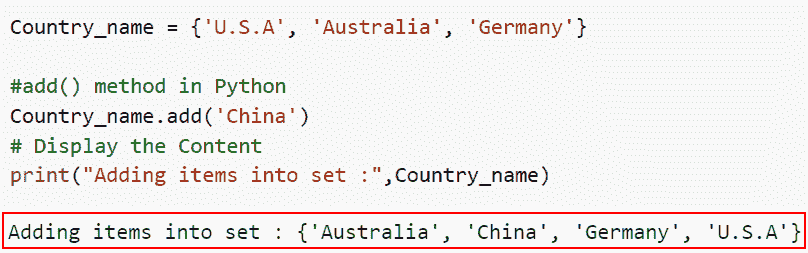
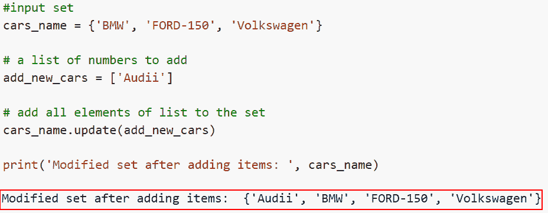
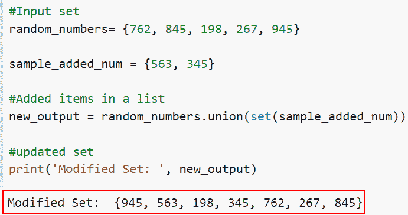
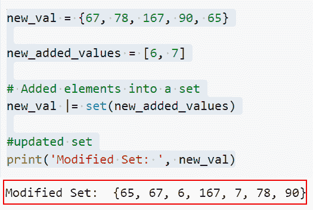
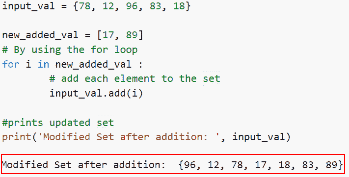

# 如何在 Python 中添加集合中的元素

> 原文：<https://pythonguides.com/add-elements-in-a-set-in-python/>

[](https://sharepointsky.teachable.com/p/python-and-machine-learning-training-course)

在这个 [Python 教程](https://pythonguides.com/python-programming-for-the-absolute-beginner/)中，我们将学习如何用 Python 在集合中添加元素。我们将使用一些内置函数来理解在 Python 中向集合中添加项目的各种方法。

作为一名开发人员，在制作 Python 项目时，我需要向 Python 中的一个集合添加元素。

在这里我们将看到:

*   如何使用 Add()在 Python 中添加集合中的元素
*   如何在 Python 中使用 update()在集合中添加元素
*   如何在 Python 中使用 union()在集合中添加元素
*   如何在 Python 中使用|运算符在集合中添加元素
*   如何在 Python 中使用 for 循环和 Add 函数在集合中添加元素

目录

[](#)

*   [如何在 Python 中添加集合中的元素](#How_to_Add_Elements_in_a_Set_in_Python "How to Add Elements in a Set in Python")
    *   [如何在 Python 中使用 add()](#How_to_Add_Elements_in_a_Set_in_Python_using_add "How to Add Elements in a Set in Python using add()") 添加集合中的元素
    *   [如何使用 update()在 Python 中添加集合中的元素](#How_to_Add_Elements_in_a_Set_in_Python_using_update "How to Add Elements in a Set in Python using update()")
    *   [如何使用 union()在 Python 中添加集合中的元素](#How_to_Add_Elements_in_a_Set_in_Python_using_union "How to Add Elements in a Set in Python using union()")
    *   [如何使用|运算符在 Python 中添加集合中的元素](#How_to_Add_Elements_in_a_Set_in_Python_using_operator "How to Add Elements in a Set in Python using | operator")
    *   [如何使用 for 循环和 Add 函数在 Python 中添加集合中的元素](#How_to_Add_Elements_in_a_Set_in_Python_using_for_loop_and_add_function "How to Add Elements in a Set in Python using for loop and add function")

## 如何在 Python 中添加集合中的元素

索引没有任何作用，因为集合是无序的。不能使用索引来修改或检索集合项目。set 数据结构并不关心它。使用 add()函数添加一个项目，使用 update()函数添加几个项目。

在 Python 中，有许多方法可以在 Python 集合中添加元素。我们将介绍如何用 Python 在集合中添加元素。

### 如何在 Python 中使用 add() 添加集合中的元素

*   在本节中，我们将讨论如何使用 Add()在 Python 中添加集合中的元素。
*   可以使用这个内置函数集将元素添加到集合中。此功能一次只能向器械包添加一件物品。如果我们试图添加集合中已经存在的元素，它将不会被添加，因为集合只包含唯一的元素；相反，它将继续使用原始设置并运行程序。
*   要添加元素，需要一个参数，默认情况下，该参数不取值。

句法

下面是 Python 中 set add()函数的语法。

```py
set.add(element)
```

**举例:**

让我们举一个例子，看看如何使用 `add()` 在 Python 中添加集合中的元素。

**源代码:**

```py
Country_name = {'U.S.A', 'Australia', 'Germany'}

#add() method in Python
Country_name.add('China')
# Display the Content
print("Adding items into set :",Country_name)
```

在下面的代码中，我们声明了名为“Country_name”的输入集。现在，我们使用 Python 中的 set.add()函数向输入集添加新元素。

下面是以下给定代码的实现。



How to Add Elements in a Set in Python using add

这就是如何在 Python 中使用 Add()在集合中添加元素。

阅读: [Python 程序创建空集](https://pythonguides.com/python-create-empty-set/)

### 如何使用 update()在 Python 中添加集合中的元素

*   现在让我们了解如何使用 update()在 Python 中添加集合中的元素。
*   在 Python 中，向集合中添加元素是使用内置方法完成的。这个函数在一行中做元素加法。它比其他方法更有效、更快捷。如果用户想一次添加多个条目，这种方法很有用。

**语法:**

让我们看看语法，理解 Python 中 update()函数的工作原理。

```py
set.update(iterable)
```

这个参数只接受一个参数，它指定像集合或列表这样的可迭代对象。

**举例:**

这里我们将举一个例子，并检查如何在 Python 中使用 update()在集合中添加元素。

**源代码:**

```py
#input set
cars_name = {'BMW', 'FORD-150', 'Volkswagen'}

# a list of numbers to add
add_new_cars = ['Audii']

# add all elements of list to the set
cars_name.update(add_new_cars)

print('Modified set after adding items: ', cars_name)
```

在上面的代码中，我们声明了给定的集合，然后使用 set.update()函数向集合中添加了一个新的项目。

你可以参考下面的截图



How to Add Elements in a Set in Python using update

正如你在截图中看到的，我们已经讨论了如何使用 update()在 Python 中添加元素。

阅读:[集合的并集 Python +示例](https://pythonguides.com/union-of-sets-python/)

### 如何使用 union()在 Python 中添加集合中的元素

*   在本节中，我们将讨论如何在 Python 中使用 union()在集合中添加元素。
*   来自输入集和给定集的所有项目都包含在 union()函数生成的集合中。应该用逗号分隔您描述的每个集合。

**语法:**

下面是 Python 中 union()方法的语法

```py
set1.union(iterable)
```

**注意:**该参数只接受一个可迭代的参数，并且可迭代的参数必须是集合。

**举例:**

让我们举一个例子，看看如何在 Python 中使用 union()在集合中添加元素。

**源代码:**

```py
#Input set
random_numbers= {762, 845, 198, 267, 945}

sample_added_num = {563, 345}

#Added items in a list
new_output = random_numbers.union(set(sample_added_num))

#updated set
print('Modified Set: ', new_output)
```

在下面给定的代码中，我们首先在输入集中取随机数，然后使用 union()函数将给定集中的元素相加。

下面是以下给定代码的实现。



How to Add Elements in a Set in Python using union

这就是如何在 Python 中使用 union()在集合中添加元素。

阅读:[集合交集的 Python 程序](https://pythonguides.com/python-intersection-of-sets/)

### 如何使用|运算符在 Python 中添加集合中的元素

*   这里我们将讨论如何使用|操作符在 Python 中添加集合中的项目。
*   它类似于工会。在将列表转换为集合后，我们将两个集合并。但是我们使用 set()函数将我们的列表变成一个集合。

**举例:**

这里我们将举一个例子，并检查如何在 Python 中使用|操作符在集合中添加元素。

**源代码:**

```py
new_val = {67, 78, 167, 90, 65}

new_added_values = [6, 7]

# Added elements into a set
new_val |= set(new_added_values)

#updated set
print('Modified Set: ', new_val)
```

在上面的代码中，我们首先将定义名为' new_val '的输入集，然后声明一个新变量' new_added_values '。接下来，我们使用|操作符将项目添加到一个集合中。

下面是下面给出的代码的截图。



How to Add Elements in a Set in Python using the | operator

在这个例子中，我们已经了解了如何在 Python 中使用|操作符在集合中添加元素。

阅读: [Python 集合字典](https://pythonguides.com/python-dictionary-of-sets/)

### 如何使用 for 循环和 Add 函数在 Python 中添加集合中的元素

随着 for 循环的每一次迭代，我们可以通过将每一项作为输入传递给 add()函数来向集合中添加元素。add()方法将每个元素添加到集合中，打印修改后的集合。

**举例:**

```py
input_val = {78, 12, 96, 83, 18}

new_added_val = [17, 89]
# By using the for loop
for i in new_added_val :
        # add each element to the set
        input_val.add(i)

#prints updated set
print('Modified Set after addition: ', input_val)
```

下面是下面给出的代码的截图。



How to Add Elements in a Set in Python using for loop and add function

这是如何使用 for 循环和 Add 函数在 Python 中添加元素的

您可能也喜欢阅读以下 Python 教程。

*   [Python 字典多值](https://pythonguides.com/python-dictionary-multiple-values/)
*   [Python 字典重复键](https://pythonguides.com/python-dictionary-duplicate-keys/)
*   [Python 字典增量值](https://pythonguides.com/python-dictionary-increment-value/)
*   [在 Python 中检查两个字典是否相等](https://pythonguides.com/check-if-two-dictionaries-are-equal-in-python/)

在本文中，我们已经了解了如何用 Python 向集合中添加元素。我们还讨论了以下主题。

*   如何使用 Add()在 Python 中添加集合中的元素
*   如何在 Python 中使用 update()在集合中添加元素
*   如何在 Python 中使用 union()在集合中添加元素
*   如何在 Python 中使用|运算符在集合中添加元素
*   如何在 Python 中使用 for 循环和 Add 函数在集合中添加元素

[Arvind](https://pythonguides.com/author/arvind/)

Arvind 目前是 TSInfo Technologies 的高级 Python 开发人员。他精通 Python 库，如 NumPy 和 Tensorflow。