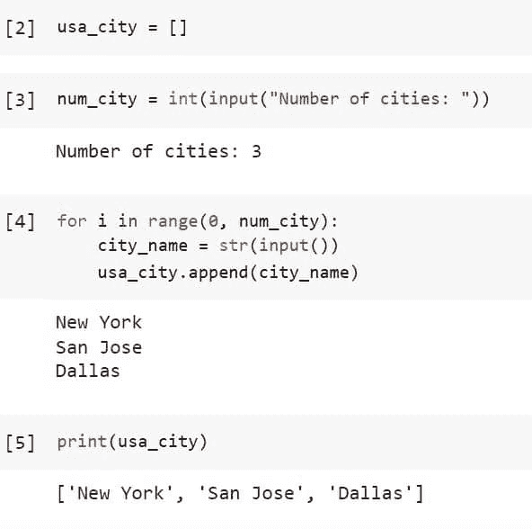

# 如何使用 For 循环在 Python 中添加列表中的元素

> 原文：<https://pythonguides.com/add-elements-in-list-in-python-using-for-loop/>

[](https://sharepointsky.teachable.com/p/python-and-machine-learning-training-course)

在 Python append()方法的帮助下，我们将使用 for 循环向列表中添加元素。此外，通过讨论以下主题，我们将知道如何在本教程中将元素添加到空列表和非空列表中。

*   如何使用 For 循环在 Python 中添加列表中的元素
*   如何使用 For 循环在 Python 中的空列表中添加元素

目录

[](#)

*   [如何使用 For 循环在 Python 中添加列表元素](#How_to_Add_Elements_in_List_in_Python_Using_For_Loop "How to Add Elements in List in Python Using For Loop")
    *   [如何在 python 中使用 for 循环从一个列表中添加另一个列表中的元素](#How_to_add_elements_in_a_list_from_another_list_in_python_using_for_loop "How to add elements in a list from another list in python using for loop")
    *   [如何使用 for 循环在 python 中从用户输入的列表中添加元素](#How_to_add_elements_in_a_list_from_user_input_in_python_using_for_loop "How to add elements in a list from user input in python using for loop")
*   [如何使用 For 循环在 Python 中添加空列表中的元素](#How_to_Add_Elements_in_Empty_List_in_Python_Using_For_Loop "How to Add Elements in Empty List in Python Using For Loop")
    *   [如何在 python 中使用 for 循环将另一个列表中的元素添加到空列表中](#How_to_add_elements_in_an_empty_list_from_another_list_in_python_using_for_loop "How to add elements in an empty list from another list in python using for loop")
    *   [如何使用 for 循环在 python 中从用户输入的空列表中添加元素](#How_to_add_elements_in_an_empty_list_from_user_input_in_python_using_for_loop "How to add elements in an empty list from user input in python using for loop")

## 如何使用 For 循环在 Python 中添加列表元素

我们将在循环中使用 Python append()方法向预定义的非空列表中添加元素。

### 如何在 python 中使用 for 循环从一个列表中添加另一个列表中的元素

首先，使用下面的代码将包含美国城市名称的列表初始化为一个字符串。

```py
usa_city = ["New York", "Los Angeles", "Chicago", "San Antonio"]
```

创建另一个列表，我们将把它的元素添加到上面创建的列表“usa_city”中。

```py
append_usa_cty = ["Huston","Phoenix","Philadelphia"]
```

用 `append()` 方法定义 for 循环，使用下面的代码将**“append _ USA _ cty”**的元素添加到**“USA _ city”**列表中。

```py
for i in range(len(append_usa_cty)):
  usa_city.append(append_usa_cty[i])
```

查看列表**“USA _ city”**查看列表**“append _ USA _ cty”**中添加的元素。

```py
print(usa_city)
```


How to Add Elements in List in Python Using For Loop Non-Empty List

这是如何在 python 中使用 for 循环从一个列表中添加另一个列表中的元素。

读取 [Python 查找列表](https://pythonguides.com/python-find-index-of-element-in-list/)中元素的索引

### 如何使用 for 循环在 python 中从用户输入的列表中添加元素

首先，使用下面的代码将包含美国城市名称的列表初始化为一个字符串。

```py
usa_city = ["New York","Los Angeles","Chicago","San Antonio"]
```

定义一个变量，它是我们要输入的城市名称的数量。例如，我们将为下面定义的变量输入值 2，因为我们将在列表“usa_city”中添加两个城市名

```py
num_city = int(input("Number of cities"))
```

定义一个循环，该循环将运行到我们希望输入到列表中的城市名称的数量或变量***【num _ city】***的长度，每次循环将使用`*`input()`*`从用户处获取一个输入或城市名称，并使用`*`append()`*`方法将其添加到列表“美国 _ 城市”中。

```py
for i in range(0, num_city):
    city_name = str(input())
    usa_city.append(city_name) 
```

使用下面的代码查看添加的美国城市名称。

```py
print(usa_city)
```


How to Add Elements in List in Python Using For Loop Non-Empty List User Input

让我们了解一下在上面的输出中代码 11 和 12 背后发生了什么:

*   ***num _ city = int(input(" Number of cities:")):***方法 *`input()`* 接受用户的输入，这个输入的 2 被转换成整数，因为方法 `int(input())` 被方法 `int()` 包装。然后将值 2 赋给变量 *`num_city`* ，这意味着我们要向列表中添加两个城市名。
*   **对于 i in range(0，num_city):** 那么循环开始并运行两次，因为循环的范围是从场景后面的 0 到 2。
*   在这个循环中有**代码 city_name = str(input())** :这个代码接受城市名并将其转换成字符串，然后将字符串赋给变量“city_name”。因此，每次循环迭代时，我们都要逐个输入两个城市名“达拉斯”和“圣何塞”。
*   之后，循环中还有另一个代码`USA _ city . append(city _ name)`:append()方法将元素添加到列表中。因此，我们为这个方法 `append(city_name)` 提供了变量 `"city_name"` ，用于在每次循环迭代时将两个城市名称逐个添加到列表 `"usa_city"` 中。

这就是如何将元素从用户输入或另一个列表添加到非空列表中。

阅读[如何用 Python 从列表中获取唯一值](https://pythonguides.com/get-unique-values-from-list-python/)

## 如何使用 For 循环在 Python 中添加空列表中的元素

在上面的小节中，我们学习了如何在 Python 中添加非空列表或已经包含一些值的列表中的元素。

在本节中，我们将向空列表添加元素，向空列表添加元素的过程与上面相同，但是这里我们将使用空列表而不是非空列表。

### 如何在 python 中使用 for 循环将另一个列表中的元素添加到空列表中

首先，使用下面的代码初始化空列表，该列表将包含美国的城市名作为一个字符串。

```py
usa_city = []
```

创建另一个列表，我们将把它的元素添加到上面创建的空列表“usa_city”中。

```py
append_usa_cty = ["Huston","Phoenix","Philadelphia","New York","Los Angeles","Chicago","San Antonio"]
```

用 `append()` 方法定义 for 循环，使用下面的代码将**“append _ USA _ cty”**的元素添加到空的**“USA _ city”**列表中。

```py
for i in range(len(append_usa_cty)):
  usa_city.append(append_usa_cty[i])
```

查看列表**“USA _ city”**查看列表**“append _ USA _ cty”**中添加的元素。

```py
print(usa_city)
```


How to Add Elements in Empty List in Python Using For Loop

这是如何在 python 中使用 for 循环将另一个列表中的元素添加到一个空列表中。

阅读[如何用 Python 从列表中获取字符串值](https://pythonguides.com/how-to-get-string-values-from-list-in-python/)

### 如何使用 for 循环在 python 中从用户输入的空列表中添加元素

首先，使用下面的代码初始化空列表，该列表将包含美国的城市名作为一个字符串。

```py
usa_city = []
```

为要输入的城市名称数量创建一个变量。例如，要将三个城市名称添加到列表“usa_city”中，我们将为下面的变量输入值 3。

```py
num_city = int(input("Number of cities"))
```

定义一个循环，该循环将运行到我们希望输入到列表中的城市名称的数量或变量***【num _ city】***的长度，每次循环将使用`*`input()`*`从用户处获取一个输入或城市名称，并使用`*`append()`*`方法将其添加到空列表“美国 _ 城市”中。

```py
for i in range(0, num_city):
    city_name = str(input())
    usa_city.append(city_name) 
```

使用下面的代码查看添加的美国城市名称。

```py
print(usa_city)
```



How to Add Elements in List in Python Using For Loop Empty List User Input

让我们来了解一下上面输出中代码 3 和 4 背后发生了什么:

*   ***num _ city = int(input(" Number of cities:")):***方法 *`input()`* 接受用户的输入，这个输入的 3 被转换成整数，因为方法 `int(input())` 被方法 `int()` 包装。然后将值 3 赋给变量 *`num_city`* ，这意味着我们要向列表中添加三个城市名。
*   **对于 i in range(0，num_city):** 那么循环开始并运行两次，因为循环的范围是从场景后面的 0 到 3。
*   在这个循环中有**代码 city_name = str(input())** :这个代码接受城市名并将其转换成字符串，然后将字符串赋给变量“city_name”。因此，每次循环迭代时，我们都要依次输入三个城市名“纽约”、“圣何塞”和“达拉斯”。
*   之后，循环中还有另一个代码`USA _ city . append(city _ name)`:append()方法将元素添加到列表中。因此，我们为这个方法 `append(city_name)` 提供了变量 `"city_name"` ，用于在每次循环迭代时将两个城市名称逐个添加到列表 `"usa_city"` 中。

这就是如何从用户输入或 Python 中的另一个列表向空列表添加元素。

我们已经学习了如何从用户输入或者从另一个列表中添加元素到预先存在的列表中。还介绍了如何向空或非空列表添加元素，包括以下主题。

*   如何使用 For 循环在 Python 中添加列表中的元素
*   如何使用 For 循环在 Python 中的空列表中添加元素

您可能会喜欢以下 Python 教程:

*   [偶数或奇数的 Python 程序](https://pythonguides.com/python-program-for-even-or-odd/)
*   [如何在 Python 中将集合转换成列表](https://pythonguides.com/convert-a-set-to-a-list-in-python/)
*   [Python 程序检查闰年](https://pythonguides.com/python-program-to-check-leap-year/)
*   [Python 程序求正方形的面积](https://pythonguides.com/python-program-to-find-the-area-of-square/)
*   [Python 列表方法](https://pythonguides.com/python-list-methods/)
*   [Python 列表理解λ](https://pythonguides.com/python-list-comprehension/)

[Saurabh](https://pythonguides.com/author/saurabh/)

我叫 Kumar Saurabh，是一名 Python 开发人员，在 TSInfo Technologies 工作。此外，像 Python 编程，SciPy，机器学习，人工智能等技术的专业知识。是我喜欢做的事情。