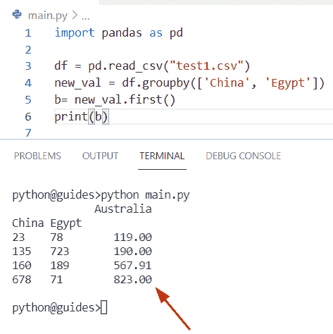

# 向数据帧添加行 Python 熊猫

> 原文：<https://pythonguides.com/add-row-to-dataframe-python-pandas/>

[](https://sharepointsky.teachable.com/p/python-and-machine-learning-training-course)

在这个 [Python 熊猫](https://pythonguides.com/pandas-in-python/)教程中，将学习如何**使用熊猫在 Python** 中给数据帧添加一行。此外，我们将涵盖这些主题。

*   向循环中的数据帧添加行
*   在 Pandas 中向数据帧添加新行
*   在 Pandas 中向现有数据帧添加新行
*   Python 熊猫向空数据帧添加行
*   在 Pandas 中向数据帧追加行
*   向数据帧添加行 Python 熊猫分组依据

目录

[](#)

*   [向数据帧添加行 Python 熊猫](#Add_row_to_DataFrame_Python_Pandas "Add row to DataFrame Python Pandas ")
    *   [通过使用 DataFrame.append()方法](#By_using_DataFrameappend_method "By using DataFrame.append() method")
    *   [通过使用 iloc()方法](#By_using_iloc_method "By using iloc() method")
    *   [通过使用连接方法](#By_using_Concatenate_method "By using Concatenate method")
*   [向循环中的数据帧添加行](#Add_rows_to_DataFrame_Pandas_in_loop "Add rows to DataFrame Pandas in loop")
*   [在熊猫的数据帧中添加新行](#Adding_new_row_to_DataFrame_in_Pandas "Adding new row to DataFrame in Pandas")
*   [在 Pandas 中向现有数据帧添加新行](#Adding_new_row_to_existing_dataframe_in_Pandas "Adding new row to existing dataframe in Pandas")
*   [Python 熊猫向空数据帧添加行](#Python_Pandas_add_row_to_empty_DataFrame "Python Pandas add row to empty DataFrame")
*   [在 Pandas 中向数据帧添加行](#Append_rows_to_a_DataFrame_in_Pandas "Append rows to a DataFrame in Pandas")
*   [向数据帧添加行 Python 熊猫组 by](#Adding_row_to_DataFrame_Python_Pandas_groupby "Adding row to DataFrame Python Pandas groupby")

## 向数据帧添加行 Python 熊猫

*   在 Python 中，数据帧是一种二维数据结构，如果您想要分析数据帧，那么您需要创建一个新的数据帧，并添加用于声明具有特定元素的数据帧的行。
*   让我们讨论如何向 Pandas 数据帧添加行。有多种方法可以用来在 Pandas 数据帧中添加行。
    *   通过使用 DataFrame.append()方法
    *   通过使用 iloc()方法
    *   通过使用连接方法

让我们来看看并了解这些方法

阅读[删除非 ASCII 字符 Python](https://pythonguides.com/remove-non-ascii-characters-python/)

### 通过使用 DataFrame.append()方法

*   在 Pandas Dataframe 中， `append()` 函数用于从另一个 Pandas Dataframe 对象中追加行。该方法总是返回包含熊猫数据帧元素的新数据帧，并且不修改源数据帧对象。
*   这种方法总是存在于 Pandas 库中，为用户提供数据分析。

这个方法的语法在这里

```py
DataFrame.append(
                 other,
                 ignore_index=False,
                 verify_integrity=False,
                 sort=False
                )
```

*   它由几个参数组成
    *   **其他:**该参数指定将要追加的数据，我们也可以调用 DataFrame 或 Series。
    *   **ignore_index:** 如果该参数为真，则生成的轴将被索引标记。
    *   **verify_integrity:** 该参数指定布尔值，如果为真，则在创建标签时引发值错误，默认情况下，该值为“假”。
    *   **排序:**该参数用于对所有列进行排序

**举例:**

让我们举一个例子，看看如何向 DataFrame 添加一行

```py
import pandas as pd

new_val = [('John', '9945', 'Germany'),
         ('William', '1456', 'Australia'),
         ('Micheal', '118', 'England'),
         ('Oliva', '934', 'Spain'),
         ('Elijah', '167', 'Paris')]

result = pd.DataFrame(new_val,
                     columns=['Student_name', 'Student_id', 'Student_city'])

print(result)
newDfObj = result.append({'Student_name': 'Potter',
                         'Student_id': '109',
                         'Student_city': 'Bangladesh'}, ignore_index=True)

print(newDfObj)
```

在上面的代码中，我们首先创建了一个元组列表**‘new _ val’**，然后声明一个 dataframe 对象**‘result’**，我们在其中分配了列名。现在我们想在现有的数据帧中添加一行，为此我们使用了 D `ataFrame.append()` 方法，并将字典作为数据帧的新行传递。

下面是以下给定代码的执行过程


Add row to DataFrame Python Pandas

阅读:[如何在 Python Pandas 中更新列值](https://pythonguides.com/update-column-values-in-python-pandas/)

### 通过使用 iloc()方法

在 Python 中， `iloc()` 方法用于选择特定的行。它只接受整数值，并帮助用户选择属于特定行和列的值。

**语法:**

下面是数据帧的语法。iloc()方法

```py
property DataFrame.iloc()
```

**源代码:**

```py
import pandas as pd

new_val = [('John', '9945', 'Germany'),
         ('William', '1456', 'Australia'),
         ('Micheal', '118', 'England'),
         ('Oliva', '934', 'Spain'),
         ('Elijah', '167', 'Paris')]

m = pd.DataFrame(new_val,
                     columns=['Student_name', 'Student_id', 'Student_city'])

m.iloc[1] = ['George', '468', 'Ireland']

print(m) 
```

下面是以下给定代码的输出


Add row to DataFrame Python Pandas

阅读[如何在 Python 中的数据帧中添加空列](https://pythonguides.com/add-empty-column-dataframe-python/)

### 通过使用连接方法

在这个程序中，我们将使用**熊猫添加多行。Concat()** 方法。在 Pandas DataFrame 中，我们可以通过使用 **Pandas 轻松地将系列或数据帧与各种数据集相结合。Concat()** 方法。

**语法:**

下面是熊猫的句法。Concat()方法

```py
Pandas.Concat
             (
              objs,
              axis=0,
              join='outer',
              ignore_index=False,
              Keys=None,
              Levels=None,
              names=None,
              Verify_integrity=False,
              Sort=False,
              Copy=True
             )
```

**举例:**

```py
import pandas as pd
import numpy as np

Employee_info1 = {'Employee_name':['Micheal', 'William', 'Bob', 'Oliva'],
		'Employee_id':[834, 156, 349, 168],
		'Employee_age':[23, 37, 46, 26]
	}

df1 = pd.DataFrame(Employee_info1)

Employee_info2 = {'Employee_name':['Elijah', 'John'],
		'Employee_id':[78, 118],
		'Employee_age':[17, 19]
	}

df2 = pd.DataFrame(Employee_info2)
new_val = pd.concat([df1, df2], ignore_index = True)
new_val.reset_index()

print(new_val)
```

在上面的代码中，我们首先创建了一个字典 **'Employee_info1'** ，然后声明了一个 dataframe 对象，在该对象中我们将字典作为参数传递。同样，我们还创建了另一个字典**‘雇员 _ 信息 2’**。

现在，我们想要连接两个不同的数据帧，并将结果存储到“new_val”中。一旦您打印了**‘new _ val’**，那么输出将在数据帧中显示新的行。

下面是以下代码的截图


Add row to DataFrame Python Pandas

阅读:[检查 Python Pandas 中的数据帧是否为空](https://pythonguides.com/check-if-dataframe-is-empty-in-python-pandas/)

## 向循环中的数据帧添加行

*   在这里，我们可以看到如何使用 for 循环方法向数据帧添加行
*   通过使用 for 循环，我们可以遍历一个行列表，并在循环中将列名作为键元素与数据作为值组合起来。在 Python 中， `zip()` 方法接受项目并将它们追加到一个元组中。

**源代码:**

```py
import pandas as pd

new_col = ['Integer value']
new_empt_list = []
b = 123

for m in range(8):
    new_empt_list.append([b])
    b = b + 1
df = pd.DataFrame(new_empt_list, columns=new_col)
print(df)
```

在上面的代码中，我们首先创建一个变量，并在列表中指定一个列名。

下面是以下给定代码的实现


Add rows to DataFrame Pandas in a loop

阅读: [Python 熊猫替换多个值](https://pythonguides.com/pandas-replace-multiple-values/)

## 在熊猫的数据帧中添加新行

*   在这个程序中，我们将讨论如何在熊猫数据帧中添加一个新行。
*   通过使用 `append()` 方法，我们可以执行这个特定的任务，这个函数用于在数据帧的末尾插入一行或多行。
*   该方法总是返回具有新行的新数据帧，并且包含熊猫数据帧的元素，并且它不修改源数据帧对象。

**源代码:**

```py
import pandas as pd

new_dictionary = {'Student_name': ['Noah', 'Lijah'],
	'Desgination': ['Developer', 'Tester'],
	'student_id': [178, 199]}

df = pd.DataFrame(new_dictionary)
result = pd.Series(data={'Student_name':'George', 'Desgination':'Gamer', 'student_id':658}, name='x')
df = df.append(result, ignore_index=False)
print(df)
```

在上面的代码中，我们首先创建了一个字典**‘new _ dictionary’**，然后声明一个 dataframe 对象**‘result’**，我们在其中指定了字典名。

现在我们想在现有的数据帧中添加一行，为此我们使用了 `DataFrame.append()` 方法，并将字典作为数据帧的新行传递。

你可以参考下面的截图


Adding a new row to DataFrame in Pandas

阅读: [Python 熊猫掉行](https://pythonguides.com/python-pandas-drop-rows-example/)

## 在 Pandas 中向现有数据帧添加新行

*   让我们看看如何在现有的 Pandas 数据帧中添加一个新行。
*   为了执行这个特定的任务，我们可以使用 `append()` 函数的概念，这个方法将帮助用户在现有的数据帧中添加一个新行。

**举例:**

```py
import pandas as pd

my_dictionary = {'Fruit_name':['Apple', 'Litchi', 'Cherry', 'Banana'],
		'new_val':[189, 578, 289, 134],

	}

df = pd.DataFrame(my_dictionary)
df2 = {'Fruit_name': 'Grapes', 'new_val': 167}
df = df.append(df2, ignore_index = True)
print(df) 
```

下面是以下给定代码的输出


Adding a new row to DataFrame in Pandas

阅读:[如何将熊猫数据帧转换成字典](https://pythonguides.com/how-to-convert-pandas-dataframe-to-a-dictionary/)

## Python 熊猫向空数据帧添加行

*   在这个程序中，我们将讨论如何声明一个空数据帧并在其中追加行。
*   在本例中，我们有数据帧的列名，但数据帧中没有任何值或数据。首先，我们将创建一个只有特定列名的空数据帧。
*   现在，通过添加已经分配了键值对元素的字典，在空数据帧中追加行。创建 datafarme 后，将 **'ignore_index=True'** 作为参数传递给它。

**源代码:**

```py
import pandas as pd

new_val = pd.DataFrame(columns = ['emp_id', 'emp_age', 'emp_city'])
print(new_val)

new_val = new_val.append({'emp_id' : 876, 'emp_age' : 29, 'emp_city' : 'Germany'},
				ignore_index = True)
new_val = new_val.append({'emp_id' : 115, 'emp_age' : 34, 'emp_city' : 'Uganda'},
				ignore_index = True)
new_val = new_val.append({'emp_id' : 1178, 'emp_age' : 16, 'emp_city' : 'Russia'},
				ignore_index = True)
print(new_val) 
```

下面是以下代码的截图


Python Pandas add a row to empty DataFrame

阅读:[如何在 Python 中使用 Pandas drop()函数](https://pythonguides.com/pandas-drop/)

## 在 Pandas 中向数据帧添加行

*   这里我们可以看到如何在 pandas 数据帧中添加行。
*   通过使用 `append()` 函数，我们可以在 Pandas 数据帧中插入特定的行。

**源代码:**

```py
import pandas as pd

new_val = [('John', '9945', 'Germany'),
         ('William', '1456', 'Australia'),
         ('Micheal', '118', 'England'),
         ('Oliva', '934', 'Spain'),
         ('Elijah', '167', 'Paris')]

new_output = pd.DataFrame(new_val,
                     columns=['Student_name', 'Student_id', 'Student_city'])

print(new_output)
m = new_output.append({'Student_name': 'Potter',
                         'Student_id': '109',
                         'Student_city': 'Bangladesh'}, ignore_index=True)

print(m)
```

在上面的代码中，我们首先创建了一个元组列表**‘new _ val’**，然后声明一个 dataframe 对象**‘result’**，我们在其中分配了列名。

现在我们想在现有的数据帧中添加一行，为此我们使用了 `DataFrame.append()` 方法，并将字典作为数据帧的新行传递。

你可以参考下面的截图


Append rows to a DataFrame in Pandas

阅读:[Python 熊猫中的 group by](https://pythonguides.com/groupby-in-python-pandas/)

## 向数据帧添加行 Python 熊猫组 by

*   让我们看看如何使用 groupby 方法在数据帧中添加一行。
*   在 Python 中，group-by 函数将结果组合在一起，我们还可以根据条件将数据分成不同的组。该功能可用于对大量数据进行分组。

**语法:**

下面是 groupby 方法的语法

```py
DataFrame.groupby
                (
                 by=None,
                 axis=0,
                 level=None,
                 as_index=True,
                 sort=True,
                 group_keys=True,
                 Squeeze=Nodefault.no_default,
                 observed=False,
                 dropna=True
                )
```

**举例:**

```py
import pandas as pd

df = pd.read_csv("test1.csv")
new_val = df.groupby(['China', 'Egypt'])
b= new_val.first()
print(b)
```

下面是以下给定代码的执行过程



Adding a row to DataFrame Python Pandas groupby

你可能也喜欢读下面的文章。

*   [Python 熊猫 CSV 教程](https://pythonguides.com/python-pandas-csv/)
*   熊猫用 0 换下南
*   [Python 中熊猫缺失数据](https://pythonguides.com/missing-data-in-pandas/)
*   [用 Python 连接两个数据帧](https://pythonguides.com/concatenate-two-dataframes-in-python/)
*   [熊猫删除栏目](https://pythonguides.com/pandas-delete-column/)
*   [Python 将数据帧转换为列表](https://pythonguides.com/python-convert-dataframe-to-list/)
*   [计算熊猫数据帧中的行数](https://pythonguides.com/count-rows-in-pandas-dataframe/)

在这篇 Python Pandas 教程中，我们学习了如何使用 Pandas 在 Python 中**向 Dataframe 添加一行。此外，我们已经讨论了这些主题。**

*   向循环中的数据帧添加行
*   在 Pandas 中向数据帧添加新行
*   在 Pandas 中向现有数据帧添加新行
*   Python 熊猫向空数据帧添加行
*   在 Pandas 中向数据帧追加行
*   向数据帧添加行 Python 熊猫分组依据

[Bijay Kumar](https://pythonguides.com/author/fewlines4biju/)

Python 是美国最流行的语言之一。我从事 Python 工作已经有很长时间了，我在与 Tkinter、Pandas、NumPy、Turtle、Django、Matplotlib、Tensorflow、Scipy、Scikit-Learn 等各种库合作方面拥有专业知识。我有与美国、加拿大、英国、澳大利亚、新西兰等国家的各种客户合作的经验。查看我的个人资料。

[enjoysharepoint.com/](https://enjoysharepoint.com/)[](https://www.facebook.com/fewlines4biju "Facebook")[](https://www.linkedin.com/in/fewlines4biju/ "Linkedin")[](https://twitter.com/fewlines4biju "Twitter")