# 在 Python 中向绘图 matplotlib 添加文本

> 原文：<https://pythonguides.com/add-text-to-plot-matplotlib/>

[](https://sharepointsky.teachable.com/p/python-and-machine-learning-training-course)

在这个 [Python 教程](https://pythonguides.com/python-hello-world-program/)中，我们将学习如何在 python 中使用 matplolib**将文本添加到情节中。我们还将讨论以下主题:**

*   将文本添加到绘图 matplotlib
*   将文本添加到绘图 matplotlib 示例
*   向绘图 matplotlib 添加多行文本
*   将文本添加到绘图 matplotlib 更改样式
*   添加文本以绘制 matplotlib 数学公式
*   将文本框添加到绘图 matplotlib
*   将文本添加到条形图 matplotlib
*   将文本添加到散点图 matplotlib
*   将文本添加到三维绘图 matplotlib
*   在绘图 matplotlib 下添加文本
*   将文本添加到绘图 matplotlib 的顶部
*   将文本添加到绘图 matplotlib 底部
*   将文本添加到绘图 matplotlib 的右侧
*   将文本添加到绘图 matplotlib 的角上
*   将文本添加到绘图 matplotlib 的中心
*   将文本添加到上面的绘图 matplotlib

如果您是 Matplotlib 的新手，请查看[什么是 Matplotlib 以及如何在 Python 中使用它](https://pythonguides.com/what-is-matplotlib/)以及[如何安装 matplotlib python](https://pythonguides.com/how-to-install-matplotlib-python/)

目录

[](#)

*   [添加文本到绘图 matplotlib](#Add_text_to_plot_matplotlib "Add text to plot matplotlib")
*   [将文本添加到绘图 matplotlib 示例中](#Add_text_to_plot_matplotlib_example "Add text to plot matplotlib example")
*   [添加多行文本到绘图 matplotlib](#Add_multiple_line_text_to_plot_matplotlib "Add multiple line text to plot matplotlib ")
*   [添加文本到绘图 matplotilb 改变样式](#Add_text_to_plot_matplotilb_change_style "Add text to plot matplotilb change style")
*   [添加文本以绘制 matplotlib 数学公式](#Add_text_to_plot_matplotlib_mathematical_formula "Add text to plot matplotlib mathematical formula")
*   [添加文本框到绘图 matplotlib](#Add_text_box_to_plot_matplotlib "Add text box to plot matplotlib")
*   [向柱状图 matplotlib 添加文本](#Add_text_to_bar_plot_matplotlib "Add text to bar plot matplotlib")
*   [向散点图 matplotlib 添加文本](#Add_text_to_scatter_plot_matplotlib "Add text to scatter plot matplotlib")
*   [向 3D 绘图 matplotlib 添加文本](#Add_text_to_3D_plot_matplotlib "Add text to 3D plot matplotlib")
*   [在绘图 matplotlib 下添加文本](#Add_text_under_plot_matplotlib "Add text under plot matplotlib")
*   [将文本添加到绘图 matplotlib 的顶部](#Add_text_to_top_of_plot_matplotlib "Add text to top of plot matplotlib")
*   [将文本添加到绘图 matplotlib 的底部](#Add_text_to_bottom_of_plot_matplotlib "Add text to bottom of plot matplotlib")
*   [在绘图 matplotlib 右侧添加文本](#Add_text_to_right_of_plot_matplotlib "Add text to right of plot matplotlib")
*   [将文本添加到绘图 matplotlib 的角落](#Add_text_to_corner_of_plot_matplotlib "Add text to corner of plot matplotlib")
*   [将文本添加到绘图 matplotlib 的中心](#Add_text_to_center_of_plot_matplotlib "Add text to center of plot matplotlib")
*   [在绘图 matplotlib 上方添加文本](#Add_text_above_plot_matplotlib "Add text above plot matplotlib")

## 添加文本到绘图 matplotlib

在这一节中，我们将学习如何在 matplotlib 中**向绘图添加文本。在开始之前，我们先了解一下**【文本】**是什么意思。**

文本是我们想要添加到情节中的文字。我们可以添加文本信息或提供情节的解释。

**以下步骤用于在 matplotlib 的绘图中添加文本，概述如下:**

*   **定义库:**导入在绘图中添加文本所需的重要库(用于数据创建和操作:Numpy，用于数据可视化:来自 matplotlib 的 pyplot)。
*   **定义 X 和 Y:** 定义用于 X 轴和 Y 轴的数据值。
*   **将文本添加到图表:**通过使用 text()函数，我们可以很容易地将文本添加到图表中。
*   **Display:** 为了显示图形，我们使用了 show()函数。

**向图中添加文本的语法如下:**

```py
matplotlib.pyplot.text(x, y, s, fontdict=None, **kwargs)
```

**上述使用的参数概述如下:**

*   **x:** 指定放置文本的 x 坐标位置。
*   **y:** 指定放置文本的 y 坐标位置。
*   **s:** 指定文本。
*   **fontdict:** 指定文本属性而非默认值的字典。
*   **kwargs:** 指定一些其他的文本属性。

> **注意:**我们可以使用变换参数改变坐标系。

看看， [Python 使用 Matplotlib 绘制多条线](https://pythonguides.com/python-plot-multiple-lines/)

## 将文本添加到绘图 matplotlib 示例中

在上一节中，我们讨论了文本的含义和各个步骤，我们还学习了将文本添加到情节中的语法。

**让我们借助一个例子更清楚地理解添加文本的概念:**

```py
**# Import library**

import matplotlib.pyplot as plt

**# Define Data**

x = [7, 14, 21, 28, 35]
y = [4, 8, 12, 16, 20]

**# Plot a Graph**

plt.plot(x, y, color = 'm')

**# Add text**

plt.text(7.8, 12.5, "I am Adding Text To The Plot")

**# Display Graph**

plt.show()
```

*   在上面的例子中，我们导入了 `matplotlib.pyplot` 库，并定义了 x 和 y 轴数据点。
*   我们使用 `plt.plot()` 方法绘制一个图形，然后使用 `plt.text()` 方法将文本添加到图形中。
*   这里我们传递参数为 `x=7.8` ， `y=12.5` ，并且我们传递文本“**我正在将文本添加到绘图**”，我们希望在指定的轴上打印该文本。
*   最后，我们使用 **plt。show()** 显示绘图。

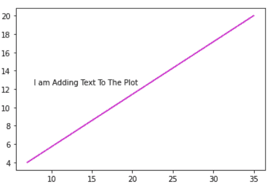

plt.text()

检查完毕， [Matplotlib 绘制一条线](https://pythonguides.com/matplotlib-plot-a-line/)

## 添加多行文本到绘图 matplotlib

有时，我们希望在绘图中放置多个文字注释。因此，要添加多行文本，我们需要添加一个**新行符号“\ n”**。

**添加多个文本的语法如下:**

```py
matplotlib.pyplot.text(x, y, "Text1 \n Text2 \n Text3 ... " )
```

**上面使用的参数是:**

*   **x 和 y:** 指定放置文本的坐标。
*   **文本 1，文本 2:** 指定我们想要添加的多个文本。在文本之间，我们使用新的线符号。

**让我们看看与多行文本相关的例子:**

```py
**# Import library**

import matplotlib.pyplot as plt

**# Define Data** 

x = [7, 14, 21, 28, 35]
y = [4, 8, 12, 16, 20]

**# Plot a Graph**

plt.plot(x, y, color = 'r', linestyle= '--')

**# Add multiple texts** 

plt.text(13, 18, "I am Adding Text To The Plot \nI am Trying To Add a New Line of Text \nWaoo! Mutiple Texts are added")

**# Display Graph**

plt.show() 
```

在上面的例子中，我们使用 `text()` 方法将文本添加到绘图中，我们传递参数 **x，y，**和**文本**，在多个文本之间我们使用 **"\n"** 。

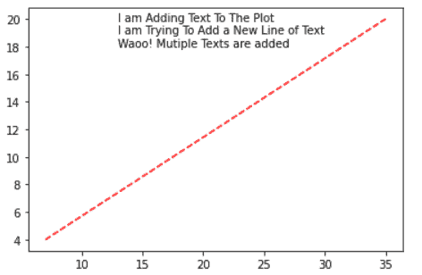

plt.text()

检查出， [Matplotlib 绘图条形图](https://pythonguides.com/matplotlib-plot-bar-chart/)

## 添加文本到绘图 matplotilb 改变样式

Matplotlib 为我们提供了一个改变添加文本样式的特性。

要改变样式，我们必须将定义新样式的**字典**传递给参数 `fontdict` 。

如果你想了解更多的文本样式和属性，请访问官方 matplotlib 页面。

```py
**# Import library** 
import matplotlib.pyplot as plt

**# Define Data**

x = [7, 14, 21, 28, 35]
y = [4, 8, 12, 16, 20]

**# Plot a Graph**

plt.plot(x, y, color = 'r', linestyle= '--')

**# Add dictionary**

font = {'family': 'cursive',
        'color':  'k',
        'weight': 'bold',
        'size': 12,
        }

**# Change text style**

plt.text(7.5, 18, "Changing style and properties of    text",fontdict = font )

**# Display Graph**

plt.show() 
```

*   在上面的例子中，我们创建了一个字典，为文本定义了新的样式和属性。
*   之后，我们使用 `text()` 方法在图形中绘制文本，并传递参数`fonddict`来改变样式。

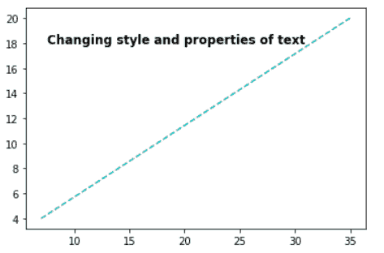

plt.text()

另外，检查一下，[什么是 matplotlib 内联](https://pythonguides.com/what-is-matplotlib-inline/)

## 添加文本以绘制 matplotlib 数学公式

很多时候我们需要在图表或图形中加入数学公式。所以 `text()` 方法提供了向绘图中添加公式的功能。

要添加公式，我们必须在公式的开头和结尾添加一个**美元符号“$”**。

**添加数学公式的语法:**

```py
matplotlib.pyplot.text(x, y, "$Formula$" )
```

**让我们看一个例子，了解如何向图表添加公式**:

```py
**# Import library**

import matplotlib.pyplot as plt

**# Define Data** 
x = [1, 2, 3, 4, 5]
y = [1, 2, 3, 4, 5]

**# Plot a Graph**

plt.plot(x)

**# Mathematical Formula**

plt.text(1,4, "$y=mx + c$",{'color':'green','weight':'heavy','size':20})

**# Display Graph** 

plt.show()
```

*   在上面的例子中，我们导入了 `matplotlib.pyplot` 库。
*   之后，我们定义 x 轴和 y 轴上的数据，并使用 `plt.plot()` 方法绘制图表。
*   我们使用 `plt.text()` 方法将文本添加到情节中，我们将一个特殊的字符串**“数学公式”**传递给该方法。
*   要以公式的形式打印一个字符串，我们在字符串的开头和结尾使用美元符号 **" $ "** 。

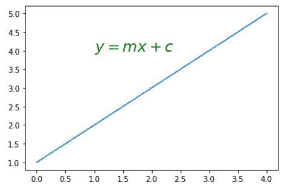

plt.text() *“Mathematical formula of straight line”*

退房， [Matplotlib 支线剧情教程](https://pythonguides.com/matplotlib-subplot-tutorial/)

## 添加文本框到绘图 matplotlib

我们可以把你的文章放进一个盒子里来装饰它。Matplotlib 提供了改变盒子样式和颜色的功能。

通过在文本周围添加一个方框，您可以使您的情节更具吸引力。bbox 关键字参数用于放置文本框。

**添加框的语法:**

```py
matplotlib.pyplot.text(x,y,bbox={Create dict of bbox style})
```

**上面使用的参数是:**

*   **x 和 y** :数据点的坐标
*   **bbox:** 关键字在文本周围放置框。它需要一个字典，字典中的键定义了盒子的样式。

**让我们看一个在文本周围添加框的例子:**

```py
**# Import library** 

import matplotlib.pyplot as plt

**# Define Data**

x = [1, 2, 3, 4, 5]
y = [1, 2, 3, 4, 5]

**# Plot a Graph**

plt.plot(x)

**# Define bbox style**

box_style=dict(boxstyle='round', facecolor='wheat', alpha=0.5)

**# Text inside a box**

plt.text(1.2,4.2, "$y=mx + c$",{'color':'red','weight':'heavy','size':20},bbox=box_style)

**# Display Graph**

plt.show() 
```

*   在上面的例子中，我们使用 `plt.text()` 方法在图表中添加一个文本，并且我们传递关键字参数 `bbox` 在框中放置一个文本。
*   `bbox` 的样式在 `box_style` 变量中定义。

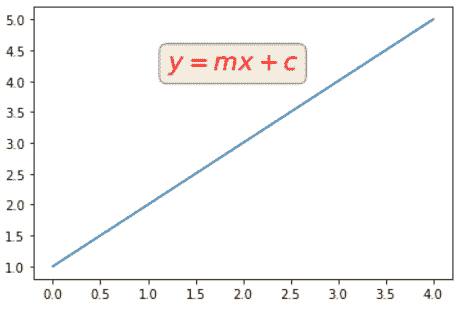

plt.text(bbox)

检查， [Matplotlib 绘图误差线](https://pythonguides.com/matplotlib-plot-error-bars/)

## 向柱状图 matplotlib 添加文本

为了可视化图形数据，我们可以使用条形图，因此我们可以通过查看不同高度的条形来轻松比较数据。

为了绘制条形图，我们使用 `plt.bar()` 方法并传递 x 和 y 坐标。

默认情况下，条形图不显示条形的值标签，因此，有时很难分析条形的准确值。

通过使用 `plt.text()` 方法，我们可以很容易地在条形图的每个条上添加文本标签。

**创建条形图并向每个条形图添加标签的语法如下:**

```py
**# To create bar chart**
matplotlib.pyplot.bar(x, height)

**# To add text label** 
matplotlib.pyplot.text(x, y, s , ha , va, bbox)
```

**上面使用的参数定义如下:**

*   **x:** 指定横条的 x 坐标。
*   **高度:**指定条形的 y 坐标。
*   **x:** 指定文本的 x 坐标。
*   **y:** 文本的具体 y 坐标。
*   s: 指定要显示的文本。
*   **ha:** 指定水平对齐
*   **va:** 指定垂直对齐
*   **bbox:** 指定文本周围的矩形框

让我们举几个不同的例子来更清楚地理解这个概念:

**举例:默认条形图**

```py
**# Import Library**

import matplotlib.pyplot as plt

**# Define Data** 

student = [5, 10, 12, 16, 18]
marks= [99, 90, 80, 85, 75]

**# Plot Graph** 

plt.bar(student,marks) 

**# Define Labels** 

plt.xlabel("No.Of students")
plt.ylabel("Marks of students")

**# Display Graph**

plt.show()
```

在上面的例子中，我们简单地绘制了显示学生及其分数的条形图。我们用 `plt.bar()` 的方法来绘制这个条形图。

我们注意到，默认情况下，条形图并不显示每个条形的值。

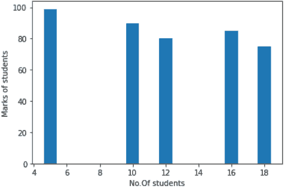

plt.bar()

检查， [Matplotlib 移除刻度标签](https://pythonguides.com/matplotlib-remove-tick-labels/)

**示例:在条形图上添加文本标签**

```py
**# importing library** 
import matplotlib.pyplot as plt

**# function to add text**

def addtext(x,y):
    for i in range(len(x)):
        plt.text(i,y[i],y[i])

**# Main function**

if __name__ == '__main__':

    **# Define data**
    x = ["A","B","C","D","E","Fail"]
    y = [15, 12, 3, 5,1, 2]

    **# Plot bar chart**
    plt.bar(x, y)

    **# Call function**
    addtext(x, y)       

    **# Define labels**
    plt.xlabel("Grades")
    plt.ylabel("Number of Students")

   ** # Display plot**
    plt.show()
```

*   在上面的例子中，我们导入了库 `matplotlib.pyplot`
*   创建一个函数 `addtext()` 可以将文本添加到条中。在函数中，我们用一个**来表示循环**的长度 x 值，并使用 `len()` 方法来计算长度。
*   之后，我们使用 `plt.text()` 方法在每个条上添加文本，并传递分别代表高度和要打印的字符串的 `i` 和**y[I】**。
*   我们创建**主函数**并定义数据点。
*   然后通过使用 `plt.bar()` 我们绘制条形图，并将坐标 x 和 y 传递给它。我们还在 x 轴和 y 轴上添加了**标签**。
*   最后，我们使用 `plt.show()` 方法来显示绘图。

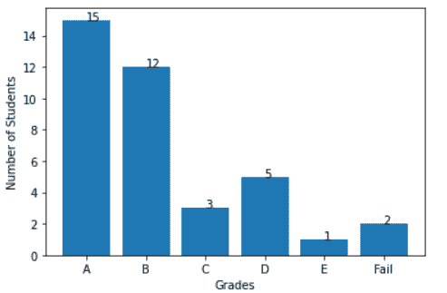

plt.text()

**示例:向条形图添加居中对齐的文本，并在文本周围添加一个框**

```py
**# Import library**

import matplotlib.pyplot as plt

**# Function to add text in center with box**

def addtext(x,y):
    for i in range(len(x)):
        plt.text(i,y[i],y[i], ha = 'center',
                 bbox = dict(facecolor = 'pink', alpha =0.8))

**# Main function**

if __name__ == '__main__':

    **# Define data
**    x = ["A","B","C","D","E","Fail"]
    y = [15, 12, 3, 5,1, 2]

    **# Plot bar chart**
    plt.bar(x, y)

    **# Call function**
    addtext(x, y)       

    **# Define labels**
    plt.xlabel("Grades")
    plt.ylabel("Number of Students")

    **# Display plot**
    plt.show()
```

*   在上面的例子中，我们导入了库 `matplotlib.pyplot.`
*   我们创建了一个函数 `addtext()` 可以将文本添加到条中。在函数中，我们使用一个**来循环**x 值的长度，并且使用 `len()` 方法来计算长度，我们传递**水平对齐**参数并将其设置为**中心**。
*   我们还将 `bbox` 参数传递给 `text()` 方法，并定义**字典**具有 box 样式。
*   之后，我们使用 `plt.text()` 方法在每个条上添加文本，并传递分别代表高度和要打印的字符串的 `i` 和**y[I】**。
*   我们创建**主函数**并定义数据点。然后通过使用 `plt.bar()` 我们绘制条形图，并将坐标 x 和 y 传递给它。我们还在 x 轴和 y 轴上添加了**标签**。
*   最后，我们使用 `plt.show()` 方法来显示绘图。

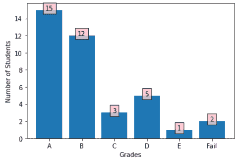

plt.text(ha=’center’,bbox=dict())

读取 [Matplotlib 旋转刻度标签](https://pythonguides.com/matplotlib-rotate-tick-labels/)

**示例:向高度中心的条形图添加文本，并在文本周围添加一个框**

```py
**# Import library** 
import matplotlib.pyplot as plt

**# Function to add text in center with box** 
def addtext(x,y):
    for i in range(len(x)):
        plt.text(i,y[i]//2,y[i], ha = 'center',
                 bbox = dict(facecolor = 'red', alpha =0.8))

**# Main function**

if __name__ == '__main__':

    **# Define data**
    x = ["A","B","C","D","E","Fail"]
    y = [15, 12, 3, 5, 0, 2]

    **# Plot bar chart**
    plt.bar(x, y,color='yellow')

    **# Call function**
    addtext(x, y)       

    **# Define labels**
    plt.xlabel("Grades")
    plt.ylabel("Number of Students")

    **# Display plot**
    plt.show()
```

在上面的例子中，我们在每个条的中心添加了文本框。为此，我们将 `y` 坐标除以 `2` ，并传递 `addtext()` 函数中的值。

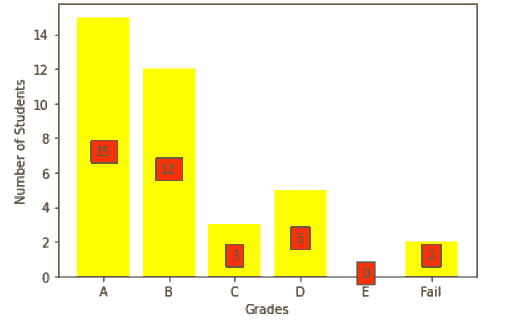

plt.text()

读取 [Matplotlib 改变背景颜色](https://pythonguides.com/matplotlib-change-background-color/)

## 向散点图 matplotlib 添加文本

我们可以在 matplotlib 中向散点图添加文本。

**创建散点图和添加文本的语法如下:**

```py
**# Create scatter plot**
matplotlib.pyplot.scatter(x,y)

**# Add text**
matplotlib.pyplot.text(x,y)
```

*   这里 `scatter()` 方法的 x，y 参数表示数据点的 x，y 坐标。
*   而 `text()` 方法的 x 和 y 参数表示文本的 x 轴和 y 轴点。

**让我们看一个向散点图添加文本的例子:**

```py
**# Importing library** 

import matplotlib.pyplot as plt

**# Define data**

x = [3.5, 2, 3, 4, 5]
y = [2.6, 1, 1.5, 2, 2.6]

annotations=["P1","P2","P3","P4","P5"]

**# Plot scatter**

plt.scatter(x, y,color='black') 

plt.xlabel("X")
plt.ylabel("Y")

**# add text**

for i, label in enumerate(annotations):
    plt.text(x[i], y[i],label,ha='right',size=12,color= 'red') 

**# Display plot**

plt.show()
```

*   在上面的例子中，我们使用 `plt.scatter()` 方法，我们传递 x 和 y 数据点。
*   然后我们使用 `plt.text()` 方法在散点上添加文字。

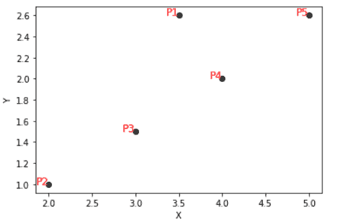

The output to add text in scatter plot

读取 [Matplotlib 散点标记](https://pythonguides.com/matplotlib-scatter-marker/)

## 向 3D 绘图 matplotlib 添加文本

在这一节中，我们将学习如何绘制 3D 图，以及如何向其中添加文本。

**创建 3D 绘图和添加文本的语法:**

```py
**# Create 3D plot**
ax.plot3D(x,y,z)
**# Add text**
ax.text(x,y,z)
```

这里 x，y 和 z 是坐标点。

**我们来看一个与此相关的例子:**

```py
**# Import Library**

from mpl_toolkits import mplot3d
import matplotlib.pyplot as plt

fig = plt.figure()

**# 3D projection**

ax = plt.axes(projection ='3d')

**# Define axes**

z = [0, 1, 2, 3]
x = [4, 5, 6, 7]
y = [1, 8, 9, 5]

**# plotting**

ax.plot3D(x, y, z, 'green')

**# add text** 

ax.text(4, 4,1, "plot a point")

**# display graph**

plt.show()
```

*   在上面的例子中，我们导入了 `mplot3d` 和 `matplot.pyplot` 库。
*   之后，我们定义 3D 投影和 3D 数据点，并通过使用 `plot3D()` 方法创建 3D 绘图。
*   `text()` 方法用于在特定位置添加文本， `show()` 方法用于可视化情节。

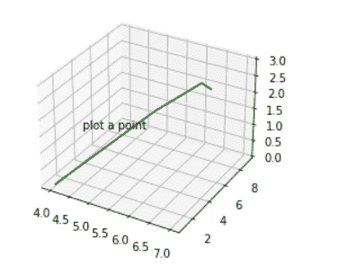

plt.text()

读取 [Matplotlib 虚线](https://pythonguides.com/matplotlib-dashed-line/)

## 在绘图 matplotlib 下添加文本

这里我们学习在 matplotlib 中的地块下添加文本。我们使用 `figtext()` 方法在图形区域添加文本，并在中心设置水平和垂直对齐。

**让我们看一个例子，学习如何将文本绘制到底部:**

```py
**# Import Library**

import matplotlib.pyplot as plt

plt.clf() **# Clear the figure**

**# Define data**

x = [2, 4, 8]
y = [5, 10, 15]

**# Plot graph**

plt.plot(x,y,'o')

**# text**

plt.figtext(0.5,0.01, "Text under the Plot", ha="center", va="center", fontsize=18, bbox={"facecolor":"orange", "alpha":0.5})

**# Plot graph**

plt.show()
```

*   在上面的例子中，我们使用 `fig.text()` 方法在绘图下添加文本，并传递参数 `x = 0.5` 和 `y=0.01` 。
*   我们设置文本框在**中心**的对齐方式。

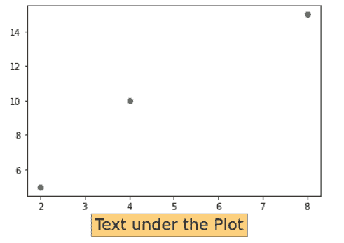

plt.figtext()

读取 [Matplotlib plot_date](https://pythonguides.com/matplotlib-plot-date/)

## 将文本添加到绘图 matplotlib 的顶部

在这里，我们将学习如何在绘图顶部添加文本。

**让我们看一个向图的左上方添加文本的例子:**

```py
**# import library** 
import matplotlib.pyplot as plt

**# Define axes**

left = 0.01
width = 0.9
bottom  = 0.01
height = 0.9
right = left + width
top = bottom + height
ax = plt.gca()

**# Transform axes**

ax.set_transform(ax.transAxes)

**# Define text**

ax.text(left, top, 'left top',
        horizontalalignment='left',
        verticalalignment='top',color='r',size=10,
        transform=ax.transAxes)

**# Display Graph**

plt.show()
```

*   在上面的例子中，我们定义了数据，然后我们使用了 `transform()` 方法。
*   在这之后，我们使用一个 `ax.text()` 方法在图的左上方绘制文本
*   这里我们将**水平对齐**设置为“**左侧”**，将**垂直对齐**设置为**“顶部”**。

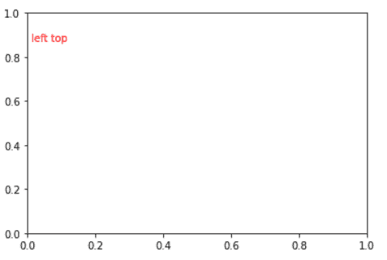

*“Top”*

读取 [Matplotlib 日志日志图](https://pythonguides.com/matplotlib-log-log-plot/)

## 将文本添加到绘图 matplotlib 的底部

在本节中，我们将看到一个**在图**底部添加文本的例子。

图的底部表示在最低位置**。**

**让我们来看一个向图的左下方添加文本的例子:**

```py
**# import library**

import matplotlib.pyplot as plt

**# Define axes**

left = 0.01
width = 0.9
bottom  = 0.01
height = 0.9
right = left + width
top = bottom + height
ax = plt.gca()

**# Transform axes**

ax.set_transform(ax.transAxes)

**# Define text** 

ax.text(left, bottom, 'left bottom',
        horizontalalignment='left',
        verticalalignment='bottom',
        color='r',size=10,
        transform=ax.transAxes)

**# Display Graph**

plt.show()
```

这里我们使用 `ax.text()` 方法在图的**左下方**绘制文本，并将**水平对齐**设置为“**左”**，**垂直对齐**为**“底部”**。

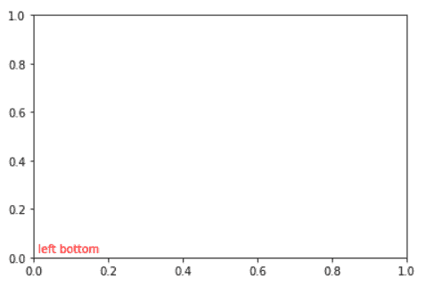

*“Bottom”*

读取[Matplotlib subplots _ adjust](https://pythonguides.com/matplotlib-subplots_adjust/)

## 在绘图 matplotlib 右侧添加文本

这里我们将看到如何在图的右边书写文本。

为了更好地理解，我们来看一个例子:

```py
**# import library**

import matplotlib.pyplot as plt

**# Define axes**

left = 0.01
width = 0.9
bottom  = 0.01
height = 0.9
right = left + width
top = bottom + height
ax = plt.gca()

**# Transform axes**

ax.set_transform(ax.transAxes)

**# Define text**

ax.text(right, top, 'Right Side of the Plot',
        horizontalalignment='right',
        verticalalignment='top',
        color='g',size=15,
        transform=ax.transAxes)

**# Display Graph**

plt.show()
```

这里我们使用 `ax.text()` 方法在图的**右侧**绘制文本，我们将**水平对齐**设置为“**右”**，将**垂直对齐**设置为**“顶部”**。

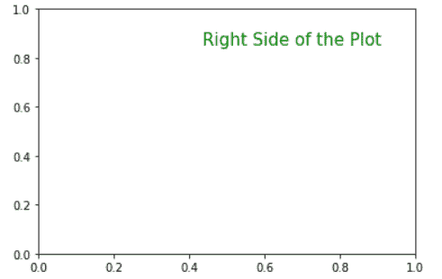

*“Right Side”*

读取 [Matplotlib 最佳拟合线](https://pythonguides.com/matplotlib-best-fit-line/)

## 将文本添加到绘图 matplotlib 的角落

**角**是两条边相交的一侧。我们必须根据自己的适合性在角落设置文本的轴。

**以下是在角上对齐的文本示例:**

```py
**# import library**

import matplotlib.pyplot as plt

**# Define axes**

left = 0.01
width = 0.9
bottom  = 0.01
height = 0.9
right = left + width
top = bottom + height
ax = plt.gca()

box_style=dict(boxstyle='round', facecolor='wheat', alpha=0.5)

**# Transform axes** 
ax.set_transform(ax.transAxes)

**# Define text**

ax.text(0.99, 0.8 , 'Corner',
        horizontalalignment='right',
        rotation='vertical',
        bbox=box_style,
        size=12,
        color='blue',
        transform=ax.transAxes)

**# Display Graph**

plt.show()
```

*   首先，我们导入库并定义数据，然后我们使用 `transform()` 方法。
*   之后，我们使用一个 `ax.text()` 方法在绘图的**角**绘制文本。
*   这里我们将**水平对齐**设置为“**右”**，并且我们添加了一些额外的特性。

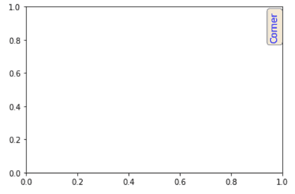

*“Corner”*

阅读 [Matplotlib 另存为 pdf](https://pythonguides.com/matplotlib-save-as-pdf/)

## 将文本添加到绘图 matplotlib 的中心

图的中间称为**中心**位置。在这里，我们将文本设置在左、右、下和上位置的中间，或者我们可以说它正好在图的中间。

**我们来看一个例子:**

```py
**# import library**

import matplotlib.pyplot as plt

**# Define axes**

left = 0.01
width = 0.9
bottom  = 0.01
height = 0.9
right = left + width
top = bottom + height
ax = plt.gca()

**# Transform axes**

ax.set_transform(ax.transAxes)

**# Define text**

ax.text(0.5 * (left + right), 0.5 * (bottom + top), 'I am at the center',
        horizontalalignment='center',
        verticalalignment='center',
        size= 12,
        color='r',
        transform=ax.transAxes)

**# Display Graph**

plt.show()
```

*   这里我们使用 `ax.text()` 方法在图的中间添加文本。
*   我们在图的**中心**设置水平和垂直对齐。
*   我们还通过找到左边和右边的中间**以及底部和顶部的中间**来定义文本的位置。

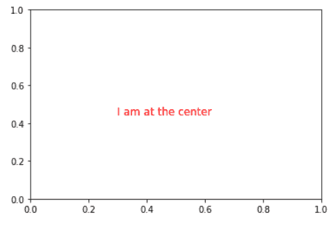

*“Center”*

读取 [Matplotlib set_xticks](https://pythonguides.com/matplotlib-set-xticks/)

## 在绘图 matplotlib 上方添加文本

在本节中，我们将学习在 matplotlib 中的绘图上方添加文本。 `figtext()` 方法用于在图形区域添加文本。

这里我们将水平和垂直对齐设置在中心。

**让我们看一个在情节上方添加文本的例子:**

```py
**# Import Library** 
import matplotlib.pyplot as plt

plt.clf()     **# Clear the current figure** 
**# Define data**

x = [2, 4, 8]
y = [5, 10, 15]

**# Plot graph**

plt.plot(x,y,'o')

**# text**

plt.figtext(0.5,1, "Text above the Plot", ha="center", va="center", fontsize=18, bbox={"facecolor":"r", "alpha":0.5})

**# Plot graph**

plt.show()
```

*   这里我们导入了 `matplotlib.pyplot` 库，之后我们使用 `clf()` 方法来清除图形。
*   我们定义数据点，并使用散点图样式中的 `plot()` 方法绘制它们。
*   `plt.figtext()` 方法用于在绘图上方添加文本，这里我们设置 x 轴= 0.5，y 轴= 1。
*   最后，我们使用 `show()` 方法来可视化情节。

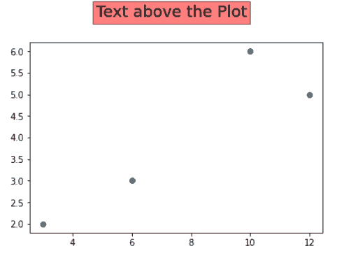

*“Above the plot”*

在本 Python 教程中，我们讨论了**“将文本添加到绘图 matplotlib”**，并且我们还介绍了一些与之相关的例子。这些是我们在本教程中讨论过的以下主题。

*   将文本添加到绘图 matplotlib
*   将文本添加到绘图 matplotlib 示例
*   向绘图 matplotlib 添加多行文本
*   将文本添加到绘图 matplotlib 更改样式
*   添加文本以绘制 matplotlib 数学公式
*   将文本框添加到绘图 matplotlib
*   将文本添加到条形图 matplotlib
*   将文本添加到散点图 matplotlib
*   将文本添加到三维绘图 matplotlib
*   在绘图 matplotlib 下添加文本
*   将文本添加到绘图 matplotlib 的顶部
*   将文本添加到绘图 matplotlib 底部
*   将文本添加到绘图 matplotlib 的右侧
*   将文本添加到绘图 matplotlib 的角上
*   将文本添加到绘图 matplotlib 的中心
*   将文本添加到上面的绘图 matplotlib

[Bijay Kumar](https://pythonguides.com/author/fewlines4biju/)

Python 是美国最流行的语言之一。我从事 Python 工作已经有很长时间了，我在与 Tkinter、Pandas、NumPy、Turtle、Django、Matplotlib、Tensorflow、Scipy、Scikit-Learn 等各种库合作方面拥有专业知识。我有与美国、加拿大、英国、澳大利亚、新西兰等国家的各种客户合作的经验。查看我的个人资料。

[enjoysharepoint.com/](https://enjoysharepoint.com/)[](https://www.facebook.com/fewlines4biju "Facebook")[](https://www.linkedin.com/in/fewlines4biju/ "Linkedin")[](https://twitter.com/fewlines4biju "Twitter")