# 如何用 Python 将两个数相加

> 原文：<https://pythonguides.com/add-two-numbers-in-python/>

[](https://sharepointsky.teachable.com/p/python-and-machine-learning-training-course)

在这个 [python 教程中，](https://pythonguides.com/python-hello-world-program/)你将学习到 **Python 程序添加两个数**，我们还将检查 **:**

*   Python 程序将两个数相加
*   如何在 python 中添加多个数字
*   如何用 python 将两个整数相加
*   Python 程序通过获取用户的输入将两个数字相加
*   使用函数将两个数相加的 Python 程序
*   使用类将两个数相加的 Python 程序
*   Python 程序使用用户定义的函数将两个数相加
*   如何在 python 中通过获取用户输入来添加两个浮点数
*   不使用+运算符将两个数相加的 Python 程序
*   Python 程序将两个二进制数相加
*   如何用 python 将两个复数相加
*   如何在 python 中添加 int 和 float 数
*   如何在 python 中添加两个字符串数字
*   如何用 python 将两个十进制数相加
*   使用类将两个复数相加的 Python 程序
*   使用类和对象将两个数相加的 Python 程序
*   使用 lambda 函数将两个数相加的 Python 程序
*   使用 python 中的函数将两个浮点数相加的程序

目录

[](#)

*   [Python 程序将两个数相加](#Python_program_to_add_two_numbers "Python program to add two numbers")
*   [如何在 python 中添加多个数字](#How_to_add_multiple_numbers_in_python "How to add multiple numbers in python")
*   [python 中如何将两个整数相加](#How_to_add_two_integers_in_python "How to add two integers in python")
*   [Python 程序通过用户输入将两个数相加](#Python_program_to_add_two_numbers_by_getting_input_from_a_user "Python program to add two numbers by getting input from a user")
*   [Python 程序使用函数将两个数相加](#Python_program_to_add_two_numbers_using_functions "Python program to add two numbers using functions")
*   [Python 程序使用类](#Python_program_to_add_two_numbers_using_class "Python program to add two numbers using class")将两个数相加
*   [Python 程序使用用户定义函数将两个数相加](#Python_program_to_add_two_numbers_using_user_defined_function "Python program to add two numbers using user defined function")
*   [如何在 python 中通过获取用户输入来添加两个浮点数](#How_to_add_two_float_number_by_getting_input_from_a_user_in_python "How to add two float number by getting input from a user in python")
*   [Python 程序不使用+运算符将两个数相加](#Python_program_to_add_two_numbers_without_using_operator "Python program to add two numbers without using + operator")
*   [Python 程序将两个二进制数相加](#Python_program_to_add_two_binary_numbers "Python program to add two binary numbers")
*   [如何在 python 中添加两个复数](#How_to_add_two_complex_numbers_in_python "How to add two complex numbers in python")
*   [如何在 python 中添加 int 和 float 数](#How_to_add_int_and_float_numbers_in_python "How to add int and float numbers in python")
*   [如何在 python 中添加两个字符串数字](#How_to_add_two_string_numbers_in_python "How to add two string numbers in python")
*   [如何在 python 中添加两个十进制数](#How_to_add_two_decimal_numbers_in_python "How to add two decimal numbers in python")
*   [Python 程序使用类](#Python_program_to_add_two_complex_numbers_using_class "Python program to add two complex numbers using class")将两个复数相加
*   [Python 程序使用类和对象将两个数相加](#Python_program_to_add_two_numbers_using_class_and_object "Python program to add two numbers using class and object")
*   [Python 程序使用 lambda 函数将两个数相加](#Python_Program_to_add_two_numbers_using_a_lambda_function "Python Program to add two numbers using a lambda function")
*   [使用 python 中的函数将两个浮点数相加的程序](#Program_to_add_two_float_numbers_using_the_function_in_python "Program to add two float numbers using the function in python")

## Python 程序将两个数相加

现在，我们将看到 **python 程序将两个数**相加。

为了在 python 中添加两个数，我们将使用 **" +"操作符**来添加两个数，然后使用 print 来获得输出。

**举例:**

```py
f_Num = 2.0
s_Num = 8.0
Sum = f_Num + s_Num
print("The addition of {0} and {1} is {2}".format(f_Num, s_Num, Sum))
```

我们可以看到输出中两个数的相加是 `10.0` 。您可以参考下面的输出截图。

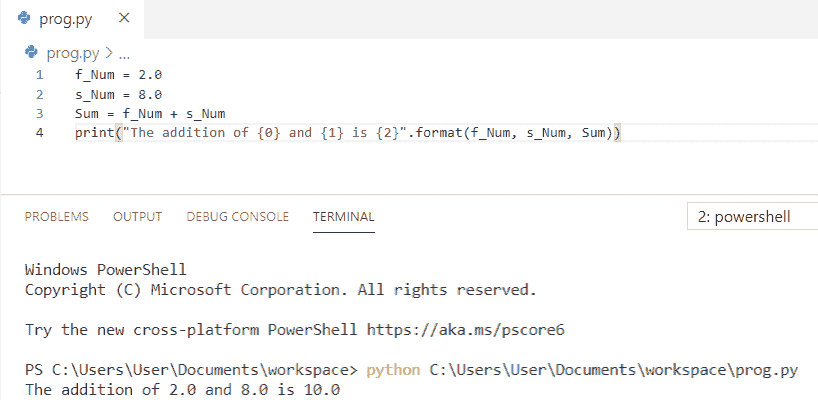

Python program to add two numbers

这就是我们如何在 Python 中把两个数相加。

请看， [Python 程序反转一个字符串的例子](https://pythonguides.com/python-program-to-reverse-a-string/)和[如何打印 Python 斐波那契数列](https://pythonguides.com/python-fibonacci-series/)。

## 如何在 python 中添加多个数字

在这里，我们可以看到**如何在 python** 中添加多个数字。

*   在这个例子中，我们采用了三个变量作为 `f_Num` 、 `s_Num` 和 **t_Num、**，并且在 python 中使用了 **" +"运算符**来将多个数字相加。
*   `Sum = f_Num + s_Num + t_Num` 用于计算总和
*   **打印**用于获取输出。

**举例:**

```py
f_Num = 2.0
s_Num = 8.0
t_Num = 5.0
Sum = f_Num + s_Num + t_Num
print("The addition of {0}, {1} and {2} is {3}".format(f_Num, s_Num, t_Num, Sum))
```

我们可以看到输出中多个数字的相加是 `15.0` 。您可以参考下面的输出截图。

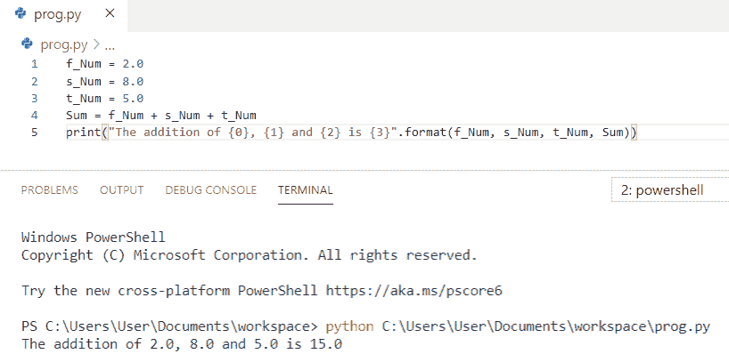

How to add multiple numbers in python

这就是我们如何在 Python 中**添加多个数字。**

## python 中如何将两个整数相加

让我们看看**如何用 python** 将两个整数相加。

在 python 中，要将两个整数相加，我们需要两个整数数据类型的数字，然后将这两个数字相加。为了得到输出，我使用了 `print(sum)` 。

**举例:**

```py
num1 = 10
num2 = 25
sum = num1 + num2
print("The addition of two integers is: ",sum)
```

我们可以看到 python 中两个整数的相加在输出中是 `35` 。您可以参考下面的输出截图。

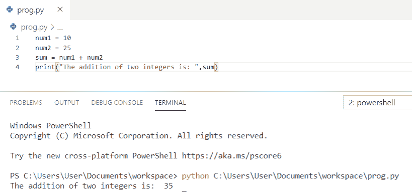

How to add two integers in python

这是 Python 程序将 Python 中的两个整数**相加。**

你可能喜欢， [Python 程序打印质数](https://pythonguides.com/python-program-to-print-prime-numbers/)。

## Python 程序通过用户输入将两个数相加

在这里，我们将看到 **python 程序通过从用户**获得输入来将两个数字相加。

*   在本例中，我们将要求**用户输入两个数字**，然后使用 `sum = int(num1) + int(num2` )来计算用户给出的两个数字的总和。
*   为了得到输出，我使用了**print(' 0 和 1 的相加是{2} ')。格式(num1，num2，sum))** 。

**举例:**

```py
num1 = input('Enter the first number: ')
num2 = input('Enter the second number: ')
sum = int(num1) + int(num2)
print('The addition of {0} and {1} is {2}'.format(num1, num2, sum))
```

我们可以看到输出中两个数的相加是 `80` 。您可以参考下面的输出截图。

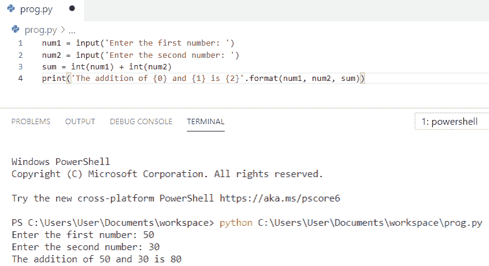

Python program to add two numbers by getting input from a user

这是 python 代码，通过从 Python 中的用户获取输入来将两个数字相加。

## Python 程序使用函数将两个数相加

现在，我们将看到 **python 程序使用函数**将两个数字相加。

*   首先，我们将定义一个函数为 **def add_number(n1，n2)** 。
*   `sum = n1 + n2` 用于加法，**返回 sum** 将返回值
*   我们将变量声明为 `num1` 和 `num2`
*   最后，使用 `print` 调用函数，我们将得到输出。

**举例:**

```py
def add_number(n1,n2):
    sum = n1 + n2;
    return sum;
num1 = 30
num2 = 20
print("The sum of two number is",add_number(num1,num2))
```

我们可以在输出中看到两个数之和是 `50` 。您可以参考下面的输出截图。

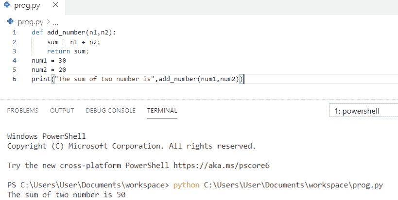

Python program to add two numbers using functions

这就是如何使用 Python 中的函数**将两个数相加。**

查看，[如何在 Python](https://pythonguides.com/read-video-frames-in-python/) 和 [Python 程序中读取视频帧以打印数组中的元素](https://pythonguides.com/python-program-to-print-element-in-an-array/)

## Python 程序使用类将两个数相加

在这里，我们将看到 **python 程序使用类**将两个数字相加。

*   在这个程序中，我们将类定义为 `add` ，并将**函数**定义为 **def findsum(self，n1，n2)**
*   `sum = n1 + n2` 用于加法，**返回 sum** 将返回值。
*   我们将变量声明为 `n1` 和 `n2`
*   在这里，对象被创建，打印被用来获得输出。

**举例:**

```py
class add:
    def findsum(self, n1, n2):
        sum = n1 + n2
        return sum
n1 = 100
n2 = 50
Obj = add()
sum =Obj.findsum(n1, n2)
print("The sum of two numbers is: ", sum)
```

我们可以在输出中看到两个数之和是 `150` 。您可以参考下面的输出截图。

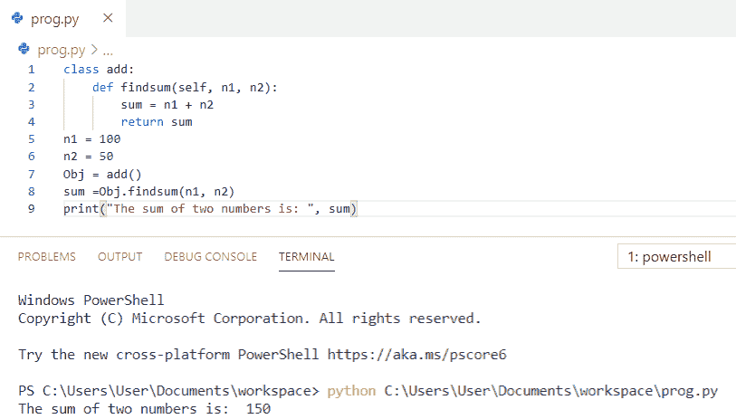

Python program to add two numbers using class

这是使用类将两个数相加的 **Python 程序。**

## Python 程序使用用户定义函数将两个数相加

让我们看看使用用户定义函数将两个数字相加的 **python 程序。**

*   **用户自定义函数**是我们定义的执行某个特定任务的函数。
*   因此，我们将函数定义为 `add_num()` ，它将两个数相加并返回结果。
*   `sum = n1 + n2` 用于加法，**返回 sum** 将返回值。
*   最后，使用 `print` 调用函数，我们将得到输出

**举例:**

```py
def add_num(n1,n2):
   sum = n1 + n2
   return sum
num1 = 25
num2 = 35
print("The sum of two number is: ", add_num(num1, num2))
```

我们可以在输出中看到两个数之和是 `60` 。您可以参考下面的输出截图。

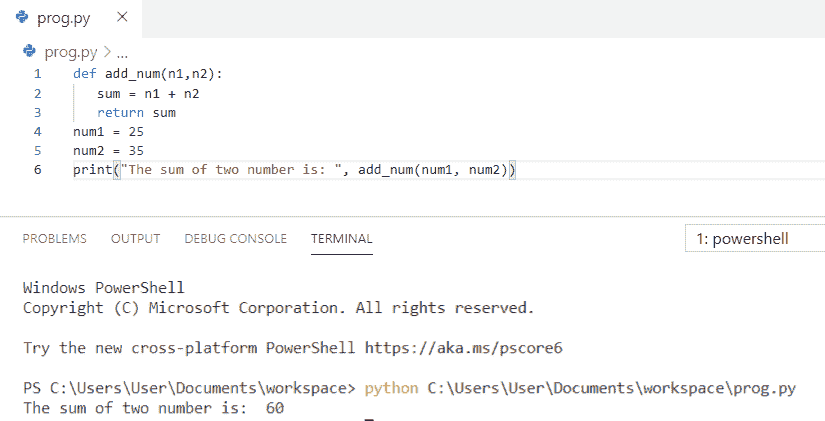

Python program to add two numbers using user defined function

这就是如何使用 Python 中的用户定义函数将两个数**相加。**

另外，查看一下， [Python 二叉树实现](https://pythonguides.com/python-binary-tree/)和 [Python 连接列表示例](https://pythonguides.com/python-concatenate-list/)。

## 如何在 python 中通过获取用户输入来添加两个浮点数

现在，我们将看到**如何通过 python** 中的用户输入来添加两个浮点数

*   在本例中，我们将要求**用户输入两个数字**，然后使用 `sum = float(n1) + float(n2` )来计算用户给出的两个浮点数的总和。
*   最后用 `print` 得到输出。

**举例:**

```py
n1 = input("Enter first number: ")
n2 = input("Enter second number: ")
sum = float(n1) + float(n2)
print("Sum:", sum)
```

我们可以看到输出中两个浮点数的相加是 `21.0` 。您可以参考下面的输出截图。

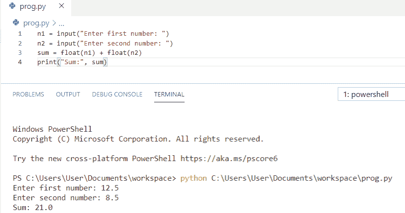

How to add two float number by getting input from a user in python

这是 Python 程序**通过从 python** 中的用户获得输入来添加两个浮点数。

## Python 程序不使用+运算符将两个数相加

这里，我们将看到 **python 程序在不使用+运算符**的情况下将两个数相加

*   首先，我们将定义一个函数为 **def add(n1，n2)**
*   While 用于迭代，直到没有进位
*   **进位位**可以通过执行两位的**、&、**得到
*   并且通过执行 **XOR(^)** 可以获得两位的**和**
*   **n2 =进位<1**这里进位移位一位，因此将其加到 n1 上得到所需的和
*   最后，调用函数，输出就会显示出来。

**举例:**

```py
def add(n1, n2):
    while (n2 != 0):
        carry = n1 & n2
        n1 = n1 ^ n2
        n2 = carry << 1
    return n1
print(add(45, 25))
```

我们可以看到输出中两个数的相加是 `70` 。您可以参考下面的输出截图。

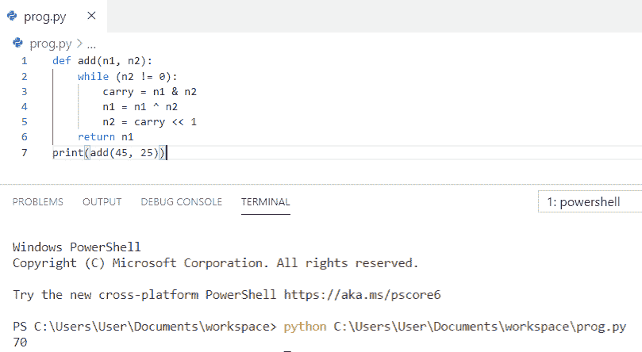

Python program to add two numbers without using + operator

上面的代码，我们可以在 Python 中不使用+运算符的情况下，用 to **将两个数相加。**

您可能喜欢， [Python 字符串格式化示例](https://pythonguides.com/python-string-formatting/)

## Python 程序将两个二进制数相加

现在，我们将看到 **python 程序将两个二进制数**相加。

*   在这个例子中，我们使用了两个内置函数 `int()` 和 `bin()`
*   首先，我们取了两个变量 `n1` 和 `n2`
*   `int()` 函数根据提供的基值将给定的字符串转换成整数。
*   我们将二进制值的字符串转换成整数，因此我们将基值**作为 2** 传递。二进制数的基数是 2。
*   之后，字符串被转换成一个整数值，然后我们将它们相加，使用 **bin()函数**将结果转换成一个二进制数。

**举例:**

```py
n1 = '00010'
n2 = '10010'
sum = bin(int(n1,2) + int(n2,2))
print(sum)
```

我们可以看到输出中两个二进制数的相加是 `0b10100` 。您可以参考下面的输出截图。

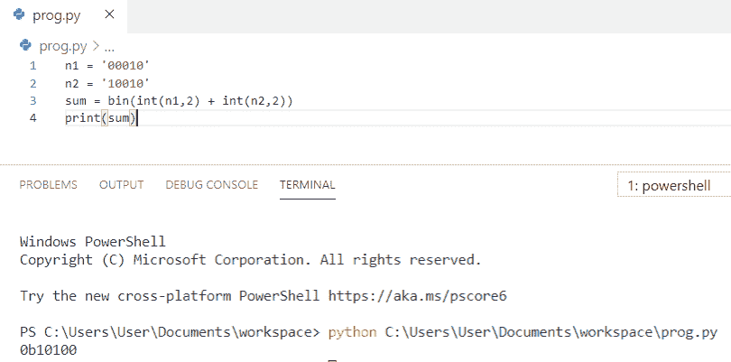

Python program to add two binary numbers

这就是如何在 Python 中**将两个二进制数相加。**

## 如何在 python 中添加两个复数

让我们看看**如何用 python** 将两个复数相加。

*   在这个例子中，我们将取两个复数**即 `x = (10+2j)` 和 `y = (12+6j)` 。**
*   `sum = x + y` 求它们的和**打印(sum)** 用于得到输出。

**举例:**

```py
x = (10+2j)
y = (12+6j)
sum = x + y
print(sum)
```

我们可以看到输出中两个复数的相加是 `(22+8j)` 。您可以参考下面的输出截图。

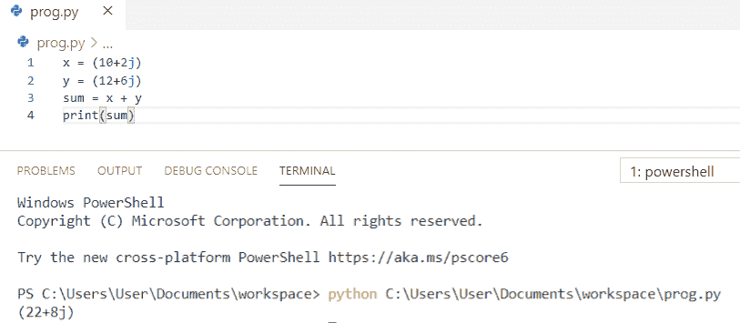

How to add two complex numbers in python

这就是如何在 python 中**将两个复数相加。**

请看， [Python 用示例](https://pythonguides.com/python-concatenate-tuples/)连接元组。

## 如何在 python 中添加 int 和 float 数

在这里，我们将看到**如何在 python** 中添加 int 和 float 数

*   首先，我们将获取一个数据类型为 `int` 的变量 `n1` ，以及另一个保存数据类型为 `float` 的变量 `n2` 。
*   当我们将两个不同数据类型的数字相加时，较低的数据类型被提升为较高的数据类型，这是隐式发生的。在这里，int 被提升为 float。
*   然后我们将使用 **+运算符**添加 `n1` 和 `n2`
*   最后用 `print` 得到输出。

**举例:**

```py
n1 = 10
n2 = 2.0
sum = n1 + n2
print('The addition of {0} and {1} is {2}'.format(n1, n2, sum))
```

我们可以看到输出中 int 和 float 数的和是 `12.0` 。您可以参考下面的输出截图。

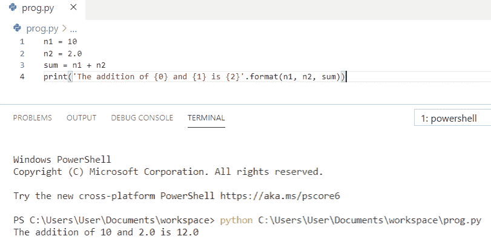

How to add int and float numbers in python

上面的代码，我们可以用来在 python 中**加 int 和 float 数。**

## 如何在 python 中添加两个字符串数字

我们来看看**如何在 python** 中将两个字符串数字相加。

*   首先，我们将定义一个函数为 **def Sum(first，second)**
*   我们有一个变量叫做 `f_num = "200"` 和 `s_num = "100"` ，这是一个字符串
*   为了将**字符串**转换为 `int` ，我们有一个名为 `int()` 的内置方法
*   之后，它将返回数字的总和
*   现在，调用方法 `Sum` 并打印输出。

**举例:**

```py
def Sum(first,second):
  return int(first) + int(second)
f_num = "200"
s_num = "100"
print(Sum(f_num,s_num))
```

我们可以在输出中看到两个字符串数字的相加是 `300` 。您可以参考下面的输出截图。

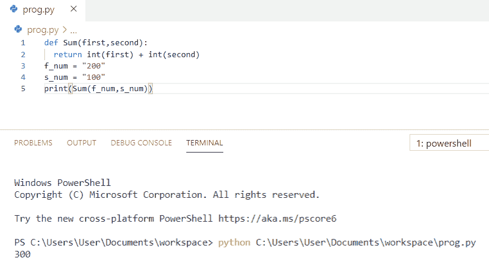

How to add two string numbers in python

我们可以用 Python 中的这段代码将两个字符串数字相加。

另外，你可能会喜欢，[如何在 python](https://pythonguides.com/concatenate-strings-in-python/) 中连接字符串。

## 如何在 python 中添加两个十进制数

在这里，我们将看到**如何用 python** 将两个十进制数相加。

*   在这个例子中，我们取了两个变量作为 `Num1` 和 `Num2`
*   为了计算两个十进制数的和，我们将使用 **+运算符**将 `Num1` 和 `Num2` 相加
*   最后， `print(float(add))` 得到输出。

**举例:**

```py
Num1 = 3.3
Num2 = 2.5
add = Num1 + Num2
print(float(add))
```

我们可以看到输出中两个十进制数的相加是 `5.8` 。您可以参考下面的输出截图。

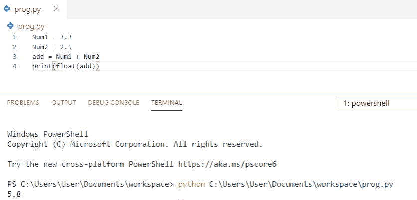

How to add two decimal numbers in python

这就是我们如何在 python 中把两个十进制数相加。

## Python 程序使用类将两个复数相加

现在，我们将看到 **python 程序使用类**将两个复数相加。

*   首先，我们将声明一个类**“Complex”**，它将存储复数的实部和虚部。
*   这个类有三个方法
*   第一个 `initComplex()` 方法帮助初始化它们，它将要求复数的实部和虚部。
*   第二个 `display()` 方法允许将它们显示到输出屏幕上。
*   而第三种方法是 `sum()` ，会帮助把参数中传递的两个复数相加。

**举例:**

```py
class Complex ():
    def initComplex(self):
        self.real = int(input("Enter the Real Part: "))
        self.imag = int(input("Enter the Imaginary Part: "))            
    def display(self):
        print(self.real,"+",self.imag,"i", sep="")
    def sum(self, C1, C2):
        self.real = C1.real + C2.real
        self.imag = C1.imag + C2.imag
C1 = Complex()
C2 = Complex()
C3 = Complex()
print("Enter first Complex number")
C1.initComplex()
print("First Complex Number: ", end="")
C1.display()
print("Enter second Complex number")
C2.initComplex()
print("Second Complex Number: ", end="")
C2.display()
print("Sum of two complex numbers is ", end="")
C3.sum(C1,C2)
C3.display()
```

我们可以在输出中看到使用 class is `20+10i` 将两个复数相加。您可以参考下面的输出截图。

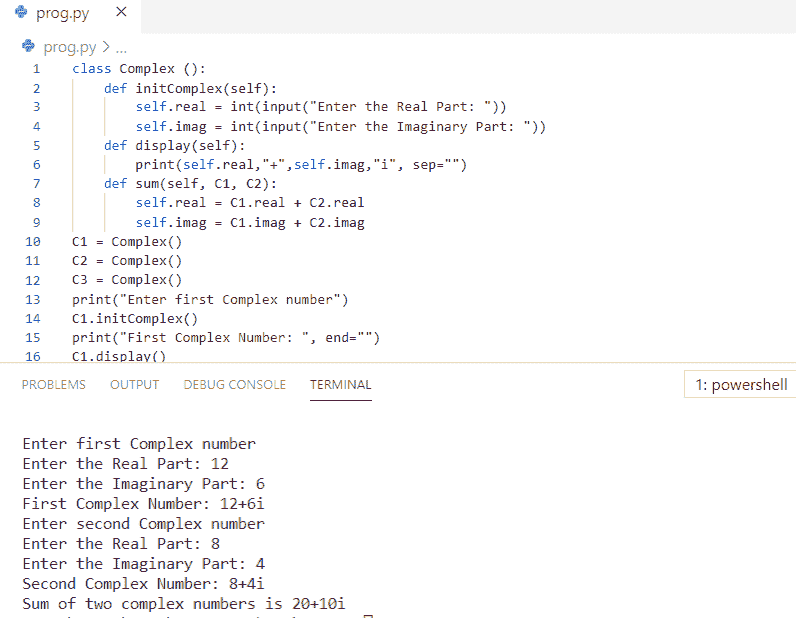

Python program to add two complex numbers using class

这就是我们如何使用 Python 中的类将两个复数相加。

还有，看看， [Python 串联字典+例子](https://pythonguides.com/python-concatenate-dictionary/)。

## Python 程序使用类和对象将两个数相加

在这里，我们将看到 **python 程序使用类和对象**将两个数相加

*   在这个程序中，我们有一个类叫做 `Add` ，我们定义了**函数**为 **def sum(self，x，y)**
*   `z = x + y` 用于加法，**返回** `z` 将返回值。
*   我们已经将变量声明为 `x` 和 `y`
*   在这里，对象被创建，打印被用来获得输出。

**举例:**

```py
class Add:
    def sum(self, x, y):
        z = x + y
        return z
x = int(input("Enter first number:"))
y = int(input("Enter second number:"))
obj = Add()
z = obj.sum(x, y)
print("Addition of two number is:", z)
```

我们可以看到在输出中使用类和对象将两个数相加是 80。您可以参考下面的输出截图。

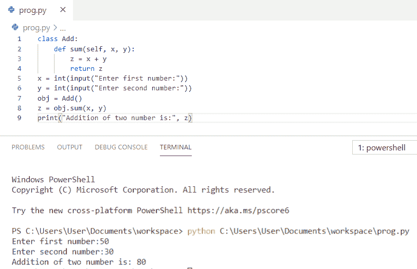

Python program to add two numbers using class and object

这就是如何使用 Python 中的类和对象**将两个数相加。**

## Python 程序使用 lambda 函数将两个数相加

让我们看看使用 lambda 函数将两个数字相加的 **python 程序。**

*   在这个例子中，我们将使用****λ**函数将两个数相加**
*   **现在，我们将要求用户输入两个数字。**
*   **双参数用于执行加法，我们必须调用 lambda 函数将用户输入的两个数相加。**

 ****举例:**

```py
z = lambda n1, n2: n1 + n2
n1 = int(input("Enter first number:"))
n2 = int(input("Enter second number:"))
result = z(n1, n2)
print("The addition of two number is:", result)
```

我们可以看到，在输出中，使用 lambda 函数将两个数字相加的结果是 `60` 。您可以参考下面的输出截图。

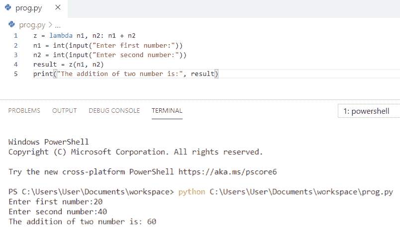

Python Program to add two numbers using a lambda function

这是使用 Python 中的 lambda 函数将两个数相加的 Python 代码。

你可能喜欢， [Python 串联数组](https://pythonguides.com/python-concatenate-arrays/)。

## 使用 python 中的函数将两个浮点数相加的程序

这里，我们将看到**程序使用 python** 中的函数将两个浮点数相加。

*   首先，我们为加法定义了一个**函数**。
*   **返回总和**将返回值
*   现在，我们将要求用户输入两个数字。因此，我们可以使用 `float()` 函数将字符串转换为浮点。
*   最后，我们将调用该函数，并显示输出。

**举例:**

```py
def add(n1,n2):
    sum = n1+n2;
    return sum;
number1=float(input("Enter the first number: "))
number2=float(input("Enter the second number: "))
print("The addition of two float number is",add(number1,number2))
```

我们可以在输出中看到使用函数 is `33.1` 将两个浮点数相加。您可以参考下面的输出截图。

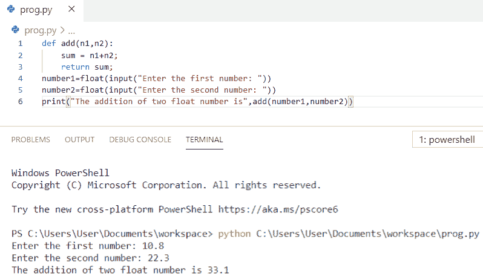

Program to add two float numbers using the function in python

这是如何使用 Python 中的函数将两个浮点数相加。

你可能喜欢， [Python 程序求 n 个数之和的例子](https://pythonguides.com/python-program-to-find-sum-of-n-numbers/)

在本 Python 教程中，我们学习了将两个数相加的 **Python 程序。此外，我们还讨论了以下主题:**

*   Python 程序将两个数相加
*   如何在 python 中添加多个数字
*   如何用 python 将两个整数相加
*   Python 程序通过获取用户的输入将两个数字相加
*   使用函数将两个数相加的 Python 程序
*   使用类将两个数相加的 Python 程序
*   Python 程序使用用户定义的函数将两个数相加
*   如何在 python 中通过获取用户输入来添加两个浮点数
*   不使用+运算符将两个数相加的 Python 程序
*   Python 程序将两个二进制数相加
*   如何用 python 将两个复数相加
*   如何在 python 中添加 int 和 float 数
*   如何在 python 中添加两个字符串数字
*   如何用 python 将两个十进制数相加
*   使用类将两个复数相加的 Python 程序
*   使用类和对象将两个数相加的 Python 程序
*   使用 lambda 函数将两个数相加的 Python 程序
*   使用 python 中的函数将两个浮点数相加的程序

[Bijay Kumar](https://pythonguides.com/author/fewlines4biju/)

Python 是美国最流行的语言之一。我从事 Python 工作已经有很长时间了，我在与 Tkinter、Pandas、NumPy、Turtle、Django、Matplotlib、Tensorflow、Scipy、Scikit-Learn 等各种库合作方面拥有专业知识。我有与美国、加拿大、英国、澳大利亚、新西兰等国家的各种客户合作的经验。查看我的个人资料。

[enjoysharepoint.com/](https://enjoysharepoint.com/)[](https://www.facebook.com/fewlines4biju "Facebook")[](https://www.linkedin.com/in/fewlines4biju/ "Linkedin")[](https://twitter.com/fewlines4biju "Twitter")**