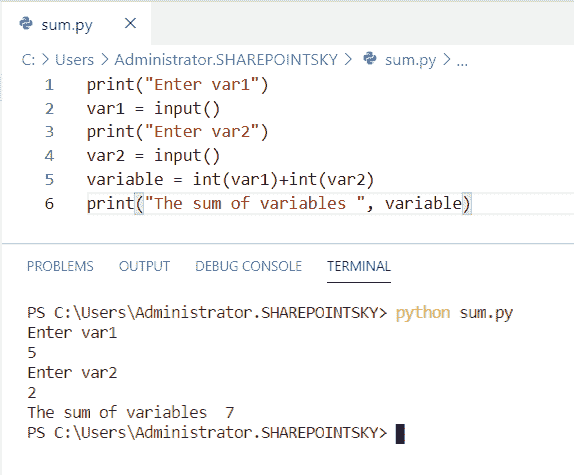
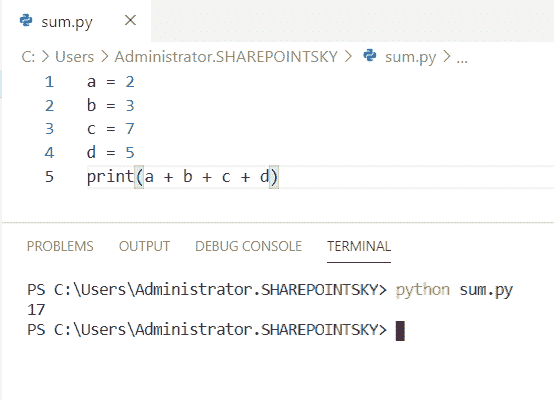
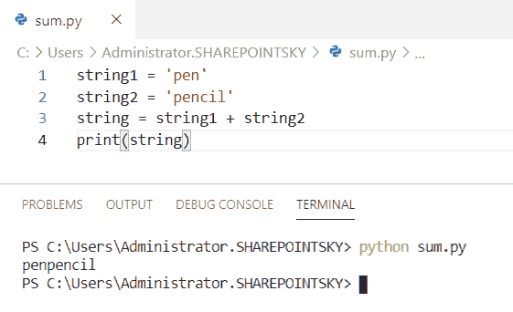
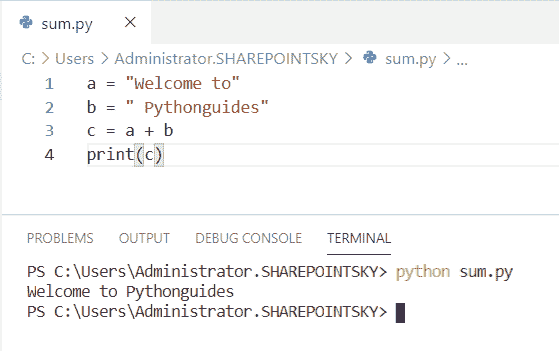
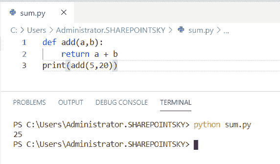
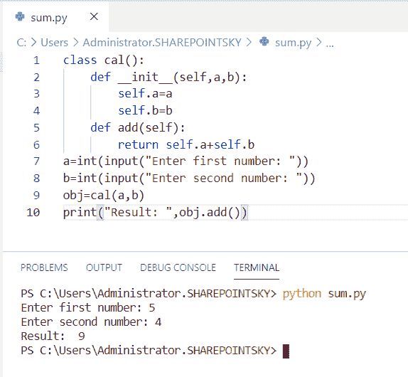
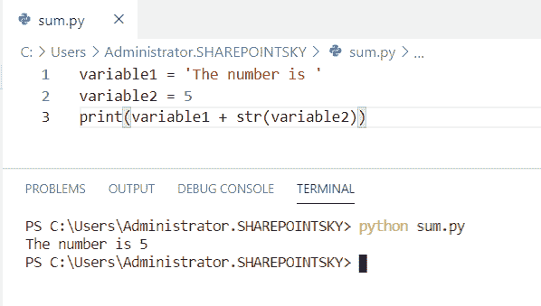

# 如何在 Python 中添加两个变量

> 原文：<https://pythonguides.com/add-two-variables-in-python/>

[](https://sharepointsky.teachable.com/p/python-and-machine-learning-training-course)

在这个 [python 教程中，](https://pythonguides.com/python-hello-world-program/)你将学习**如何在 python 中添加两个变量**，我们也将检查 **:**

*   如何在 python 中添加两个变量
*   如何在 python 中添加多个变量
*   如何在 python 中组合两个变量
*   如何在 python 中添加两个字符串变量
*   如何用函数将两个变量相加
*   如何使用 python 中的类将两个数相加
*   在 python 中追加两个变量

目录

[](#)

*   [如何在 Python 中添加两个变量](#How_to_add_two_variables_in_Python "How to add two variables in Python")
*   [如何在 python 中添加多个变量](#How_to_add_multiple_variables_in_python "How to add multiple variables in python")
*   [如何在 Python 中添加两个字符串变量](#How_to_add_two_string_variables_in_Python "How to add two string variables in Python")
*   [如何在 python 中组合两个变量](#How_to_combine_two_variables_in_python "How to combine two variables in python")
*   [如何使用函数](#How_to_add_two-variable_using_function "How to add two-variable using function")添加两个变量
*   [如何使用 Python 中的类将两个数相加](#How_to_add_two_numbers_using_class_in_Python "How to add two numbers using class in Python ")
*   [添加 int 和 string 变量](#Add_int_and_string_variables "Add int and string variables")

## 如何在 Python 中添加两个变量

这里可以看到**如何在 python 中添加两个变量**。

*   在这个例子中，我使用了 print 语句来输入一个变量。
*   我采用了一个 `input()` 来存储用户给定的输入值。
*   `"+"` 运算符用于将变量相加。
*   **print("变量之和"，变量)**用来得到输出。

示例:

```py
print("Enter var1")
var1 = input()
print("Enter var2")
var2 = input()
variable = int(var1)+int(var2)
print("The sum of variables ", variable)
```

我们可以看到变量的和是 `7` 作为输出。您可以参考下面的输出截图。



How to add two variables in python

这就是如何在 Python 中**添加两个变量。**

看看，[如何在 Python 中添加两个数](https://pythonguides.com/add-two-numbers-in-python/)和[如何在 Python 中创建一个字符串](https://pythonguides.com/create-a-string-in-python/)。

## 如何在 python 中添加多个变量

这里可以看到**如何在 python 中添加多个变量**。

*   在这个例子中，我取了四个变量，像 **a，b，c，d** 。
*   我已经使用了 `"+"` 操作符来添加多个变量。
*   我已经用 `print(a + b + c + d)` 得到了输出。

示例:

```py
a = 2
b = 3
c = 7
d = 5
print(a + b + c + d)
```

我们可以将所有变量的总和视为输出。您可以参考下面的输出截图。



How to add multiple variables in python

这段代码，我们可以用**如何在 Python** 中添加多个变量。

你可能喜欢， [Python 检查变量是否是整数](https://pythonguides.com/python-check-if-the-variable-is-an-integer/)。

## 如何在 Python 中添加两个字符串变量

现在，我们可以看到**如何在 python 中添加两个字符串变量**。

*   在这个例子中，我取了两个字符串作为**字符串 1** 和**字符串 2** 。
*   **字符串 1** 被指定为**笔**，而**字符串 2** 被指定为**铅笔**。
*   我使用了 `"+"` 操作符来添加字符串。
*   我已经用 `print(string)` 得到了输出。

示例:

```py
string1 = 'pen'
string2 = 'pencil'
string = string1 + string2
print(string)
```

下面的截图显示了输出。



How to add two string variables in python

这是代码，我们可以用来在 Python 中**添加两个字符串变量。**

## 如何在 python 中组合两个变量

这里可以看到**如何在 python 中组合两个变量**。

*   在这个例子中，我取了两个变量作为 `a` 和 `b` 。
*   变量 a 被赋值为 `a = "Welcome to"` ，变量 b 被赋值为 `b = " Pythonguides"` 。
*   为了组合这两个变量，我使用了 `"+"` 操作符。
*   为了得到输出，我使用了 `print(c)` 。

示例:

```py
a = "Welcome to"
b = " Pythonguides"
c = a + b
print(c)
```

我们可以看到两个字符串被合并为输出。您可以参考下面的输出截图。



How to combine two variables in python

这就是**如何在 python**n 中组合两个变量。

看看， [Python 写变量到文件](https://pythonguides.com/python-write-variable-to-file/)和[如何在 Python 中创建变量](https://pythonguides.com/create-python-variable/)。

## 如何使用函数添加两个变量

现在，我们可以看到**如何使用 python 中的函数**添加两个变量。

*   在这个例子中，我定义了一个函数为 `def add` ，并将参数传递为 **(a，b)** 。
*   该函数与表达式一起返回。要添加的值在函数中调用。
*   我已经用 **print(add(5，20))** 得到了输出。

示例:

```py
def add(a,b):
    return a + b
print(add(5,20))
```

两个变量之和就是输出。您可以参考下面的输出截图。



How to add two-variable using function

这是代码，**如何在 Python** 中使用函数添加两个变量。

## 如何使用 Python 中的类将两个数相加

在这里，我们可以看到**如何使用 python 中的类**将两个数相加。

*   在这个例子中，我创建了一个**类**,使用一个构造函数来初始化这个类的值
*   我已经创建了一个方法来将这些数字相加。
*   我将两个数字作为输入，并为该类创建了一个对象来传递参数。
*   `self` 是用于将属性和方法传递给类的关键字。
*   为了得到输出，我使用了 **print("Result:"，obj.add())** 。

示例:

```py
class cal():
    def __init__(self,a,b):
        self.a=a
        self.b=b
    def add(self):
        return self.a+self.b
a=int(input("Enter first number: "))
b=int(input("Enter second number: "))
obj=cal(a,b)
print("Result: ",obj.add())
```

我们可以将数字之和视为输出。您可以参考下面的输出截图。



How to add two numbers in python using class

这段代码我们可以用来使用 Python 中的类将两个数相加。

查看，[如何使用 Python Tkinter](https://pythonguides.com/create-countdown-timer-using-python-tkinter/) 创建倒计时定时器。

## 添加 int 和 string 变量

这里可以看到**如何在 Python 中添加 int 和 string 变量**。

*   在这个例子中，我取了两个变量作为变量 1 和变量 2。
*   将**变量 1** 赋值为**，编号为’**，将**变量 2** 赋值为 `5` 。
*   为了将 int 值转换成字符串，我使用了 `str(variable2)` 。
*   我已经用`print(variable 1+str(variable 2))`得到了输出。

示例:

```py
variable1 = 'The number is '
variable2 = 5
print(variable1 + str(variable2))
```

您可以参考下面的输出截图。



Add int and string variable

这就是我们如何在 Python 中添加 int 和 string 变量。

另外，你可能喜欢用 [Python 程序来反转一个字符串，用](https://pythonguides.com/python-program-to-reverse-a-string/)和 [Python 程序来打印质数](https://pythonguides.com/python-program-to-print-prime-numbers/)。

在本 Python 教程中，我们学习了在 python 中添加两个变量**。此外，我们还讨论了以下主题:**

*   如何在 python 中添加两个变量
*   如何在 python 中添加多个变量
*   如何在 python 中组合两个变量
*   如何在 python 中添加两个字符串变量
*   如何用函数将两个变量相加
*   如何使用 python 中的类将两个数相加
*   在 python 中追加两个变量

[Bijay Kumar](https://pythonguides.com/author/fewlines4biju/)

Python 是美国最流行的语言之一。我从事 Python 工作已经有很长时间了，我在与 Tkinter、Pandas、NumPy、Turtle、Django、Matplotlib、Tensorflow、Scipy、Scikit-Learn 等各种库合作方面拥有专业知识。我有与美国、加拿大、英国、澳大利亚、新西兰等国家的各种客户合作的经验。查看我的个人资料。

[enjoysharepoint.com/](https://enjoysharepoint.com/)[](https://www.facebook.com/fewlines4biju "Facebook")[](https://www.linkedin.com/in/fewlines4biju/ "Linkedin")[](https://twitter.com/fewlines4biju "Twitter")