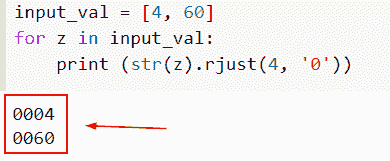
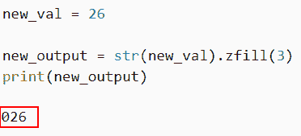
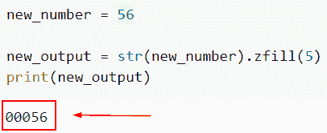
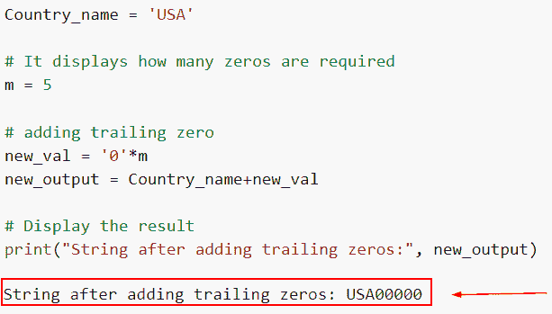
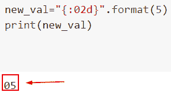
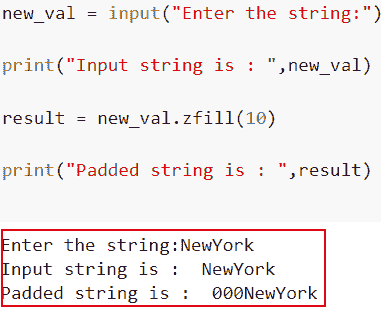
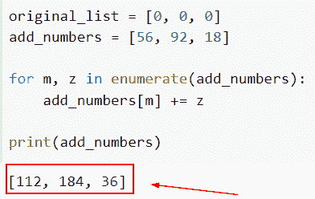

# Python 中如何在数字前加零

> 原文：<https://pythonguides.com/add-zeros-before-a-number-in-python/>

[](https://sharepointsky.teachable.com/p/python-and-machine-learning-training-course)

这里我们将讨论如何在 Python 中的数字前**加零。简单地说，添加意味着在给定字符串的左侧或右侧添加无关紧要的字符，我们还将讨论以下主题。**

*   Python 在数字前加零
*   Python 在数字前加零
*   Python 在整数前加零
*   Python 向数字添加尾随零
*   Python 为数字添加前导零
*   Python 在用户输入的数字前添加零
*   Python 向列表中添加一个数字

目录

[](#)

*   [Python 在数字前加零](#Python_add_zeros_before_the_number "Python add zeros before the number")
*   [Python 在数字前加零](#Python_add_zeros_in_front_of_a_number "Python add zeros in front of a number")
*   [Python 在整数前加零](#Python_add_zeros_before_integer "Python add zeros before integer")
*   [如何在 Python 中给数字添加尾随零](#How_to_add_trailing_zeros_to_a_number_in_Python "How to add trailing zeros to a number in Python")
*   [Python 为数字添加前导零](#Python_add_leading_zeros_to_a_number "Python add leading zeros to a number")
*   [Python 在用户输入的数字前加零](#Python_add_zeros_before_the_number_with_user_input "Python add zeros before the number with user input")
*   [Python 给列表添加一个数字](#Python_add_a_number_to_list "Python add a number to list")

## Python 在数字前加零

*   在本节中，我们将讨论如何在 Python 中在数字前添加零。
*   通过 rjust()函数将填充添加到字符串的左侧。简单来说，填充就是在给定字符串的左侧或右侧添加无关紧要的字符，而不改变原始字符串的含义。为了在 Python 程序中显示前导零，我们可以利用字符串填充。
*   两个参数组成了 rjust()函数:width 和 fill char。在这两个参数中，width 参数是必需的，用于指示填充过程之后所提供的字符串的长度。
*   下面是一个示例程序，它解释了如何使用本示例中的每种方法来显示数字 1 和 10 以及前导零。rjust()函数允许用户直接选择需要多少填充。

**举例**:

```py
input_val = [4, 60]
for z in input_val:
    print (str(z).rjust(4, '0'))
```

在本例中，我们创建了一个列表，并为其分配了整数值。接下来，我们使用 for 循环迭代值，我们还使用了 rjust()函数，该函数将在整数之前添加零值。

下面是以下给定代码的实现



Python add zeros before the number

这就是如何在 Python 中的数字前**加零。**

阅读[如何在 Python 中找到完全数](https://pythonguides.com/perfect-number-in-python/)

## Python 在数字前加零

*   在这个例子中，我们将讨论如何在 Python 中在数字前加零。
*   通过使用 zfill()函数，我们可以很容易地使用零填充字符串到给定的长度。
*   需要填充的字符串长度(不一定是零的总数)是 zfill 的参数。因此，在规定中，如果你的字符串已经包含 5 个字符，它不会附加任何零。

**举例**:

```py
new_val = 26

new_output = str(new_val).zfill(3)
print(new_output)
```

在下面给定的代码中，我们已经定义了变量并分配了整数。接下来，我们使用 zfill()函数，通过在字符串的开头添加 0，可以用前导零填充字符串。

下面是以下代码的截图



Python add zeros in front of a number

正如你在截图中看到的，我们已经了解了如何在 Python 中在数字前添加零值。

## Python 在整数前加零

*   在这一节中，我们将讨论如何在 Python 中的整数前**加零。**
*   `zfill()` 方法可用于在字符串的开头添加 0，使其达到所需的长度，从而用前导零填充字符串。实际上，我们应用了左填充技术，它输出带填充的字符串，并接受字符串的大小作为参数。
*   在这个例子中，我们必须在整数前加零。要填充的字符串的长度，不一定是要添加的零的总数，是 zfill 的参数。

**举例**:

```py
new_number = 56

new_output = str(new_number).zfill(5)
print(new_output)
```

在下面给出的代码中，我们首先声明一个整数值，并将其赋给一个‘new _ number’变量。

接下来，我们使用 str 类将数字转换为字符串，同时使用 zfill()函数，在该函数中，我们将整数值作为参数传递，该参数显示我们希望在数字前添加多少个零。

下面是以下给定代码的实现



Python add zeros before integer

这就是我们如何在 Python 中在整数前加零。

阅读[如何在 Python 中反转一个数字](https://pythonguides.com/reverse-a-number-in-python/)

## 如何在 Python 中给数字添加尾随零

*   这里我们将讨论如何在 Python 中**给数字添加尾随零。**
*   为了执行这个特定的任务，我们将使用 ljust()方法。Python 的 ljust()函数将字符串左对齐，并将 fillchars 插入任何空格。此方法输出一个新字符串，该字符串左对齐并包含 fillchars。
*   该方法采用两个参数，并返回具有扩展长度的值。

**语法**:

下面是 Python 中 ljust()函数的语法。

```py
string.ljust(width, char)
```

*   它由几个参数组成
    *   **宽度**:该选项指定所需字符串的总长度。如果字符串的长度等于或小于当前字符串的长度，函数将返回相同的字符串。
    *   **char:** 可选参数，用来填充字符串中剩余空格的字符。

**举例**:

让我们举个例子，看看如何在 Python 中给数字添加尾随零。

**源代码**:

```py
Country_name = 'USA'

# It displays how many zeros are required
m = 5

# adding trailing zero
new_val = '0'*m
new_output = Country_name+new_val

# Display the result
print("String after adding trailing zeros:", new_output)
```

在下面给定的代码中，我们首先定义了一个变量“Country_name ”,并给字符串赋值“USA”。接下来，我们声明一个变量，该变量定义了我们需要多少个零，然后通过“0”* m 添加尾随零。执行代码后，它将在数字前显示零值。

下面是以下给定代码的实现



Python add trailing zeros to number

这是如何在 Python 中给一个数字添加尾随零。

读 [Python 程序求偶数或奇数](https://pythonguides.com/python-program-for-even-or-odd/)

## Python 为数字添加前导零

*   在这个例子中，我们将讨论如何在 Python 中给数字添加前导零。
*   使用 `str.format()` 函数是在 Python 中应用字符串格式的另一种方法。它使用花括号来表示打印语句中需要替换变量的位置。
*   `str.format()` 函数可用于 Python 3.5 之前的所有 Python 版本。由于这个函数非常有效地处理复杂的字符串格式，程序员强烈建议在实现字符串格式时使用它。

**举例**:

```py
new_val="{:02d}".format(5)
print(new_val)
```

在上面的代码中，我们使用了 str.format()函数，在这个函数中，我们将整数值作为参数传递。

下面是以下给定代码的实现



Python add leading zeros to number

这是如何在 Python 中给一个数字添加前导零。

在 Python 中读取[复数](https://pythonguides.com/complex-numbers-in-python/)

## Python 在用户输入的数字前加零

*   在本例中，我们将在 Python TensorFlow 中用户输入的数字前添加零。
*   在 Python 中，input()和 print()函数用于接收用户的输入，并生成显示在屏幕上的输出。用户可以使用 input()函数以文本或数字的形式向应用程序提供任何信息。
*   在本例中，我们还将使用 zfill()函数和 `zfill()` 方法，通过在字符串的开头添加 0 来填充一个带有前导零的字符串，使其达到所需的长度。实际上，我们应用了左填充技术，它输出带填充的字符串，并接受字符串的大小作为参数。

**举例**:

```py
new_val = input("Enter the string:")

print("Input string is : ",new_val)

result = new_val.zfill(10)

print("Padded string is : ",result)
```

在下面给出的代码中，我们首先从输入用户处获取 input()函数，然后使用了 `str.zfill()` 函数，在这个函数中，我们将整数值作为参数传递，它将在数字前添加零。

下面是以下代码的截图



Python add zeros before the number with user input

这就是我们如何在“NewYork”字符串值之前添加零值。

阅读 [Python 回文程序及示例](https://pythonguides.com/python-palindrome-program/)

## Python 给列表添加一个数字

*   在这一节中，我们将讨论如何在 Python 中向列表添加一个数字。
*   添加了整数的列表的值会随之增加。例如，**【56，92，18】**是整数**【56，92，18】与【0，0，0】**相加的结果。
*   若要获取元组列表，其中包含要添加的每个整数成员的索引和整数，请调用 enumerate(integers to add)。要添加的整数中的每个值都应该通过使用 for 循环遍历该列表来添加到原始列表的相应索引处的值中。

**举例**:

让我们举一个例子，看看如何用 Python 向列表中添加一个数字。

**源代码**:

```py
original_list = [0, 0, 0]
add_numbers = [56, 92, 18]

for m, z in enumerate(add_numbers):
    add_numbers[m] += z

print(add_numbers)
```

首先在上面的代码中，我们将创建一个原始列表，在这个列表中，我们分配零值。接下来，我们声明变量并给整数值赋值。

下面是以下代码的截图



Python add a number to list

在本文中，我们讨论了如何在 Python 中在数字前添加零。我们还讨论了以下主题。

*   Python 在数字前加零
*   Python 在数字前加零
*   Python 在整数前加零
*   Python 向数字添加尾随零
*   Python 为数字添加前导零
*   Python 在用户输入的数字前添加零
*   Python 向列表中添加一个数字

您可能会喜欢以下 Python 教程:

*   [Python 中的阿姆斯特朗数](https://pythonguides.com/armstrong-number-in-python/)
*   [如何在 Python 中修剪字符串](https://pythonguides.com/trim-a-string-in-python/)
*   [如何在 Python 中读取视频帧](https://pythonguides.com/read-video-frames-in-python/)
*   [Python 程序打印数组中的元素](https://pythonguides.com/python-program-to-print-element-in-an-array/)
*   [Python 二叉树实现](https://pythonguides.com/python-binary-tree/)
*   [Python 连接列表与示例](https://pythonguides.com/python-concatenate-list/)

[Arvind](https://pythonguides.com/author/arvind/)

Arvind 目前是 TSInfo Technologies 的高级 Python 开发人员。他精通 Python 库，如 NumPy 和 Tensorflow。