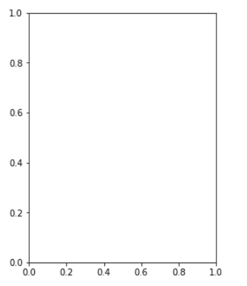
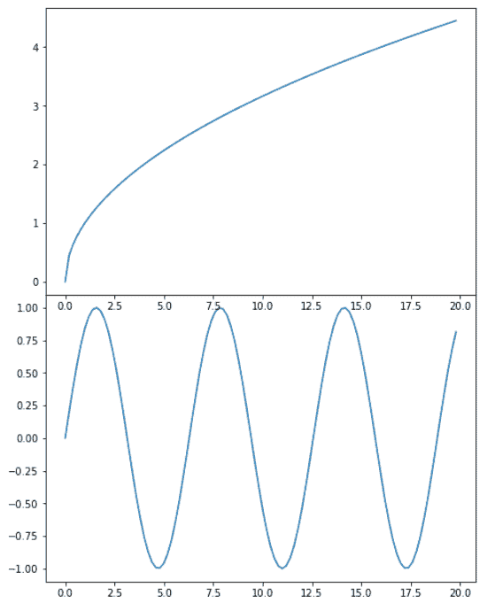
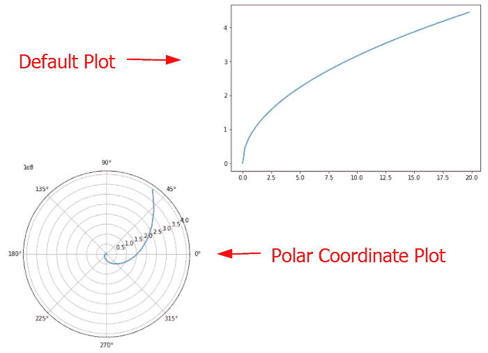
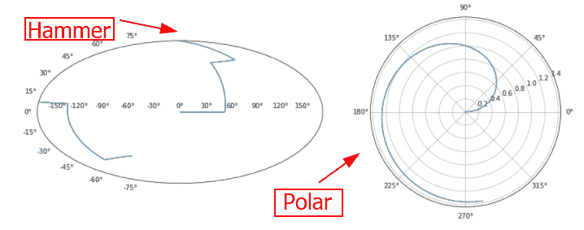
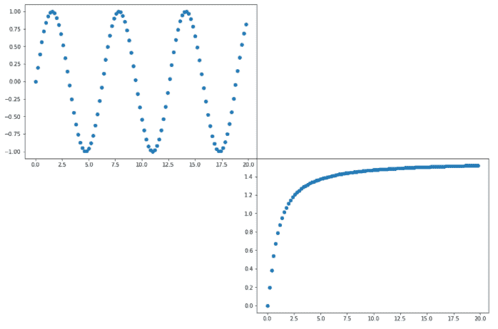
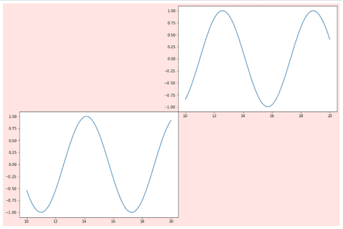
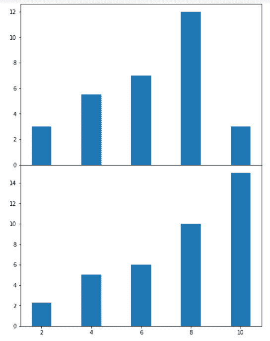
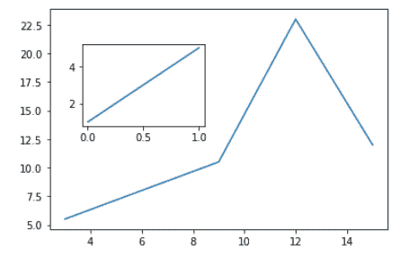

# 什么是 add_axes matplotlib

> 原文：<https://pythonguides.com/add_axes-matplotlib/>

[](https://sharepointsky.teachable.com/p/python-and-machine-learning-training-course)

在这个 [Python Matplotlib 教程](https://pythonguides.com/what-is-matplotlib/)中，我们将讨论 `add_axes matplotlib` 。这里我们将介绍使用 Python 中的 matplotlib 与 `add_axes` 相关的不同例子。我们还将讨论以下主题:

*   add_axes matplotlib
*   add_axes rect matplotlib
*   相互添加坐标轴 matplotlib
*   add_axes 极坐标 matplotlib
*   add_axes 投影 matplotlib
*   add_axes 散点图 matplotlib
*   add_axes facecolor matplotlib
*   add_axes 多条 matplotlib
*   绘图 matplotlib 内的 add_axes 绘图

目录

[](#)

*   [add_axes matplotlib](#add_axes_matplotlib "add_axes matplotlib ")
*   [add_axes rect matplotlib](#add_axes_rect_matplotlib "add_axes rect matplotlib")
*   [相互添加 _ 轴 matplotlib](#add_axes_on_each_other_matplotlib "add_axes on each other matplotlib")
*   [添加 _ 轴极坐标图形库](#add_axes_polar_matplotlib "add_axes polar matplotlib")
*   [add _ axes projection matplotlib](#add_axes_projection_matplotlib "add_axes projection matplotlib")
*   [add_axes 散点图 matplotlib](#add_axes_scatter_matplotlib "add_axes scatter matplotlib")
*   [add _ axes face color matplot lib](#add_axes_facecolor_matplotlib "add_axes facecolor matplotlib")
*   [add _ axis multiple bars matplotlib](#add_axes_multiple_bars_matplotlib "add_axes multiple bars matplotlib")
*   [绘图 matplotlib 内的 add_axes 绘图](#add_axes_plot_inside_plot_matplotlib "add_axes plot inside plot matplotlib")

## add_axes matplotlib

[Matplotlib](https://pythonguides.com/what-is-matplotlib/) 是 Python 中用于数据可视化的库。图形模块提供图形，该图形具有该图的所有元素。为了给图形添加轴，我们使用 matplotlib 库的图形模块。

用于给图形添加轴的图形模块的功能是 add_axes()。

**以下是语法:**

```py
matplotlib.Figure.figure.add_axes(*args, *kwargs)
```

**参数如下:**

| 参数 | 价值 | 描述 |
| --- | --- | --- |
| 矩形 | [左、下、宽、高] | 该参数用于设置图形的新尺寸。它也接受浮点值。 |
| 推断 | 无，'艾托夫'，'哈默'，'兰伯特'，'莫尔韦德'，'极坐标'，'直线' | 该参数用于设置轴的新投影。默认情况下，该项目是无，这将导致“直线”投影。 |
| 极地的 | 弯曲件 | 默认情况下，polar 设置为 False。如果我们将其设置为 True，axes 会产生“极轴”投影。 |
| sharex 还是 sharey | 轴线 | 该参数用于共享 x 轴和 y 轴。 |

另外，查看:[如何安装 matplotlib python](https://pythonguides.com/how-to-install-matplotlib-python/)

## add_axes rect matplotlib

这里我们将看到 Matplotlib 中带有 `rect` 参数的 `add_axes` 函数的示例。在本例中，我们只添加单轴。

**以下是语法:**

```py
matplotlib.figure.figure.add_axes(rect=[])
```

**举例:**

```py
**# Import library** 
import matplotlib

**# Create figure() objects** 
fig = matplotlib.pyplot.figure()

**# Creating axis** axes = fig.add_axes([0.75, 1, 0.5, 1])

**# Display** 
plt.show()
```

*   首先导入 `matplotlib.pyplot` 库。
*   接下来，创建**图()**模块。
*   要给图形添加轴，使用 `add_axes()` 功能。
*   这里我们将 `xmin` 、 `ymin` 、 `width` 和 `height` 分别设置为 0.75，1，0.5，1。
*   要显示图表，使用 `show()` 功能。



add_axes()

阅读: [Matplotlib 绘制一条线](https://pythonguides.com/matplotlib-plot-a-line/)

## 相互添加 _ 轴 matplotlib

这里我们将看到一个例子，我们使用 `add_axes` matplotlib 函数在彼此之上添加一个图。

**举例:**

```py
**# Import libraries** 
import matplotlib
import numpy as np

**# Create figure() objects**

fig = matplotlib.pyplot.figure()

**# Generate line graph** 
x = np.arange(0, 20, 0.2)
y1 = np.sin(x)
y2 = np.sqrt(x)

**# Creating two axes**

axes1 = fig.add_axes([0, 0, 1, 1])
axes1.plot(x, y1)
axes2 = fig.add_axes([0, 1, 1, 1])
axes2.plot(x, y2)

**# Show plot**

plt.show()
```

*   导入 `matplotlib.pyplot` 和 `numpy` 库。
*   接下来，我们创建 `figure()` 对象。
*   之后，我们使用 numpy 的 `arange()` 、 `sin()` 和 `sqrt()` 函数定义数据坐标。
*   然后我们创建两个轴，使用 `add_axes()` 函数。



add_axes()

阅读: [Python 情节多行](https://pythonguides.com/python-plot-multiple-lines/)

## 添加 _ 轴极坐标图形库

通过使用图形模块的 add_axes()函数，我们可以在极坐标中绘制曲线。为此，我们将 polar 作为参数传递，并将其值设置为 `True` 。

**以下是语法:**

```py
matplotlib.figure.figure.add_axes(rect,polar)
```

**我们来看一个例子:**

```py
**# Import libraries**

import matplotlib
import numpy as np

**# Create figure() objects**

fig = matplotlib.pyplot.figure()

**# Generate graph**

x = np.arange(0, 20, 0.2)
y1 = np.exp(x)
y2 = np.sqrt(x)

**# Creating two axes** 
axes1 = fig.add_axes([0, 0, 1, 1],polar=True)
axes1.plot(x, y1)
axes2 = fig.add_axes([1, 1, 1, 1])
axes2.plot(x, y2)

**# Show plot**

plt.show()
```

*   首先，我们导入重要的库，如 `matplotlib.pyplot` 和 `numpy` 。
*   接下来，我们使用 `figure()` 函数创建图形对象。
*   我们使用 `arange()` 、 `exp()` 和 `sqrt()` 函数来定义数据坐标。
*   接下来，我们使用 `add_axes()` 函数创建第一个轴，为了在极坐标曲线中创建绘图，我们将 `polar` 作为参数传递，并将其值设置为 `True` 。
*   为了创建第二个轴，我们再次使用 `add_axes()` 函数，我们也通过传递 `rect` 参数来设置它的位置。



add_axes(polar=True)

阅读: [Matplotlib 绘图条形图](https://pythonguides.com/matplotlib-plot-bar-chart/)

## add _ axes projection matplotlib

为了在轴上设置新的投影，我们将投影参数传递给 matplotlib 中的 `add_axes()` 函数。

**语法如下:**

```py
matplotlib.figure.figure.add_axes(rect, projection)
```

**举例:**

```py
**# Import libraries**

import matplotlib
import numpy as np

**# Create figure() objects**

fig = matplotlib.pyplot.figure()

**# Generate graph**

x = np.arange(0, 5, 0.1)
y1 = np.trunc(x)
y2 = np.arctan(x)

**# Creating two axes** 
axes1 = fig.add_axes([0, 1, 1, 1],projection='hammer')
axes1.plot(x, y1)
axes2 = fig.add_axes([1, 1, 1, 1],projection='polar')
axes2.plot(x, y2)

**# Show plot**

plt.show()
```

*   导入库 `matplotlib.pyplot` 和 `numpy` 。
*   接下来，我们使用 `figure()` 函数创建 figure 对象。
*   为了定义数据点，我们使用 numpy 的 `arange()` 、 `trunc()` 和 `arctan()` 函数。
*   要生成绘图，使用 `plot()` 函数。
*   要给图形添加轴，使用 `add_axes()` 功能。
*   为了给轴设置新的投影，我们将**投影**参数传递给方法，并将它们的值分别设置为**锤子**和**极轴**。



add_axes(projection)

阅读:[什么是 matplotlib 内联](https://pythonguides.com/what-is-matplotlib-inline/)

## add_axes 散点图 matplotlib

这里我们学习通过使用 `add_axes` 到[散点图](https://pythonguides.com/matplotlib-scatter-marker/)来添加轴。要生成散点图，使用 Matplotlib 中的**`scatter()`函数。**

 ****举例:**

```py
**# Import libraries**

import matplotlib
import numpy as np

**# Create figure() objects**

fig = matplotlib.pyplot.figure()

**# Generate line graph**

x = np.arange(0, 20, 0.2)
y1 = np.sin(x)
y2 = np.arctan(x)

**# Creating two axes**

axes1 = fig.add_axes([0, 1, 1, 1])
axes1.scatter(x, y1)
axes2 = fig.add_axes([1, 0, 1, 1])
axes2.scatter(x, y2)

**# Show plot**

plt.show()
```



Scatter plot – scatter()

阅读: [Matplotlib 散点图颜色](https://pythonguides.com/matplotlib-scatter-plot-color/)

## add _ axes face color matplot lib

这里我们将看到一个例子，我们使用 add_axes 方法向图形添加轴，并且我们还使用 Matplotlib 中的 `set_facecolor` 方法设置图形的背景色。

```py
**# Import libraries**

import matplotlib
import numpy as np

**# Create figure() objects**

fig = matplotlib.pyplot.figure()

**# Generate line graph**

x = np.linspace(20, 10, 100)
y1 = np.sin(x)
y2 = np.cos(x)

**# Set facecolor**

fig.set_facecolor('mistyrose')

**# Creating two axes** 
axes1 = fig.add_axes([0, 0, 1, 1])
axes1.plot(x, y1)
axes2 = fig.add_axes([1, 1, 1, 1])
axes2.plot(x, y2)

**# Show plot**

plt.show()
```

*   这里我们用 numpy 的 `linspace()` 、 `sin()` 和 `cos()` 函数定义数据坐标。
*   为了设置面部颜色，我们使用 `set_facecolor()` 函数，并将其设置为 `mistyrose` 。



set_facecolor()

阅读: [Matplotlib 散点图图例](https://pythonguides.com/matplotlib-scatter-plot-legend/)

## add _ axis multiple bars matplotlib

在这里，我们将看到一个使用 Matplotlib 向多个条形图添加 _axes 的示例。

**举例:**

```py
**# Import libraries** 
import matplotlib
import numpy as np

**# Create figure() objects** 
fig = matplotlib.pyplot.figure()

**# Generate graph** 
x = [2, 4, 6, 8, 10]
y1 = [3, 5.5, 7, 12, 3]
y2 = [2.3, 5, 6, 10, 15]

**# Creating two axes** 
axes1 = fig.add_axes([1, 1, 1, 1])
axes1.bar(x, y1)
axes2 = fig.add_axes([1, 0, 1, 1])
axes2.bar(x,y2)

**# Show plot**

plt.show()
```

*   要绘制条形图，使用 `bar()` 方法。
*   要给图形添加轴，使用 `add_axes()` 方法。



bar()

另外，检查: [Matplotlib 多条形图](https://pythonguides.com/matplotlib-multiple-bar-chart/)

## 绘图 matplotlib 内的 add_axes 绘图

这里我们将看到一个例子，我们使用 `add_axes()` 方法在一个图中添加一个图。

**举例:**

```py
**# Import libraries**

import matplotlib
import numpy as np

**# Create figure() objects** 
fig = matplotlib.pyplot.figure()

**# Define Data**

x = [3, 6, 9, 12, 15]
y = [5.5, 8, 10.5, 23, 12]

**# Plot**

plt.plot(x,y)

**# add plot inside a plot**

axes=fig.add_axes([0.20, 0.48, 0.28, 0.28])
axes.plot([1,5])

**# display**

plt.show()
```

*   首先，我们导入 `matplotlib.pyplot` 和 `numpy` 库。
*   要创建一个图形对象，使用 `figure()` 方法。
*   定义数据点 x 和 y。
*   要绘制图形，请使用 pyplot 模块的 `plot()` 方法。
*   要在已经生成的绘图中添加一个绘图，使用 `add_axes()` 方法。
*   生成图后，使用 `plot()` 方法绘制图形。
*   为了可视化图形，使用 `show()` 方法。



# Plot Inside Plot

你可能也喜欢阅读下面的 matplotlib 教程。

*   [堆积条形图 Matplotlib](https://pythonguides.com/stacked-bar-chart-matplotlib/)
*   [Matplotlib 绘图误差线](https://pythonguides.com/matplotlib-plot-error-bars/)
*   [Matplotlib 绘图条形图](https://pythonguides.com/matplotlib-plot-bar-chart/)
*   [Matplotlib 未知投影‘3d’](https://pythonguides.com/matplotlib-unknown-projection-3d/)

因此，在这个 **Python 教程**中，我们已经讨论了**“add _ axes matplotlib”**，并且我们还涵盖了一些与使用 `add_axes matplotlib` 相关的示例。这些是我们在本教程中讨论过的以下主题。

*   add_axes matplotlib
*   add_axes rect matplotlib
*   相互添加坐标轴 matplotlib
*   add_axes 极坐标 matplotlib
*   add_axes 投影 matplotlib
*   add_axes 散点图 matplotlib
*   add_axes facecolor matplotlib
*   add_axes 多条 matplotlib
*   绘图 matplotlib 内的 add_axes 绘图

[Bijay Kumar](https://pythonguides.com/author/fewlines4biju/)

Python 是美国最流行的语言之一。我从事 Python 工作已经有很长时间了，我在与 Tkinter、Pandas、NumPy、Turtle、Django、Matplotlib、Tensorflow、Scipy、Scikit-Learn 等各种库合作方面拥有专业知识。我有与美国、加拿大、英国、澳大利亚、新西兰等国家的各种客户合作的经验。查看我的个人资料。

[enjoysharepoint.com/](https://enjoysharepoint.com/)[](https://www.facebook.com/fewlines4biju "Facebook")[](https://www.linkedin.com/in/fewlines4biju/ "Linkedin")[](https://twitter.com/fewlines4biju "Twitter")**