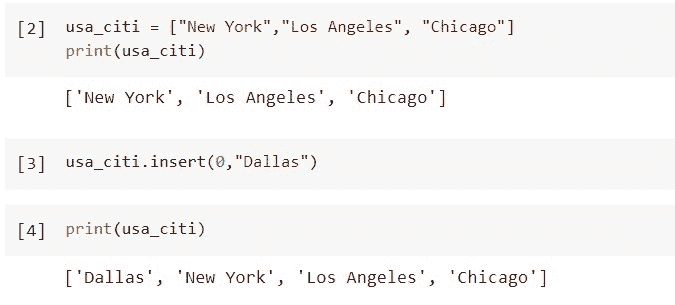
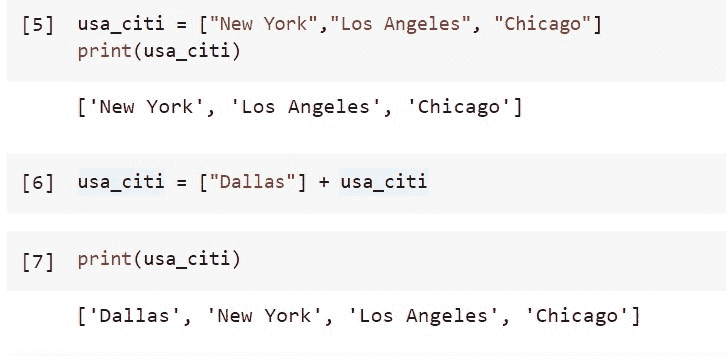
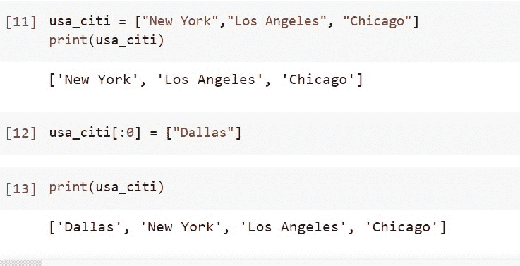
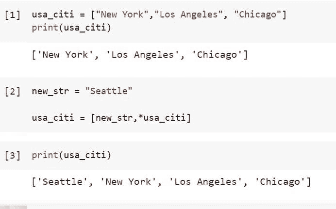
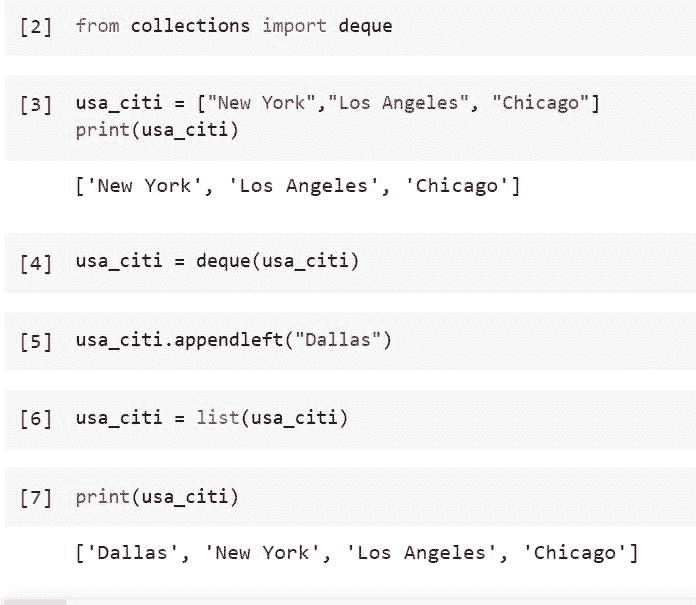

# 如何将字符串追加到列表 Python 的开头

> 原文：<https://pythonguides.com/append-string-to-beginning-of-list-python/>

[](https://sharepointsky.teachable.com/p/python-and-machine-learning-training-course)

这个 [Python 教程](https://pythonguides.com/beginners-guide-to-programming/)将向我们展示在 Python 中向列表开头添加字符串的各种方法。因为不管列表包括什么类型的数据，列表插入技术必须是相同的，所以在整个课程中使用字符串列表作为例子，集中于列表插入，而不是插入其他数据类型。

*   将字符串追加到列表 Python 的开头

目录

[](#)

*   [将字符串追加到列表 Python 的开头](#Append_String_To_Beginning_of_List_Python "Append String To Beginning of List Python")
    *   [在 Python 中，要将一个字符串追加到列表的开头，使用 insert()函数](#To_append_a_string_to_the_beginning_of_a_list_in_Python_use_the_insert_function "To append a string to the beginning of a list in Python, use the insert() function")
    *   [在 Python 中，要将字符串追加到列表的开头，使用+和[]运算符](#To_append_a_string_to_the_beginning_of_a_list_in_Python_use_the_and_Operator "To append a string to the beginning of a list in Python, use the + and [] Operator")
    *   [在 Python 中，要将一个字符串附加到列表的开头，使用切片方法](#To_append_a_string_to_the_beginning_of_a_list_in_Python_use_the_slicing_method "To append a string to the beginning of a list in Python, use the slicing method")
    *   [使用解包](#Append_an_element_at_the_start_of_a_Python_list_using_unpacking "Append an element at the start of a Python list using unpacking")在 Python 列表的开头追加一个元素
    *   [要在 Python 中将字符串追加到列表的开头，使用 collections.deque.appendleft()方法](#To_append_a_string_to_the_beginning_of_a_list_in_Python_use_the_collectionsdequeappendleft_method "To append a string to the beginning of a list in Python, use the collections.deque.appendleft() method")

## 将字符串追加到列表 Python 的开头

新元素通常使用 append 函数添加到 Python 列表的末尾。但是，在某些情况下，我们必须将添加的每个条目添加到列表的开头。让我们来讨论一些在列表开头添加的方法。

### **在 Python 中要将一个字符串追加到一个列表的开头，使用 insert()函数**

函数的作用是:在一个现有的列表中指定的索引处添加一个新的条目。它接受两个参数:要插入的值和该项应输入的索引。

```py
insert(indx, value)
```

作为一个例子，我们将向一个现有的三项列表中添加一个字符串。通过将第一个参数设置为 0，这表明插入是在索引 0(列表的开始)处进行的，我们使用`*`insert()`*`函数在列表的开头追加一个字符串。

使用下面的代码创建或初始化新的列表，用三个字符串代表美国的三个城市。

```py
usa_citi = ["New York","Los Angeles", "Chicago"]
print(usa_citi)
```

使用函数`*`insert()`*`在上面创建的列表的开头插入新字符串“Dallas”。

```py
usa_citi.insert(0,"Dallas")
```

使用下面的代码打印列表“usa_citi”的值。

```py
print(usa_citi)
```



Append String To Beginning of List Python

在上面的输出中，我们可以看到字符串“Dallas”被附加在列表的开头。

阅读[如何用 Python 从列表中获取字符串值](https://pythonguides.com/how-to-get-string-values-from-list-in-python/)

### **在 Python 中，要将字符串追加到列表的开头，使用+和[]运算符**

通过在 Python 中组合这两个操作符，可以完成任务开始时的字符串追加。元素被转换成列表，然后执行列表添加。

使用下面的代码创建或初始化新的列表，用三个字符串代表美国的三个城市。

```py
usa_citi = ["New York","Los Angeles", "Chicago"]
print(usa_citi)
```

使用运算符+和[]将字符串“Dallas”附加到上面创建的列表“usa_citi”的开头，代码如下。

```py
usa_citi = ["Dallas"] + usa_citi
```

请记住，字符串“Dallas”用方括号[]括起来。为了支持列表添加，单个字符串被转换为列表数据类型。

使用下面的代码查看列表。

```py
print(usa_citi)
```



Append String To Beginning of List Python Example

在上面的输出中，我们可以看到字符串“Dallas”使用两个操作符+和[]附加在列表的开头。

这就是如何在 Python 中使用+和[]运算符将字符串追加到列表的开头。

### **在 Python 中要将一个字符串追加到一个列表的开头，使用切片方法**

列表切片是执行这种特定操作的另一种方式。在 Python 中，我们简单地将从转换后的元素创建的列表附加到 0 切片列表。

使用下面的代码创建或初始化新的列表，用三个字符串代表美国的三个城市。

```py
usa_citi = ["New York","Los Angeles", "Chicago"]
print(usa_citi)
```

使用下面的代码，使用切片将字符串追加到上面创建的列表的开头。

```py
usa_citi[:0] = ["Dallas"]
```

使用下面的代码检查列表开头的附加字符串。

```py
print(usa_citi)
```



Append String To Beginning of List Python Using Slicing

这是如何在 Python 中使用切片方法将字符串追加到列表的开头。

阅读[如何用 Python 从列表中获取唯一值](https://pythonguides.com/get-unique-values-from-list-python/)

### **使用解包** 在 Python 列表的开头追加一个元素

在 Python 中，称为解包的过程使得某些可迭代操作成为可能。由于解包，iterable 赋值对开发人员来说适应性更强，效率更高。

在这个例子中，在列表的开始插入将通过合并已经存在的 iterables 来完成，这是解包的一个特性。我们使用解包操作符*将单个字符串与当前列表合并，在新创建的列表的开头插入该字符串。

使用下面的代码创建或初始化新的列表，用三个字符串代表美国的三个城市。

```py
usa_citi = ["New York","Los Angeles", "Chicago"]
print(usa_citi)
```

使用下面的代码，使用解包方法将字符串追加到上面创建的列表的开头。

```py
new_str = "Seattle"

usa_citi = [new_str,*usa_citi]
```

使用下面的代码显示新添加到列表中的字符串。

```py
print(usa_citi)
```



Append String To Beginning of List Python Using Unpacking

这就是如何在 Python 中使用解包在列表的开头追加元素。

读取 [Python 查找列表](https://pythonguides.com/python-find-index-of-element-in-list/)中元素的索引[](https://pythonguides.com/python-find-index-of-element-in-list/)

### **要在 Python 中将字符串追加到列表的开头，使用 collections.deque.appendleft()方法**

这个列表可以转换成一个 deque，然后可以使用 appendleft()在双端队列的开始处执行类似 push 的操作。

使用下面的代码导入所需的库或方法。

```py
from collections import deque
```

使用下面的代码创建或初始化新的列表，用三个字符串代表美国的三个城市。

```py
usa_citi = ["New York","Los Angeles", "Chicago"]
print(usa_citi)
```

首先使用下面的代码对上面创建的列表进行出队。

```py
usa_citi = deque(usa_citi)
```

使用下面的代码在列表的开头添加新的字符串“Dallas”。

```py
usa_citi.appendleft("Dallas")
```

使用下面的代码再次将它转换成列表。

```py
usa_citi = list(usa_citi)
```

使用下面的代码查看列表。

```py
print(usa_citi)
```



Append String To Beginning of List Python Using Deque

这是如何在 Python 中使用 collections.deque.appendleft()方法将字符串追加到列表的开头。

我们已经学习了如何在 Python 中使用不同的方法将字符串追加到列表的开头，例如使用 insert()、加号(+)和方括号([])操作符、切片、解包和 deque()方法。

您可能会喜欢以下 Python 教程:

*   [如何在 Python 中反转列表](https://pythonguides.com/reverse-a-list-in-python/)
*   [Python 将数据帧转换为列表](https://pythonguides.com/python-convert-dataframe-to-list/)
*   [Python 列表字典](https://pythonguides.com/python-dictionary-of-lists/)
*   [Python 字符串列表](https://pythonguides.com/python-string-to-list/)
*   [Python 字典元组列表](https://pythonguides.com/python-dictionary-of-tuples/)

[Saurabh](https://pythonguides.com/author/saurabh/)

我的名字是库马尔·索拉博，我在青岛科技公司工作，是一名 Python 开发人员。此外，还有 Python 编程、SciPy、机器学习、人工智能等技术方面的专业知识。是我喜欢做的事情。