# 追加到字符串 Python +示例

> 原文：<https://pythonguides.com/append-to-a-string-python/>

[](https://sharepointsky.teachable.com/p/python-and-machine-learning-training-course)

在这个 [python 教程中，](https://pythonguides.com/python-hello-world-program/)你将学习如何**追加到一个字符串 python** ，我们也将检查 **:**

*   追加到字符串 python
*   前置到字符串 python
*   插入到字符串 python 中
*   将 0 追加到字符串 python
*   将字符追加到字符串 python
*   Python 追加到循环中字符串的开头
*   向字符串 python 添加字母
*   向字符串 python 添加变量
*   向字符串 python 添加 int
*   在 python 中追加到字符串的末尾
*   如何在 python 中向字符串追加新行
*   如何在 python 中给字符串追加反斜杠
*   如何在 python 中向空字符串追加内容
*   如何在 python 中将双引号追加到字符串中

目录

[](#)

*   [追加到字符串 python](#Append_to_a_string_python "Append to a string python")
*   [前置到字符串 python](#Prepend_to_a_string_python "Prepend to a string python")
*   [插入到一个字符串 python](#Insert_to_a_string_python "Insert to a string python")
*   [将 0 追加到字符串 python](#Append_0_to_a_string_python "Append 0 to a string python")
*   [给字符串添加字符 python](#Append_character_to_a_string_python "Append character to a string python")
*   [Python 追加到循环中字符串的开头](#Python_append_to_beginning_of_a_string_in_a_loop "Python append to beginning of a string in a loop")
*   [给字符串添加字母 python](#Add_letter_to_a_string_python "Add letter to a string python")
*   [给字符串 python 添加变量](#Add_variable_to_a_string_python "Add variable to a string python")
*   [给字符串 python 添加 int](#Add_int_to_a_string_python "Add int to a string python")
*   [在 python 中追加到字符串末尾](#Append_to_end_of_a_string_in_python "Append to end of a string in python")
*   [如何在 python 中向字符串追加新行](#How_to_append_a_new_line_to_a_string_in_python "How to append a new line to a string in python")
*   [如何在 python 中给字符串追加反斜杠](#How_to_append_backslash_to_a_string_in_python "How to append backslash to a string in python")
*   [如何在 python 中追加空字符串](#How_to_append_to_an_empty_string_in_python "How to append to an empty string in python")
*   [如何在 python 中给字符串添加双引号](#How_to_append_double_quotes_to_a_string_in_python "How to append double quotes to a string in python")
*   [如何在 python 中追加字符串](#How_to_append_to_a_string_in_python "How to append to a string in python")

## 追加到字符串 python

让我们看看如何将**追加到一个字符串 python** 。

在这个例子中，我们将使用 **"+"操作符**在 python 中添加一个字符串。下面的代码显示了两个字符串的追加。

**举例:**

```py
s1 = "New"
s2 = "Delhi"
space = " "
print(s1 + space + s2)
```

你可以参考下面的截图来看看**追加到字符串 python 的输出。**

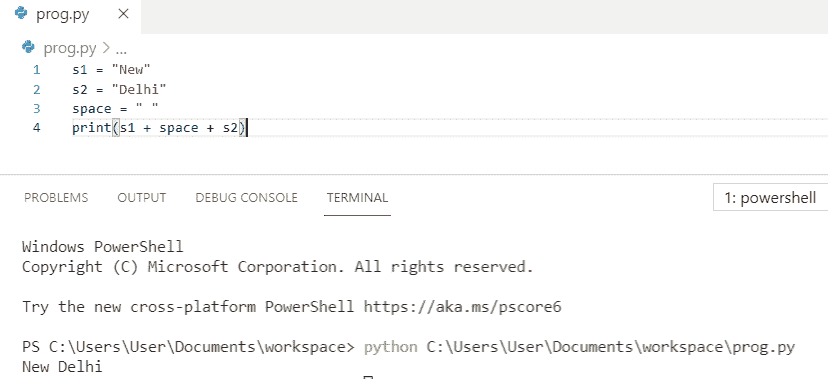

Append to a string python

这就是我们如何在 Python 中将**追加到一个字符串中。**

阅读:[Python 中的 String 方法并举例](https://pythonguides.com/string-methods-in-python/)。

## 前置到字符串 python

现在，我们将看到如何将**前置到一个字符串 python** 。

`Prepend to a string` 将元素添加到一个字符串中。在这个例子中，我们有两个字符串，为了得到输出，我们将打印 `my_string` 。

**举例:**

```py
my_string = "Python"
add_string = " is famous"
my_string += add_string
print("The string is : " + my_string)
```

你可以参考下面的截图来查看前置到字符串 python 的**的输出**

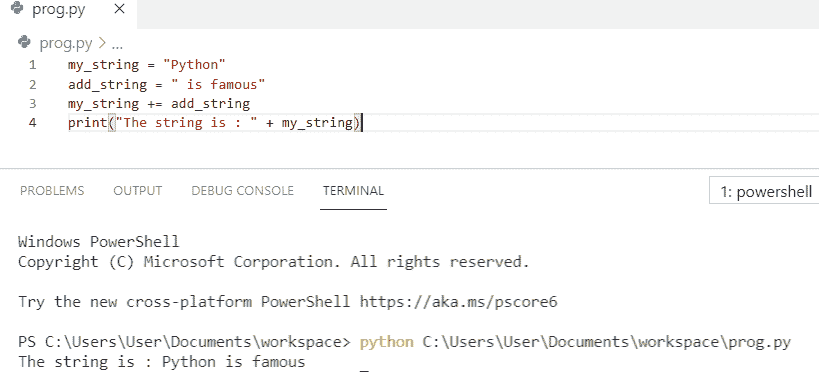

Prepend to a string python

这就是我们如何在 Python 中前置一个字符串。

阅读:[从字符串 Python 中移除字符](https://pythonguides.com/remove-character-from-string-python/)。

## 插入到一个字符串 python

在这里，我们将看到如何将**插入到一个字符串 python** 。

*   为了**插入一个字符串**，我们将使用 python 中的索引。
*   插入字符串将返回在给定索引处插入了另一个字符串的字符串。
*   在本例中，我们将“纽约”插入“洛杉矶，芝加哥”，它返回“洛杉矶，纽约，芝加哥”。

**举例:**

```py
str1 = "Los Angeles, Chicago"
str2 = "New York, "
beg_substr = str1[:7]
end_substr = str1[7:]
my_str = beg_substr + str2 + end_substr
print(my_str)
```

这就是我们如何在 Python 中**插入一个刺。**

读取: [Python 将字符串写入文件](https://pythonguides.com/python-write-string-to-a-file/)。

## 将 0 追加到字符串 python

让我们看看如何**将 0 追加到一个字符串 python** 。

在这个例子中，我们将使用 `rjust` 函数为**向字符串**追加 0，因为它提供了执行任务的单行方式。

**举例:**

```py
t_str = 'New'
N = 1
res = t_str.rjust(N + len(t_str), '0')
print("The string after adding zeros : " + str(res))
```

你可以参考下面的截图来看看**将 0 附加到一个字符串 python** 的输出。

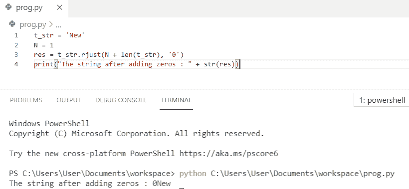

Append 0 to a string python

上面的 Python 代码我们可以用来**在 Python** 中把 0 追加到一个字符串。

阅读: [Python 生成随机数和字符串](https://pythonguides.com/python-generate-random-number/)

## 给字符串添加字符 python

现在，我们将看到如何**将字符添加到字符串 python** 中。

*   为了**将一个字符添加到一个字符串中**我们将在一个字符串的索引处插入该字符，它将创建一个包含该字符的新字符串。
*   为了插入一个字符，我们将使用 slicing**a _ str[:1]+" n "+a _ str[1:]**，并且使用 `"+"` 操作符来插入想要的字符。

**举例:**

```py
a_str = "Hello"
a_str = a_str[:1] + "n" + a_str[1:]
print(a_str)
```

你可以参考下面的截图来看看**将字符追加到字符串 python** 的输出

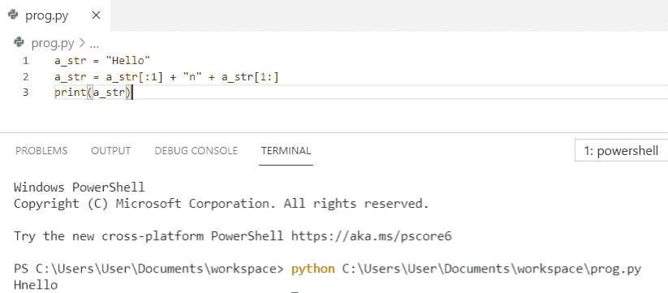

Append character to a string python

这就是**如何在 Python** 中将字符追加到字符串中。

阅读:[如何在 Python 中把字符串转换成日期时间](https://pythonguides.com/convert-a-string-to-datetime-in-python/)

## Python 追加到循环中字符串的开头

在这里，我们将看到 **Python 在一个循环**中附加到一个字符串的开头

在这个例子中，我们将使用 for 循环将**追加到字符串**的开头，并且使用了 `"+"` 操作符。

**举例:**

```py
endstr = "People"
my_list = ['Hello', 'to', 'all']
for words in my_list:
  endstr = endstr + words
print("The string is: " + endstr)
```

你可以参考下面的截图来看看 **python 添加到循环中的字符串**的输出。

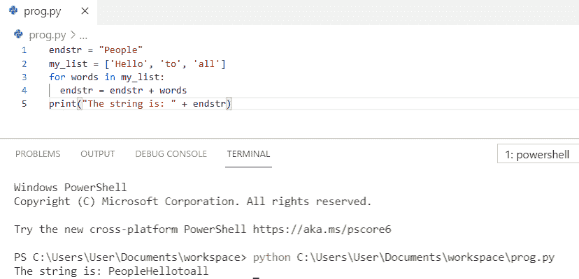

Python append to the beginning of a string in a loop

上面的代码，我们可以用来在 Python 的循环中把**追加到一个字符串的开头。**

阅读:[如何将 Python 字符串转换成字节数组](https://pythonguides.com/python-string-to-byte-array/)。

## 给字符串添加字母 python

在这里，我们将看到如何**添加字母到一个字符串 python** 。

为了给字符串 python 添加字母，我们将使用 **f"{str1}{l2}"** ，为了得到输出，我们将 **print(res)。**

**举例:**

```py
str1 = "Python"
l2 = "G"
res = f"{str1}{l2}"
print(res)
```

你可以参考下面的截图来看看**添加字母到一个字符串 python** 的输出

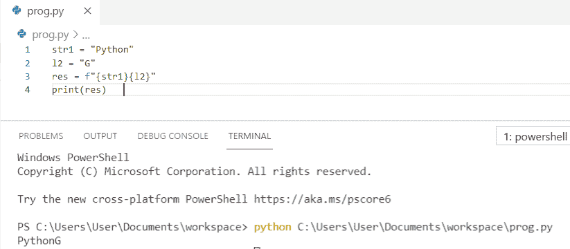

Add letter to a string python

这是 python 代码，用于在 Python 中给字符串**添加字母。**

阅读:[如何在 python 中连接字符串](https://pythonguides.com/concatenate-strings-in-python/)

## 给字符串 python 添加变量

让我们看看如何**给一个字符串 python** 添加变量。

在这个例子中，我们将使用 `"+"` 操作符向字符串中添加一个变量。

**举例:**

```py
var = "Guides"
print("Python " + var + " for learning")
```

你可以参考下面的截图来查看**将变量添加到字符串 python** 的输出

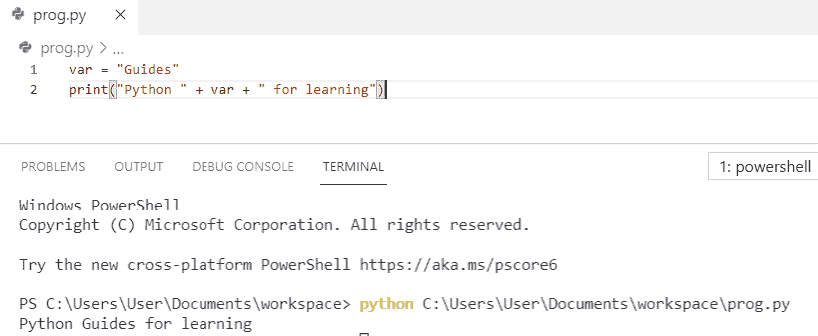

Add variable to a string python

这就是如何在 Python 中**将变量添加到字符串中。**

阅读:[将 float 转换为 int Python](https://pythonguides.com/convert-float-to-int-python/)

## 给字符串 python 添加 int

现在，我们将看到如何**将 int 添加到一个字符串** `python` 。

首先，我们将初始化字符串和一个数字，通过使用类型转换，我们将在字符串中插入数字，然后得到我们将打印的输出。

**举例:**

```py
t_str = "Python"
t_int = 8 
res = t_str + str(t_int) + t_str
print("After adding number is  : " + str(res))
```

你可以参考下面的截图来看看**将 int 添加到一个字符串 python** 的输出

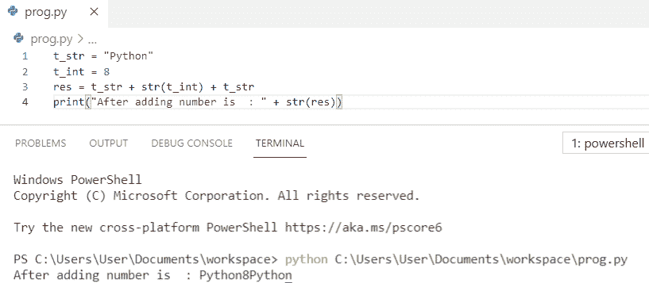

Add int to a string python

这是**如何在 Python** 中给一个字符串加 int。

阅读: [Python 字符串格式化示例](https://pythonguides.com/python-string-formatting/)

## 在 python 中追加到字符串末尾

在这里，我们将看到如何在 python 中将**添加到字符串的末尾**

在这个例子中，我们将使用 `"+"` 操作符，为了得到输出，我们将**打印(string3)** 。

**举例:**

```py
string1 = "Hello Wo"
string2 = "rld"
string3 = string1 + string2
print(string3)
```

你可以参考下面的截图来看看在 python 中把**附加到字符串末尾的输出。**

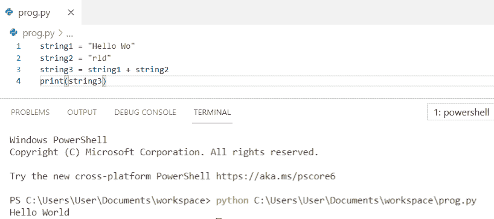

Append to the end of a string in python

上面的代码我们可以用来在 python 中将**追加到一个字符串的末尾。**

阅读: [Python 程序反转一个字符串](https://pythonguides.com/python-program-to-reverse-a-string/)

## 如何在 python 中向字符串追加新行

让我们看看**如何在 python** 中将一个新行追加到一个字符串中

在本例中，**为了向字符串**追加新行，我们使用 **"\n"** 指定了换行符，也称为转义符。因此，字符串“to python”打印在下一行。

**举例:**

```py
my_string = "Welcome\n to python."
print(my_string)
```

你可以参考下面的截图来看看**如何在 python** 中给一个字符串追加一个新行的输出。

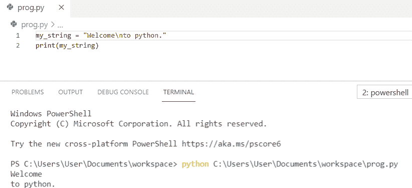

How to append a new line to a string in python

上面的代码我们可以用来在 python 中将一个新行追加到一个字符串中。

阅读:[如何在 Python 中把 string 转换成 float](https://pythonguides.com/convert-string-to-float-in-python/)

## 如何在 python 中给字符串追加反斜杠

现在，我们将看到**如何在 python** 中将反斜杠附加到字符串上

在这个例子中，**为了在 python** 中将反斜杠追加到字符串中，我们使用了语法 **"\\"** 来表示字符串中的单个反斜杠。

**举例:**

```py
my_str1 = "Hello"
my_str2 = "\\"
res = my_str1 + my_str2
print(res)
```

你可以参考下面的截图来看看**如何在 python** 中将反斜杠附加到字符串的输出。

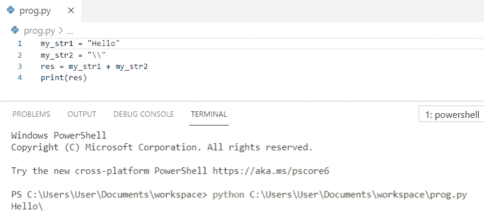

How to append backslash to a string in python

上面的代码我们可以用来**在 python** 中给一个字符串追加反斜杠。

阅读:[添加字符串到列表 Python](https://pythonguides.com/add-string-to-list-python/)

## 如何在 python 中追加空字符串

让我们看看**如何在 python** 中追加空字符串。

为了在 python 中追加到一个空字符串，我们必须使用 `"+"` 操作符来追加到一个空字符串中。

**举例:**

```py
str = ""
res = str + "Hello World"
print(res)
```

你可以参考下面的截图来看看**如何在 python** 中追加到一个空字符串的输出。

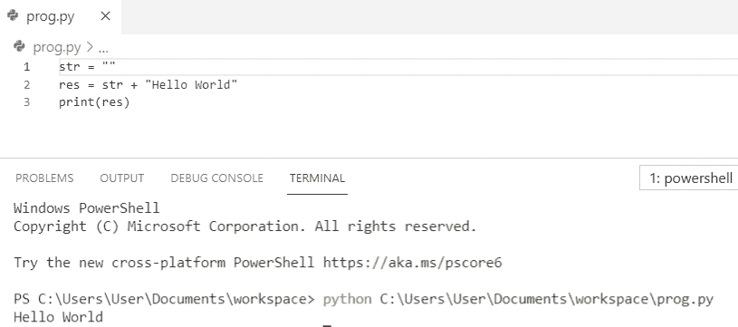

How to append to an empty string in python

上面的代码我们可以用来将**追加到 python** 中的一个空字符串。

读取 [Python 字符串以列出](https://pythonguides.com/python-string-to-list/)

## 如何在 python 中给字符串添加双引号

在这里，我们将看到**如何在 python** 中将双引号附加到字符串上。

为了在 python 中给字符串添加双引号，我们必须将字符串放在**单引号**中。

**举例:**

```py
double_quotes = '"Python"'
print(double_quotes)
```

你可以参考下面的截图来看看**如何在 python** 中给字符串添加双引号的输出。

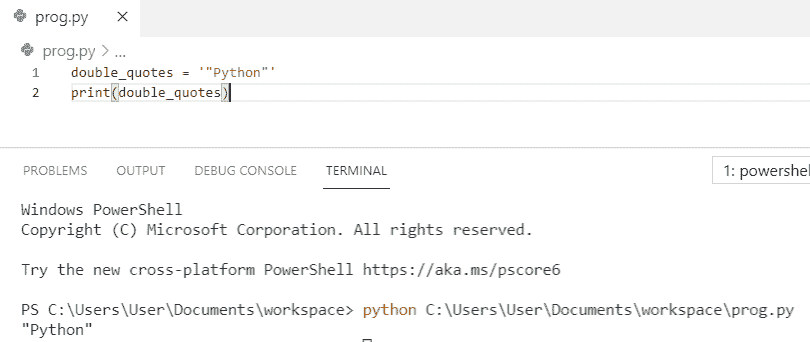

How to append double quotes to a string in python

上面的代码我们可以用来在 python 中给一个字符串添加双引号**。**

## 如何在 python 中追加字符串

在 python 中，**追加一个字符串在 python 中，**我们将使用 `" + "` 操作符，它将把变量追加到现有的字符串中。

**举例:**

```py
name = 'Misheil'
salary = 10000
print('My name is ' + name + 'and my salary is around' + str(salary))
```

在编写了上面的 python 代码(如何在 Python 中追加到字符串)之后，您将打印这些代码，然后输出将出现**“我的名字是 Misheil，我的工资大约是 10000”**。在这里， `" + "` 操作符被用来追加变量。另外，你可以参考下面的截图在 python 中添加一个字符串。

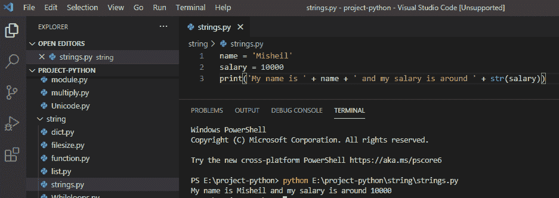

How to append to a string in python

另请参阅:

*   [如何在 Python 中处理 indexerror:字符串索引超出范围](https://pythonguides.com/indexerror-string-index-out-of-range-python/)
*   [如何在 Python 中把列表转换成字符串](https://pythonguides.com/python-convert-list-to-string/)
*   [Python 字符串函数](https://pythonguides.com/string-methods-in-python/)
*   [Python 排序 NumPy 数组](https://pythonguides.com/python-sort-numpy-array/)
*   [Python 统计文件中的字数](https://pythonguides.com/python-count-words-in-file/)
*   [Python 将二进制转换为十进制+ 15 示例](https://pythonguides.com/python-convert-binary-to-decimal/)

在这个 Python 教程中，我们已经学习了如何将**追加到一个字符串 python** 。此外，我们还讨论了以下主题:

*   追加到字符串 python
*   前置到字符串 python
*   插入到字符串 python 中
*   将 0 追加到字符串 python
*   将字符追加到字符串 python
*   Python 追加到循环中字符串的开头
*   向字符串 python 添加字母
*   向字符串 python 添加变量
*   向字符串 python 添加 int
*   在 python 中追加到字符串的末尾
*   如何在 python 中向字符串追加新行
*   如何在 python 中给字符串追加反斜杠
*   如何在 python 中向空字符串追加内容
*   如何在 python 中将双引号追加到字符串中
*   如何在 python 中追加字符串

[Bijay Kumar](https://pythonguides.com/author/fewlines4biju/)

Python 是美国最流行的语言之一。我从事 Python 工作已经有很长时间了，我在与 Tkinter、Pandas、NumPy、Turtle、Django、Matplotlib、Tensorflow、Scipy、Scikit-Learn 等各种库合作方面拥有专业知识。我有与美国、加拿大、英国、澳大利亚、新西兰等国家的各种客户合作的经验。查看我的个人资料。

[enjoysharepoint.com/](https://enjoysharepoint.com/)[](https://www.facebook.com/fewlines4biju "Facebook")[](https://www.linkedin.com/in/fewlines4biju/ "Linkedin")[](https://twitter.com/fewlines4biju "Twitter")