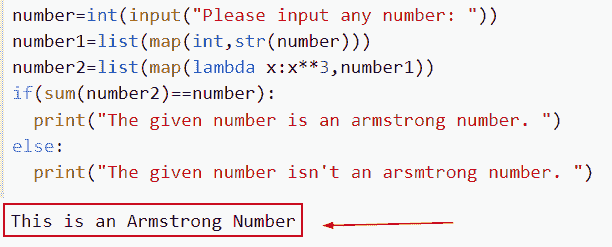

# Python 中的阿姆斯特朗数

> 原文：<https://pythonguides.com/armstrong-number-in-python/>

[](https://sharepointsky.teachable.com/p/python-and-machine-learning-training-course)

写一个 Python 程序来检查它是否是一个阿姆斯特朗数，我们还将讨论下面的主题。

*   阿姆斯特朗在 python 中的数字是多少
*   Python 中使用 for 循环的阿姆斯特朗数
*   如何在 Python 中使用 while 循环检查是否是阿姆斯特朗数
*   Python 中使用递归的阿姆斯特朗数
*   Python 中使用 if else 的阿姆斯特朗数
*   如何在 Python 中显示给定范围内的阿姆斯特朗数
*   不使用字符串函数的 Python 中的阿姆斯特朗数
*   Python 中的阿姆斯特朗数在 1 到 1000 之间
*   Python 中使用 def 函数的阿姆斯特朗数
*   使用列表理解的 Python 中的阿姆斯特朗数
*   Python 中的 4 位阿姆斯特朗数
*   使用 lambda 的 Python 中的阿姆斯特朗数

目录

[](#)

*   [python 中的阿姆斯特朗数](#Armstrong_number_in_python "Armstrong number in python")
*   [在 Python 中使用 for 循环的阿姆斯特朗数](#Armstrong_number_in_Python_using_for_loop "Armstrong number in Python using for loop")
*   [在 Python 中使用 while 循环的阿姆斯特朗数](#Armstrong_number_in_Python_using_while_loop "Armstrong number in Python using while loop")
*   [阿姆斯特朗数在 Python 中使用递归](#Armstrong_number_in_Python_using_recursion "Armstrong number in Python using recursion")
*   [Python 中使用 if else 的阿姆斯特朗数](#Armstrong_number_in_Python_using_if_else "Armstrong number in Python using if else")
*   [给定范围内 Python 中的阿姆斯特朗数](#Armstrong_number_in_Python_for_a_given_range "Armstrong number in Python for a given range")
*   [不使用字符串函数的 Python 中的阿姆斯特朗数](#Armstrong_number_in_Python_without_using_string_function "Armstrong number in Python without using string function")
*   [Python 中的阿姆斯特朗数在 1 到 1000 之间](#Armstrong_number_in_Python_between_1_to_1000 "Armstrong number in Python between 1 to 1000")
*   [用 Python 中的阿姆斯特朗数定义函数](#Armstrong_number_in_Python_using_def_function "Armstrong number in Python using def function")
*   [阿姆斯特朗数在 Python 中使用列表理解](#Armstrong_number_in_Python_using_list_comprehension "Armstrong number in Python using list comprehension")
*   [Python 中的 4 位阿姆斯特朗数](#4-digit_Armstrong_number_in_Python "4-digit Armstrong number in Python")
*   [阿姆斯特朗数在 Python 中使用λ](#Armstrong_number_in_Python_using_lambda "Armstrong number in Python using lambda")

## python 中的阿姆斯特朗数

*   阿姆斯特朗数的数字的立方之和。例如，阿姆斯特朗的数字是 0、1、153、370、371 和 407。
*   在 Python 中，阿姆斯特朗数是一个所有数字相加的乘积等于给定数的数。例如，对于给定的整数，1^3 + 5^3 + 3^3 等于 153。
*   为了找到一个 3 位数的阿姆斯壮数，我们必须首先从该数中提取每个数字，乘以三次以确定其立方，然后将所有这些立方相加。
*   我们现在将总和与提供的数字进行比较。如果一个数的立方之和等于实际数，我们称这个数为阿姆斯特朗数；否则，就不是。

示例:

让我们试着用数学的方法来理解它

```py
370 = (3*3*3)+(7*7*7)+(0*0*0)  
where:  
(0*0*0)=0  
(7*7*7)=343
(3*3*3)=27  
So:  
0+343+27=370 
```

示例:

```py
new_num = int(input("Enter a number: "))

i = 0

result = new_num

while result > 0:

   new_digit = result % 10

   i += new_digit ** 3

   result //= 10

if new_num == i:

   print(new_num," It is an Armstrong number")

else:

   print(new_num," It is not an Armstrong number") 
```

在下面给定的代码中，我们首先将 sum 的初始值设置为 0。我们可以使用 **%** 运算符逐个找出数字的位数。原始数的最后一位是通过将该数的余数除以 10 得到的。在这之后，我们使用指数运算符来计算数字的立方。

最后，我们可以说，如果一个数的总数与原来的数相同，那么这个数就是阿姆斯特朗数。而如果总数不等于原始数，则该数不是阿姆斯特朗数。

以下是给定代码的屏幕截图


Armstrong number in python

这就是我们如何在 Python 中找到阿姆斯特朗数。

阅读: [Python 字典方法](https://pythonguides.com/python-dictionary-methods/)

## 在 Python 中使用 for 循环的阿姆斯特朗数

*   让我们以一个数字为例，更好地理解阿姆斯特朗的数字。设 n 为所选值。确定数字的位数。数字中的每个数字都被取 n 次方。
*   所有这些加在一起，如果所有这些数的总和等于这个数本身，那么这个数 n 就是阿姆斯特朗数。如果不是，那么 n 就不是阿姆斯特朗数。
*   在这个例子中，我们将使用 for 循环的概念，这个程序允许用户输入正整数。

**举例**:

```py
new_number = int(input("Enter the Value:"))
new_val = len(str(new_number ))
m = new_number ;
total = 0
result=str(new_number )
for z in result:
    new_digit =m%10
    total += new_digit **new_val
    m = m//10
if(total==new_number ):
    print("",new_number ," It is an Armstrong number")
else:
    print("",new_number ,"It is not an Armstrong number")
```

在上面的代码中，我们首先将 sum 的初始值设置为 0。我们可以用%运算符逐个找出数字的位数。原始数的最后一位是通过将该数的余数除以 10 得到的。在这之后，我们使用指数运算符来计算数字的立方。

最后，我们可以说，如果一个数的总数与原来的数相同，那么这个数就是阿姆斯特朗数。而如果总数不等于原始数，则该数不是阿姆斯特朗数。

下面是下面给出的代码的截图。


Armstrong number in Python using for loop

在这个例子中，我们已经理解了如何使用 for 循环来检查是否是 Armstrong。

阅读:[如何在 Python 中创建列表](https://pythonguides.com/create-list-in-python/)

## 在 Python 中使用 while 循环的阿姆斯特朗数

*   在这个例子中，我们将讨论使用 while 循环来检查 Armstrong 数字的 python 程序。
*   在 Python 中，阿姆斯特朗数是一个所有数字相加的乘积等于给定数的数。
*   在这个例子中，我们将获取一个数字，然后初始化一个变量来存储总和并将值赋给 0。接下来，我们将找到给定数字中的位数，并将数字中的每个数字乘以位数，然后将其添加到 sum 变量中。

**举例**:

```py
new_num = int(input("Enter a number: "))

i = 0

result = new_num

while result > 0:

   new_digit = result % 10

   i += new_digit ** 3

   result //= 10

if new_num == i:

   print(new_num," It is an Armstrong number")

else:

   print(new_num," It is not an Armstrong number") 
```

你可以参考下面的截图


Armstrong number in Python using while loop

这就是我们如何通过使用 while 循环在 Python 中创建 Armstrong 数。

阅读: [Python 命名约定](https://pythonguides.com/python-naming-conventions/)

## 阿姆斯特朗数在 Python 中使用递归

*   递归是用另一个项目来定义一个项目的过程。简单来说就是一个函数直接或间接调用自己的过程。
*   在这个例子中，我们将使用 if-else 条件的概念，这个程序允许用户输入正整数。

**举例**:

```py
total_num=0
def check_ArmstrongNumber(m):
    global total_num
    if (m!=0):
        total_num+=pow(m%10,3)
        check_ArmstrongNumber(m//10)
    return total_num
m=int(input("Enter the value:"))
if (check_ArmstrongNumber(m) == m  ):
    print("This is an Armstrong Number.")
else:
    print("This is not an Armstrong Number.")
```

下面是以下给定代码的实现


Armstrong number in Python using recursion

正如你在截图中看到的，我们已经通过使用递归方法检查了它是否是阿姆斯特朗。

阅读:[删除 python 中的 Unicode 字符](https://pythonguides.com/remove-unicode-characters-in-python/)

## Python 中使用 if else 的阿姆斯特朗数

*   当条件为真时，if-else 语句的 else 块和 if 语句都被执行。
*   在本例中，我们将定义一个变量“new_num ”,并指定整数，同时设置条件 if add_sum == new_num，如果相等，则为 Armstrong number，否则将返回非 Armstrong number。

**举例**:

```py
new_num = 370
i = new_num
add_sum = 0
while i != 0:
    n = i % 10
    add_sum += n*n*n
    i = i//10
if add_sum == new_num:
    print('This is a Armstrong Number')
else:
    print('This is not an Armstrong Number')
```

下面是以下给定代码的执行过程


Armstrong number in Python using if else

这就是我们如何使用 if-else 条件在 Python 中创建阿姆斯特朗数。

阅读:[Python 中的注释行](https://pythonguides.com/comment-lines-in-python/)

## 给定范围内 Python 中的阿姆斯特朗数

*   这里我们将讨论如何在 Python 中设置区间范围来获取阿姆斯特朗数。
*   为了找到一个 3 位数的阿姆斯壮数，我们必须首先从该数中提取每个数字，乘以三次以确定其立方，然后将所有这些立方相加。

**举例**:

```py
new_lower_val = int(input("Enter the lower value: "))  
new_upper_val = int(input("Enter the upper value: "))  

for i in range(new_lower_val,new_upper_val + 1):  
   total = 0  
   n = i   
   while n > 0:  
       digit = n % 10  
       total += digit ** 3  
       n //= 10  
       if i == total:  
            print(i)
```

在下面给出的代码中，我们使用了 input 函数和 for 循环方法从变量 lower 到 upper 进行迭代。在迭代中，lower 的数目增加 1，并检查它是否是阿姆斯特朗数。

下面是以下给定代码的实现


Armstrong number in Python for a given range

在这个例子中，我们已经了解了如何在给定的区间或范围内检查阿姆斯特朗数。

阅读:[在 Python 中检查列表是否为空](https://pythonguides.com/check-if-a-list-is-empty-in-python/)

## 不使用字符串函数的 Python 中的阿姆斯特朗数

*   在这一节中，我们将讨论如何在不使用字符串函数的情况下用 Python 创建阿姆斯特朗数。
*   如果我有一个 3 位数，我将每个数字增加到 3 的幂，然后相加得到这个数。如果得到的数等于原始数，我们称之为阿姆斯特朗数。
*   阿姆斯特朗数的特殊之处在于，它们可以是任何数系基数的一部分。例如，十进制中的数字 153 是阿姆斯特朗数。

**举例**:

```py
new_number=int(input("Enter any value: "))
val1=list(map(int,str(new_number)))
val2=list(map(lambda y:y**3,val1))
if(sum(val2)==new_number):
    print("It is an armstrong number ")
else:
    print("It is not an arsmtrong number ")
```

在下面的代码中，我们首先使用输入函数，并将其包含在变量“new_number”中。使用 map 函数提取数字的每个数字，然后将其转换为字符串并存储在列表中。

它将检查条件，如果数字的立方的总和等于输入的数字，该数字是阿姆斯特朗数，否则它将返回它不是阿姆斯特朗数。

下面是下面给出的代码的截图。


Armstrong number in Python without using string function

这就是我们如何在不使用 string 函数的情况下检查数字是否为 Armstrong。

阅读: [Python 方块一号](https://pythonguides.com/python-square-a-number/)

## Python 中的阿姆斯特朗数在 1 到 1000 之间

*   这里我们将讨论在 Python 中寻找 1 到 1000 之间的阿姆斯特朗数。
*   为了找到一个 3 位数的阿姆斯壮数，我们必须首先从该数中提取每个数字，乘以三次以确定其立方，然后将所有这些立方相加。
*   在本例中，我们使用了 input 函数和 for 循环方法从变量 lower 到 upper 进行迭代。在迭代中，lower 的数目增加 1，并检查它是否是阿姆斯特朗数。
*   我们将下限值设置为 1，上限设置为 1000。

```py
new_lower_val = int(input("Enter the lower value: "))  
new_upper_val = int(input("Enter the upper value: "))  

for i in range(new_lower_val,new_upper_val + 1):  
   total = 0  
   n = i   
   while n > 0:  
       digit = n % 10  
       total += digit ** 3  
       n //= 10  
       if i == total:  
            print("These numbers are armstrong:",i)
```

下面是以下给定代码的实现


Armstrong number in Python between 1 to 1000

正如你在截图中看到的，我们显示了 1 到 1000 之间的阿姆斯特朗数。

阅读: [Python 将元组转换为列表](https://pythonguides.com/python-convert-tuple-to-list/)

## 用 Python 中的阿姆斯特朗数定义函数

Python 中的 def 关键字用于定义函数；它以用户提供的函数名为前缀来构造用户定义的函数。

**举例**:

```py
def total(new_number):
    if new_number == 0:
        return new_number
    else:
        return pow((new_number%10),result) + total(new_number//10)  

new_number = int(input("Enter the value:"))

result = len(str(new_number))

new_val = total(new_number) 

if new_val==new_number:
    print('This is an Armstrong number')
else:
    print('This is not an Armstrong number')
```

在下面给出的代码中，我们首先声明一个接受整数参数的 `total()` 函数—`new _ number`,它将每个数字的值乘以订单值，以计算数字的总和。
输入数字的位数就是订单值。变量 order 将用于保存该值。然后再次调用该函数，如果总和与输入值匹配，则返回一个 Armstrong 数。

你可以参考下面的截图。


Armstrong number in Python using def function

这就是我们如何通过使用 def 函数来声明一个阿姆斯特朗数。

阅读:[获取当前目录 Python](https://pythonguides.com/get-current-directory-python/)

## 阿姆斯特朗数在 Python 中使用列表理解

*   为了迭代 Python 列表中的每个元素，对携带表达式的括号进行理解，然后对每个元素运行该表达式。
*   在这个例子中，我们将使用列表理解方法来检查它是否是阿姆斯特朗数。

**举例**:

```py
new_number=int(input("Enter any value: "))
val1=list(map(int,str(new_number)))
val2=list(map(lambda y:y**3,val1))
if(sum(val2)==new_number):
    print("It is an armstrong number ")
else:
    print("It is not an arsmtrong number ")
```

在下面给出的代码中，我们首先使用了输入函数，并将其存储在一个变量中。使用 map 函数提取数字的每一位，然后将它转换成一个字符串并放入一个列表中，第二个 map 函数将每个数字立方并存储在另一个列表中。

如果数字的立方之和等于原始数，它将检查该条件，该数是阿姆斯特朗数，否则它将返回它不是阿姆斯特朗数。

下面是以下代码的截图


Armstrong number in Python using list comprehension

在这个例子中，我们用列表理解的方法显示了阿姆斯特朗数。

阅读:[在 Python 中创建一个空数组](https://pythonguides.com/create-an-empty-array-in-python/)

## Python 中的 4 位阿姆斯特朗数

*   在所有数字相加之前，每个数字都必须单独提高到 4 的幂。如果总和等于初始值，就说它是阿姆斯特朗数；否则，就不是。1634、8208 和 9474 是几个 4 位阿姆斯特朗数字的例子。
*   在 Python 中，需要两个参数来确定两个数是否是阿姆斯特朗数。位数将是第一个参数，各个位数的 n 次方之和将是第二个参数。

**举例**:

```py
num = 8208
new_word = len(str(num))
new_val = num
total = 0
while new_val!= 0:
    i = new_val % 10
    total += i**new_word
    new_val = new_val//10
if total == num:
    print('This is an Armstrong Number')
else:
    print('This is not a Armstrong Number')
```

你可以参考下面的截图


4-digit Armstrong number in Python

这就是我们如何在 Python 中检查它是否是一个 4 位阿姆斯特朗数。

阅读:[python 中的无效语法](https://pythonguides.com/invalid-syntax-in-python/)

## 阿姆斯特朗数在 Python 中使用λ

*   没有名字的 Python 函数称为 lambda 函数，也称为匿名函数。def 关键字通常在声明或定义函数时与函数名一起使用。
*   然而，在定义 lambda 函数时，我们首先使用 lambda 关键字(因此称为 lambda 函数)。

**举例**:

```py
new_number=int(input("Enter any value: "))
val1=list(map(int,str(new_number)))
val2=list(map(lambda y:y**3,val1))
if(sum(val2)==new_number):
    print("It is an armstrong number ")
else:
    print("It is not an arsmtrong number ")
```

下面是以下给定代码的实现



Armstrong number in Python using lambda

另外，看看更多的 Python 教程。

*   [Python 中的乘法与例题](https://pythonguides.com/multiply-in-python/)
*   [Python 中在数字前加零](https://pythonguides.com/add-zeros-before-a-number-in-python/)
*   [如何在 Python 中反转一个数字](https://pythonguides.com/reverse-a-number-in-python/)
*   [偶数或奇数的 Python 程序](https://pythonguides.com/python-program-for-even-or-odd/)
*   [在 Python 中创建一个元组](https://pythonguides.com/create-a-tuple-in-python/)
*   [Python 中的复数](https://pythonguides.com/complex-numbers-in-python/)
*   [Python 关键字与示例](https://pythonguides.com/python-keywords/)

在这篇文章中，我们讨论了是否可以检查它是否是一个阿姆斯特朗数，我们已经涵盖了以下主题。

*   Python 中使用 for 循环的阿姆斯特朗数
*   Python 中使用 while 循环的阿姆斯特朗数
*   Python 中使用递归的阿姆斯特朗数
*   Python 中使用 if else 的阿姆斯特朗数
*   给定范围的 Python 中的阿姆斯特朗数
*   不使用字符串函数的 Python 中的阿姆斯特朗数
*   Python 中的阿姆斯特朗数在 1 到 1000 之间
*   Python 中使用 def 函数的阿姆斯特朗数
*   使用列表理解的 Python 中的阿姆斯特朗数
*   Python 中的 4 位阿姆斯特朗数
*   使用 lambda 的 Python 中的阿姆斯特朗数

[Arvind](https://pythonguides.com/author/arvind/)

Arvind 目前是 TSInfo Technologies 的高级 Python 开发人员。他精通 Python 库，如 NumPy 和 Tensorflow。