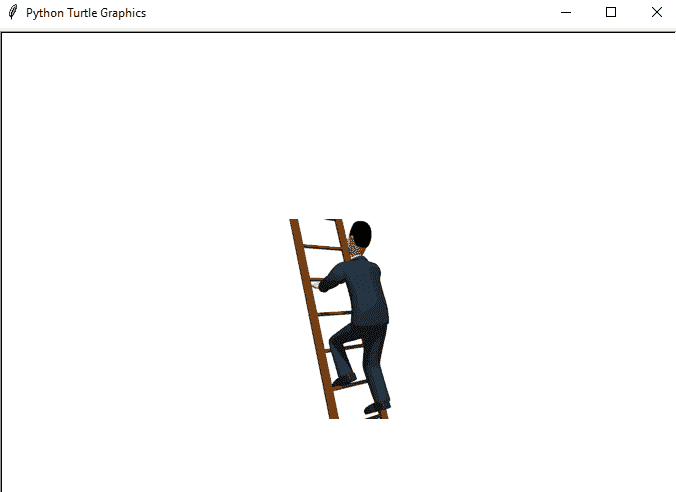
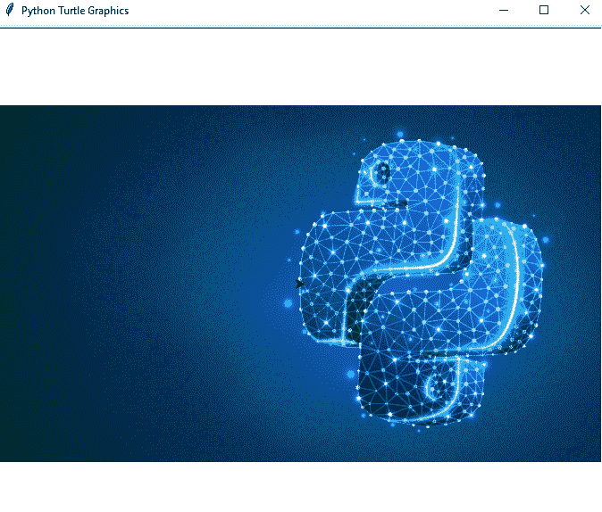
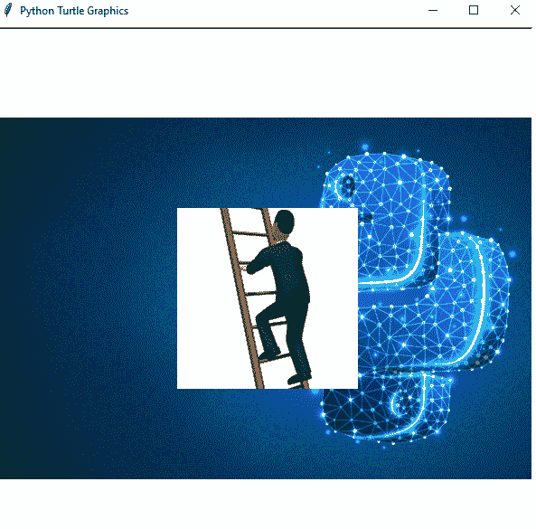
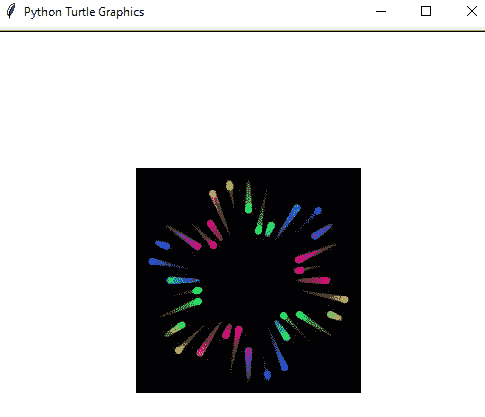
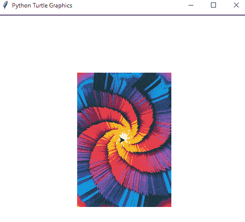

# 如何在 Turtle Python 中附加图像

> 原文：<https://pythonguides.com/attach-image-to-turtle-python/>

[](https://sharepointsky.teachable.com/p/python-and-machine-learning-training-course)

在这个 [Python 教程](https://pythonguides.com/learn-python/)中，我们将通过几个例子学习**如何在` `乌龟 Python** 中附加一个图像，我们也将涉及这些主题:

*   如何保存乌龟图像 python
*   如何附加图像龟 python
*   添加背景图片龟蟒
*   如何在 python turtle 中导入图像
*   Python Turtle 更改显示的背景图像

目录

[](#)

*   [如何保存龟图像 python](#How_to_save_turtle_image_python "How to save turtle image python")
*   [如何附加图像龟 python](#How_to_attach_image_turtle_python "How to attach image turtle python")
*   [添加背景图片龟蟒](#Add_Background_image_turtle_python "Add Background image turtle python")
*   [如何在 python turtle 中导入图像](#How_to_import_an_image_in_python_turtle "How to import an image in python turtle")
*   [蟒蛇龟改变显示的背景图像](#Python_Turtle_change_displayed_background_image "Python Turtle change displayed background image")

## 如何保存龟图像 python

为了拯救海龟形象，我们必须记住两件重要的事情:

*   **python 文件**和**图像文件**应该在同一个文件夹里。
*   **图像文件**只能是**【gif】**格式。
*   如果图像不是以**“gif”**的形式，那么我们必须通过使用画图并以 `gif` 格式保存文件来改变它。

> 你可能喜欢阅读[使用 Python 的机器学习](https://pythonguides.com/machine-learning-using-python/)和 [Python Pygame 教程](https://pythonguides.com/python-pygame-tutorial/)

## 如何附加图像龟 python

让我们看看如何在 turtle python 中**附加一张图片。**

*   首先，我们将**导入 turtle** 模块。turtle()方法用于制作对象。
*   我们将使用 **"wn = turtle 创建一个**屏幕对象**。**屏幕()"。
*   `addshape()` 函数用于在海龟屏幕上添加一个海龟形状。
*   要在海龟屏幕上保存图像，它应该是**“gif”**格式。

**举例:**

```py
import turtle
tr = turtle.Turtle()
wn = turtle.Screen()
wn.addshape('python2.gif')
tr.shape('python2.gif')
wn.mainloop()
```

在这个输出中，我们可以看到新窗口出现了，并且图像被附加到 python turtle 屏幕上。



How to attach image turtle python

阅读[蟒龟圈](https://pythonguides.com/python-turtle-circle/)

## 添加背景图片龟蟒

让我们看看如何在 Python turtle 中**添加背景图片。**

*   首先，我们将**导入 turtle** 模块。turtle()方法用于制作对象。
*   我们将使用 **"wn = turtle 创建一个**屏幕对象**。**屏幕()"。
*   `bgpic()` 函数用于设置背景图像，它只需要一个参数。
*   要在海龟屏幕上保存图像，它应该是**“gif”**格式。

**举例:**

```py
import turtle
tr = turtle.Turtle()
wn = turtle.Screen()
wn.bgpic("python1.gif")
wn.mainloop()
```

在这个输出中，我们可以看到新窗口出现了，背景图像设置在 python turtle 屏幕上。



Add Background image turtle python

## 如何在 python turtle 中导入图像

让我们看看如何在 python turtle 中**导入图像。**

*   首先，我们将**导入 turtle** 模块。**龟()**法是用来做物件的。
*   我们将使用 **"wn = turtle 创建一个屏幕对象。**屏幕()"。
*   **设置(宽度=600，高度=600)** 用于设置主窗口的大小和位置。
*   `bgpic()` 函数用于设置背景图像，它只需要一个参数。
*   `addshape()` 函数用于向海龟屏幕添加图像。
*   要在海龟屏幕上保存图像，它应该是**“gif”**格式。

**举例:**

```py
import turtle
tr = turtle.Turtle()
wn = turtle.Screen()
wn.setup(width=600,height=600)
wn.bgpic("python1.gif")
wn.addshape('python2.gif')
tr.shape('python2.gif')
wn.mainloop()
```

在这个输出中，我们可以看到新窗口出现了，并且我们可以看到带有当前图像的背景图像。



How to import an image in python turtle

## 蟒蛇龟改变显示的背景图像

让我们看看如何在 Python turtle 中**改变显示的背景图像。**

*   首先，我们将**导入海龟**模块，然后我们将**导入时间**。
*   我们将使用 **"wn = turtle 创建一个**屏幕对象**。**屏幕()"。
*   **设置(宽度=600，高度=600)** 用于设置主窗口的大小和位置。
*   `bgpic()` 函数用于设置背景图像，它只需要一个参数。
*   这里用 `update()` 的方法来改变背景图像，然后图像会在 2 秒后发生变化。
*   现在，我们可以在海龟屏幕上看到更新后的图像。要在海龟屏幕上保存图像，它应该是**“gif”**格式。

**举例:**

```py
import turtle
import time
tr = turtle.Turtle()
wn = turtle.Screen()
wn.setup(width=500,height=500)
wn.bgpic('python3.gif')
wn.update()
time.sleep(2)
wn.bgpic('python4.gif')
wn.mainloop()
```

在这个输出中，我们可以看到新窗口出现，第一个背景图像可见。



Python Turtle change displayed background image

2 秒钟后，我们将能够在海龟屏幕上看到更新的背景图像。你可以参考下面的截图。



Python Turtle change displayed background image

你喜欢下面的 Python 海龟教程:

*   [巨蟒龟命令](https://pythonguides.com/python-turtle-commands/)
*   [如何用 Turtle 创建 Python 中的贪吃蛇游戏](https://pythonguides.com/snake-game-in-python/)
*   [使用蟒蛇龟绘制彩色填充形状](https://pythonguides.com/draw-colored-filled-shapes-using-python-turtle/)
*   [如何使用 Turtle 在 python 中绘制形状](https://pythonguides.com/turtle-programming-in-python/)
*   [Python 将图像保存到文件](https://pythonguides.com/python-save-an-image-to-file/)
*   [如何使用 Python Tkinter 创建日期时间选择器](https://pythonguides.com/create-date-time-picker-using-python-tkinter/)

在本教程中，我们学习了如何在 Python 中使用 turtle 附加图像，我们也讨论了以下主题:

*   如何保存乌龟图像 python
*   如何附加图像龟 python
*   添加背景图片龟蟒
*   如何在 python turtle 中导入图像
*   Python Turtle 更改显示的背景图像

[Bijay Kumar](https://pythonguides.com/author/fewlines4biju/)

Python 是美国最流行的语言之一。我从事 Python 工作已经有很长时间了，我在与 Tkinter、Pandas、NumPy、Turtle、Django、Matplotlib、Tensorflow、Scipy、Scikit-Learn 等各种库合作方面拥有专业知识。我有与美国、加拿大、英国、澳大利亚、新西兰等国家的各种客户合作的经验。查看我的个人资料。

[enjoysharepoint.com/](https://enjoysharepoint.com/)[](https://www.facebook.com/fewlines4biju "Facebook")[](https://www.linkedin.com/in/fewlines4biju/ "Linkedin")[](https://twitter.com/fewlines4biju "Twitter")