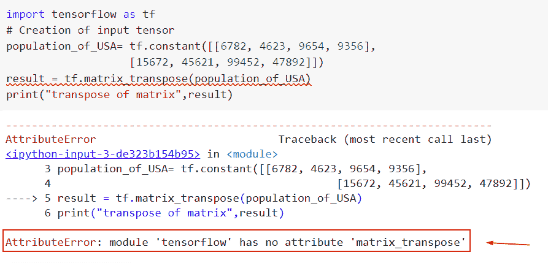
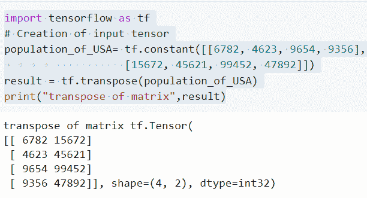
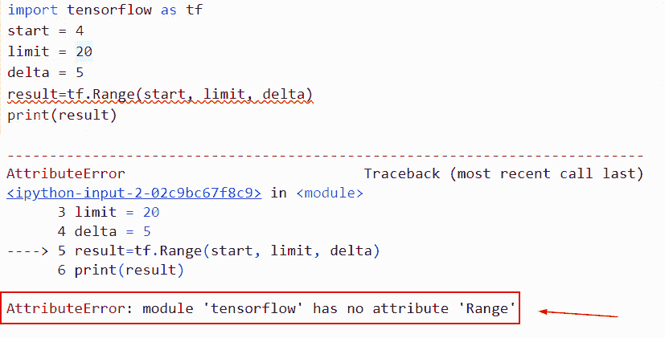
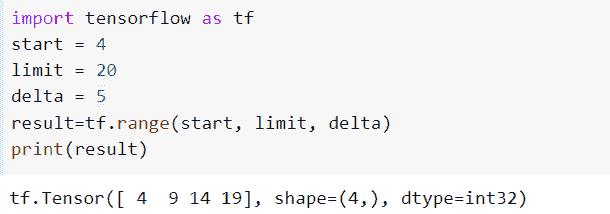
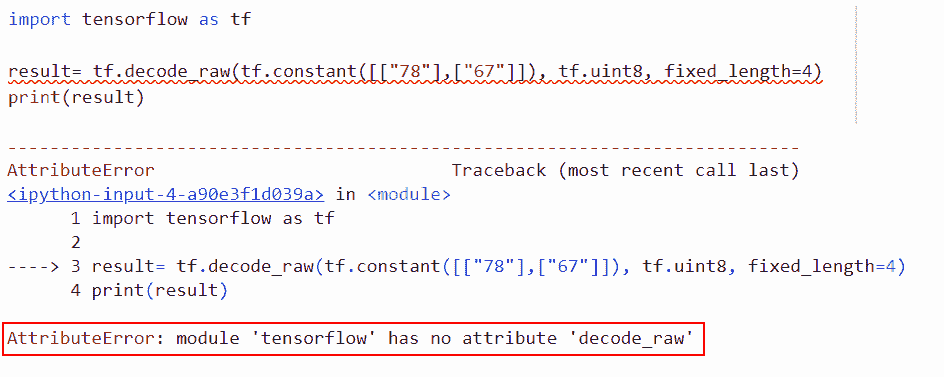
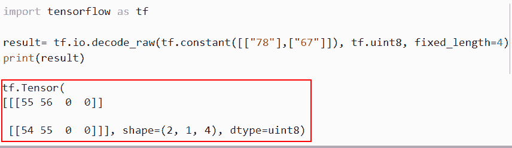

# attributeerror:模块“tensorflow”没有属性“matrix_transpose”

> 原文：<https://pythonguides.com/attributeerror-module-tensorflow-has-no-attribute-matrix_transpose/>

[](https://sharepointsky.teachable.com/p/python-and-machine-learning-training-course)

知道怎么解决没有属性' matrix_transpose' 的 **attributeerror 模块' tensorflow '吗？我们来讨论一下如何在 TensorFlow 中使用 matrix_transpose()函数。我们还将讨论以下主题:**

*   Attributeerror:模块“tensorflow”没有属性“matrix_transpose”
*   Attributeerror:模块“tensorflow”没有属性“Range”
*   Attributeerror:“模块”对象没有属性“decode_raw”

目录

[](#)

*   [属性错误:模块“tensorflow”没有属性“matrix _ transpose”](#attributeerror_module_tensorflow_has_no_attribute_matrix_transpose "attributeerror: module ‘tensorflow’ has no attribute ‘matrix_transpose’")
*   [属性错误:模块“tensorflow”没有属性“Range”](#attributeerror_module_tensorflow_has_no_attribute_Range "attributeerror: module ‘tensorflow’ has no attribute ‘Range’")
*   [属性错误:“模块”对象没有属性“decode _ raw”](#Attributeerror_module_object_has_no_attribute_decode_raw "Attributeerror: ‘module’ object has no attribute ‘decode_raw’")

## 属性错误:模块“tensorflow”没有属性“matrix _ transpose”

*   本节我们将讨论如何解决 attributeerror 模块' tensorflow '没有属性' matrix_transpose '。
*   这种方法是用来转置输入张量的，通过将行交换成列或者将列交换成行，可以找到矩阵的转置。在所提供矩阵的上标中，字母“T”表示矩阵的转置。例如，如果“B”是给定的矩阵，那么 B '或 BT 表示矩阵的转置。

示例:

```py
import tensorflow as tf
# Creation of input tensor
population_of_USA= tf.constant([[6782, 4623, 9654, 9356],
				           [15672, 45621, 99452, 47892]])
result = tf.matrix_transpose(population_of_USA)
print("transpose of matrix",result)
```

下面是以下代码的截图



attributeerror module tensorflow has no attribute matrix_transpose

以下是此错误的解决方案

**原因**:这个错误背后的原因是 TensorFlow 最新版本中没有 matrix_transpose。

现在我们要使用 transpose()函数的最新版本，也就是 tf.transpose()。

**语法:**

下面是 Python TensorFlow 中 tf.transpose()函数的语法

```py
tf.transpose(
             a, 
             perm=None, 
             conjugate=False, 
             name='transpose'
            )
```

*   它由几个参数组成
    *   `a` :该参数定义了输入张量。
    *   `perm` :默认取 none 值，指定张量维度的排列。
    *   `conjugate` :可选 bool 将其设置为 True 的数学等价物是 TF . math . conj(TF . transpose(input))。
    *   **名称**:该参数定义了操作的名称，默认取‘转置’值。

**举例**:

```py
import tensorflow as tf
# Creation of input tensor
population_of_USA= tf.constant([[6782, 4623, 9654, 9356],
				           [15672, 45621, 99452, 47892]])
result = tf.transpose(population_of_USA)
print("transpose of matrix",result)
```

在下面给出的代码中，我们首先使用 tf.constant()函数创建了一个输入张量“population_of_USA ”,并在该函数中，将整数值作为参数进行赋值。

接下来，我们使用 tf.transpose()函数并将输入张量指定为参数，它会将所有列元素转置为行元素。

下面是以下给定代码的实现



Solution of attributeerror module tensorflow has no attribute matrix_transpose

这就是我们如何解决 attributeerror 模块 TensorFlow 没有属性 matrix_transpose

## 属性错误:模块“tensorflow”没有属性“Range”

*   这里我们将讨论如何解决 attributeerror 模块‘tensor flow’没有属性‘Range’。
*   TensorFlow range 函数提供开始、停止、步进和 dtype，range()创建一个新的 tf。用给定范围内的值填充的 Tensor1D。简单来说，我们可以说它将创建一个数字序列。

**语法**:

让我们看一下语法并理解 range()函数的工作原理

```py
tf.range
        (
          start, 
          limit, 
          delta=1,
          dtype=None,
          name='range'
         )
```

*   它由几个参数组成
    *   **开始**:0 维张量(标量)。用作范围限制，如果限制为无，则第一个条目默认为 0。否则，充当范围限制。
    *   **极限** : 0 维张量(标量)。最高可能序列，排他的。如果不存在，则默认为 start 值，而范围内的第一个条目默认为 0。
    *   `delta` :默认取 1 值，指定增量开始的数字。
    *   `dtype` :默认情况下，取 none 值，指定输入张量的数据类型。

**举例**:

```py
import tensorflow as tf
start = 4
limit = 20
delta = 5
result=tf.Range(start, limit, delta)
print(result)
```

下面是以下给定代码的执行过程



attributeerror module tensorflow has no attribute Range

以下是此错误的解决方案

```py
import tensorflow as tf
start = 4
limit = 20
delta = 5
result=tf.range(start, limit, delta)
print(result)
```

在上面的代码中，我们设置了 start、limit 和 delta 的范围值。接下来，我们使用 tf.range()函数并将所有参数分配给它。一旦你执行这段代码，它将返回一个给定范围的张量。

你可以参考下面的截图



Solution of attributeerror module tensorflow has no attribute Range

正如您在截图中看到的，我们已经解决了 attributeerror 模块 tensorflow 没有属性“Range”。

## 属性错误:“模块”对象没有属性“decode _ raw”

*   让我们讨论一下如何解决 attributeerror 'module '对象没有属性' decode_raw '。
*   在 Python TensorFlow 中，decode_raw()用于将原始字节字符串转换为张量。

**语法**:

```py
tf.io.decode_raw(
    input_bytes, out_type, little_endian=True, fixed_length=None, name=None
)
```

*   它由几个参数组成
    *   `input_bytes` :输入张量的每个元素都被转换成一个字节数组。
    *   `out_type` :输出的数据类型。Half、float、double、int32、uint16、int8、int16、int8 和 int64 都是可接受的类型。
    *   `little _ endian`:input _ bytes 数据是否为 little-endian 格式。如有必要，数据将被转换成主机字节顺序。
    *   `fixed_length` :默认取 none 值，如果取 none 值，则转换每个元素的初始定长字节。数据将被修剪或零填充到所需的长度。

**举例**:

```py
import tensorflow as tf

result= tf.decode_raw(tf.constant([["78"],["67"]]), tf.uint8, fixed_length=4)
print(result)
```

下面是以下代码的截图



attributeerror module object has no attribute decode_raw

以下是错误的解决方案

```py
import tensorflow as tf

result= tf.io.decode_raw(tf.constant([["78"],["67"]]), tf.uint8, fixed_length=4)
print(result)
```

下面是以下代码的截图



Solution of Attributeerror module object has no attribute decode_raw

这就是我们解决 attributeerror 模块对象没有属性“decode_raw”的方法

在本文中，我们讨论了如何解决没有属性“matrix_transpose”的 attributeerror 模块“tensorflow”。我们来讨论一下如何在 TensorFlow 中使用 matrix_transpose()函数。我们还讨论了以下主题:

*   attributeerror:模块“tensorflow”没有属性“matrix_transpose”
*   attributeerror:模块“tensorflow”没有属性“Range”
*   Attributeerror:“模块”对象没有属性“decode_raw”

您可能会喜欢以下 Python Tensorflow 教程:

*   [模块“张量流”没有属性“函数”](https://pythonguides.com/module-tensorflow-has-no-attribute-function/)
*   [模块“tensorflow”没有属性“optimizer”](https://pythonguides.com/module-tensorflow-has-no-attribute-optimizers/)
*   [模块“tensorflow”没有属性“sparse _ placeholder”](https://pythonguides.com/module-tensorflow-has-no-attribute-sparse_placeholder/)
*   [模块“tensorflow”没有属性“div”](https://pythonguides.com/module-tensorflow-has-no-attribute-div/)
*   [模块“tensorflow”没有属性“get _ variable”](https://pythonguides.com/module-tensorflow-has-no-attribute-get_variable/)

[Bijay Kumar](https://pythonguides.com/author/fewlines4biju/)

Python 是美国最流行的语言之一。我从事 Python 工作已经有很长时间了，我在与 Tkinter、Pandas、NumPy、Turtle、Django、Matplotlib、Tensorflow、Scipy、Scikit-Learn 等各种库合作方面拥有专业知识。我有与美国、加拿大、英国、澳大利亚、新西兰等国家的各种客户合作的经验。查看我的个人资料。

[enjoysharepoint.com/](https://enjoysharepoint.com/)[](https://www.facebook.com/fewlines4biju "Facebook")[](https://www.linkedin.com/in/fewlines4biju/ "Linkedin")[](https://twitter.com/fewlines4biju "Twitter")