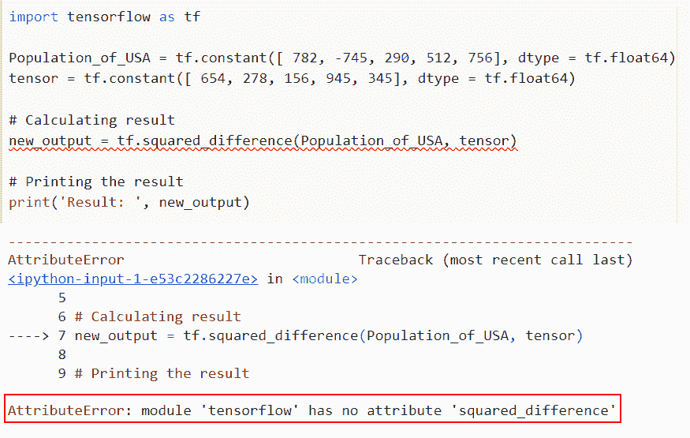
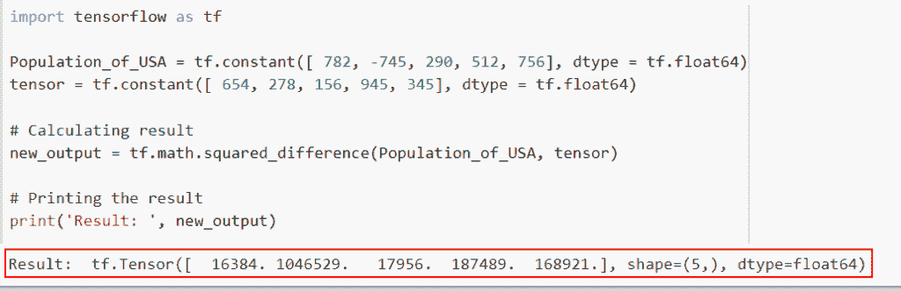
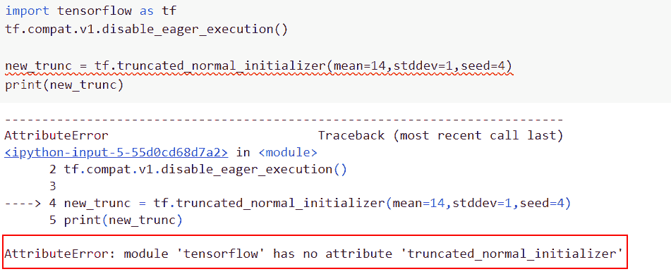
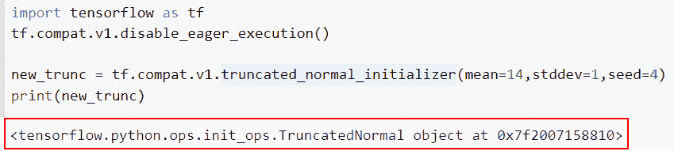

# Attributeerror 模块“tensorflow”没有属性“squared_difference”

> 原文：<https://pythonguides.com/attributeerror-module-tensorflow-has-no-attribute-squared_difference/>

[](https://sharepointsky.teachable.com/p/python-and-machine-learning-training-course)

在本 Tensorflow 教程中，我们将看到，如何修复错误，“ **attributeerror 模块‘tensor flow’没有属性‘squared _ difference’**”。在 TensorFlow 中使用 squared_difference 时出现的错误。

*   Attributeerror:模块“tensorflow”没有属性“squared_difference”
*   Attributeerror:模块“tensorflow”没有属性“truncated_normal_initializer”

目录

[](#)

*   [属性错误:模块“tensorflow”没有属性“squared _ difference”](#Attributeerror_module_tensorflow_has_no_attribute_squared_difference "Attributeerror: module ‘tensorflow’ has no attribute ‘squared_difference’")
    *   [解决方案](#Solution "Solution")
*   [属性错误:模块“tensorflow”没有属性“truncated _ normal _ initializer”](#Attributeerror_module_tensorflow_has_no_attribute_truncated_normal_initializer "Attributeerror: module ‘tensorflow’ has no attribute ‘truncated_normal_initializer’")
    *   [解决方案](#Solution-2 "Solution")

## 属性错误:模块“tensorflow”没有属性“squared _ difference”

*   这里我们将讨论如何解决 attributeerror:模块' tensorflow '没有属性 **'squared_difference'** 。
*   为了完成这项任务，我们首先将导入带有 tf 别名的 TensorFlow 库，其中 tf 代表 TensorFlow，用于数值计算问题。接下来，我们将创建一个张量形式的变量，并分配一个 `tf.constant()` 函数。在 Python 中，该函数采用一个常数值，表示不修改的值，并且还初始化一个对象，如数组或列表。
*   在 Tensorflow 中，平方差用于计算元素方式的 `(x-y)(x-y)` 。

**语法**:

我们先来看看语法，了解一下`TF . math . squared _ difference()`函数在 Python TensorFlow 中的工作原理。

```py
tf.math.squared_difference(
                           x,
                           y, 
                           name=None
                          )
```

*   它由几个参数组成
    *   `x` :该参数定义输入张量，必须是以下类型之一:bfloat16，half，float32，float64，int32，int64，complex64，complex128。
    *   `y` :该参数指定了第二个输入张量，它必须与 x 的类型相同。
    *   `name` :默认情况下，取 none 值，指定操作的名称。

**举例**:

```py
import tensorflow as tf

Population_of_USA = tf.constant([ 782, -745, 290, 512, 756], dtype = tf.float64)
tensor = tf.constant([ 654, 278, 156, 945, 345], dtype = tf.float64)

# Calculating result
new_output = tf.squared_difference(Population_of_USA, tensor)

# Printing the result
print('Result: ', new_output)
```

下面是以下代码的截图



attributeerror module tensorflow has no attribute squared_difference

正如您在屏幕截图中看到的，输出显示错误 **AttributeError:模块“tensor flow”**没有属性“squared_difference”。

**原因:**该错误的可能原因是 Tensorflow 最新版本(TensorFlow2.0)中没有 tf.squared_difference 属性。

现在让我们来看看这个问题的解决方案

### 解决方案

```py
import tensorflow as tf

Population_of_USA = tf.constant([ 782, -745, 290, 512, 756], dtype = tf.float64)
tensor = tf.constant([ 654, 278, 156, 945, 345], dtype = tf.float64)

# Calculating result
new_output = tf.math.squared_difference(Population_of_USA, tensor)

# Printing the result
print('Result: ', new_output)
```

在上面给出的代码中，我们通过使用 `tf.constant()` 函数创建了一个张量，这个张量的名字是**‘美国人口’**。现在我们想通过使用`TF . math . squared _ difference()`函数来计算输入张量值。

下面是以下给定代码的实现



attributeerror module ‘tensorflow’ has no attribute ‘squared_difference’

这是修复错误的方法，attributeerror 模块“tensorflow”没有属性“squared_difference”。

阅读 [TensorFlow 学习率调度程序](https://pythonguides.com/tensorflow-learning-rate-scheduler/)

## 属性错误:模块“tensorflow”没有属性“truncated _ normal _ initializer”

*   我们来讨论一下如何解决错误模块‘tensor flow’没有属性‘truncated _ normal _ initializer’。
*   为了执行这个特定的任务，我们将使用`TF . compat . v1 . truncated _ normal _ initializer()`函数，这个函数初始化器生成一个截断的正态分布。
*   这些值与来自随机正常初始值设定项的值之间的唯一区别是，偏离两个以上标准偏差的值将被丢弃和减少。应该使用这种方法初始化神经网络的权重和滤波器。

**语法**:

下面是 Python TensorFlow 中`TF . compat . v1 . truncated _ normal _ initializer()`函数的语法

```py
tf.compat.v1.truncated_normal_initializer(
    mean=0.0,
    stddev=1.0,
    seed=None,
    dtype=tf.dtypes.float32
)
```

**举例**:

```py
import tensorflow as tf
tf.compat.v1.disable_eager_execution()

new_trunc = tf.truncated_normal_initializer(mean=14,stddev=1,seed=4)
print(new_trunc)
```

下面是以下代码的截图



Attributeerror module ‘tensorflow has no attribute-‘truncated_normal_initializer

### 解决方案

此错误的解决方案

```py
import tensorflow as tf
tf.compat.v1.disable_eager_execution()

new_trunc = tf.compat.v1.truncated_normal_initializer(mean=14,stddev=1,seed=4)
print(new_trunc)
```

你可以参考下面的截图



Solution of Attributeerror module tensorflow has no attribute ‘truncated_normal_initializer

这是修复错误的方法，Attributeerror:模块“tensorflow”没有属性“truncated_normal_initializer”。

在本文中，我们讨论了如何解决错误 **attributeerror 模块“tensorflow”没有属性“squared _ difference”**。让我们讨论如何在张量流中使用平方差。我们已经讨论了以下主题:

*   Attributeerror:模块“tensorflow”没有属性“squared_difference”
*   Attributeerror:模块“tensorflow”没有属性“truncated_normal_initializer”

您可能会喜欢以下 Tensorflow 教程:

*   [当前日期和时间的 Python 程序](https://pythonguides.com/python-program-for-current-date-and-time/)
*   [模块“tensorflow”没有属性“optimizer”](https://pythonguides.com/module-tensorflow-has-no-attribute-optimizers/)
*   [Tensorflow 将稀疏张量转换为张量](https://pythonguides.com/tensorflow-convert-sparse-tensor-to-tensor/)
*   [模块“tensorflow”没有属性“div”](https://pythonguides.com/module-tensorflow-has-no-attribute-div/)
*   [模块“tensorflow”没有属性“sparse _ placeholder”](https://pythonguides.com/module-tensorflow-has-no-attribute-sparse_placeholder/)
*   [模块“tensorflow”没有属性“get _ variable”](https://pythonguides.com/module-tensorflow-has-no-attribute-get_variable/)

[Arvind](https://pythonguides.com/author/arvind/)

Arvind 目前是 TSInfo Technologies 的高级 Python 开发人员。他精通 Python 库，如 NumPy 和 Tensorflow。